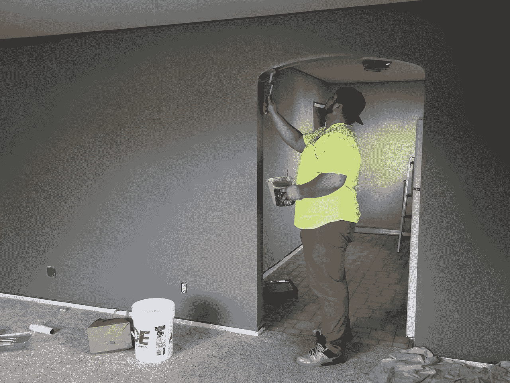
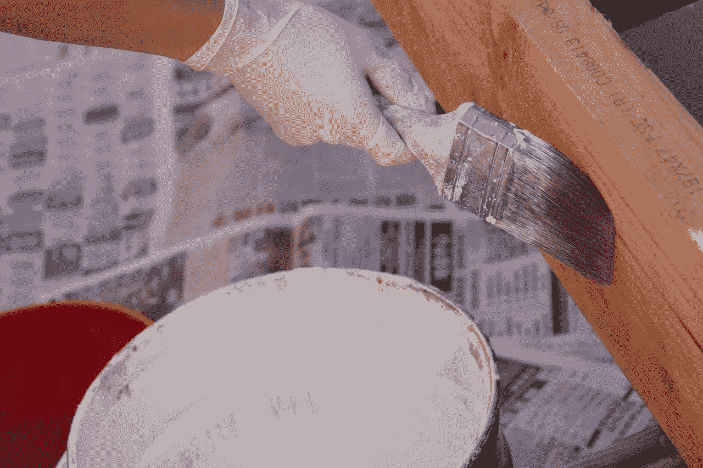

# Lowes(低)还是价值投资吗？

> 原文：<https://medium.datadriveninvestor.com/is-lowes-low-still-a-value-investment-8dac52b7f8ee?source=collection_archive---------17----------------------->

最近的头条新闻会有很多投资者问 Lowes(低)是否还是价值投资。例如，Lowes 正在关闭其 Iris 智能家居平台并关闭商店。

事实上，洛斯计划在 2019 年 3 月 31 日死亡， *DigitalTrends* [报道](https://www.digitaltrends.com/home/lowes-shutting-down-home-automation-platform/)。此外，2019 年 1 月 31 日之后，Lowes 将不再对 Iris 收费。相反，劳氏将在二月份退还顾客的虹膜费用。

引人注目的是，**劳氏公司**将关闭美国和加拿大的 47 家商店。美国消费者新闻与商业频道[报道](https://www.cnn.com/2018/11/05/business/lowes-closures/index.html)，到 2019 年 2 月 1 日，劳氏将关闭加拿大的 27 家店铺和美国的 20 家店铺。

这些关闭是除了整个果园供应硬件子公司。具体来说，所有果园供应点将于 2019 年 2 月 1 日关闭，*《今日美国》* [声称](https://www.usatoday.com/story/money/business/2018/08/22/lowes-orchard-supply-hardware-stores-close/1060236002/)。

**Lowe ' s(LOW)关店后还是价值投资吗？**

因此，许多人会问劳氏(低)仍然是一个价值投资。我对这个问题的回答是肯定的，因为 Lowe 的财务状况。

例如，劳氏在 2018 年第四季度的收入为 17.415 美元，毛利润为 56.6 亿美元。此外，劳氏报告 2018 年第四季度营业收入为 9.57 亿美元，净收入为 6.29 亿美元，毛利率为 32.5%。

更重要的是，Lowe 在 2018 年第四季度的收入增长率为 3.85%。因此，劳氏正在赚钱，尽管商店关门，它仍在增长。

最后，劳氏报告称，2018 年第四季度的运营现金流为 10.11 亿美元，运营现金流为 7.28 亿美元。此外，劳氏公司在 2018 年 11 月 2 日报告了 16.68 亿美元的现金和等价物以及 2.08 亿美元的短期投资。

**劳氏(低)仍然是价值投资**

Lowe's 是一家现金充裕的公司，因为它在 2018 年第四季度末报告了 18.76 亿美元的银行存款。我认为这些现金使 Lowe's 在 2019 年 2 月 4 日交易的 97.39 美元的股票上成为价值投资。

我认为劳氏公司是价值投资，因为它的直接竞争对手的股票；**家得宝(NYSE: HD)** ，2019 年 2 月 4 日交易价格为 184.94 美元。值得注意的是，劳氏公司是一家盈利且现金充裕的公司，股价较低，收入不断增长。

**劳氏公司(Lowe)是一只股息丰厚的股票**

最后，劳氏公司是一个伟大的股息股票，为投资者提供 56 年的股息增长，Dividend.com 报告。此外，Lowe's 在 2019 年 2 月 4 日向投资者提供的股息收益率为 1.98%，年化支付为 1.92 美元，支付率为 37%。

下一次劳氏股息为 48 英镑，定于 2019 年 2 月 6 日。重要的是，劳的股息在一年内增长了 13。解释一下，劳氏在 2017 年 4 月支付了 35 英镑的股息，2017 年 7 月增长到 41 英镑，2018 年 8 月增长到 48 英镑。

因此，劳氏是家装行业中股息最高的股票。我认为在目前的情况下，股息使得劳氏比家得宝更值得购买。

**劳氏(低)不确定的未来**

然而，劳氏面临着不确定的未来和来自**亚马逊**和家得宝的严重威胁。

具体来说，Lowe's (LOW)面临门店太多，占地面积太大的问题。目前，劳氏正通过关闭门店的传统方式来解决这个问题。

另一方面，商店的关闭并不能解决劳氏面临的一些根本性困境。例如，问题“对于大盒子商店来说多大才算大”，以及零售商需要多大的空间？此外，还有一个问题，在 21 世纪，零售商需要多少个地点。

特别是，当很大一部分顾客通过智能手机购物时，维护数百个大卖场是否明智？在这种情况下，履行中心和交付基础设施是更明智的投资。

劳氏公司(Lowe's)需要研究传统零售的替代品

然而，最紧迫的问题是洛斯能否让所有的地点都为自己买单。因此，劳氏必须研究传统零售的替代方案。

一个很好的选择是在商店里经营其他种类的生意。例如， **Office Depot(纳斯达克股票代码:ODP)** 正在其商店中试验合作空间。解释一下，公司或企业家使用像办公室一样的合作环境。例如，一位企业家可以使用她只是偶尔需要的便利设施，比如会议室或复印机。

具体来说，像 Office Depot 的 [Workonomy Hub](https://thinkrealty.com/office-depot-pilots-new-coworking-space/) 这样的合作空间允许自由职业者或小企业共享资源。例如，Workonomy 的客户可以使用会议室、打印设备、复印机和技术支持。

**劳氏(LOW)能否进入合作领域？**

相比之下，劳氏的共同工作空间可能会为承包商提供工具、计算机辅助设计设施、租赁卡车和机械车间。此外，劳氏可以在其商店中提供会议室和打印等办公设施。

显然，这样的空间存在一些严重的风险，包括保险费用。例如，被纸割伤的保险索赔低于被锯伤的保险索赔。

Lowe 的潜在解决方案包括为客户执行任务的自动化或机器人工具。例如，将木材或管道切割成一定长度的机器人，或者为客户制造螺栓等零件的机器。

值得注意的是，像 [SyncFab](https://syncfab.com/) 和 [Aitheon](https://www.aitheon.com/) 这样的公司正在试验物联网(IoT)解决方案，可以为劳氏商店的用户制造定制零件。然而，我认为那些公司的解决方案距离现实世界商业化可能还有几年时间。

**劳氏(LOW)是房地产公司吗？**

奇怪的是，Lowe's (LOW)最有价值的资源可能是其商店的所有空间。例如，劳氏商店的平均室内面积为 112，000 平方英尺，室外面积为 32，000 英尺。

所有这些空间的一个明显用途是与其他零售商合作。例如，劳氏可以将空间出租给亚马逊的全食超市、乔氏百货、阿尔迪超市或克罗格超市。重要的是，这种共享空间可以产生额外的客流量和租金收入。

Lowe's space 最吸引人的地方是允许在家装中心内开设小型商店。比如**星巴克(纽交所:纳斯达克:SBUX)** ，7–11，**麦当劳(纽交所:MCD)** ，五个家伙，或者 **Chipotle(纽交所:CMG)**Lowe ' s 内部。

亚马逊的 Go 自动化便利店提出了其他可能性，亚马逊回归了。例如，**美国柯尔百货公司(纽约证券交易所:KSS)** 现在[接受](https://www.kohls.com/feature/amazon.jsp)亚马逊在其商店退货。

Lowe's 可以通过接受通过亚马逊订购的油漆、工具、器具和其他物品的退货来吸引新的业务。此外，Lowe's 还可以为通过亚马逊订购的商品提供取货点或本地送货服务。

**劳氏(NYSE: LOW)能从停车场赚钱吗？**

有趣的是，停车场是劳氏的另一个潜在的赚钱资源。

劳氏可以允许公司将其停车场用作拼车或短期租赁车辆的存放地点。例如，允许[宝马](https://reachnow.com/en/)或 [ZipCar](https://www.zipcar.com/) 汽车停在劳氏。此外，劳氏可以在其停车场放置电动汽车充电站或特斯拉商店。

一个更具异国情调的想法是一辆自动驾驶货车，将顾客的商品拖到她家，然后返回劳氏。因此，自动驾驶汽车对劳氏来说是一个未来的机会。

无人驾驶汽车将需要地方停车，或许还可以充电。与此同时，劳氏在每家商店都有巨大的停车场，可以出租给自动驾驶汽车的车主。因此，劳氏可以从停车场赚钱。

在这种情况下，Lowe 的 2350 家商店和它们所在的土地可能是其最有价值的资源。因此，房地产可以保持洛氏(低)的价值投资。

这个故事最初是在 [*Market Mad House*](https://marketmadhouse.com/) 看到的，在那里我写了关于散户和许多其他股票的文章。

## 来自 DDI 的相关故事:

 [## 为什么数据会改变投资管理

### 有人称之为“新石油”虽然它与黑金没有什么相似之处，但它的不断商品化…

medium.com](https://medium.com/datadriveninvestor/why-data-will-transform-investment-management-4a60966c1c81)