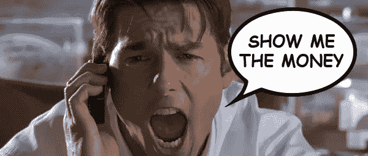

# Medium 是自由撰稿人的付费骗局还是数字乌托邦？

> 原文：<https://medium.datadriveninvestor.com/is-medium-a-pay-scam-for-freelance-writers-1dea6d4bc160?source=collection_archive---------0----------------------->

## 评估合作伙伴计划…

在加入 Medium 之前，我经常在 LinkedIn 上写很多东西。但那是在 2014-2016 年期间，LinkedIn 的“Pulse”发布平台在自由作家中处于受欢迎的顶峰。

不幸的是，在 LinkedIn 上发布内容的情况变得更糟了。这是由于影响通知、群组和其他功能的不明原因的激进限制。随着编辑们在 LinkedIn 的土地上宣传和推荐精心挑选的“有影响力的人”，独立作家的用户参与度很快就消失了。

> 那是我开始尝试在媒介上写作的时候。

2016 年 10 月，我在这里发表了我的第一篇文章，当时我对 LinkedIn Pulse 的沮丧情绪已经沸腾。但 Medium 有自己成长的烦恼需要克服，因为在一个由有抱负的作家和博客作者组成的过度饱和的社交媒体空间中，商业模式是不稳定的。

尽管博客圈人满为患，但媒体的编辑方向却很模糊。员工出人意料地被解雇了。不确定的改善前景隐约出现。前面的路看起来崎岖不平。

> **令我沮丧的是，我发现这种媒体在用户参与度上同样相形见绌。因此，直到 2018 年春天，我才再次在这里呆了很长时间。**

那时，中型合作伙伴计划面向所有用户推出。这一新交易吸引了我，因为它承诺我的散文会得到报酬。我还喜欢这样一个事实，即读者可以为一篇文章鼓掌多达 50 次，而在其他社交媒体平台上只有一个“赞”。

> 唯一的收获是每月 5 美元的会员费，根据所提供的金钱激励和平台范围内的访问权限，我认为这是“小钱”。

## 合作伙伴计划的诞生

在我成为中级会员的第一个月，我通过合作伙伴计划赚了大约 300 美元。我想，对兼职来说还不错。

编辑们给了我 100 美元的奖金，奖励我精选的特色文章，以及祝贺性的鼓舞人心的电子邮件。第二个月，我赚了 200 多美元。我的内容继续出现在主题区。

我称赞了这个合作伙伴项目，甚至把它推荐给了我更大的社交媒体网络中的其他自由撰稿人，其中一些人也注册了。

> **这是一笔不错的零花钱，但没有理由放弃一份全职工作。然后在接下来的几个月里，我开始挣得少了。我困惑地想，这是怎么回事？**

在我成为会员的第三个月，我不再收到 100 美元的奖金。尽管如此，我的文章还是被刊登出来，我还被指定为几个主题的“顶级作家”。这令人放心。我的士气仍然很高。

当我继续写作挣钱的时候，我注意到其他一些成员开始不满了。最初几个月的积极体验开始变得不愉快。参与度和读者数量下降。随着更多新成员的加入，编辑们的关注减少了。

我的文章参与度逐渐下降，而我花在社交营销上的时间却增加了。我并没有在主题区中占据显著位置。新作家用更多的内容淹没了平台。

似乎一开始就接受合作伙伴计划的作家们对 Medium 的未来不再抱有幻想。

> 这一令人困惑的困境引发了以下问题:

1.  为什么合作伙伴计划在付费会员中不稳定？
2.  媒体如何决定谁来宣传和报道？
3.  新媒体模式是基于优点还是神话？
4.  所有的编辑决策都是由人类编辑做出的吗？还是有一种令人烦恼的算法，作者无法掌握？
5.  内容真正向上流动的有机程度如何，持续了多长时间？

> *作家想知道。我想知道。然而，尽管媒体分享信息，答案仍然难以捉摸。*

## 拒绝订婚

与在 LinkedIn 上写作类似，在 Medium 上成为全平台特色的标准是模糊的。有机增长的说法似乎值得怀疑。对于谁得到报酬，什么时候，为什么和多久一次，也是如此。

我开始注意到，随着合作伙伴计划成员的激增，新成员越来越多地出现在主页上。但是对于老会员来说，这个项目就不一样了。我们觉得被编辑们避开了。

> **这仅仅是一个巧合还是一个秘密付款计划的一部分？**

*   Medium 的真正动机是像它声称的那样，基于有价值的内容为所有作家营造一个公平、平等的竞争环境吗？
*   或者，恰恰相反，收益和文章放置是为了哄骗更多自由撰稿人支付会员费吗？

> 虽然我对这些令人困惑的问题没有任何明确的答案，但还是有一些理论可以遵循…

首先也是最重要的一点是，通过展示新会员的内容来支付更多报酬，会促使他们写更多的东西，并向朋友吹嘘媒体。这反过来又吸引了更多的新作家付费成为会员。

许多有抱负的作家和博客作者从来没有因为他们的创造性努力而得到报酬。这就是为什么媒体上的财务激励起初如此诱人。

然而，我推测在合作伙伴计划中一两个月后，之前的一批新成员会从编辑的雷达中消失。原因是以循环的方式奖励和展示最新一轮的新付费会员——如此等等。

> **我假设 Medium 的支付系统未必有功勋。从货币角度来看，这对 Medium 来说具有商业意义。**

许多有抱负的作家往往缺乏信心，当他们终于出版并获得报酬时，变得过于兴奋。这也为 Medium 带来了红利，吸引了新会员，他们可以作为非官方的品牌大使免费推广平台。

哪个科技巨头不想从他们的用户那里获得免费的正面宣传呢？

应该注意的是，新作家往往有脆弱的自我。他们渴望得到认可，就像沙漠中迷失的流浪者突然发现了一片绿洲。

似乎 Medium 已经利用了这种情绪，采取了增加新会员参与度的策略，但只是在有限的时间内，直到他们上瘾——就像毒贩子分发免费样品一样。

> 但是当绿洲干涸或变成海市蜃楼时会发生什么？

这就是为什么有些作家对 Medium 的真实意图感到困惑。越来越多的作家在首次被推到聚光灯下后，开始发泄对参与度下降的沮丧。其他人试图解释参与度下降的原因，并提供如何补救的建议。

> **对新作家的经济激励，虽然短暂，但对每个媒体的商业模式都有很大的好处——特别是合作伙伴计划的扩展。**

那么，有什么可靠的策略来在 Medium 上建立强大的追随者，以提高参与度，并有希望通过合作伙伴计划赚更多的钱呢？

独一无二的[加里·维纳查克](https://medium.com/u/c4ec9163657c?source=post_page-----1dea6d4bc160--------------------------------)在下面的视频中提供了一些有用的建议…

## 顶级作家身份

许多成员喜欢被指定为特定主题的顶级作家。这是赞美合作伙伴计划和自由推广品牌的另一个强大动力(如上所述)。

研究表明，即使在当今无处不在的移动、数字和虚拟信息时代，“口碑”传播仍然是建立品牌忠诚度和信任度的最有效的营销方式之一。

> 关于一个人如何成为顶级作家，这个称号会持续多久，以及为什么它会令人惊讶地消失，有很多猜测。

*   顶级作家的地位真的是基于在特定主题上发表有价值内容的频率吗？
*   这个决定实际上是由人类编辑做出的，还是作者不知道的隐藏算法？

让我们面对现实吧:顶级科技公司总是想方设法扩大用户群，以在拥挤喧闹的社交/数字媒体环境中保持竞争力。

> 让我们记住:用户通常是“产品”,通常会被任何特定的平台以某种方式利用来满足自身的利益。

也就是说:看看脸书和谷歌就是最好的例子。收集和出售用户的个人数据、推送不想要的广告或无数其他方法通过利用系统在不知不觉中利用用户，已经清楚地证明了这一点。

> 有人真的相信 Medium 的动机不是基于任何私利的表象，而是据称成为自由作家的数字乌托邦吗？

## 好的一面

像任何社交或数字媒体平台一样，Medium 应该得到应有的赞誉。

考虑一下合作伙伴计划的一些积极因素:

*   赚更多的钱比少量的会员费容易，有时很快——假设你的写作不差。
*   就像美国运通宣扬的那样，会员有它的好处——包括平台范围内所有内容(文字和音频)的普遍访问。
*   会员可以获得一些来自受欢迎的传统媒体和知名记者的文章。否则，这些文章可能会被关在网上其他地方的付费墙后面。

作为一种制度，新闻业应该受到读者和作家的赞赏。自由和独立的新闻界是民主的基本支柱。这比以往任何时候都重要，因为第四等级继续受到白宫、国会和右翼组织的攻击。

> 这就是为什么有人会认为合作伙伴计划仍然是一个很好的交易，如果你定期写作并建立了相当多的追随者，它会多次收回成本。

如果你是一个狂热的读者或者喜欢流行文章的音频版本，情况也是如此。因此，媒介对读者和作者都是有益的。

一方面(再次重申)，通过合作伙伴计划获得报酬远非稳定收入。然而，对于那些投入时间和精力的人来说，这可能是一件值得做的事情。

> 请记住，根据 Medium data 的数据，只有不到 10%的合作伙伴计划成员每月收入超过 100 美元。

另一方面，至少你有资格为你的时间和创造性努力获得报酬。在 LinkedIn 和其他社交网站上却不是这样。

> 对自由作家来说，有所收获总比一无所获好。

## 媒体出版物

[也有更多适合读者和作家的出版物](https://medium.com/search/publications?q=Medium%20publications)。这些出版物通过吸引更多的读者，为作家提供了增加曝光率和更多收入的潜力。

然而，Medium 上一些受欢迎的作家推测，出版物的增长无意中阻碍了整个平台的高参与度，包括他们自己。

> **媒乘刊物的关注者从几万到几十万不等。**

它总是有助于作家拥有一个自动的观众，而不是不得不花个人时间进行社会营销努力来推广内容。你永远不知道你的一篇文章什么时候会在媒体上疯传，LinkedIn 上的博客曾经就是这样。

长镜头有时会出现——并迅速走红是每个作家的梦想。病毒式内容可以促进成功的创业、新的商业投资或潜在雇主的招聘。我目睹了这一切。

> 病毒式传播可以极大地提升你的个人或专业品牌。但如果你从不尝试，你永远不会知道。

## 最后的想法

从本质上来说，这仍然是一个悬而未决的问题，即中等合作伙伴计划是一个支付骗局还是真正的交易。这可能取决于你问谁。

然而，问题依然存在。

> 新媒体模式是一种肤浅的方案还是一种新颖的方法？

是的，新媒体模式值得称赞。但在竞争日益激烈的社交/数字媒体领域，这也是一项正在进行的工作。

这就是为什么作者在评估 Medium 的真实动机时应该保持警惕，实事求是，包括通过合作伙伴计划持续赚取的金额。

还是那句话，不要放弃你的日常工作。

但所有社交媒体和数字媒体都是如此，尤其是付费墙和付费播放访问的增长趋势。

> Medium 似乎相信，它终于有了一个可行的商业模式。但是，Medium 在合作伙伴计划的第一个月，是否出于严格的推广目的，故意向新作者支付更多报酬？

当然，我很容易就偏离了我善变的理论。我肯定 Medium 的首席执行官 [Ev Williams](https://medium.com/u/fac50372cb55?source=post_page-----1dea6d4bc160--------------------------------) ，顶级编辑(如[西沃恩·奥康纳](https://medium.com/u/98ac79723788?source=post_page-----1dea6d4bc160--------------------------------))和 [Medium 员工](https://medium.com/u/a32c340ea342?source=post_page-----1dea6d4bc160--------------------------------)强烈反对我的假设。

请记住，我是在成为会员仅七个月的基础上对合作伙伴计划做出的广泛推断。我的推测很可能完全错误。

然而，最终的问题仍然是:

> **在不断变化的数字/社交媒体环境中，新媒体模式不仅会成功，还会改变出版业和付费墙的格局吗？**

这还有待观察。

根据你目前在这里的经历，你有什么想法？请在下面的评论区分享您的宝贵反馈。

这个对话需要继续。

*DBG*

**注:** [本文的早期版本发表在 LinkedIn](https://www.linkedin.com/pulse/writing-mediums-partner-program-payment-scam-david-b-grinberg/) 上。

## 你也可能喜欢…

 [## 亲爱的媒体:禁止作家审查读者

### 促进网上言论自由…

medium.com](https://medium.com/@DBGrinberg/why-medium-should-ban-writers-from-censoring-readers-fb7cee8480e1)  [## 超大博客投资回报率初学者指南

### 扩大你的品牌，传播影响…

medium.com](https://medium.com/@DBGrinberg/how-to-supersize-your-blogging-roi-d6f0939e21f)