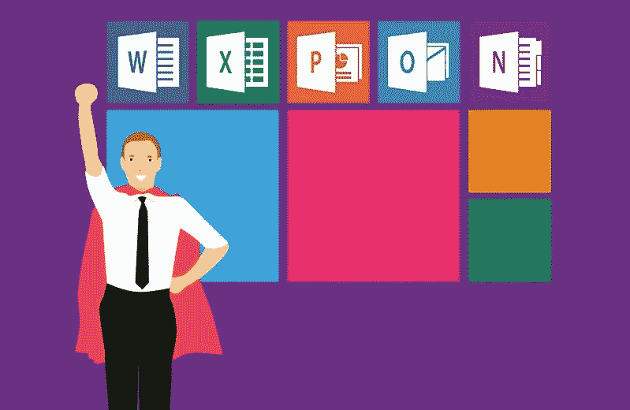
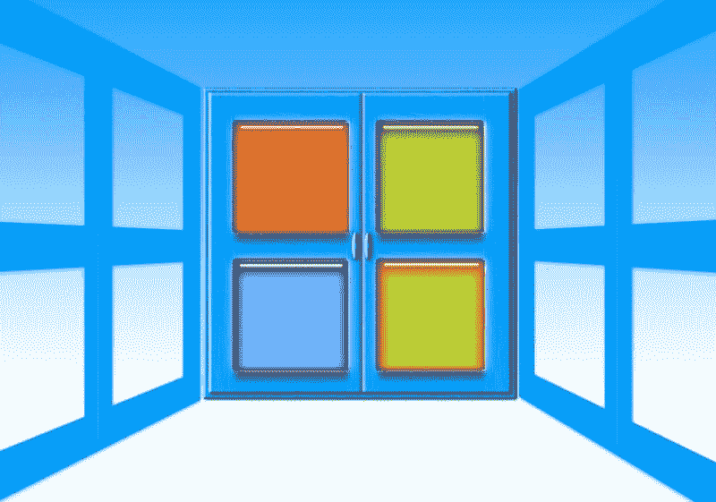
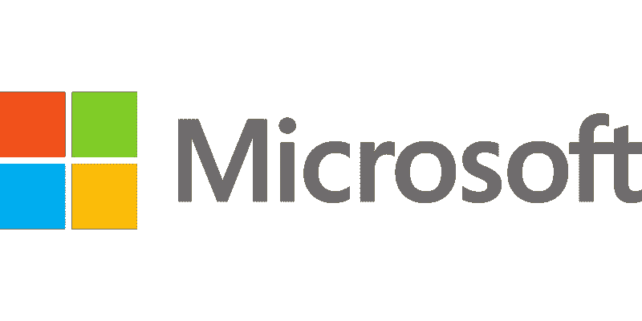

# 微软是科技领域最有价值的公司吗？—市场疯人院

> 原文：<https://medium.datadriveninvestor.com/is-microsoft-the-best-value-in-tech-market-mad-house-643a4b791636?source=collection_archive---------6----------------------->

我认为微软是科技股中最有价值的，因为它的股价很低，但能产生大量现金。

例如，**微软(纳斯达克:MSFT)** 在 2019 年 3 月 31 日拥有 1316.18 亿美元的现金和等价物。此外，截至 2019 年 3 月 31 日，微软的运营现金流为 135.28 亿美元，自由现金流为 109.55 亿美元。然而，微软股票在 2019 年 5 月 8 日的交易价格为 125.51 美元。

 [## 股票市场投资的机器学习——数据驱动的投资者

### 当你的一个朋友在脸书上传你的新海滩照，平台建议给你的脸加上标签，这是…

www.datadriveninvestor.com](https://www.datadriveninvestor.com/2019/01/30/machine-learning-for-stock-market-investing/) 

相比之下，**苹果(NASDAQ: AMZN)** 在 2019 年 3 月 30 日拥有 800.92 亿美元的现金和短期投资。相反，亚马逊在 2019 年 3 月 20 日记录的投资现金流为 133.48 亿美元，运营现金流为 111.55 亿美元，自由现金流为 87.92 亿美元。值得注意的是，苹果股票在 2019 年 5 月 8 日的交易价格为 202.86 美元。

因此，微软积累的现金比苹果多，但其股票价值却比苹果低 90 美元左右。因此，与苹果相比，微软是一项有价值的投资。

# 微软是一个好的分红投资吗？

此外，微软是一项值得尊敬的股息投资，计划于 2019 年 6 月 13 日支付 46₵。此外，4₵在 2018 年增加了股息，从 2018 年 6 月 13 日的 42₵开始增加。

此外，微软在 2019 年 5 月 8 日向投资者提供的股息收益率为 1.46%，年化支付为 1.84 美元，支付率为 43.3%。重要的是，微软已经连续几年支付股息，Dividend.com 报道。

另一方面，苹果的红利比微软大。事实上，苹果的股息将在 2019 年 5 月 16 日由 4₵增长到 77₵。因此，苹果投资者在 2019 年 5 月 8 日获得了 1.52%的股息率，年化支付额为 3.08 美元，支付率为 25.2%。苹果公司在过去的六年里一直在支付股息。

我认为微软较低的价格远远弥补了较低的股息收益率。因此，如果你正在寻找科技股中的廉价股，去看看微软吧。

# 微软赚了多少钱

微软是科技行业最划算的公司，因为它赚了很多钱。例如，微软报告 2019 年第二季度的毛利为 204.01 亿美元，收入为 305.73 亿美元。

此外，微软 2019 年第二季度的营业收入为 103.41 亿美元，净收入为 88.09 亿美元。最重要的是，据 Stockrow 计算，微软的收入在 2019 年第二季度增长了 13.99%。

与此同时，Stockrow 估计苹果在 2019 年第一季度的收入增长率为-5.11%。因此，微软现在是一个比苹果更好的成长股，而且更便宜。

根据记录，苹果 2019 年第一季度的总利润为 218.21 亿美元，营收为 580.15 亿美元。因此，微软以更低的收入和更低的支出赚了几乎和苹果一样多的钱。

# 微软为什么这么赚钱？

微软之所以这么赚钱，是因为该公司拥有几个赚钱的平台。

例如，VentureBeat [估计](https://venturebeat.com/2019/01/30/microsoft-earnings-q2-2019/)微软智能云的收入在 2019 年第二季度增长了 20%，达到 94 亿美元。与此同时，企业服务的收入增长了 6%，Azure 云服务平台的收入增长了 76%。

加上个人电脑增长了 7%，达到 130 亿美元。特别是，Windows Commerical 增长了 13%，搜索广告收入增长了 14%。与此同时，Surface 收入增长 39%，游戏收入增长 8%。毫不奇怪，Xbox 平台推动了游戏收入。

# LinkedIn 赚钱了吗？

另一方面，据 Business of Apps 计算，微软报告 2019 年 LinkedIn 收入为 53 亿美元。微软声称它正在将 LinkedIn 货币化，但没有说明如何实现。

但是，LinkedIn 给微软带来了一个巨大的平台。值得注意的是，商务应用[报道](http://www.businessofapps.com/data/linkedin-statistics/) LinkedIn 的流动资产包括:

*   美国有 1.54 亿用户
*   超过 3000 万企业用户。
*   全球 5.9 亿用户
*   25%的美国成年人有 LinkedIn
*   LinkedIn 上列出了 1100 万份工作
*   1 亿次 LinkedIn 下载。
*   LinkedIn 的流量来自移动设备。
*   LinkedIn 上每月发布 13 万篇文章。
*   超过 200 个国家的用户。

# GitHub 是微软最有价值的资产吗？

因此，微软是个人电脑、软件、云计算和视频游戏的主要参与者。然而，我认为 [GitHub](https://marketmadhouse.com/will-microsoft-msft-make-money-from-github/) 可能是微软最有价值的资产。

解释一下，GitHub 的“Octoverse”是一个面向开发者、组织和客户的去中心化的全球生态系统。具体来说，Octoverse 让开发者、客户和组织能够访问超过 9600 万个装满软件、应用和区块链技术的存储库。

令人印象深刻的是，GitHub [声称](https://octoverse.github.com)，Octoverse 连接了超过 3100 万开发者和 210 万个组织。此外，GitHub 在 2018 年收到了 2 亿次软件请求。此外，GitHub 计算出开发者在 2018 年为 Octoverse 贡献了超过 11 亿个解决方案。

# GitHub 的爆发式增长

因此，微软通过收购 GitHub 增加了 3100 万工程师和开发人员。此外，微软通过收购 GitHub 与 210 万潜在商业客户建立了联系。

此外，Octoverse 正以令人难以置信的速度增长。例如，GitHub 声称其托管的仓库数量在 2018 年增长了 40%。此外，管理层声称，2018 年加入 GitHub 的人数超过了该平台运营前六年的人数。

此外，他们估计 GitHub pull 请求的数量在 2018 年增长了 33%以上。这些请求的增长是因为使用 GitHub 的组织数量在 2018 年增长了 40%。

# GitHub 的未来

最终，GitHub 代表了一个强大的商业模式，微软可以在其他市场利用它。

例如，视频游戏开发者的 GitHub，金融服务的 GitHub，音乐和视频的 GitHub。解释一下，游戏开发商可以通过微软连接到 Xbox 平台的视频游戏 GitHub 来销售他们的游戏。

微软可以为视频提供一个 GitHub，制片人可以在那里发布电影或电视节目。因此，微软可以与 Alphabet 的 YouTube 和 T2 的网飞竞争。

# GitHub 会比 App Store 更大吗？

在这种情况下，微软可以在 Slate、Windows、微软 Office、Xbox 和其他产品中放置 GitHub 的直接链接。因此，微软可以将 GitHub 发展成一个更大、应用更广泛的应用商店。

事实上，我认为 GitHub 可能比苹果的应用商店更有利可图，因为用户可以从各种各样的设备上访问它。例如，微软可以将 GitHub 应用程序放在 **Alphabet 的** Android Play 中，以吸引 Android 用户。

因此，GitHub 可以覆盖全球 74.85%的智能手机用户。为了澄清，Statcounter 估计世界上 74.85%的智能手机运行安卓系统。相比之下，据 StatCounter 计算，全球只有 22.94%的移动设备运行 iOS。

归根结底，微软是一项价值投资，具有巨大的增长潜力。因此，我认为微软是当前市场中科技股的最佳选择。

*原载于 2019 年 5 月 8 日*[*https://marketmadhouse.com*](https://marketmadhouse.com/is-microsoft-the-best-value-in-tech/)*。*