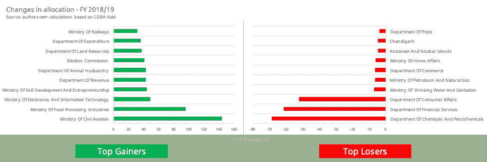
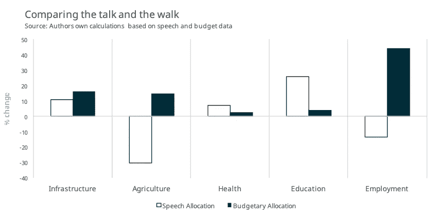

# 财政部长先生真的说到做到吗？

> 原文：<https://medium.datadriveninvestor.com/is-mr-finance-minister-walking-the-talk-or-not-really-f07c39173b9d?source=collection_archive---------26----------------------->

随着电子媒体覆盖范围的扩大，信息传递似乎变得和行为本身一样重要。人们认为，公民不仅根据决定，而且根据他们对一项措施的严重性的看法来作出决定。一个值得注意的例子是，前瞻性指引作为货币政策工具的重要性日益增加。在大多数西方国家利率接近于零的情况下，进一步降息不是控制货币供应的一个选项。因此，与市场沟通被用作传达央行意图的工具。

这种现象不仅限于宏观经济学，关于后真理的辩论表明它正在进入政治和政策制定领域。Cushing & Eskridge (2017)的研究探讨了美国州长在国情咨文中谈到的优先事项与其所在州的预算分配之间的关系。

本博客试图了解预算演讲和拨款之间是否存在这种联系。假设是两者之间有更密切的关系，因为财政预算案演辞往往会集中在财政预算案上，并与财政预算案紧密相连。这将是一个有趣的探索，是否特定的主题在演讲中没有被强调，但在预算分配时却得到了更高的优先权。

下图显示了与去年相比，预算拨款增加(和减少)最多的 10 个部委/部门。

Changes in budgetary allocation

鉴于中央政府当前的优先事项和即将举行的人民院选举，跟踪这些部委的子集以及它们在财政部长的预算演讲中获得的关注将是有价值的。从预算拨款来看，目标可能是加强农业、农村发展、卫生、教育、就业、MSME 和基础设施部门。

过去的四份财政预算案演辞，每份约有 21，000 字。该数据集被清除了常见的英语单词，以进一步增强进行彻底分析的能力。

Comparing the talk and the walk!

上面的图表比较了演讲和散步——实际预算分配的变化绘制在预算演讲期间话题获得的关注变化旁边。基础设施、卫生和教育也是如此。尽管后两个主题的预算分配与基础设施不同，没有显著变化。

其余两个部门——农业和就业——关系相反。在演讲中，这个话题涉及的内容较少，但与此同时，该部门在当前工会预算中的预算有所增加。中央政府不得不面对对这两个部门处理不当的批评，这并非巧合。印度目前的人口和职业构成、农民和青年是任何希望当选的政党的重要政治支持者。做“正确的”事情，而不必接受现有政府政策的缺点，这可能是一个明智的政治举措。

鉴于本博客的局限性，这些初步发现指出了一些东西，并足以吸引人们对印度背景下民选代表发表的演讲和随后的政府行动进行更深入的分析。

**参考文献**

伯努瓦 K (2018)。_quanteda:文本数据的定量分析 _。doi:10.5281/zenodo.1004683(网址:[http://doi . org/10.5281/Zeno do . 1004683)，](http://doi.org/10.5281/zenodo.1004683),) R 包版本 0.99.22，<网址: [http://quanteda.io](http://quanteda.io) >。

m . j . Cushing 和 k . m . Eskridge(2017)。通过政治领导人的演讲衡量他们宣称的优先事项:主题建模的案例，1–46。

r 核心团队(2016)。r:用于统计计算的语言和环境。奥地利维也纳统计计算基金会。网址[https://www.R-project.org/](https://www.R-project.org/)。

莱昂内尔·亨利和哈德利·韦翰(2017)。函数式编程工具。r 包版本 0.2.4。[https://CRAN.R-project.org/package=purrr](https://CRAN.R-project.org/package=purrr)

Rinker，T. W. (2013 年)。qdap dictionary:qdap 包附带的字典。1.0.7.布法罗大学。纽约水牛城。[http://github.com/trinker/qdapDictionaries](http://github.com/trinker/qdapDictionaries)