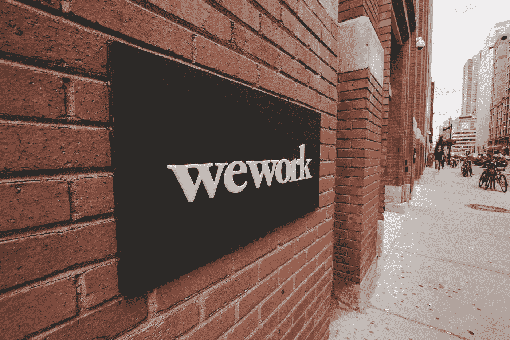

# 迈萨是我们工作的中心吗？

> 原文：<https://medium.datadriveninvestor.com/is-myrsa-the-pivot-for-wework-4a1b92d5e659?source=collection_archive---------4----------------------->

Photo by [Eloise Ambursley](https://unsplash.com/@e_ambursley?utm_source=medium&utm_medium=referral) on [Unsplash](https://unsplash.com?utm_source=medium&utm_medium=referral)

WeWork 估值 150 亿美元，负债翻倍。

WeWork 商业模式在技术上吗？

Myrsa 是商业租赁的未来吗？

 [## 动荡迫使暴风雨中的平静|数据驱动的投资者

### 自然界中很少有东西是直线行进的，尤其是经济。当投资者和消费者希望平静时…

www.datadriveninvestor.com](https://www.datadriveninvestor.com/2019/03/25/volatility-compels-calm-amid-the-storm/) 

WeWork 能从 Myrsa 的商业模式中获利吗？

上周，9 月 24 日，WeWork 的首席执行官亚当·纽曼辞去了首席执行官的职务。他的辞职源于董事会数周的压力，此前他试图进行首次公开募股(IPO)失败，并对他的诚信提出质疑。自 2010 年公司成立以来，努曼一直担任公司的首席执行官。在过去的几年里，Adam 已经将 WeWork 转变为纽约市最大的商业地产租户，估值为 470 亿美元。

然而，这一雄心壮志正在化为乌有。今年 8 月，WeWork 提交了 IPO 申请。当投资者进行尽职调查时，他们开始担心公司的状况。首席执行官亚当·努曼过着狂野的花花公子生活，拥有私人飞机和豪华住宅，但与此同时，该企业却在亏损，负债超过[340 亿美元。努曼的古怪行为，比如在私人飞机上抽大麻，以及自发禁止员工餐吃肉，也吓坏了投资者。](https://hbr.org/2019/08/no-wework-isnt-a-tech-company-heres-why-that-matters)

9 月份，这些不断增加的风险被证明对他们的投资者软银来说太多了，他们决定将 WeWork 的估值降至仅 150 亿美元。这种贬值也迫使 WeWork 取消了 IPO。软银还要求努曼辞职。虽然努曼持有 WeWork 的大部分股份，但他最终还是屈服于压力，辞职了。

**we work 的商业模式正确吗？**

去年 8 月，当 WeWork 宣布其首次公开募股的雄心时，其招股说明书将该公司归类为技术公司；但这是准确的描述吗？

常规科技公司的商业模式是怎样的？

**可变成本低**

谷歌、脸书、Yelp 和优步都整合了廉价可扩展虚拟网络的模式。该网络使用其应用程序接口以较低的启动成本实现。然后，当业务增长时，虚拟网络可以根据边际额外成本进行扩展。虚拟网络也是动态的，可以按需扩展。

**低资本投资**

所有企业都有资本投资成本。就技术公司而言，投资成本通常局限于软件开发和服务器群支持的网络。虽然这些农场是昂贵的资产，但与公司的全部资产相比，它们是边际资本投资。脸书只管理着 250 亿美元的资产，而他们却保持着 5250 亿美元的估值。相比之下，WeWork 拥有的资产很少，而是从其他公司租赁房地产。这些房地产资产仍被视为资本投资。这种模式的后果是，WeWork 的资本成本将永远高于其他技术公司，而没有低规模成本。这种模式也限制了 WeWork 不断寻找贷款人来为增长提供资金。

**客户数据**

如今，从亚马逊到网飞，几乎所有的科技公司都在积累、整理和分析客户信息。这些统计数据通常是从第一次客户互动开始多年收集的，是任何技术公司的黄金。有了这些统计数据，公司就可以有针对性地向消费者投放广告，或者根据消费者的偏好定制服务。目前尚不清楚 WeWork 是否收集客户统计数据，隐私后果也不清楚。

**网络效应**

所有现代技术公司都利用网络。这个网络可能是由字面上的客户联系构成的，比如 Twitter，也可能是客户统计数据，比如亚马逊的购买历史。网络的价值随着每个新成员的加入而增加。这种价值增加可能是更好的客户数据、客户参与、网络规模或两者结合的结果。然而，在 WeWork 模型中，价值如何随着远程客户的增加而增加并不明显。

**资产负债不匹配**

WeWork 通过长期合同租赁物业，然后通过短期创收合同租赁物业来管理其房地产。在经济景气时，这种模式可能利润很高，但风险也很大，因为负债是固定的。WeWorks 的负债目前为 340 亿美元。

虽然 WeWork 将自己归类为技术公司可能不真诚，但这种模式有先例吗？

**我们从事存储业务吗？**

2006 年，亚马逊凭借其网络服务 [(AWS)](https://stratechery.com/2019/the-wework-ipo/) 平台的推出，进入了电脑硬件市场。这在当时是一个大胆的举动，因为 IBM 前一年刚刚出售了个人电脑业务。亚马逊也以 30%的利润和只向用户收费的模式进入了这个行业。在随后的几年里，包括微软在内的其他公司也复制了这一模式。

*   初创公司几乎以零成本获得即时网络接入，因为价格是基于使用量的。
*   成长型企业可以扩大使用范围，而不需要购买昂贵的新服务器。
*   老牌企业可以专注于其核心技能，并将管理云服务的能力外包出去。

这种模式的共同之处在于，对于亚马逊的客户来说，web 服务是一种可变成本。亚马逊仍然负责建设和维护服务器网络的固定资本支出。WeWork 可以考虑将这种模式作为灵活的房地产等价物。

Myrsa 是商业租赁的未来吗？

脸书价值 5250 亿美元，但他们不生产任何内容。 [Youtube](https://www.businessinsider.com/morgan-stanley-values-youtube-160-billion-dollars-2018-5) 估值 1600 亿美元，他们也不制作任何内容。也许 WeWork 的未来真的在技术领域，但作为租赁经纪人而不是租户。印度初创公司 [Myrsa](https://www.myrsa.in/howitworks) 已经有了这种商业模式。Myrsa 的工作方式是授权业主以他们选择的价格在其网站上列出他们的空间。他们还可以列出设施，房地产的目的，特点，以及财产位于何处。然后，潜在的租户可以向业主发送询价，询问价格、租赁目的和期限。每个请求的所有者都会收到一个自动通知。然后当达成协议时，租户支付财产的押金，就可以使用它。

Myrsa 也符合传统技术公司的所有分类。他们以较低的资本投资成本管理虚拟网络。它的网络可以根据需求以较低的可变成本动态扩展。预计他们可以访问客户统计数据，并可以利用这些数据优化他们的服务。他们还应该能够利用网络效应来改善他们的网络。

这个模式可能是 WeWork 的下一个商业模式，或者 Myrsa 可能是下一个 WeWork。

WeWork 还有未来吗？

*原载于*