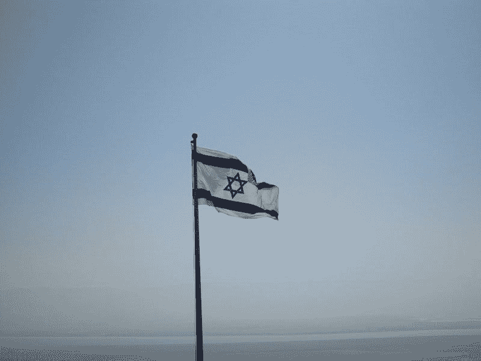
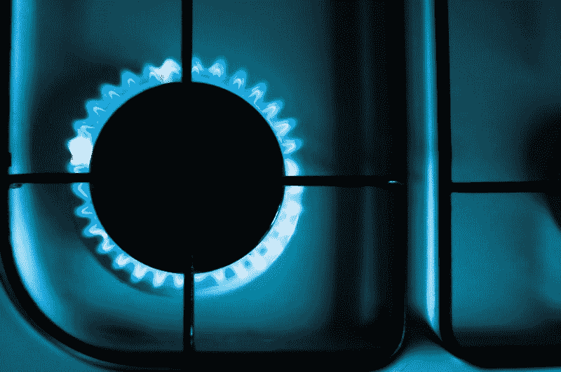
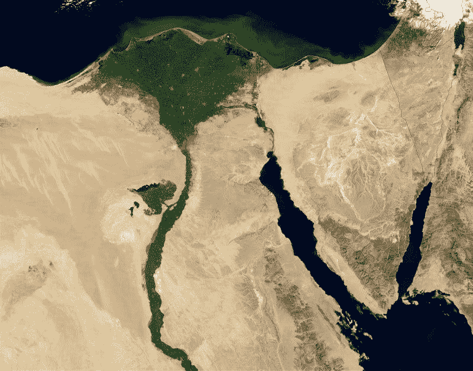
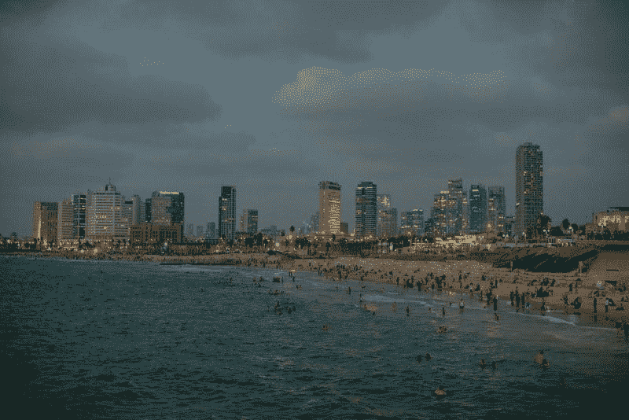

# 贵能赚钱吗？—市场疯人院

> 原文：<https://medium.datadriveninvestor.com/is-noble-energy-making-money-market-mad-house-b70840b0a983?source=collection_archive---------6----------------------->

来宝能源(纽约证券交易所:NBL) 是投资者的最爱，在中东承担着巨大的风险。

目前，投资者正在奖励来宝能源公司建造以色列最大的能源项目巨大的[利维坦](https://www.nblenergy.com/operations/leviathan-progress-update)天然气钻井平台。诺布尔声称利维坦可以在 2019 年底前开采天然气。

作为回应，来宝能源的股价从 2019 年 10 月 14 日的 20.44 美元上涨至 2019 年 11 月 15 日的 21.03 美元。因此，Market 先生喜欢 Noble Energy 在以色列沿海的地中海开采天然气的商业计划。详细来说，来宝能源拥有利维坦项目 39.66%的股份。

 [## 值得购买的 4 大人工智能股票及其原因|数据驱动型投资者

### 人工智能(AI)在 2019 年继续进入大众意识。通过应用程序…

www.datadriveninvestor.com](https://www.datadriveninvestor.com/2019/03/06/top-4-artificial-intelligence-stocks-to-buy-and-why/) 

Noble 声称利维坦每天可以生产 12 亿立方英尺的天然气。利维坦可以在利维坦气田开采 22 万亿立方英尺的天然气，并通过以色列天然气管道有限公司将其输送到以色列。

# 高尚能源公司奇怪而危险的商业计划

诺布尔能源公司的利维坦商业计划；然而，既奇怪又危险。例如，利维坦天然气的主要市场是以色列的邻国；历史上的敌人埃及。

事实上，诺贝尔能源公司董事长大卫·斯托弗在 2019 年 5 月会见了埃及独裁者阿卜杜勒·法塔赫·塞西。塞西指示埃及官员“与贵族能源合作”，【今日埃及*[报道](https://www.egypttoday.com/Article/1/70627/Noble-Energy-contemplates-boosting-investments-in-Egypt)。*

*此外，Noble Energy 已经签署协议，向海豚控股有限公司出售三万亿立方英尺的利维坦天然气，新闻稿[指出](https://www.businesswire.com/news/home/20191002005229/en/Noble-Energy-Amends-Gas-Sales-Contracts-Dolphinus)。海豚控股有限公司计划在埃及出售天然气。*

*此外，来宝及其合作伙伴正试图购买 EMG(东地中海天然气)管道。路透社[报道](https://www.reuters.com/article/us-israel-egypt/pipeline-operator-emg-signs-terminal-deal-for-israel-egypt-gas-exports-idUSKCN1VT07H) EMG 的运营商签署了一份价值 150 亿美元的协议，“使用一个属于以色列欧亚管道公司(EAPC)的终端向埃及出口天然气。”*

*埃及可能是一个巨大的天然气市场。例如，Worldometers [估计【2019 年 11 月埃及人口为 1.01096 亿。加上埃及人口增长迅速，2009 年埃及人口为 8113.5 万。](https://www.worldometers.info/world-population/egypt-population/)*

*因此，诺布尔向埃及出售天然气可以赚很多钱。所有这些埃及人都需要电力；通过燃烧天然气和烹饪用气体产生。*

# *高尚能源在中东的危险赌博*

*然而，诺布尔将自己置身于埃及-以色列和阿拉伯-以色列冲突的中间，是在冒难以置信的风险。*

*从 1947 年到 1973 年，以色列和埃及在 T2 打了五场战争。埃及人试图摧毁以色列；而以色列夺取了埃及大片领土，所以双方都有嫌隙。最近，以色列对巴勒斯坦人的粗暴对待以及与美国的密切联盟使得埃及公众舆论反对这个犹太国家。*

**

*埃及现政府同情以色列；或者更准确地说，是给以色列的恩人美国和美国的钱。然而，最近的历史表明，埃及政治可以在一夜之间发生巨大变化。*

*例如，在 2011 年的[阿拉伯之春](https://www.history.com/topics/middle-east/arab-spring)中，总统 Hosni Mubarak 执政 30 年的政府彻底垮台。与此同时，民选的穆罕默德·穆尔西政府在 2013 年上台不到一年就垮台了。*

*因此，敌视以色列的埃及新政府随时可能掌权。值得注意的是，斯托弗的朋友塞西是推翻穆尔西的人。穆尔西的政党穆斯林兄弟会仍然是埃及最大的政党，也是最有可能赢得未来埃及选举的团体。*

# *诺布尔能源公司买的是穿越战区的管道吗？*

*埃及和以色列之间的管道可能会穿过西奈半岛。自 2013 年以来，埃及军队一直在西奈与叛乱分子作战。*

*事实上，埃及军方部署了 4.2 万名人员；包括第 88 集团军在内，为了打击西奈叛乱分子，兰德组织[估计](https://www.rand.org/blog/2019/08/making-headway-against-the-sinai-insurgency.html)。兰德声称西奈叛乱分子与 ISIS 有关联。兰德估计，西奈半岛的战斗已经导致 1000 多名埃及安全人员和 7000 多名叛乱分子死亡。*

**

*因此，Noble Energy 正计划购买一条穿越战区的管道。我认为美国拥有的输送以色列天然气的管道是叛乱分子无法抵抗的目标。叛乱分子可以攻击 EMG 管道来伤害他们的三个敌人；埃及政府、美国和以色列。*

*只要在管道上放一次炸药，就能破坏气流；或者几发迫击炮、火箭弹、炮弹瞄准它。因此，对埃及来说，保护管道既艰难又昂贵。相反，破坏管道对叛乱分子来说很容易。*

# *无人机会瞄准利维坦吗？*

*此外，利维坦本身也是 ISIS、西奈叛乱分子、巴勒斯坦激进分子、真主党以及埃及和以色列的其他敌人的一大目标。*

*同样，也门的胡塞叛乱分子在 2019 年 9 月 14 日的[无人机袭击](https://marketmadhouse.com/lessons-we-can-learn-from-pearl-harbor/)中破坏了沙特阿拉伯的 Abqaiq 和 Khurais 石油设施。胡塞人是在报复沙特阿拉伯在也门内战中支持他们的敌人。*

*像 Abqaiq 和 Khurais 一样，利维坦将是无人机很容易破坏的一个大目标。保卫利维坦将是困难的，因为它坐落在海中央。军事技术也无法保护利维坦。*

**

*胡塞武装无人驾驶飞机轻松躲过了沙特的 [313 战斗机和 122 组防空导弹](https://www.defensenews.com/global/mideast-africa/2015/03/26/saudi-arabia-the-gulf-s-best-equipped-military/)。以色列使用相同的；大部分是美国制造的，在 Abqaiq 和 Khurais 防御失败。*

*恐怖分子可能将利维坦作为目标，因为摧毁它将是对以色列经济和声誉的耻辱性打击。我认为摧毁或损坏一个巨大的天然气钻井平台很容易。一枚导弹、一枚鱼雷或一艘装满炸药的快艇就能点燃利维坦。一群[无人机](https://www.latimes.com/business/la-fi-drone-swarms-20190219-story.html)可以通过发射导弹或投掷炸弹摧毁利维坦。*

# *利维坦是投资还是恐怖分子的目标？*

*显然，无人机袭击利维坦的最大受害者将是来宝能源的股价。来宝集团在世界上最不稳定的地区之一建造这样一个巨大的设施是在冒巨大的风险。*

*利维坦气田靠近西奈半岛、约旦河西岸、叙利亚、加沙和黎巴嫩的战区。此外,“利维坦”可能在叙利亚、西奈和黎巴嫩恐怖分子基地的导弹射程之内。我预测恐怖分子会用无人机、导弹、鱼雷或自杀式袭击来攻击利维坦，因为它是一个大目标。*

**

*我不得不质疑任何管理层在一个明显是恐怖分子目标的项目上花费 37.5 亿美元。然而，高尚能源正在这样做。*海上能源今天* [估计](https://www.offshoreenergytoday.com/noble-energy-leviathan-development-60-complete-first-gas-sales-in-2019/)利维坦可能耗资 37.5 亿美元。*

*具有讽刺意味的是，诺布尔的网站称利维坦为“正在创造的历史”可悲的是，随着恐怖分子摧毁第一个钻井平台,《利维坦》可能会创造另一种历史。*

# *贵族能量赚钱吗？*

*因此，**来宝能源(纽约证券交易所代码:NBL)** 是一项逆向投资，因为它的商业计划有风险。*

*我认为投资者需要远离高尚能源，因为它会冒险，会赔钱。例如，来宝能源在 2019 年 9 月 30 日报告了 900 万美元的季度运营亏损。相比之下，来宝在 2019 年 6 月 30 日报告了 3200 万美元的营业收入；以及 2018 年 9 月 30 日 3.05 亿美元的季度收入。*

**

*此外，来宝报告称，2019 年 9 月 30 日，其季度收入为 11.19 亿美元，季度毛利为 7260 亿美元。季度毛利高于 6 月 30 日的 7.2 亿美元，但低于 2018 年 9 月 30 日的 9.24 亿美元。与此同时，来宝的收入高于 2019 年 6 月 30 日的 10.93 亿美元，但低于 2018 年 9 月 30 日的 12.73 亿美元。*

# *来宝能源有多少现金？*

*有趣的是，来宝能源正从其业务中产生一些现金。*

*例如，2019 年 6 月 30 日，来宝能源报告运营现金流为 4.37 亿美元，融资现金流为 2.65 亿美元。然而，来宝在同一天公布的自由现金流为负-1.56 亿美元。*

*因此，来宝能源在 2019 年 9 月 30 日拥有 4.73 亿美元的现金及等价物。这一数字低于 2018 年 9 月 30 日的 7.2 亿美元。*

**

*我的结论是，来宝能源从其业务中赚了一点钱，但不足以证明其所冒的风险。因此，我认为市场先生在 2019 年 11 月 15 日将来宝的股票定价过高，为 21.03 美元。*

# *来宝能源是好的分红股吗？*

*我建议投资者远离**来宝能源(纽约证券交易所代码:NBL)** ，因为我看不到它的股息是如何可持续的。*

*Dividend.com[透露](https://www.dividend.com/dividend-stocks/basic-materials/independent-oil-and-gas/nbl-noble-energy/)，诺布尔能源于 2019 年 11 月 1 日支付 12₵季度股息。然而，来宝能源并不是一只好的分红股票，因为它只提供了一年的股息增长和-135.83%的负“派息率”。NBL 还在 2019 年 11 月 15 日提供了 2.28%的股息收益率和年化 48₵。*

**

*我认为来宝能源的股息太低，不值得这家公司冒险收购利维坦。总之，我认为购买 NBL 股票的唯一原因是对以色列国的宗教或意识形态支持，或者对中东和平的信心。*

*我的结论是，来宝能源在利维坦和 EMG 管道上承担的风险太大，普通投资者不会把 NBL 当作好股票。*

**原载于 2019 年 11 月 15 日*[*【https://marketmadhouse.com】*](https://marketmadhouse.com/is-noble-energy-making-money/)*。**