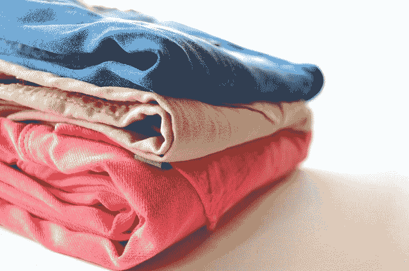
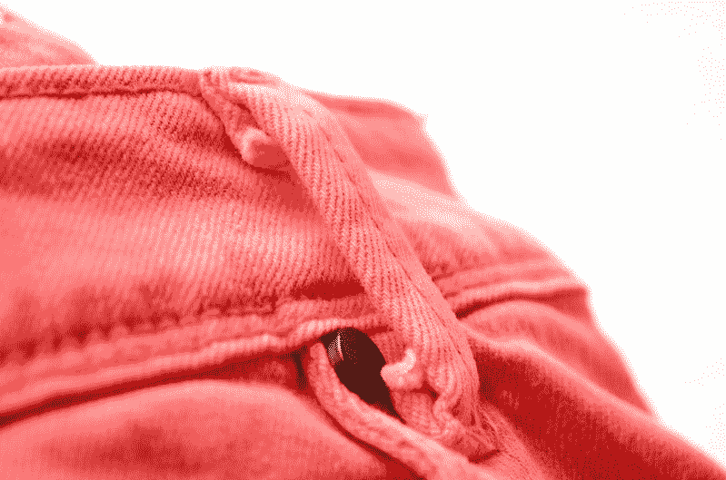
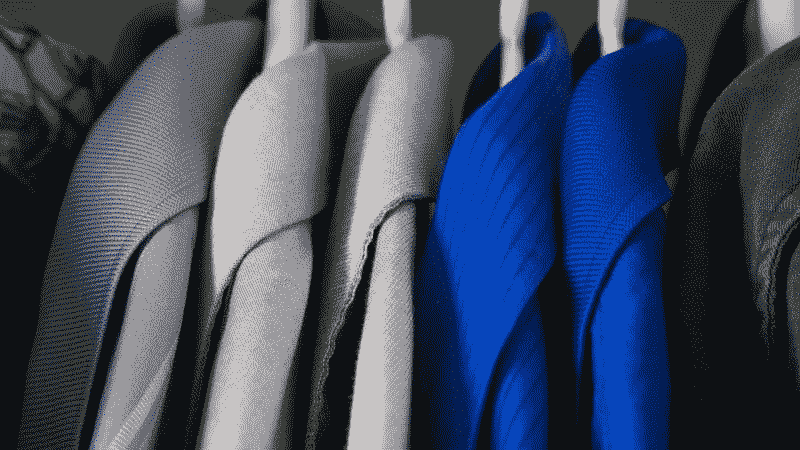
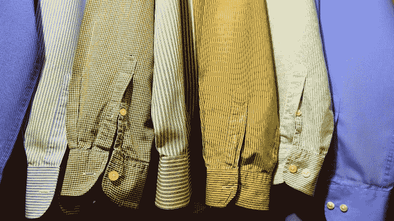
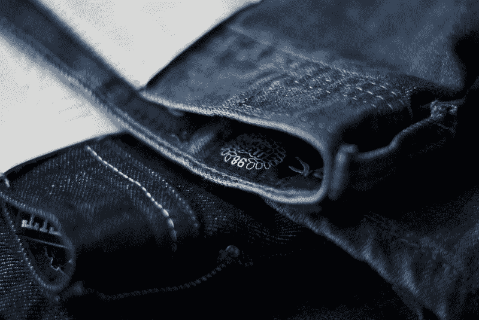

# 诺德斯特龙赚钱了吗？—市场疯人院

> 原文：<https://medium.datadriveninvestor.com/is-nordstrom-making-money-market-mad-house-63f041373c5a?source=collection_archive---------11----------------------->

我问 Nordstrom 是否在赚钱，因为它的许多竞争对手都在崩溃。特别是， **JC Penney(纽约证券交易所代码:JCP)** 在 2019 年 5 月 6 日的股价为 1.30 美元。

然而，**诺德斯特龙(纽约证券交易所代码:JWN)** 在 2019 年 2 月 2 日以 16.39 亿美元的毛利、44.83 亿美元的收入和 3.33 亿美元的营业收入存活下来。此外，Nordstrom 在 2019 年 5 月 2 日的股价为 40.47 美元。

 [## 2019 年需要关注的 20 个数字营销趋势和技术——数据驱动的投资者

### Faisal 在加拿大工作，拥有金融/经济和计算机方面的背景。他一直积极从事外汇交易…

www.datadriveninvestor.com](https://www.datadriveninvestor.com/2019/02/04/20-digital-marketing-trends-techniques-to-watch-out-for-in-2019/) 

不幸的是，生存是 T4·诺德斯特龙所做的一切。事实上，Nordstrom 有一个非常令人担忧的迹象，2019 年 2 月 2 日的收入增长率为-4.5%。

# 诺德斯特龙的收入在增长吗？

然而，Nordstrom 的收入从 2018 年 11 月的 13.13 亿美元增长到 2019 年 2 月的 16.39 亿美元。相反，Nordstrom 在 2018 年 2 月 3 日的节后收入(17.33 亿美元)高于 2018 年第四季度的收入。

从本质上讲，尽管有经济增长的报告，诺德斯特龙在 2018 年假期的收入比 2017 年假期少。此外，Nordstrom 最近在纽约开设的商店和洛杉矶的本地商店在增加收入方面收效甚微。

Nordstrom 最近一个季度的运营现金流为 6.54 亿美元，自由现金流为 4.29 亿美元，也没有那么大。因此，低收入增长限制了 Nordstrom 产生现金的能力。

# 诺德斯特龙产生的现金越来越少

此外，Nordstrom 的现金流从 2018 年开始大幅下降。例如，Nordstrom 在 2018 年 2 月 3 日记录了 8.03 亿美元的运营现金。此外，Nordstrom 当天的自由现金流为 6.08 亿美元。

因此，Nordstrom 从不断增长的收入中获得的现金越来越少。毫不奇怪，Nordstrom 的现金和等价物从 2018 年 2 月的 11.81 亿美元降至 2019 年 2 月的 9.57 亿美元。

然而，奇怪的是，Nordstrom 的收入成本实际上是下降了。为了解释这一点，Nordstrom 在 2018 年 2 月 3 日报告了 29.69 亿美元的收入成本，一年后又报告了 28.44 亿美元的收入成本。

# 诺德斯特龙的竞争力越来越弱

因此，我认为诺德斯特龙正在慢慢变得不那么有竞争力。这是危险的，因为两个危险的直接零售商，沃尔玛(纽约证券交易所:WMT) 和亚马逊(纳斯达克:AMZN )正在明目张胆地争夺诺德斯特龙的顾客。

为了解释这一点，亚马逊和沃尔玛都在增加他们在纽约等城市市场的能力，以吸引 Nordstrom 的富裕客户。事实上，两个城市；纽约和洛杉矶，可能很快会占到 Nordstrom 全价商品销售额的 25%，*《纽约时报》* [估计](https://www.nytimes.com/2019/05/01/business/nordstrom-local-manhattan.html)。

这种情况很危险，因为它迫使 Nordstrom 为几个集中的市场展开激烈竞争。此外，竞争者的进入门槛很低，因此许多公司进入了这个市场。

因此，*时报*报道称，诺德斯特龙正在曼哈顿和洛杉矶开设社区商店中心，为生活在自然环境中的富人提供服务。解释一下，每个中心都是一个较小的本地商店，有试衣间、裁缝店、退货服务柜台，以及像沙龙、咖啡店和酒吧这样的便利设施。

商业内幕 [报道](https://www.businessinsider.com/nordstrom-local-new-york-city-2019-5)，Nordstrom Local 是一家拥有 2000 至 2400 家店铺的商店，其设施是为社区设计的。例如，法院附近的 Nordstrom 当地商店可以为律师提供西装定制服务。

# 沃尔玛正在争夺诺德斯特龙的顾客

Nordstrom 可能永远得不到那个市场份额，因为沃尔玛正在纽约大举进军。

为了解释这一点，沃尔玛的 8 号孵化店正在测试 Jetblack 为曼哈顿的顾客购物的算法， *Vox* [报告](https://www.vox.com/2018/5/18/17368358/walmart-jetblack-code-eight-personal-shopping-concierge-jenny-fleiss)。快递员会在两天内交付所有的 Jetblack 订单，并免费收取退货。

此外，在纽约进行的实验中，沃尔玛拥有男士时尚品牌 Bonobos，并与 Lord Taylor 合作。因此，Nordstrom 的明智之举是推出礼宾服务或加入 Jetblack。

显然，Nordstrom local 对于像 Jetblack 这样的礼宾服务来说将是一个完美的支持机制。例如，Jetblack 快递员可以把衣服带到 Nordstrom Local 进行剪裁。

# Nordstrom 的客户群在增长，但市场在萎缩吗？

沃尔玛正在追逐诺德斯特龙的顾客，因为上层阶级在增长，而中产阶级在萎缩。

为了解释这一点，皮尤研究中心[估计](https://www.pewresearch.org/fact-tank/2018/09/06/the-american-middle-class-is-stable-in-size-but-losing-ground-financially-to-upper-income-families/)美国上层家庭的比例从 1991 年的 17%增长到 2016 年的 19%。与此同时，美国中产阶级家庭的比例从 1991 年的 56%下降到 2016 年的 52%。

而且，上层阶级更有钱。皮尤计算高收入家庭的收入在 2000 年至 2016 年间增长了 9%。从每年 172，152 美元增加到 187，872 美元。

此外，皮尤估计，美国高收入家庭的平均财富从 2013 年的 659，300 美元增长到 2016 年的 810，000 美元。因此，Nordstrom 拥有更多的客户，这些客户面临更多的竞争。例如，据*福布斯* [报道](https://marketmadhouse.com/is-nordstrom-making-money/#3da5cf4b27c5)，Neiman Marcus 三月份在曼哈顿的 Hudson Yards 开设了第一家新店。

我认为美国零售业正在自相残杀，更多的零售商争夺更少的顾客。此外，更多的零售商正在增加便利设施和零售影院服务，以吸引富人。例如，Neiman Marcus 的 Hudson Yards 商店提供擦鞋服务、鞋匠服务和定制帽子店。

# 诺德斯特龙的脆弱地位

在这种情况下，诺德斯特龙的处境非常脆弱。特别是，Nordstrom 是亚马逊的直接目标。

很能说明问题的是，**亚马逊(NASDAQ: AMZN)** ，现在为奢侈品牌、奢侈美容和女性奢侈品牌提供频道。然而，*福布斯* [报道](https://marketmadhouse.com/is-nordstrom-making-money/#491d297ed05b)亚马逊正在努力吸引奢侈品牌加入其平台。

所以 Nordstrom 比传统百货更有亚马逊证明。解释一下，亚马逊无法提供上层顾客想要的客户服务水平以及质量和真实性保证。

# 亚马逊的时尚攻势威胁到了诺德斯特龙

然而，亚马逊仍然能够吸引那些不在乎品牌的上层顾客。例如，亚马逊收购的 Body Labs 正试图开发一种远程测量顾客体型的系统。

因此，这将使亚马逊能够生产和运输定制服装，TechCrunch [报道](https://techcrunch.com/2017/10/03/amazon-has-acquired-3d-body-model-startup-body-labs-for-50m-70m/)。此外，机器人可以缝制这些衣服以降低成本。重要的是，亚马逊已经获得了基于荧光墨水的自动缝纫系统的专利， *GeekWire* [报道](https://www.yahoo.com/news/amazon-patents-robot-tailor-clothes-035145770.html)。

此外，亚马逊还与香水、化妆品、盥洗用品等小型奢侈品展开激烈竞争。因此，Nordstrom 可能不得不改变其商业模式，转而销售亚马逊难以营销的服装和其他商品。

最后，亚马逊正在用自己的自有品牌和亚马逊衣柜进行重大的时尚推广。我认为亚马逊衣柜威胁到了 Nordstrom，因为它会吸引讨厌购物的专业人士的业务。Body Labs 可以通过提供快速剪裁和优质交付来提高亚马逊衣柜的竞争力。

# 诺德斯特龙是价值投资吗？

观察人士会问，Nordstrom 股票低，是不是价值投资；2019 年 5 月 6 日 40.62 美元？

目前，我说是，因为诺德斯特龙的 37₵最后一次支付是在 2019 年 3 月 26 日。然而，自 2015 年 34₵.以来，股息一直没有增长此外，由于 Nordstrom 的现金流下降，股息不太可能很快增长。

然而，Nordstrom 股东在 2019 年 5 月 6 日获得了 3.64%的股息收益率，年化股息为 1.48 美元，股息支付率为 41.5%。因此，Nordstrom 是一只相当便宜的收益股。然而，诺德斯特龙是一只危险的股票，因为它在一个高度稳定的行业运营，这个行业正在发生翻天覆地的变化。因此，投资者最好准备好快速抛售诺德斯特龙(纽约证券交易所代码:JWN)股票。

*原载于 2019 年 5 月 6 日 https://marketmadhouse.com***。**