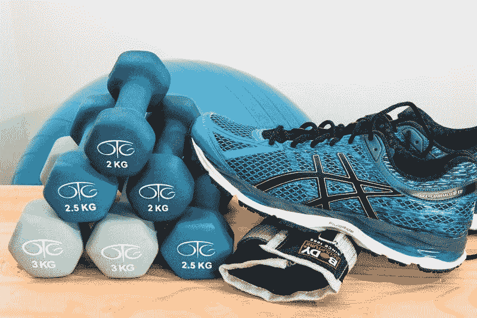

# Peloton 赚钱了吗？—市场疯人院

> 原文：<https://medium.datadriveninvestor.com/is-peloton-making-money-market-mad-house-e0cdec816f80?source=collection_archive---------5----------------------->

Peloton(纳斯达克股票代码:PTON) 因其令人毛骨悚然的电视广告活动，正迅速成为美国最受憎恨的公司之一。

*《纽约时报》* [给](https://www.yahoo.com/lifestyle/peloton-holiday-ad-goes-viral-for-its-sexist-message-003414115.html)一则名为*的 Peloton 广告贴上了“性别歧视和反乌托邦”的标签女权主义者讨厌这个广告，因为它展示了一个女人试图取悦一个男人。那个女人；为了展示 20 世纪 40 年代的价值观，她每天早起锻炼以“取悦她的丈夫”*

就我个人而言，我觉得这些广告既令人毛骨悚然又带有性别歧视。这些广告让 Peloton 看起来像一个邪教，并促进了女性行为的可怕标准。许多男人会避开 Peloton，因为他们害怕 Peloton 会把他们的妻子变成吸血鬼；或者成为珀洛东妻子的伴侣。

我不得不怀疑 Peloton 的广告部生活在什么世纪？另一个批评是*回馈*的礼物是“阶级歧视”我不能理解这种批评，但是阶级歧视是美国参议员伯尼·桑德斯需要避免的一项指控。

# 觉醒文化是对商业的威胁吗？

专家们对 Peloton 的批评源于普遍的女权主义和觉醒的政治意识形态。

然而，Peloton 的管理层没有预料到这一点。佩洛东激起的觉醒文化如此普遍，以至于前总统巴拉克·奥巴马(伊利诺斯州民主党人)对此提出了批评。候选人杨安泽(纽约州民主党人)甚至将沃克文化作为总统竞选中的一个议题，他为被解雇的周六夜现场剧组成员谢恩·吉利斯[辩护。](https://twitter.com/AndrewYang/status/1173097832850579456?s=20)

 [## 健康品牌源于定位|数据驱动的投资者

### 品牌定位是 Phemelo Segoe 的激情之一。她是一名企业家、健康教练和米尔部落的创始人…

www.datadriveninvestor.com](https://www.datadriveninvestor.com/2019/01/11/healthy-brands-grow-from-positioning/) 

奇怪的是，Peloton 管理层并不知道沃克文化的存在或其对商业的潜在影响。值得注意的是，[福乐鸡快餐店](https://marketmadhouse.com/chick-fil-as-surrender-is-a-defeat-for-free-speech/)；一家比 Peloton 更大更赚钱的公司在 11 月向沃克文化投降。

# Peloton 是不是落伍了？

解释一下，由于受到批评，福乐鸡快餐店停止向反对同性婚姻的慈善机构捐款。有争议的团体包括救世军。

有人在 Peloton 使用社交媒体、阅读博客、阅读新闻或上网吗？沃克文化并不是什么新鲜事，它是新旧媒体的共同话题。包括[罗德·德雷尔](https://www.theamericanconservative.com/author/rod-dreher/)在内的权威人士已经开始攻击沃克文化。

我认为缺乏对沃克文化的了解表明 **Peloton(纳斯达克代码:PTON)** 的管理层脱离实际。毕竟，Peloton 有很多方法可以让其产品在广告中看起来更有吸引力，同时又不冒犯任何人。

# 市场先生醒了

投资者需要研究一下觉醒的文化，因为市场先生现在觉醒了。*商业内幕* [预估](https://markets.businessinsider.com/news/stocks/pelotons-stock-price-plummet-wiped-942-million-market-value-holiday-ad-2019-12-1028737428)因为 Peloton 的妻子，Peloton 的股价下跌了 9%，Peloton 的市值下跌了 9.42 亿美元。

奇怪的是，Peloton 的股价在 2019 年 12 月 2 日升至 36.84 美元，但在 2019 年 12 月 4 日跌至 31.28 美元，因为 Peloton 妻子的反弹像病毒一样传播。关于社交媒体攻击 Peloton 的新闻故事在前一天开始出现。

Peloton 的股价在 2019 年 12 月 5 日上午下跌 1.35 美元(4.1%)至 31.57 美元，但在 2019 年 12 月 9 日交易结束时上涨至 34.77 美元。 **Peloton Interactive(纳斯达克股票代码:PLTON)**2019 年 12 月 9 日市值 97.54 亿美元，股价 34.77 美元。这些数字表明，仍有一些投资者相信 Peloton。

# Peloton 是价值投资吗？

价值投资者对 Peloton 感兴趣，因为该公司以 2245 美元的价格出售其固定自行车。

每辆自行车都有一个视频屏幕，向骑车人显示教练和骑自行车的视频。美国消费者新闻与商业频道[报道](https://www.cnbc.com/2019/08/27/peloton-reveals-its-financials-for-the-first-time-in-filing-to-go-public.html)称，Peloton 声称其销售额在 2018 年至 2019 年间增长了 110%。

另外 Peloton 该网站拥有狂热的追随者，每月出售 39 美元的会员资格。理论上，Peloton 可以从这些会员资格中产生大量的浮存金。

“浮存”是沃伦·巴菲特的术语，指公司可以随意利用的持续现金流。浮存的典型例子包括报纸和杂志订阅费、水电费、保险费和广告收入。

Peloton 从订阅中生成 float。此外，Peloton 可以通过在令人讨厌的屏幕上销售广告来产生广告收入。

# Peloton 赚钱吗？

不幸的是，Peloton 没有从这些订阅中赚到任何钱。Peloton 报告称，2019 年 9 月 30 日运营亏损-5080 万美元，净亏损-4980 万美元。

此外，Peloton 报告 2019 年 9 月 30 日的季度收入为 2.28 亿美元，季度毛利为 1.051 亿美元。因此，Peloton 几乎没有钱，收入微乎其微。

此外，Peloton 报告截至 2019 年 9 月 30 日的季度负现金流为-7620 万美元，自由现金流为-9870 万美元。然而，Peloton 报告该季度的融资现金流为 11.98 亿美元。

# Peloton 正在借钱维持运营

我认为融资现金流显示 Peloton 借入了 11.98 亿美元来为其运营融资。因此，我认为 Peloton 借钱资助制作 Peloton 妻子广告。

Peloton 不得不借这笔钱，因为它的资源很少。截至 2019 年 9 月 30 日，Peloton 的总资产为 23.88 亿美元，现金和短期投资为 14.77 亿美元。

不幸的是，我认为 Peloton 借了那笔钱。因此，Peloton 赚钱的能力很小。因此，Peloton 管理层做出有问题的决策，并借钱资助这些计划的实施。

# Peloton 是一只糟糕的股票

我建议投资者避开 **Peloton Interactive(纳斯达克代码:PLTON)** 因为这是一只糟糕的股票。

我认为 Peloton 是一家糟糕的公司。例如，Peloton 制造了一种竞争对手可以轻易复制的可疑产品。此外，Peloton 是一种[锻炼时尚](https://www.mensjournal.com/style/the-25-biggest-fitness-fads-of-all-time/)，历史表明锻炼时尚会很快消失。

有人记得 [Tae Bo](https://en.wikipedia.org/wiki/Tae_Bo) 、Jazzercize、Bowflex、Roller Blades 或 Thighmaster 吗？我预测 Peloton 将会在未来的琐事问题的答案中加入这些锻炼制度。

Peloton 对投资者来说没有价值。相反，Peloton 提供了一个有趣的教训，说明了 Woke 文化的力量以及避免首次公开募股(IPO)公司的必要性。

*原载于 2019 年 12 月 9 日*[*https://marketmadhouse.com*](https://marketmadhouse.com/is-peloton-making-money/)*。*