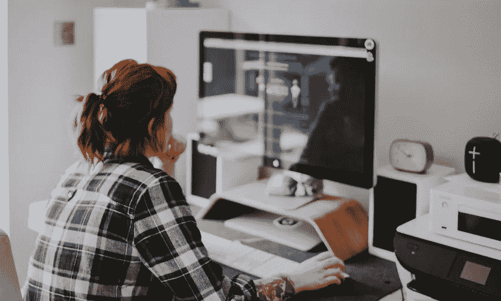
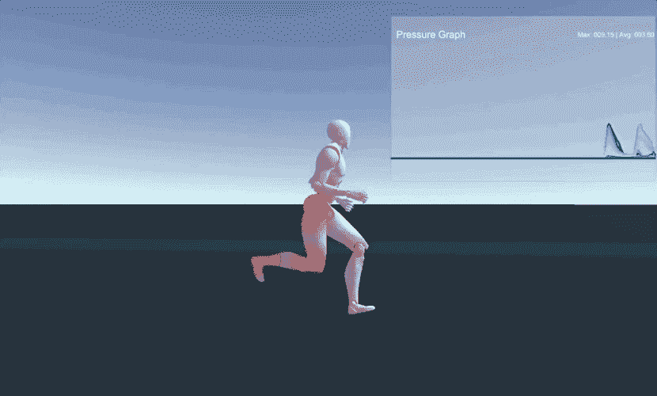
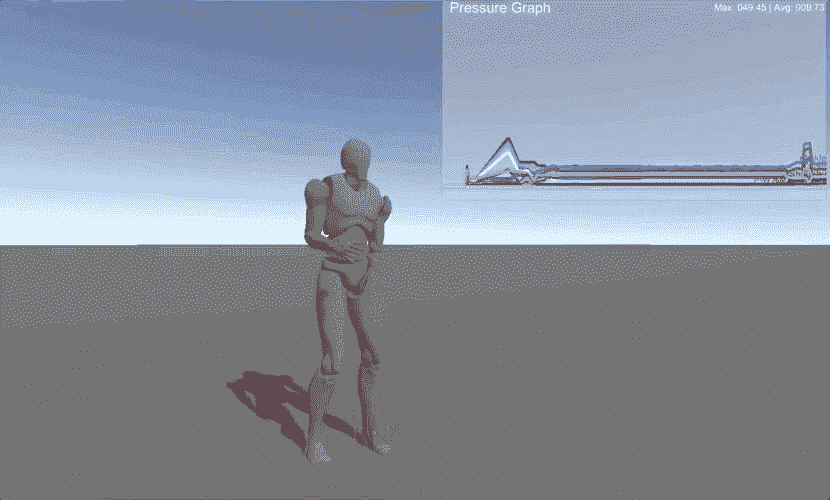
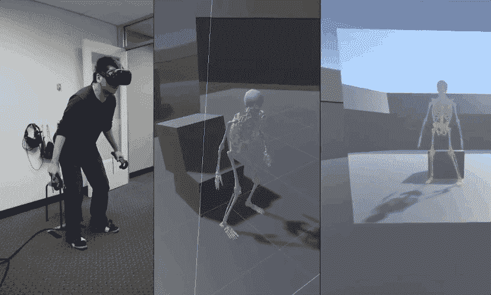

# 物理模拟是医疗保健的未来吗？

> 原文：<https://medium.datadriveninvestor.com/is-physical-simulation-the-future-of-healthcare-75015778a7b0?source=collection_archive---------4----------------------->

## 从使用数字替身进行物理治疗，到虚拟现实从业者和支持狗，交互式角色模拟将改善健康并丰富医学。我们制作了一些原型来探索这些应用。

背痛是现代生活中的通病；根据美国脊椎治疗协会的统计，背痛是导致失业的主要原因之一，每年在美国人*至少花费 500 亿美元，并且是世界范围内导致残疾的唯一主要原因。*

虽然背痛的原因很多，但大多数背痛病例是机械性的，而不是严重疾病的结果。DeepMotion 团队对此心知肚明；作为一群技术专家，我们长时间蹲在电脑前。由于我们团队中有很大一部分人患有慢性背痛，我们开始思考如何利用我们在物理模拟方面的工作来构建虚拟现实和模拟工具，用于健康、治疗和保健。对我们来说，原型化有意义的解决方案是获得洞察力和开发更好的用于人工智能驱动模拟的[软件的关键。](https://www.deepmotion.com/neuron_prelaunch)

## 教育角色模拟

我们第一个解决姿势和身体压力的原型是一个可视化骨骼压力的教育工具。利用关节物理学，我们创造了一个生物力学模拟的角色。也就是说，我们给了一个传统的 3D 角色一个模拟的身体，包括关节、肌肉组织、骨骼密度等等，使用数学来描述身体的物理属性。当角色移动时，它通过肌肉操纵来实现，类似于现实世界中的人类运动。

对周围环境有生理反应的数字角色可以用于令人兴奋的新的互动体验。我们发现一个这样的应用程序正在使用“数字替身”来洞察健康的运动。为了做到这一点，我们将数字角色包装在一个可视化工具中，该工具可以在角色移动时测量并报告骨骼压力。(你可以在这里学习如何创建一个物理模拟角色[。)](https://www.youtube.com/watch?v=QrgCA5ayf70)

该工具旨在以动态、无创的方式评估运动和应力。体能教练可以洞察不同运动分配压力的方式，并可以在模拟中开发新的练习，而不会因未经证实的方法而有人身伤害的风险。

## 虚拟现实中的物理治疗

值得注意的是，模拟长期以来一直是医学和健康的启发式工具；最核心的是，模拟是表现原因、结果和可能性范围的结构——模拟的医疗体验通常是教育和实践(对患者和医疗保健专业人员而言)之间的重要中介。从[尸检模拟](https://www.theengineer.co.uk/haptic-vr-surgery-simulation/)，到[病人护理模拟](https://www.sciencedaily.com/releases/2014/05/140520115518.htm)，再到[正畸模拟](https://www.fastcompany.com/40563283/silicon-valley-wants-to-fix-your-crooked-teeth) —卫生专业人员使用模拟向他们的病人说明概念，改进培训和教育课程，并节省原材料费用。因此，毫不奇怪，扩展现实媒体——它提出了更加集成的、身临其境的模拟体验——正被用于开发新一轮的健康和医疗应用。

为了制作一个更加个性化的骨骼压力可视化器，我们使用我们的一个物理模拟角色创建了一个全身虚拟化身。通过将生物力学建模的两足动物配置到我们的[六点跟踪系统](https://www.deepmotion.com/avatar)，我们能够逼真地再现用户的身体。现在，当用户运动时，我们可以实时看到他的运动和姿势对他的关节的影响。像我们的 VR 骨骼压力可视化工具这样的工具可以帮助患者和医生了解可持续的姿势、体重分布的影响以及如何实施简单的身体变化来缓解急性压力。

## 心理健康的互动角色

生物力学模拟是交互式角色创建的一个令人兴奋的应用，但它肯定不是唯一的应用。互动角色也可以在虚拟现实体验中起到治疗作用。毕竟，大部分医学在本质上是人际间的。促进开放的沟通对于找到生理和身体疾病的根源至关重要——使诊所的环境、地理位置或等待时间等限制成为确保优质护理的重要因素。我们的虚拟现实化身解决方案可以通过让患者和医生虚拟会面来帮助他们弥合差距，交互式 3D 代理可以为那些需要治疗陪伴的人模拟连接。

我们的虚拟现实虚拟化身解决方案可以通过让患者和医生虚拟会面来帮助他们弥合差距，交互式 3D 代理可以完全模拟那些需要治疗陪伴的人的联系。

近年来，研究人员为许多宠物主人长期以来怀疑的事情找到了令人信服的证据:拥有一个毛茸茸的朋友对你的健康有好处，并能延长寿命。然而，宠物是一个很大的责任:它们很昂贵，需要持续的照顾，并且被禁止进入许多公共场所和住房。我们模拟了一只互动的狗，以创造出许多人渴望的、但在他们自己的生活中无法获得的狗的陪伴体验。当你拍手的时候，狗就来了，当你抚摸它的时候，它会实时地做出身体上的反应。数字宠物的行为越像真实的动物——在它们的身体交流和不可预测的活力方面——我们就越可能看到治疗性宠物的生理 benefits⁴转移到最终用户身上。

虚拟现实医学作为一个领域仍处于起步阶段，但早期应用有望为治疗和健康提供更全面的解决方案。我们迫不及待地想看到交互式角色模拟被用于可访问的定制护理的方式。

***脚注:***

*1:*[*https://www . ACA today . org/Patients/Health-Wellness-Information/Back-Pain-Facts-and-Statistics*](https://www.acatoday.org/Patients/Health-Wellness-Information/Back-Pain-Facts-and-Statistics) *2:*[*https://www . ACA today . org/Health-Wellness-Information/Back-Pain-Facts-and-Statistics* *3:*](https://www.acatoday.org/Patients/Health-Wellness-Information/Back-Pain-Facts-and-Statistics)[*https://www . nytimes*](https://www.nytimes.com/2017/11/22/well/family/dog-owners-live-longer.html)

在 DeepMotion 博客[上阅读更多类似的文章。](https://blog.deepmotion.com/2018/08/27/how-can-physical-simulation-and-virtual-reality-improve-health/)

[***deep Motion***](https://deepmotion.com/)*是新兴运动智能领域的先驱。我们正在使用物理模拟和人工智能构建逼真图形的工具。我们的使命是通过革新实时、程序化动画，实现交互式内容并扩展创作能力。DeepMotion 基于云的服务允许任何人训练数字演员的反应动作技能，如跑酷、舞蹈、田径、武术等。在来自暴雪、皮克斯、迪士尼、ROBLOX、微软、育碧、斯坦福、CMU 和清华的成员的带领下，我们正在利用该领域数十年的经验，帮助个人和团队为 ar、VR、游戏、电影和机器人创造更好的内容。*