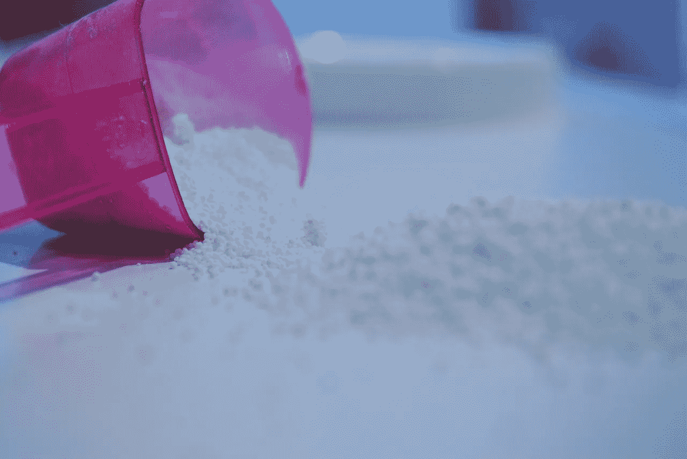
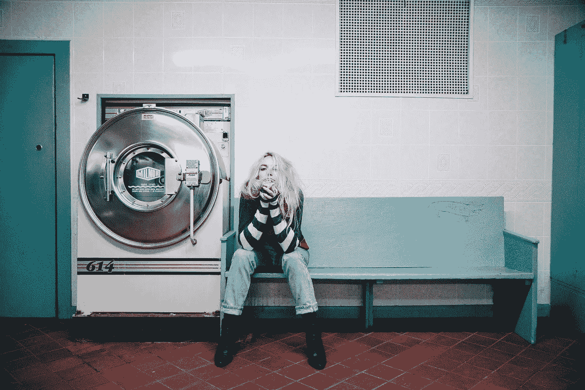
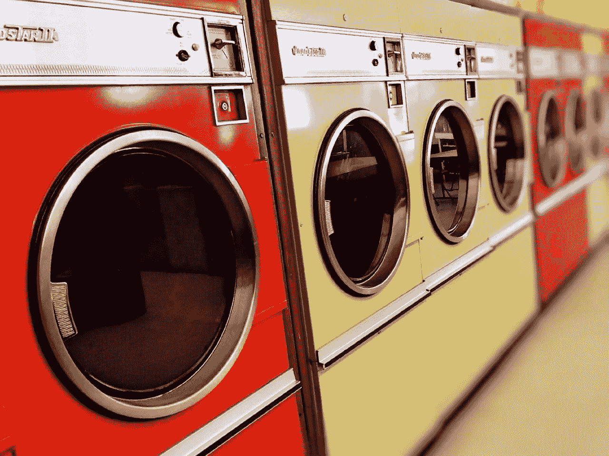
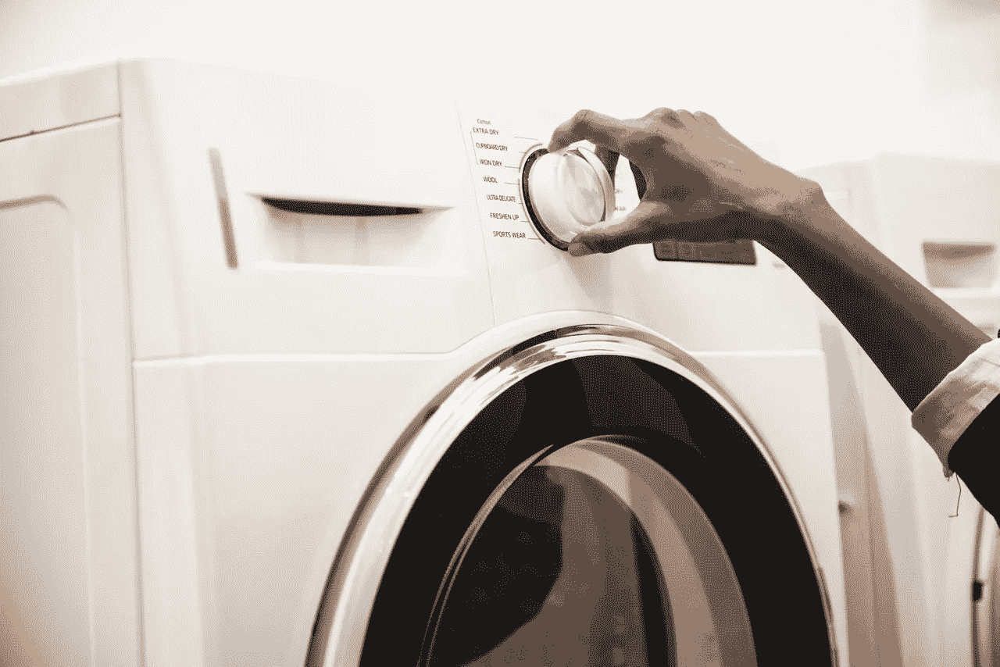

# 宝洁(Procter & Gamble)正在好转吗

> 原文：<https://medium.datadriveninvestor.com/is-procter-gamble-pg-turning-around-8ad464b399dc?source=collection_archive---------15----------------------->

宝洁(Procter & Gamble)或 P&G 似乎正在从零售业的末日中复苏。美国最受欢迎的肥皂公司刚刚结束了连续第五个季度的收入增长。

一年来，P&G 的收入一直在增长。值得注意的是，**宝洁公司(纽约证券交易所代码:PG)** 报告称，2018 年第三季度收入增长率为 0.22%。

这标志着 P&G 的收入连续第五个季度增长。详细来说，宝洁的收入在 2017 年第三季度开始增长。

此外，有些增长令人印象深刻。例如，P&G 2018 年第一季度的收入增长为 4.33%，2017 年第四季度为 3.2%，2018 年第二季度为 2.64%。

**惊喜宝洁&再次增长**

因此，宝洁公司(Procter & Gamble)又开始增长了。这将增加价值投资者的兴趣，因为 P&G 仍然是赚钱的地方。

例如，宝洁公司 2018 年第三季度的收入为 166.69 亿美元，毛利为 82.06 亿美元。这使得 P&G 在 2018 年第三季度的毛利率达到了令人印象深刻的 49.17%。

此外，这些数字转化为 35.54 亿美元的营业收入和 31.99 亿美元的净收入。因此，P&G 仍然通过销售汰渍洗涤剂、吉列剃须刀和象牙肥皂赚了很多钱。

**宝洁公司拥有大量现金**

毫不奇怪，P&G 从这些肥皂销售中获得了大量现金。具体来说，宝洁第三季度实现了 35.67 亿美元的运营现金流和 24.87 亿美元的自由现金流。

因此，P&G 在第三季度末报告了大量现金。特别是，该公司有 87.88 亿美元的短期投资和 25.45 亿美元的现金及等价物。因此，宝洁是一家现金充裕的公司。

此外，宝洁公司(Proctor & Gamble)正明智地利用这笔资金，调整其商业模式以适应现代美国。尤其是最近的两项举措，表明 P&G 明白消费市场的走向。

宝洁公司(PG)推出新的潮牌生态盒，进行战略性的电子商务活动

首先，宝洁公司(Procter & Gamble)推出了一款专为电子商务设计的新款 liquid Tide 包装盒。新包装；这款名为生态盒的产品于 11 月首次发货，据《The Verge》报道。

他们把新盒子做得像一个酒盒，这吸引了很多在线模仿。然而，P&G 设计的生态箱能够经受住运输。解释一下，酒盒足够坚固，可以抵抗运输过程中的损坏。

事实上，我把旧的酒盒切碎，用这些碎片来保护我有时运送的漫画书。澄清一下，酒盒纸板非常结实，没有邮递员能把它弄弯。

对于宝洁公司来说，Tide 生态箱是一个明智的战略举措

因此，在运输过程中，防潮箱不太可能被刺破，也不太可能将清洁剂泄漏到其他物品上。在这种情况下，托运人没有理由拒绝装运装有液体的箱子。

另外，不会有豆荚；儿童和愚蠢的青少年有时会吃。换句话说，P&G 可以避免因食用豆荚而导致的负面宣传和大诉讼。

最重要的是，P&G 可以通过邮件、像 UPS 这样的快递公司和新的运输服务轻松运输生态箱。因此，P&G 巧妙地为新的零售环境定位，在这种环境中，很大一部分人永远不会涉足实体超市。

**交付是零售和宝洁&的未来**

具体来说，生态箱将使通过下一代送货服务的运输变得容易。这样的服务包括 [Ocado](https://marketmadhouse.com/is-ocado-the-future-of-groceries-and-does-it-make-money/) ，盒装，Instacart，Shipt，Cornershop，包裹，亚马逊发货。

生态盒将使 P&G 通过此类服务销售洗衣液、洗碗皂和洗碗皂变得更加容易。此外，P&G 可以更容易地将 Tide 直接运送到一元店和其他较小的社区零售商店。

环保箱的潜在市场将是巨大的，因为 Statista [估计](https://www.statista.com/statistics/253587/number-of-stores-of-dollar-general-in-the-united-states/)在美国有 14，534**Dollar General(NYSE:DG)**小箱折扣店。除了一元店，还有下一代折扣运输服务，比如盒装的。

最后，像 Tide 这样直接向消费者运送产品将是 P&G 业务的一大部分。更好的包装将使 P&G 能够扩大其业务，同时消除中间商。

**学监& Gamble (PG)进行了一次明智的收购**

除了新的包装，宝洁公司(Proctor & Gamble)正在消费品领域进行明智的收购。

P&G 最近最引人注目的收购是专门为有色人种提供健康和美容产品的 Walker & Company。具体来说，沃克公司的产品线包括斜面护发产品。

Recode [估计](https://www.recode.net/2018/12/12/18136744/walker-company-procter-gamble-acquisition-tristan-walker-bevel)宝洁为沃克&公司支付了 2000 万到 4000 万美元。值得注意的是，沃克公司首席执行官特里斯蒂安·沃克将继续负责。

收购沃克公司在两个非常重要的方面帮助了 P&G。首先，它提供了吸引年轻消费者的新产品，这些消费者对传统的 P&G 产品不太忠诚。比如最近移民到美国的有色人种。

宝洁公司需要口碑，因为旧媒体正在消亡

其次，像 Bevel 这样的品牌，靠的是特定社区的口碑广告。这种广告对 P&G 至关重要，因为不断变化的媒体消费习惯正在扼杀网络电视等传统媒体。

例如，流媒体视频服务 Hulu 在美国拥有 4750 万用户，*市场疯人院*，[声称](https://marketmadhouse.com/is-disney-dis-a-monopoly/)。与此同时，据 Statista [估计](https://www.statista.com/statistics/530119/tv-networks-viewers-usa/)，2018 年美国最受欢迎的网络电视节目《生活大爆炸平均拥有 2273 万观众。

在这种情况下，大多数电视观众再也看不到 P&G 为汰渍和佳洁士做的广告。另一方面，人们仍然会从朋友、家人和同事那里得到推荐。因此，在当今的数字世界中，口碑对 P&G 来说比以往任何时候都更加重要。

宝洁公司可以和沃克公司一起开发巨大的新市场

第三，沃克公司的非白人专业知识可以为宝洁公司打开广阔的新市场。

美国人口普查局[估计](https://www.census.gov/quickfacts/fact/table/US/PST045217)2017 年，仅非洲裔美国人就占美国人口的 13.4%。因此，在美国 3.25719 亿人口中，大约有 4360 万黑人。

此外，人口普查局对 23.4%的美国人口进行了分类；或者说 7622 万人是“非白人”。因此，仅在美国，沃克公司的产品就有 7622 万潜在客户。

此外，大约有 800 万非洲裔人生活在欧洲，石英[估计](https://qz.com/1236213/europes-black-population-has-increased-by-at-least-a-million-over-the-last-decade/)。重要的是， *Quartz* 估计欧洲的非洲人口在 2010 年至 2017 年间增加了一百万。

除了欧洲和美国，非洲等发展中地区也有快速增长的市场。理论上，加密货币和区块链等下一代零售技术可以为宝洁等公司的直接销售打开这些市场

例如，俄亥俄州的 P&G 工厂可能很快就可以运送斜角护发产品；或者叫 Tide，直接卖给尼日利亚或者肯尼亚的客户。

宝洁公司是一家成长和价值投资公司

所有这些使宝洁公司成为一个增长型投资，但 P&G 也是一个价值投资。

例如，**宝洁(纽约证券交易所代码:PG)** 与**亚马逊(纳斯达克代码:AMZN)** 相比是一个便宜货。2018 年 12 月 13 日，G 的交易价格为每股 96.49 美元，而亚马逊在同一天的交易价格为每股 1658.38 美元。

独特的是，P&G 支付股息，而亚马逊没有。例如，宝洁公司的股东在 2018 年 11 月 15 日收到了 7170 万美元。另一方面，众所周知，亚马逊不支付股息。

此外，P&G 的股息正在增长；2018 年期间增长了 2.7。详细来说，宝洁公司在 2017 年 11 月支付了每股 69 英镑的股息。

P&G 提供了一些非常有吸引力的股息数据。例如，其股东在 2018 年 12 月 12 日获得的股息收益率为 3.05%，年化股息为 2.87 美元，股息支付率为 64.9%。最后，宝洁的股东正享受着连续 69 年的股息增长。

如果你在寻找一只有很大增长潜力的稳定赚钱的分红股票，那就去宝洁公司(Procter & Gamble)吧。P&G 是一个稳健的赚钱机器，有很大的增长潜力——所以它是一个价值投资。

这个故事最早出现在 [*市场疯人院*](https://marketmadhouse.com/) 。