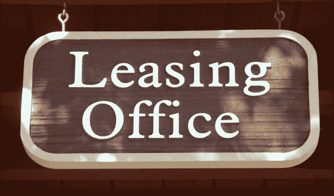

# 房地产还是好的投资吗？

> 原文：<https://medium.datadriveninvestor.com/is-real-estate-still-a-good-investment-f99ba520c81e?source=collection_archive---------37----------------------->

## 当然，过去的十年很棒，但是下一个十年呢？

这是我不时从投资者那里听到的问题。与我交谈过的一些专业投资者经常用另一种方式表达这一点，“我担心在这个周期的后期投资房地产。”

这些当然是合理的问题。但是，经常问这些问题的人忽略了更大的图景，特别是当它与投资多户房地产(又名公寓)有关的时候。现实情况是，我们正处于美国住房市场重大转变的早期阶段:从自有住房转向租房。

为什么？《国家房地产投资者》的这篇文章很好地总结了这种转变背后的主要原因。也就是说，自金融危机以来的十年里，拥有住房的价格变得越来越低。或许不太为人所知的是，美国人越来越倾向于出租房屋，而不是拥有房屋。

建造新住房的成本增加，贷款要求更加严格，利率上升，所有这些都使得拥有住房比过去几十年更难负担。与此同时，生活方式的改变导致越来越多的美国人选择租房。年轻人结婚成家的时间越来越长。与此同时，这些年轻人希望住在离工作地点近的地方，并重视租房的灵活性。另一方面，婴儿潮一代寻求缩小规模，住在离城市中心更近的地方。因此，在所有年龄组中，住房拥有率都保持在历史低点附近。

这两个都是强劲的趋势，将继续推动公寓需求的增长很多年。然而，让多家庭房地产更有说服力的是，面对这种不断增长的需求，住房供应实际上在下降。根据一项行业分析，今年建造的新住房数量将比十年前每年建造的数量少整整 33%。

总之，长期宏观经济和不断变化的生活方式趋势与供求规律相结合，将在未来许多年继续为房地产投资者提供强大的机会。

## 我想你会喜欢另外几个帖子:

[“我的下一个谷歌:75 号员工的观点](https://medium.com/@davidscacco/my-next-google-9921201ec63c#.ottmnxgwx)”

当股票开始下跌时，投资者该何去何从

*注:OpenPath 投资机会是面向合格投资者的。我不是注册会计师或专业财务顾问。所有观点都是我自己的。我鼓励你咨询你的会计师，以充分了解你的个人纳税情况。*