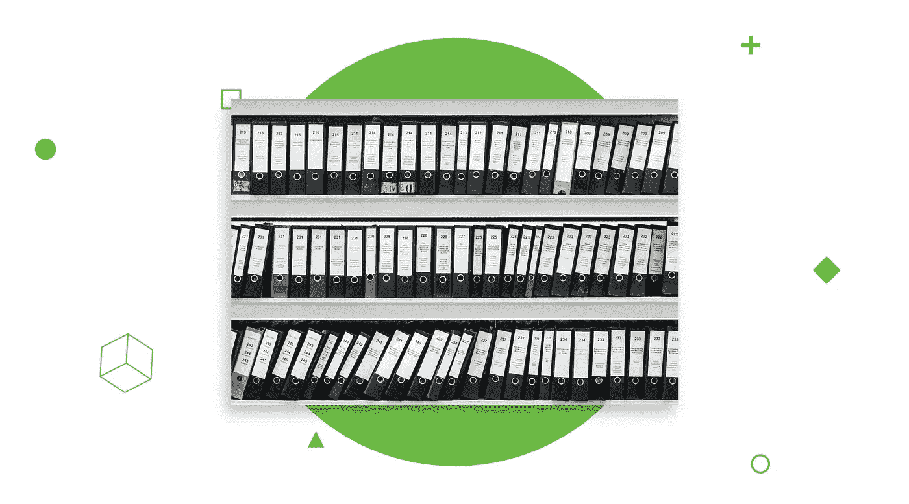
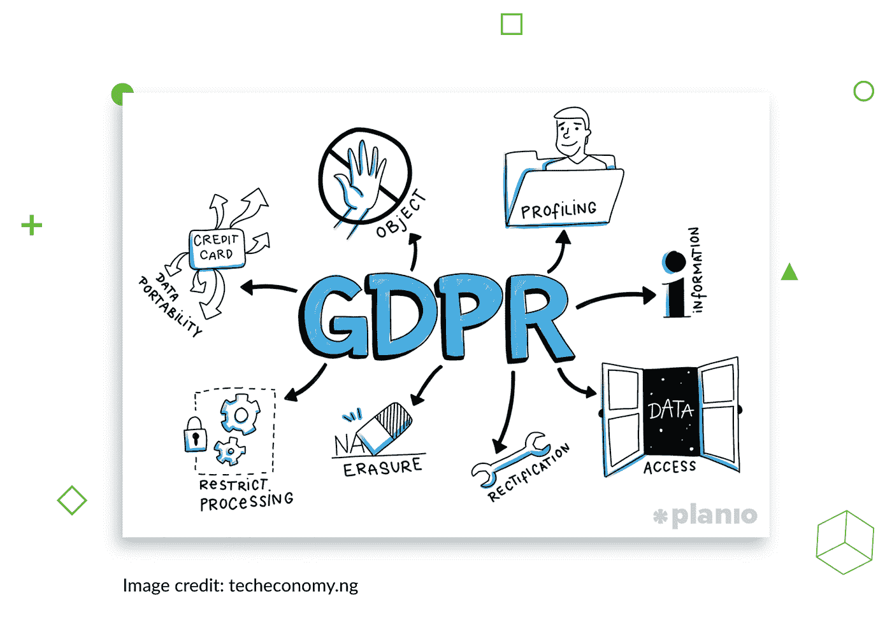
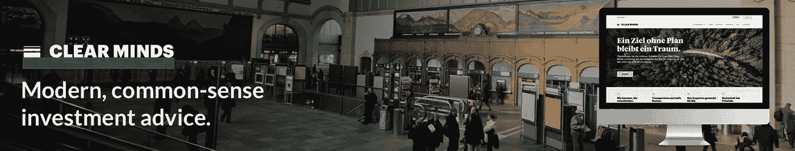
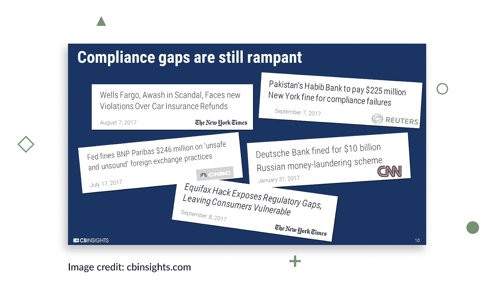
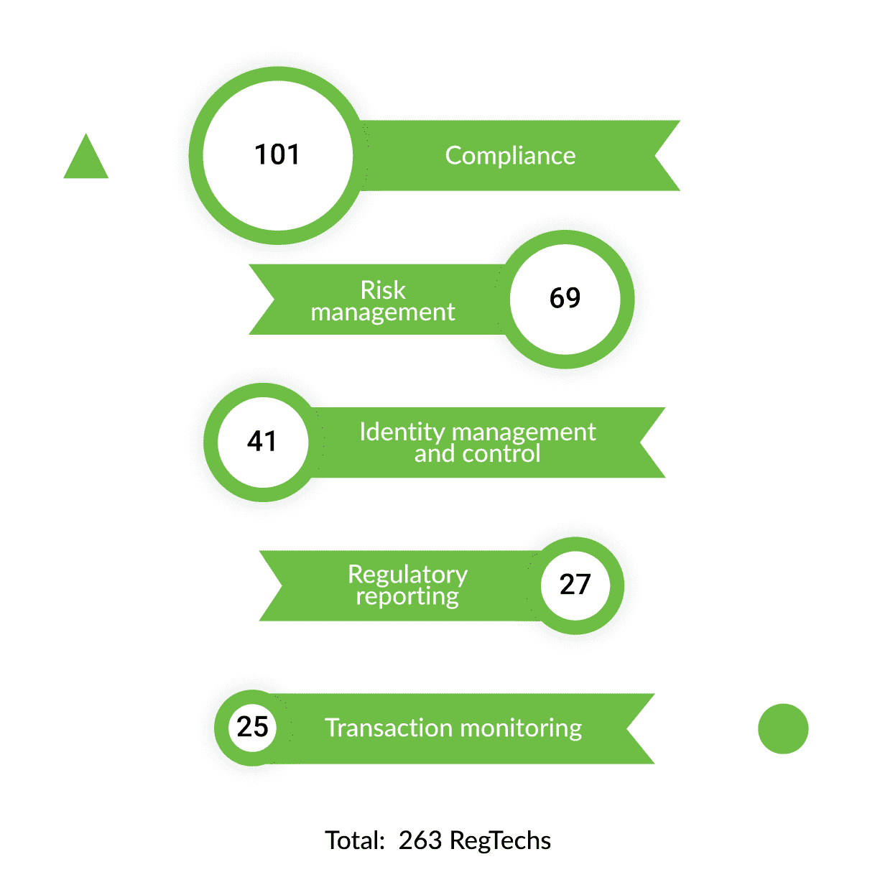
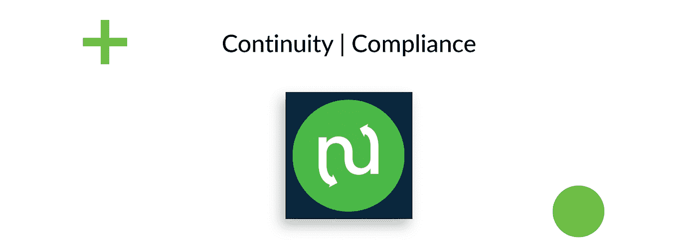
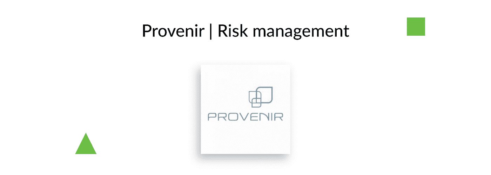
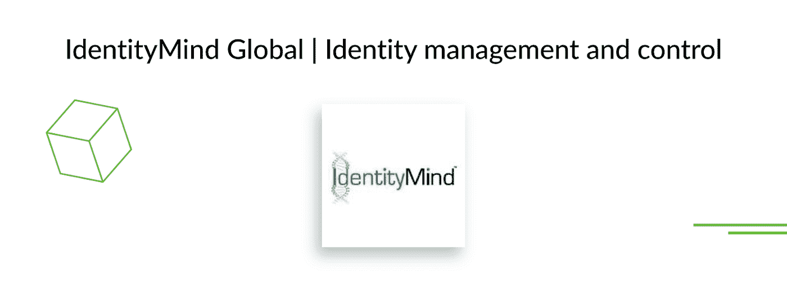
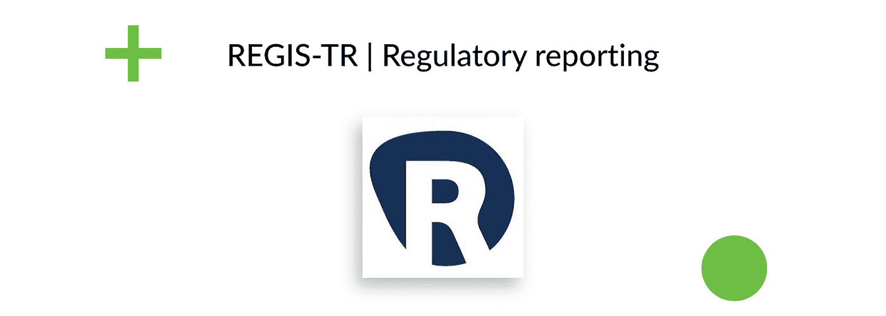
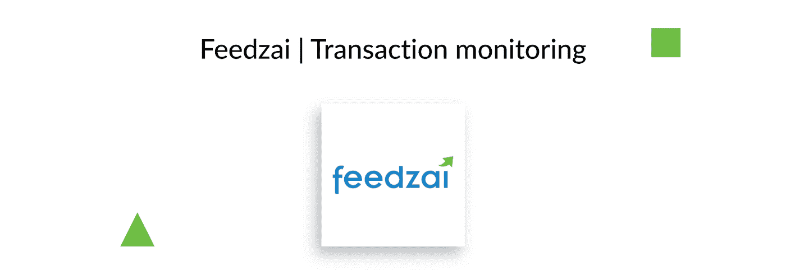

# Regtech 是金融服务的未来吗？最新金融科技趋势指南

> 原文：<https://medium.datadriveninvestor.com/is-regtech-a-future-of-financial-services-a-guide-to-the-latest-fintech-trend-805d1725721?source=collection_archive---------4----------------------->

这一切都是从几十年前开始的，当时这项技术开始存在并繁荣，政府不得不实施某些法规，以使一切都在法律之下。每一个科技企业，无论是小型网络代理还是大型软件生产，都是在他们所在州的法律下运作的。

> [继续阅读 Django Stars 博客上关于 **regtech services** 的这篇文章。](https://djangostars.com/blog/regtech-development-guide-latest-fintech-trend/#utm_source=medium&utm_medium=medium.com%2Fdatadriveninvestor&utm_campaign=what%20is%20regtech&utm_content=continue%20reading%20on%20ds%20blog)

政府法规的通过和变化比公司能够应付的更频繁——根本没有足够的时间来塑造产品或流程以符合某些法案。但是不遵守通常会导致巨额罚款和制裁。

当这种情况开始经常发生时，人们决定公司需要一个独立的合规部门。基本上，这是一个由律师和经理组成的后台办公室，他们的工作是监控和识别现有法规的变化，并防止和解决与遵守法规相关的问题。

这标志着官僚主义侵入了科技世界。因此，大胆的发明家会首先去检查他们的“突破性”想法是否符合所有适用的法规，然后他们才会建造它。费用仍然令人震惊:2016 年，金融科技公司在监管合规方面花费了大约[1000 亿美元](https://www.forbes.com/sites/tomgroenfeldt/2018/03/22/taming-the-high-costs-of-compliance-with-tech/)，并且这一成本每年都在上升，*福布斯*报道。

跟我有什么关系？嗯，当我们的团队在开发投资平台“清晰思维”时，GDPR 出现了。另一个规则，但这是一个大问题。该法案迫使科技公司保护其客户的数据，即——他们不能向第三方披露这些数据，不能以任何方式使用这些数据，但可以作为用户标识符，并且如果客户在停止使用该产品后要求公司删除用户个人数据，他们必须能够删除用户个人数据。GDPR 不仅面向科技公司，也面向终端用户。如果您还记得，2018 年 5 月，您使用的所有服务都向您发送了更新的隐私政策以及条款和条件。这就是新法规出台时真正发生的情况。

# 阅读清晰思维案例研究:

像所有在欧洲运营的科技公司一样，我们面临着存储个人数据的问题。首先，我们将研究法规本身，然后了解它将如何影响产品。我们不知道我们必须做些什么来遵守 GDPR 协议。这时**监管技术也就是 RegTech** 来拯救我们了。

# RegTech Universe —它是什么，它的类别和解决方案

一方面，我们有一堆法规要遵守。另一方面，并非所有公司都有合规官的预算。RegTech 是快乐的媒介。这项技术致力于标准化管理流程，创建对管理法规的明确解释，最重要的是，自动化法规遵从性流程。

许多公司仍然选择无视法规——但是，嘿，GDPR 的罚款可能高达 2000 万€和公司年收入的 4%。告诉我你愿意冒这个险。这张来自 [CBInsights 的](https://www.cbinsights.com/research/regtech-trends-fintech/)研究的图片清楚地说明了这个问题:

简而言之，RegTech 旨在防止因不遵守某项法律而被罚款。[德勤](https://www2.deloitte.com/lu/en/pages/technology/articles/regtech-companies-compliance.html)分析了 150 家监管科技公司，确定了 **5 类监管科技**。

**符合性**。这是 RegTech 最大的区域。人工智能和机器学习可以搜索新的或已审查的法规，报告并与利益相关者分享变化的影响。这些算法被编程为自动执行这些任务，并由合规官在关键决策点进行适当的审查。安装合规软件将有助于避免 GDPR 施加的所有这些罚款，因为没有一个行为会被忽视。

**风险管理**。一些 RegTech 解决方案持续监控风险。这意味着他们学会根据预定义的数据来检测潜在的不安全情况。在金融科技行业，风险管理软件使用先进的分析方法和大数据分析来预测市场变化和减轻类似的风险。毕竟机器对数字的处理远比人好，对吧？

**身份管理和控制**。“了解你的客户(KYC)”程序处理客户身份认证和甄别程序。大部分是例行的手工工作，容易出现人为错误，可能导致身份欺诈或洗钱。RegTech 开发人员依靠先进的数据聚合和分析工具，通过从多个来源收集信息来扩大识别流程的范围。

**监管报告**。你喜欢写报告吗？不过，机器可以。他们在这方面比人强多了。我们会犯错误，这会导致不清楚或不正确的数据。*机器人流程自动化* (RPA)使数据管理工作无需额外的员工参与，因此最终会有及时准确的数据。

**交易监控**。监控金融交易的过程通常由不同的部门执行。对于什么应该被视为可疑，他们有一定的标准。同样，RPA 可以比人更快、更准确地分析和监控事务。

结论:大部分 RegTech 软件使用 RPA、大数据分析、AI 和机器学习。现在，让我们仔细看看一些 RegTech 公司及其提供的解决方案。

# 您可能还喜欢:

 [## 创新抵押贷款行业:为什么和如何

### 有些事情就是出现了，改变了我们的生活。它们对我们来说几乎是不可见的，但是在它们到来之后，我们无法想象…

djangostars.com](https://djangostars.com/blog/innovating-mortgage-industry/#utm_source=medium&utm_medium=medium.com%2Fdatadriveninvestor&utm_campaign=what%20is%20regtech&utm_content=youmayalsolike1)  [## 2018 年顶级金融科技外卖

### 在 21 世纪，我们感觉我们终于生活在每个人都在等待的未来，而且…

djangostars.com](https://djangostars.com/blog/top-fintech-takeaways-2018/#utm_source=medium&utm_medium=medium.com%2Fdatadriveninvestor&utm_campaign=what%20is%20regtech&utm_content=youmayalsolike2) 

# RegTech 解决方案

到目前为止，RegTech 解决方案可能看起来像一个模糊不清的软件，但在这一部分，我将告诉你 5 个已经上市的工作 RegTech 解决方案，最重要的是，它们是有效的。

**Continuity** 是一家提供合规软件的美国公司。该计划持续监控美国联邦登记册，并根据客户的业务领域，解释适用于客户业务的法规变化。你可以利用连续性，而不是雇佣额外的员工。此外，它还提供了统一的合规管理系统模型，这是一个根据特定计划运行的自动化合规流程。

**Provenir** 是一款风险分析软件，可与任何结构化和指令性数据源集成，并根据预设参数创建风险分析。这样的数据源包括 Twitter、脸书、Salesforce 和许多其他使用高负载数据库的科技巨头。这种多元应用可以用于不同的行业，从电子商务网站到银行。顺便说一下，汇丰银行是他们最大的客户。

**IdentityMind** 是一个负责 KYC 过程的平台:它搜索、维护和分析身份，使公司能够知道一个人是谁，以检测和防止身份欺诈。对于商业企业来说，这意味着更好地防范洗钱。

**Regis-TR** 是一家 RegTech 开发公司，为欧盟各种资产的各种贸易交易提供报告软件。他们的报告系统符合三项规定:埃米尔、芬弗拉格和 SFTR。该公司旨在创建一个完整的生态系统，客户可以一次向一个实体报告他们的数据，而不会违反任何规定。

**Feedzai** 是一个基于人工智能的平台，旨在防止金融违规。简而言之，它为银行和商业科技公司提供支付流程保护，以检测欺诈行为。它使用历史和行为数据分析来识别交易是否具有潜在的可疑性。

正如你所看到的，RegTech 不是什么神奇的东西，而是一个非常特定区域的 B2B 服务。这 5 家软件公司只是整个 RegTech 行业的一小部分。大多数解决方案依赖于人工智能和机器学习的使用，以从报告和风险管理等常规流程中排除人为错误。不过，市场相当不稳定。许多新玩家正在进入市场，我相信 RegTech 解决方案将入侵全球大多数金融科技公司只是时间问题。

> 这篇关于 [**regtech services**](https://djangostars.com/blog/regtech-development-guide-latest-fintech-trend/#utm_source=medium&utm_medium=medium.com%2Fdatadriveninvestor&utm_campaign=what%20is%20regtech&utm_content=regtech%20services) 的文章最初发布在 [Django Stars 博客](https://djangostars.com/)上。

> *如果你觉得这篇文章有用，请点击👏下面的按钮:)*