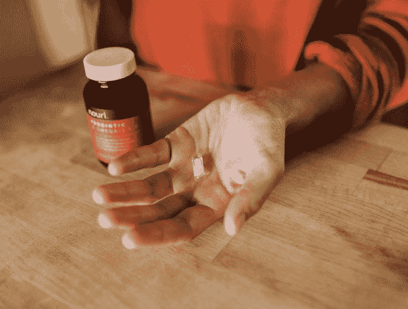

# 自理是医疗吗？

> 原文：<https://medium.datadriveninvestor.com/is-self-care-medical-care-1d2c30e8a21f?source=collection_archive---------8----------------------->

health

健康是个人的-尽管知道它会结束，但它是一个人一生中最神圣的财富，但通过生命愿意付出的努力来珍惜它。同时，每个人都喜欢享受，尝试新的选择，互动和实验。走那些不一定安全健康的路。当然，生活就像一把双刃剑，我们注定要保持健康，也注定要放弃不健康的习惯。个人需要帮助来做出正确的选择，因为他们并不是生命科学各个方面的专家。有些捷径是把负担放在医生和健康专家身上，有些捷径是忽视专家的意见，有些捷径是与医生建立联盟来寻求指导。这种态度的变化开启了一个新的有争议的话题。

谁负责一个人的健康？！支持健康的最佳方式是什么？！

虽然没有完美的定义，但理想的健康是在社会、身体和心理方面人类身体和灵魂的平衡，没有人会在我们的有生之年永生。为了实现，一个人必须通过填补无法填补的空白来定义自我、健康和关怀。一旦成功，定义然后设定目标并大步前进，就像在茁壮成长。最终，整个过程都在“**医疗保健的保护伞下。**

 [## 大笔资金和尖端技术:人工智能/人工智能投资将如何革新医疗保健…

### 在过去几年人工智能(AI)和机器学习(ML)的显著发展中…

www.datadriveninvestor.com](https://www.datadriveninvestor.com/2018/03/22/big-money-and-cutting-edge-technology-how-investment-in-ai-ml-will-revolutionize-the-healthcare-industry/) 

毫无疑问，在我看来，任何一个心智健全的人都会去争取，因为我们都呼吁更好的生活，而改善需要健康的生活。然而，在典型的使命下，我们所有人都根据不同的理由认为什么是属于我们作为病人的义务。在这个前提下，零星地定义我们所说的健康、护理、药物和医疗保健是至关重要的。这种支持满足了我们对科学、技术和社会心态的期望。例如，一个世纪前，医疗护理或自我护理被认为是医生的工作，在那个时代，病人将是指令的追随者，这可能足以满足公众的医疗保健。但是，[现在的千禧一代更加独立和自力更生，有些人可能会被认为过度依赖科技。因此，当我们在婴儿潮一代和 Y 一代或千禧一代之间导航时，医疗、自我和保健的定义可能会有所不同。定义之战是医疗保健提供系统中分歧的引爆点。因此，回顾一些历史报告并注意到这种转变是公平的。](https://link.medium.com/KzelWAU5i0)

根据维基百科，通过我的尽职调查搜索可能的在线定义，我很快就认识到医疗保健等同于医疗保健。该网站将后两者定义为“通过预防、诊断和治疗疾病、疾病、损伤和其他身体和精神损伤来维持或改善健康。卫生保健由相关卫生领域的卫生专业人员提供。”

# 让我们浏览一下定义

自理不是医学术语。这是一种管理式护理驱动的行为，指的是个体在身体或精神健康症状出现后参与的一系列事件或系统定义的协议。公司和管理式医疗保健组织经常为他们的员工/成员提供资源，以便在不亲自去办公室的情况下，就如何治疗他们的症状做出更明智的决定。换句话说，今天的自我保健指的是一种受控的、有限的协议驱动的医疗保健。它与个人控制下的任何必要的人类监管事务有关，是有意的和自发的

相反，医学是在技术上诊断、治疗和预防疾病的科学或实践，通常被用来省略外科手术。

根据定义，健康是指没有疾病和虚弱的身体、精神和社会福祉的状态。为了健康，一个人必须使用所有好的科学和实用技术来不断地应用于那个神圣的使命。三十年甚至二十年前，由于获得医疗信息和技术的途径有限，治疗的主要来源是医生的办公室。

19 世纪的预防性健康开始了一个预先定义的协议来教育公民关于传染病的疾病预防。人们普遍认为，通过强制接种疫苗和更好的卫生习惯，实施预防性保健主要是政府的责任，否则这在今天会被认为是自我保健。

健康的可维护性仍然滞后，因为它需要结构化信息、媒体接触和高度依赖技术的教育，因此受到限制。今天，随着信息技术的进步，社交媒体，未经提炼的大量信息的矛盾，人们研究和阅读他们的问题和症状。也许远离有害信息和合法有效的信息太过分了。

# 自我保健的概念及其伴随的争议得到了复兴。

过去，自我保健被认为不过是洗手和刷牙。尽管如此，如今人们认为，与以前想象的相比，自我开药和提炼草药的方法还有点欠缺，因此对医生的依赖程度较低。一个世纪前，医疗保健只不过是没有细分的带回家指导的医疗保健。因此，自我保健是自我的有控制的有限医疗保健。

今天，自我保健的约束更少，但范围更广。它正随着科技的发展而扩展。病人、医生、技术和政府角色之间出现了斗争。每个人都还没有在医疗保健真空中找到一个专门的空间。

# 自我保健和医疗保健

医疗保健和自我保健是医疗保健保护伞下的重叠现象。它们的趋同性在不断增长，它们的相称性也随着社会需求和牵引力的变化而变化。此外，如何使自我保健有效和安全是我们讨论的焦点。

# 预防是最好的药！

一个人如果不知道什么是健康的生活方式，就不能把医学借给自己。在当今一刀切的企业人群健康模式下，医学正变得越来越定型化和碎片化，尽管这个系统一直在努力修补这个崩溃的系统。它致力于创造另一种管理式医疗的概念，主要是通过把负担放在全科医生身上来统一不同的学科。因此，在医学是一门多面科学的情况下，自我保健和医疗保健之间的比较差异和重叠完全是一种错误的说法。

# 功利主义的态度无助于今天自我保健的精神态度

在具有功利主义方法的医疗保健方案中，用户是好的，正确行为的决定性考虑应该是其后果的有用性，这在今天的社会心态中不再适用。这是显而易见的，因为它未能有效地纳入所谓的自我护理模块。医生必须适应合作或务实的姿态，重视病人的自主权，尊重他们的个人生活方式，以融入后者。从医生和病人的角度来看，个人立场是医疗质量的驱动力。我们需要问自己的问题是-

> 我们希望被关心，还是希望关心自己，还是需要帮助填补空白？
> 
> 功利主义的态度显然是一个人倾向于放弃对医生或医疗专家的控制。

千禧一代是另一个极端；他们自我驱动，精通技术。千禧一代对医疗保健失去了信心；他们在去诊所之前就已经决定了他们需要从医生那里得到什么。年轻一代更适应企业驱动的医疗保健，但同时也会犯错。尽管有此警告，但仍有不良反应[被报道](https://en.wikipedia.org/wiki/Dietary_supplement)，包括肌肉痉挛、脱发、关节痛、肝病和过敏反应，其中 29%的不良反应导致住院治疗，20%导致严重伤害或疾病。

历史上，政府在自我保健和健康预防方面占据了主导地位。尽管如此，由于没有必要过渡到合法的个性化护理，这种情况正在朝着与医疗实践的现实主义相反的方向改变。而是一种伪个性化的公司医学，鼓励患者呆在家里，追求一套对大多数人来说最好的协议，而没有防范虚假信息充斥互联网的措施。

# 医生授权是美德

医生需要在他们的实践领域范围内参与并承担起预防的角色。为了安全起见，患者需要与他们的医生讨论他们的在线发现。病人必须在主治医生的监督下控制自己的健康。帮助自我保健不仅仅是初级保健领域。这是所有技能和水平的所有医疗专业人员的义务。例如，关节炎的预防必须是整形外科医生的责任，就像糖尿病的预防是内分泌学家的责任一样。错误的是，所有的预防保健都捆绑在初级保健的责任之下。

# 自我护理是协作护理

协作护理是自我护理误称最可靠的称谓。个性化的技能组合需要患者和医生之间的协调护理。它会更好地描述向公众传达了什么。“自我保健”不能脱离医疗保健，仅仅因为它需要不断的医生干预和智力咨询。

遗憾的是，我们今天看到的合作医疗主要是在病人和技术驱动的协议之间。由于他们的[技术官僚倾向，千禧一代](https://medium.com/datadriveninvestor/healthcare-technology-rush-the-major-factor-behind-the-disconnect-between-physicians-and-their-d599683b55f0)走上了信任技术的道路，摆脱了医疗专家对医疗专家自身的控制。

# 赋予病人权力是必须的

患者自己进行医疗护理是必须的，但是没有医生的指导是错误的。

千禧一代痴迷于自我保健。正如随机[刊物](https://eric.ed.gov/?id=EJ1095589)所言:

> “虽然数字媒体提供了新的机会来讨论健康差异和提高城市社区大学生的健康素养，但他们必须有机会在更深的层次上处理电子健康信息，并学会如何有效地检查网络上的健康信息。”

如果病人完全遵循这个系统，并让他们自己接受指导，企业保健和专制政府保健将不可避免地取而代之。事实上，自我保健、医疗保健，如通用术语所述，都适用于医患关系范围内的临床过程的合作来源，因为一个不能没有另一个。

# 个性化护理就是答案！

个性化护理是协作式护理。医疗保健由安讯士医疗保健、个人护理、公共卫生组成，所有这些都围绕医生和患者构建，以增强我们需要的个人能力。

个人是患者和医生，他们各自独立地认识和控制自己的空间，同时利用技术、社交媒体和信息，而没有第三方偏见影响的风险。

*原载于 2019 年 10 月 15 日*[*https://www.datadriveninvestor.com*](https://www.datadriveninvestor.com/2019/10/15/is-self-care-medical-care/)*。*

 [## 自理是医疗吗？数据驱动的投资者

### 健康是个人的——它是一个人一生中最神圣的财富，尽管知道它会结束…

www.datadriveninvestor.com](https://www.datadriveninvestor.com/2019/10/15/is-self-care-medical-care/)