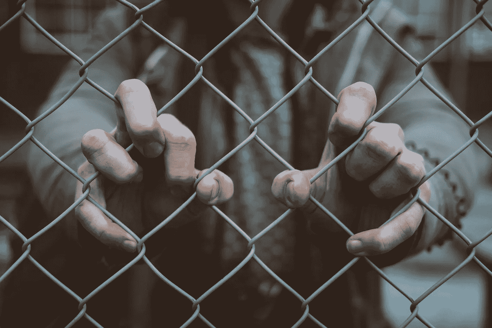
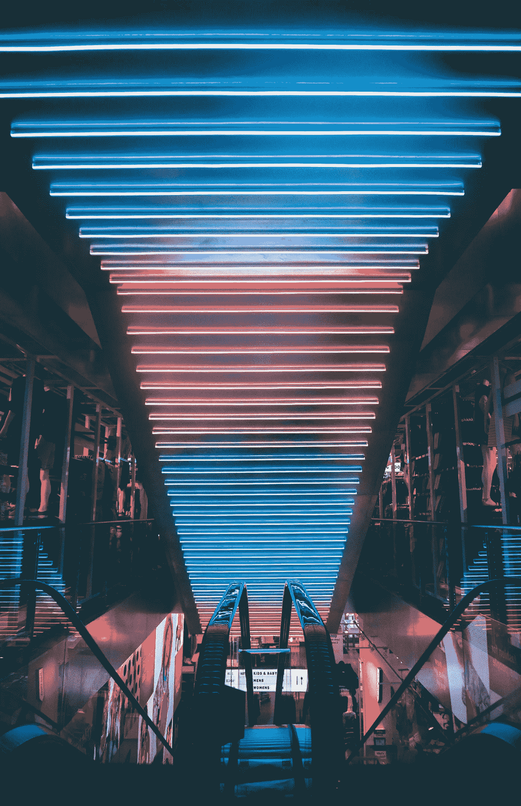
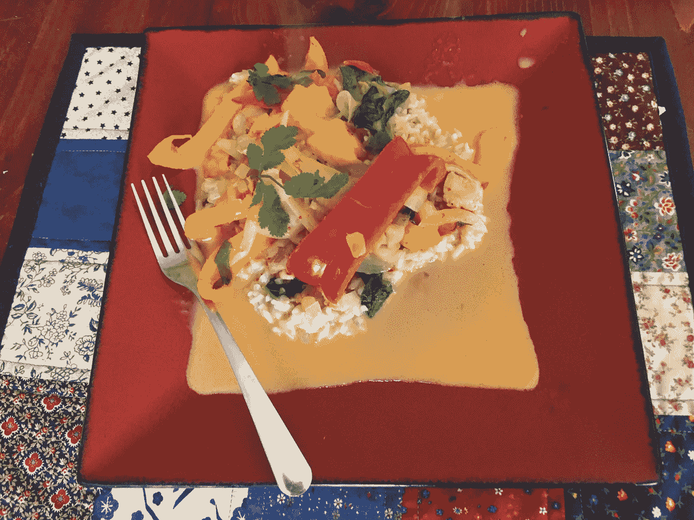

# 购物让你不开心吗？

> 原文：<https://medium.datadriveninvestor.com/is-shopping-making-us-unhappy-c65bcc12e02?source=collection_archive---------13----------------------->

# 购物只是逃避现实的另一种方式

Photo by [Mitch Lensink](https://unsplash.com/photos/Ismnr6WSHCU?utm_source=unsplash&utm_medium=referral&utm_content=creditCopyText)

在本周的隐藏大脑播客中，主持人 Shankar Vidantam 探索了逃避现实生活的诱惑。

> 以前是这样的，如果你想感受做一件事的感觉，你必须走出去做。如果你的梦想是从木筏上看到大峡谷，你应该去河边…但是我们文化中的某些东西已经改变了。
> 
> ——尚卡尔·维丹坦，《隐藏的大脑》，[足够接近:通过他人生活的诱惑](https://www.npr.org/2019/02/05/691697963/close-enough-the-lure-of-living-through-others)

在这一集里，一个年轻的女人梦想表演音乐。她吃饭，睡觉，呼吸音乐。她甚至在上班的路上练习唱歌。但是当她收到未婚夫的吉他时，她意识到成为一名音乐家实际上是多么困难。她只是想表演，而不是独自坐在房间里 [10，000 小时](https://www.litcharts.com/lit/outliers/chapter-2-the-10-000-hour-rule)练习琶音。

播客中的另一个故事涉及一项研究:

参与者观看了一段视频，视频中有人表演了“从盘子下面拉出一块桌布”的把戏。然后，他们对自己第一次尝试成功的信心程度进行评估。每个参与者观看视频的次数不同。

人们观看视频的次数越多，他们越有可能说他们第一次就能做到。例如，在看了 20 遍视频后，大多数人相信他们第一次就能做到。

**观看比赛有种像真实生活的感觉。它把我们吸了进去。我们花了几天，几周，几个月的时间躺在沙发上，窥视别人的生活。感觉如此真实。如此简单。**

我们观看，不是为了过真实的生活，而是为了逃避它。

## 消费:终极逃避

这一集让我想起了我逃避的事情:买东西。YouTube 不是我们逃避现实生活的唯一途径。花钱也可以这样。

> 2017 年，美国人平均每天花费超过 [40 分钟](https://www.bls.gov/tus/charts.htm)购物。一个月 20 个小时。

我们躺在沙发上，浏览 etsy 来缓解现实生活的压力。我们花钱是为了解决问题，消除无聊。我们整天都在试图逃避现在，为周末而活。我们一直在幻想下一次旅行或者最新最棒的 iPhone。

YouTube 和消费是虚假的避难所。他们暂时安慰了我们，但从长远来看，让我们像以前一样空虚。

当我们可以花 300 美元让别人帮我们做时，为什么要花 50 美元去学习做一张桌子呢？“下订单”完成。

为了逃避无聊和失败的感觉，我们会做任何事情。我们会睁着眼睛在亚马逊上呆上几个小时。我们会打开钱包，每次刷卡都会减轻痛苦。

最让我们害怕的事情就是去尝试一些事情，去学习一些东西，然后一次又一次的失败。我们宁愿看别人直播。我们宁愿付钱让他们为我们而活。

很难承认失败是可以的。很难承认此刻的痛苦可能是正常的，没关系的。或者意识到我们现在拥有的已经足够了。

Shopping as a way of life. Photo by [Andre Tan](https://unsplash.com/photos/cErkfKgmzak?utm_source=unsplash&utm_medium=referral&utm_content=creditCopyText)

## 购物是一种生活方式

如今，不仅仅是我们买东西。我们在 OkCupid 上寻找伴侣。我们在脸书上寻找志同道合的朋友。我们在 craigslist 上为室友购物。

我已经在网上找到了我最近的~5 个生活状况和前几任男朋友。

但是我花在网上的大部分时间，我甚至不打算买东西。我只是在幻想。

## 消费与生活

我写了一个名为[节俭的风筝](http://www.frugalkite.com)的博客，内容是关于如何努力少花钱多生活。

我越想通过花钱来缩短我的生活，我就越不喜欢它。我没有花钱，而是花很多时间为朋友准备食物，学习如何修理自己的自行车，学习画画，这样我就可以用自己的艺术品装饰房子。有时候很糟糕。

有一次，我给父母做了一个很恐怖的牧羊人馅饼(用番茄酱代替番茄酱😭).他们很好，假装它是好的。我感到羞愧。

这个周末，我给自己的自行车轮胎打气，后来没有把气门嘴拧得足够紧，晚上 10 点发现自己在雪地里，没有车可以回家。

我可以避免这些麻烦。我可以付钱让别人帮我打扫房间，洗衣服，跑腿。我可以请专业人士修理我的自行车。我可以听 Spotify，而不是学习演奏乐器。这没什么不好。

但是没有任何挣扎，又有什么意义呢？如果一切都很容易，我永远不会为自己的成就感到骄傲。我永远不会知道在钢琴上学会一首歌或粉刷我的整个公寓的甜蜜满足感。*没有奋斗，就没有快乐。*

这个周末，我做了有生以来最好吃的泰式咖喱。这是一种咖喱，我很乐意在餐馆里吃。

My sweet mango, onion, and pepper curry with a garnish of cilantro. 😋

我做咖喱有多久了？大约 10 年。我做了很多好的。但是这一次超越了他们所有人，在这么多小时的练习后，这场胜利对我来说意义重大。

## 你会冒险吗？

人生是一段艰难的旅程，也是一段有意义的旅程。这是关于确定什么是真实的，什么是给予奇迹的，什么对你是丰富的(提示:这不是你的银行账户)。*生活就是收起我们的钱包，卷起我们的袖子。*

就像孩子从跳水板的边缘后退一样，你可以站在你生命的边缘。你可以用你的一生去思考下一件你要买的东西或者下一个你要去的地方，想象它最终会让你快乐。那很好。注意安全。保持不开心。这是 walmart.com 的链接。

或者你可以和我一起冒险，尝试一些既恐怖又美妙的事情。你可以学习厉害的技能，花更多的时间和你爱的人在一起，去户外，创造生活窍门。

选择权在你。

我是吉纳。我正在写我在节俭风筝上走向更大幸福和财务独立的旅程。在 frugalkite.com[阅读更多我的故事](http://www.frugalkite.com)