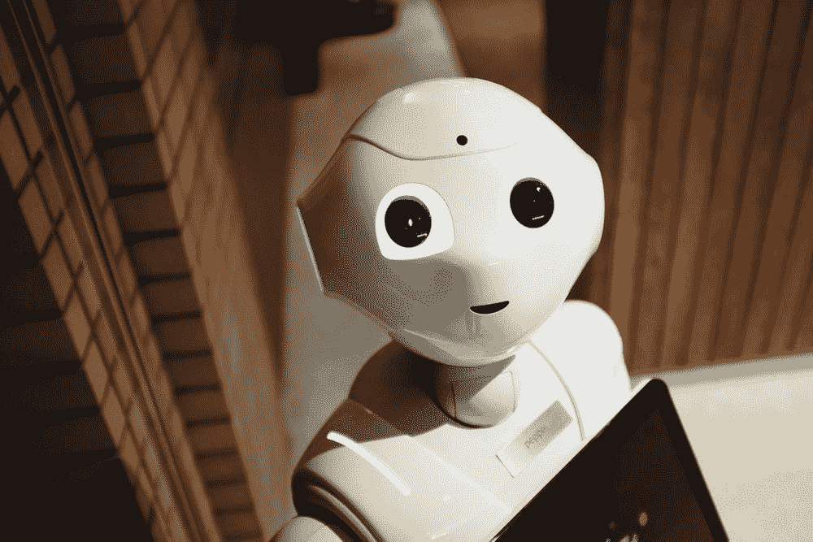
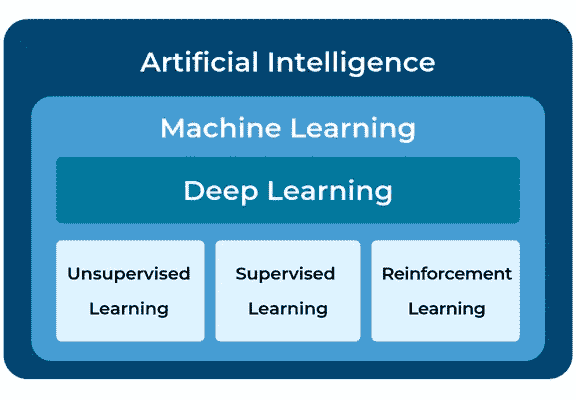
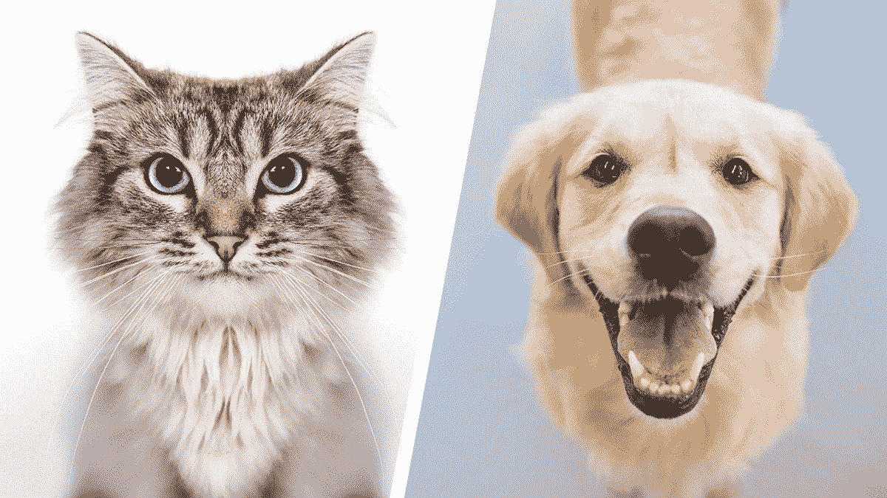
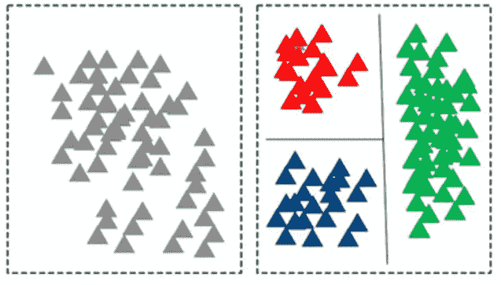
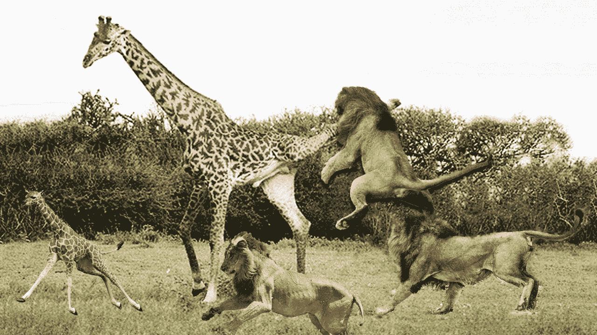

# 天网真的是人工智能的未来吗？

> 原文：<https://medium.datadriveninvestor.com/is-skynet-really-the-future-of-artificial-intelligence-83b7d6ad0d05?source=collection_archive---------2----------------------->

## 人工智能和机器学习方法介绍。

还记得电影《终结者》中开发出来指挥防御系统的人工智能软件天网吗？

天网最终获得了意识并背叛了人类。疯狂的部分不是关于天网获得意识，而是关于人类实际上如何相信未来的“现实生活”人工智能最终会获得意识并消灭人类。

 [## 人工智能预测能力的神话|数据驱动的投资者

### AI(人工智能)最有前途的优势之一似乎是它预测未来的能力…

www.datadriveninvestor.com](https://www.datadriveninvestor.com/2019/03/01/the-myth-of-ais-predictive-power/) 

人类对技术进步的负面偏见总是困扰着我。世界上一半的人认为这是迷人的和革命性的，另一半的人认为这是对人类有害的。

但真正的问题是，我们真的知道意识是什么吗？它没有被量化，因此不可测量。人工智能，顾名思义，由模仿人类智能的机器组成，这当然使智能成为人工的。

如果它是人造的，那么我的论点是它如何获得意识。如果意识是不可测量的，那么我们不应该关注人工智能可测量的方面吗？当一些人认为岩石是有意识的时候，我们认为人工智能是否会获得意识，这有什么关系吗？

因为说真的，如果没有技术进步，我们今天的生活将会变得更具挑战性。我们没有意识到这一点，因为我们认为这是理所当然的，然后我们所做的只是抱怨和挑剔这些小事，而忽略了它的好处。我们毫不夸张地指责人工智能夺走了工作，但我们从来没有谈到人工智能到 2022 年将创造 1.33 亿个工作岗位。

根据世界经济论坛的数据，人工智能创造的就业机会将是它取代的就业机会的 1.8 倍。需要明确的是，人工智能不会偷走你的工作，相反，它会改变你的工作方式。人工智能将会开辟一个比以前所认为的更广阔的领域。

# 那么……什么是人工智能？

人工智能是一个强大的工具，它让计算机像人类一样推理并模仿我们的行为。

对于人类来说，像开车、识别猫和阅读这样的任务可能变得非常容易。然而，很难将这些相同的任务教给计算机。人工智能开启了计算机学习通常只有人类才能完成的任务的能力。值得注意的是，人工智能的幕后不是魔术，而是数学，而是复杂的数学。AI 不会有意识的另一个原因是，如果我们都同意数学不是有意识的，那么 AI 突然有意识就说不通了。

对于自动驾驶汽车，人工智能分析大量数据，以模拟人类驾驶和对环境做出反应的方式。人工智能的美妙之处在于它不容易出现像疲劳这样的人类缺陷。自动驾驶汽车可能比人类司机安全得多，因为大约 94%的致命车祸是由于人为错误造成的。太疯狂了。

我们总是在想人工智能将如何影响未来，但我们很少意识到人工智能已经如何积极影响现在。昨晚你看了 Youtube 还是网飞(对于那些容易陷进 Youtube 兔子洞的人，我感觉到你了)？如果是的话，惊喜吧，你和 AI 互动过！大量的人工智能算法正在视频流平台的后台运行。有没有想过为什么你碰巧想看的东西会出现在 YouTube 的推荐区？那是由人工智能驱动的。人工智能的其他常见例子包括:

*   语法上(没错！我在这篇文章中使用了语法😅)
*   谷歌地图中的路线优化
*   优步和 Lyft 的应用
*   商业航班的人工智能自动驾驶仪
*   Gmail 的垃圾邮件过滤器
*   手机上的人脸识别
*   谷歌主页、亚马逊 Alexa、Siri

我们经常互换使用人工智能、机器学习和深度学习等流行词汇，但它们并不是完全相同的东西。**人工智能是一个总称，包括模仿人类行为的不同方法**。

**机器学习是人工智能的一个子集，在机器学习内部，还有更多子集。**

# **机器学习**

为什么有这么多不同的术语，但基本上不都只是 AI 的一个版本吗？

是的，但是每一个版本采取的方法都非常不同。由于方法不同，每个版本的应用程序也不同。

本质上，机器学习是一个过程，在这个过程中**计算机被教会分析数据，以便它能够做出智能和明智的决策。对人类来说，我们经历的接触越多，我们的选择就越明智。这与机器学习的情况非常相似，因为机器获得的数据越多(暴露)，它们的决策就越明智。数据是驱动机器学习模型准确性的主要因素之一。模型是指人工智能所有感知“魔力”背后的算法。**

机器学习是一个非常广泛的概念，可以进一步细分为不同的方法。机器学习有三个主要分支:

1.  监督学习
2.  无监督学习
3.  强化学习

Artificial intelligence is the overarching concept that encompasses machine learning and deep learning

## 监督学习

假设你是一名程序员，任务是编写代码，明确地编程计算机来区分猫和狗。

Front view of a cat and a dog

真的没有一种有效的方法来明确地编程计算机来检测图像中的动物。如果您最终编写了无数行代码，这并不奇怪，但是，您的代码甚至都不具备功能。假设你的代码最终成功了，它可以非常准确地分辨出上面的猫和狗的图像之间的区别。但是，等等，如果你有一张像下面这张一样的狗的照片会怎么样呢？

Side view of a dog

您的代码很可能不适用于描绘狗的侧视图的图像。该代码可能会返回一些随机答案或错误，因为它被明确编程为针对描绘猫和狗的正面图像进行个性化，而不是具有拥挤背景的侧面图像。这意味着你将不得不从头开始。

幸运的是，有监督的机器学习存在，所以你不必写大量的代码！

机器学习通过自己学习来工作，这意味着你不必显式地为它编程来学习。有监督的机器学习是一种教会机器从标记数据中自主学习的方法。有标签的数据集是有标签的，无标签的数据集则没有。在猫和狗的图像的标记数据集的实例中，每个图像将被标记有相应的动物。

Think of labeled data as being color-coded, while unlabeled data are not

监督学习的训练过程如下所示:

1.  该模型接受一个输入，在狗对猫分类器的情况下，该输入是一个图像
2.  输入通过模型传递
3.  模型第一次训练时，它会猜测图像是猫还是狗，并输出答案
4.  模型将其猜测与标签进行比较，并从错误中学习
5.  根据模型的错误改进模型
6.  以更有条理的形式重复步骤 1-5

当数据作为输入传入时，模型不知道标签。模型输出答案后，会将其预测与输入的标签进行比较。然后，该模型会稍微改进自己，并在下一次输入通过它时变得更加智能，因为它会从错误中学习。

## 无监督学习

如果你有没有标签的数据，不要惊慌，因为无监督学习是救星。**无监督学习不是从错误中学习，而是通过识别无标签数据中的模式来工作。**

无监督学习的一种常见方法是根据相似性对原始数据进行分组。

我真的很喜欢长颈鹿，但是我不喜欢狮子。假设我有一个长颈鹿和狮子的描述特征列表。我想把长颈鹿和狮子分开，但是手动完成所有这些工作需要太长时间。因此，我决定采用一种无监督的机器学习模型，通过观察长颈鹿和狮子的两个特征，即身高和体重，来区分它们。无监督的机器学习模型能够根据其识别的模式将列表分成两组。

Yikes! That’s chaotic!

通过绘制数据图表，可以清楚地看出有两个截然不同的群体。第一组体重较重且较高(长颈鹿)，第二组体重较轻且较矮(狮子)。无监督学习能够识别数据并将数据分成不同的组。

The group of data points at the bottom left are lions, and those a the top right are giraffes

## 强化学习

当我想到强化学习时，我喜欢想到两岁的孩子试图通过实验来了解社会规则。两岁的孩子会做一些成年人通常不会做的事情，比如在公共场合哭，因为他们的父母决定不给他们买冷冻的艾尔莎玩具套装。小孩子有这样的反应是因为他们仍然在尝试，试图弄清楚他们必须做什么才能得到他们想要的。很快，两岁的孩子变成了十岁的孩子。他们现在明白，仅仅因为想要一个玩具而在公共场合哭泣是不可接受的，因为他们之前至少经历过几次这样做的惩罚。

强化学习与两岁儿童相似，它也是通过实验学习，而不是像监督学习和非监督学习那样从数据中学习。**通过经验，强化学习可以优化其决策，使其奖励最大化，惩罚最小化。**

教机器如何玩游戏是强化学习的一个常见应用。人类通过经验变得更擅长游戏。由于 AI 反映了人类的行为，它也通过经验学习玩游戏。

Reinforcement learning in progress

为了训练一个强化学习模型来演奏钢琴瓷砖，机器将对不同的场景进行实验。然后，它只会重复产生奖励的事情，在这种情况下，游戏点。当它试验并找到最终奖励它游戏点数的动作集时，它将继续执行这些特定的动作集，同时避免重复不会导致游戏点数的动作。

你可能听说过 AlphaGo，一个强化机器学习模型，在战胜世界人类围棋冠军后被评为世界最佳围棋选手。AlphGo 随后被重新用于下棋，并击败了世界上最好的人工智能国际象棋程序 Stockfish8。

人工智能的应用远不止玩游戏。在不久的将来，人工智能有可能治愈疾病和优化药物设计。这太疯狂了。我们应该接受人工智能给人类带来的好处，而不是阻止它取得进展。

# 关键要点:

*   人工智能是包含机器学习和深度学习的总体概念
*   机器学习主要有三种类型:**监督学习**(从有标签的数据中学习)**无监督学习**(从无标签的数据中学习)**强化学习**(从经验中学习)
*   人工智能不会推翻人类

如果你喜欢我的文章，我不会咬你，如果你留下几个掌声，并在 [LinkedIn](https://ca.linkedin.com/in/joey-mach-6293b1175) 上与我联系(只是开玩笑)！