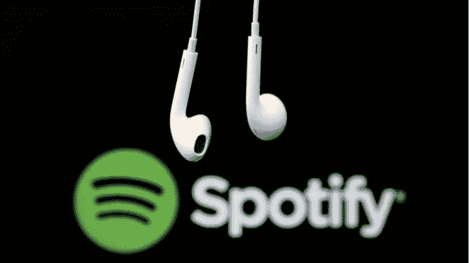

# Spotify 正在成为“音乐网飞”吗？

> 原文：<https://medium.datadriveninvestor.com/is-spotify-becoming-music-netflix-e9e05802cb32?source=collection_archive---------6----------------------->

Google Search

Spotify 是全球主要的音乐平台之一。根据福布斯的文章，Spotify 宣布现在拥有 8700 万高级订户，其中家庭和学生计划发挥了重要作用，比 2018 年 Q2 的 8300 万增加了 5%，比 2017 年 Q2 的 6200 万增加了 40%。目前，1.09 亿广告支持的月活跃用户比 2018 年 Q2 的 1.01 亿增加了 8%，比 2017 年 Q2 的 9100 万增加了 20%。欧洲占 Spotify 用户的 36%，北美占 31%，拉丁美洲占 22%，世界其他地区占 11%，其中后两者增长最快。

 [## 2019 年移动应用开发之路——数据驱动投资者

### 任何在移动应用程序开发行业工作的人，无论他们是专注于在伦敦开发 iOS 应用程序还是…

www.datadriveninvestor.com](https://www.datadriveninvestor.com/2019/01/15/the-path-of-mobile-app-development-in-2019/) 

最近，该公司宣布，公司历史上第一次营业收入、净收入和自由现金流都为正数。因此，该公司正在寻找另一种投资和改善服务的方式。瑞典音乐平台正在向播客行业投资数百万美元。这家音乐流媒体服务公司收购了 Gimlet Media 和 Anchor，推出了包括 Reply All 在内的一系列流行播客。特别是 Gimlet Media 和 Anchor，将允许个人和公司在 Spotify 上创建和发布播客。这将导致新内容创作者的数量增加。据 BBC 新闻报道，虽然预计会发现新的人才，但 Spotify 将他们的支出集中在收购播客相关内容上，他们计划花费 4 亿至 5 亿美元。Spotify 最近的所有举措都开始变得越来越像“音乐网飞”。

一旦涉及到广告，增加播客选项将为 Spotify 打开一扇更大的门。考虑到内容本身的长度，将播客作为平台的一部分可以让 Spotify 在更长的时间内吸引听众的注意力。Spotify 将播客作为一项新功能的决定将对广告商有吸引力，他们会考虑这一点，因为这将有利于他们在谷歌和脸书以外的其他地方做广告。此外，这对 Spotify 来说也是一个优势，因为这增加了它的价值，因为这将使他们与 Apple Music 和 Pandora 等竞争对手在同一水平上竞争。另一个重要的事实是，与主要唱片公司在 Spotify 上播放歌曲的成本相比，播客的制作成本更低。如今，广告商专注于数字广告，谷歌和脸书是该行业的主要参与者。如果 Spotify 投资成功，它们将加入数字广告竞赛。

在我看来，Spotify 在这笔投资上玩得很聪明。许多研究表明，20-34 岁的人可能会听播客。此外，允许一个不知名的艺术家发布他们的内容对许多人来说很有吸引力。

Charara，S. (2018 年 11 月 01 日)。Spotify 第三季度的业绩证实了我们对流媒体服务未来的了解。检索自[https://www . Forbes . com/sites/sophiecharara/2018/11/01/Spotify-Q3-2018-results-apple-music-streaming/# 2c 03 DCA 49 a 5](https://www.forbes.com/sites/sophiecharara/2018/11/01/spotify-q3-2018-results-apple-music-streaming/#2c03dcac49a5)