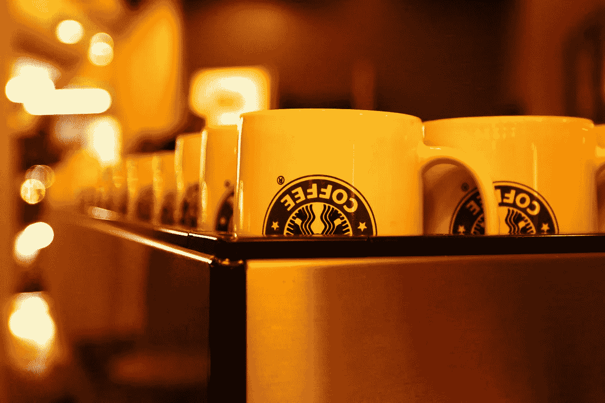
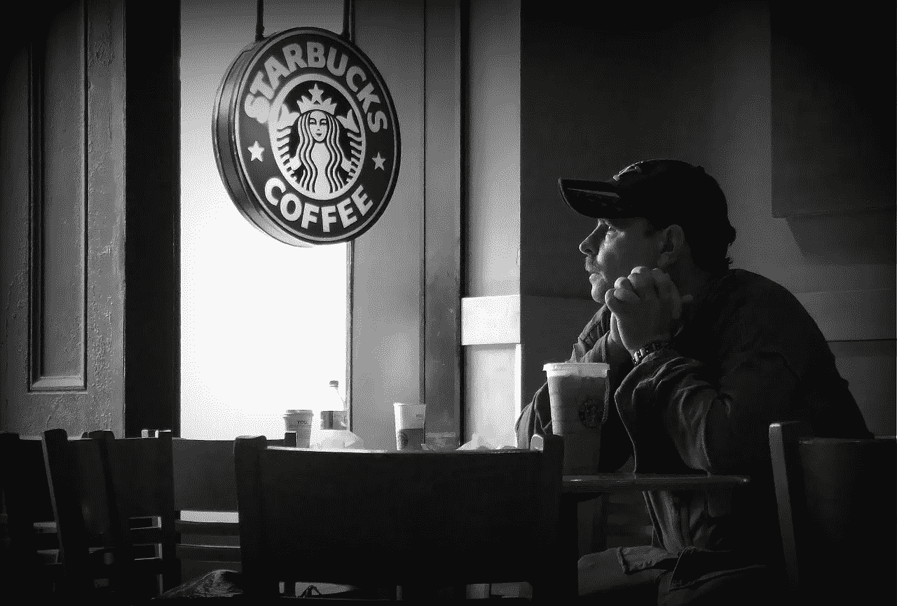
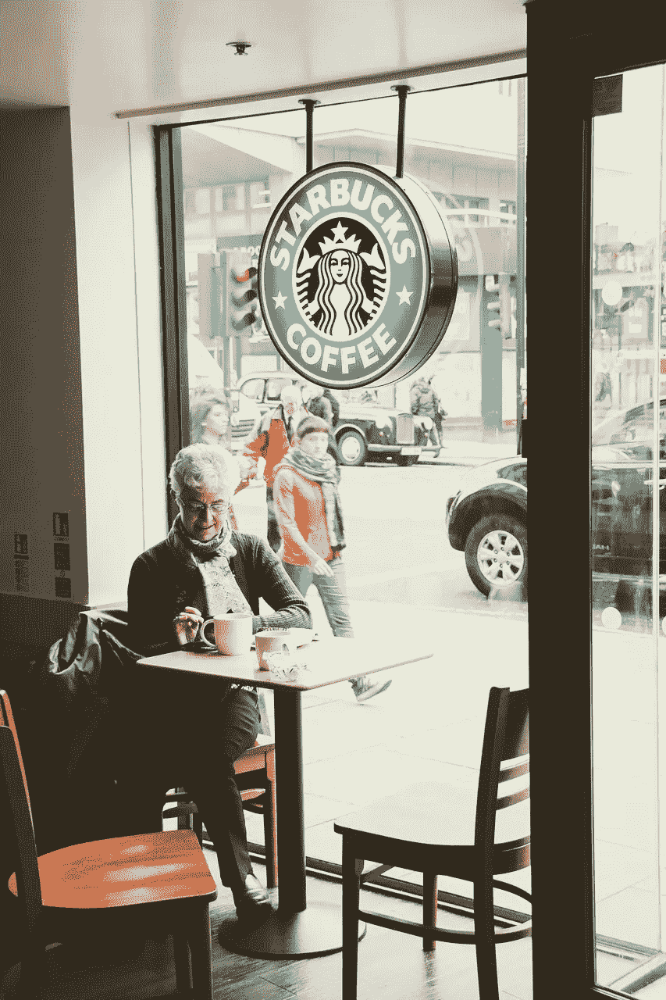
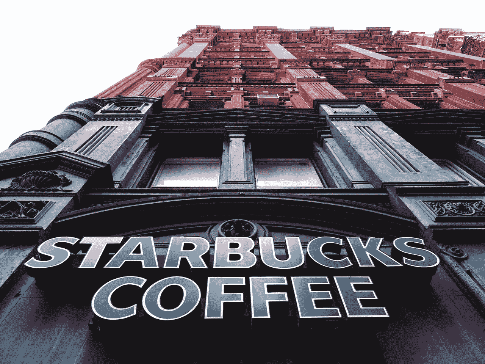

# 星巴克(SBUX)赚钱了吗？

> 原文：<https://medium.datadriveninvestor.com/is-starbucks-sbux-making-money-2fab965f1c60?source=collection_archive---------7----------------------->

是时候问问星巴克(SBUX)是否因为其前首席执行官霍华德·舒尔茨竞选总统而赚钱了。

显然，舒尔茨；和唐纳德·j·特朗普(纽约州共和党)一样，他的总统竞选基于商业专长。因此，这是一个很好的机会去看看星巴克(纳斯达克股票代码:SBUX) 看看舒尔茨是一个多么成功的高管。

还好，星巴克；与 Trump 组织不同，是一家上市公司。因此，我们可以了解星巴克是否赚钱，以及它的表现如何。

# **星巴克(SBUX)现在赚钱吗？**

目前星巴克(SBUX)正在赚钱。事实上，星巴克报告称，2018 年第四季度的毛利为 38.74 亿美元，营收为 66.32 亿美元。

此外，星巴克在 2018 年第四季度的收入增长率为 9.2%。令人印象深刻的是，星巴克 2018 年第四季度的营业收入为 9.47 亿美元，净收入为 7.6 亿美元，毛利率为 58.41%。

因此，星巴克现在正通过它的咖啡店赚钱。但是，我必须指出，舒尔茨对这些数字并不负责。取而代之的是现任首席执行官(CEO)凯文·约翰逊。为了澄清问题，约翰逊于 2017 年 4 月接管了星巴克。

# **星巴克(SBUX)是一家现金充裕的公司**

星巴克是一家现金充裕的公司，因为它报告 2018 年第四季度的运营现金流为 23.79 亿美元，自由现金流为 19.47 亿美元。而且，星巴克在银行有很多钱。

事实上，星巴克在 2018 年 12 月 30 日拥有 47.61 亿美元的现金和等价物，以及 2.302 亿美元的现金。因此，星巴克在 2018 年底拥有 49.91 亿美元现金。

对于一家实体零售商来说，这是一大笔现金。相比之下， **Kroger(纽约证券交易所代码:KR)** 在 2018 年 11 月 10 日拥有 4.39 亿美元的现金和等价物。然而，Kroger 报告 2018 年第四季度的收入为 276.72 亿美元。

# **星巴克(SBUX)是价值投资吗？**

因此，按照 2019 年 2 月 7 日报告的 68.80 美元的股价，星巴克是一家优秀的公司，也是一项潜在的价值投资。

我认为星巴克是一个可能的价值投资，因为它的足迹很大。例如，Statista [计算](https://www.statista.com/statistics/266465/number-of-starbucks-stores-worldwide/)显示，2018 年星巴克在全球经营了 2324 家门店。

美国是世界上星巴克门店最多的国家，共有 14606 家。然而，许多这样的咖啡店都在其他房地产经纪公司里，比如塔吉特(纽约证券交易所:TGT)和克罗格商店。

# **星巴克(SBUX)数字化并挖掘数据**

和 Kroger 一样，星巴克也在利用数字技术和奖励来发展业务。

例如，美国消费者新闻与商业频道[计算](https://www.cnbc.com/2018/12/14/heres-how-starbucks-plans-to-boost-us-sales-in-five-charts.html)，星巴克奖励计划在 2018 年拥有 1530 万会员，高于 2017 年的 1330 万。重要的是，星巴克的奖励在 2018 年推动了该连锁店 40%的业务。

奖励积分非常重要，因为它们提供了大量的客户数据。星巴克可以利用这些数据来改善其业务，或者将这些数据出售给其他公司。因此，星巴克可以利用其奖励积分来开发“21 世纪的石油”，正如经济学家*[所说的](https://www.economist.com/leaders/2017/05/06/the-worlds-most-valuable-resource-is-no-longer-oil-but-data)消费者数据。*

**

# ***星巴克点击送货和奖励***

*除了奖励，星巴克还与 Uber Eats 合作送咖啡。此外，据美国消费者新闻与商业频道报道，有计划将星巴克的外卖送到美国四分之一的星巴克门店或大约 3651 家门店。*

*重要的是，星巴克声称送货订单是店内购买的 2.5 到 3 倍。因此，在办公室里给疲惫的上班族提供咖啡因饮料是星巴克的明智之举。*

*此外，[星巴克](https://marketmadhouse.com/starbucks-is-the-most-popular-payment-app-in-america/)可以利用奖励带动更多的送货业务。一个长期的收入来源是允许 Uber Eats 用户从其他餐厅订购星巴克饮料和食物。例如，你可以点一个红罗宾汉堡和一杯星巴克冰茶。*

# ***亚马逊如何威胁星巴克***

*不幸的是，**亚马逊(NASDAQ: AMZN)** 要来抢星巴克的生意了。解释一下，亚马逊计划花费数十亿美元在 2021 年前开设超过 3000 家便利店。*

**

*Amazon Go 是一家威胁星巴克的自动化便利店，因为它出售咖啡和其他热饮。与不同的是，Starbucks Go 出售各种各样的预制食品。*

*由于没有收银员，GO 的开张和运营成本都很低。顾客用智能手机支付一切，而不是收银员。此外，GO 还可以位于机场、火车站、大卖场、写字楼等公共场所。*

# ***亚马逊 Prime 如何威胁星巴克(SBUX)***

*此外，亚马逊可以通过其亚马逊餐厅从全食子公司运送咖啡。因此，优质咖啡可能会对星巴克的送货构成巨大的直接威胁。*

*亚马逊可以伤害星巴克的一个方法是迫使它提供更多种类的食物。因此，星巴克可能不得不雇佣厨师并建造完整的厨房，这将增加开支。*

*此外，亚马逊可以通过提供各种各样的其他商品来推动业务，如办公用品和咖啡。因此，亚马逊可能很快成为星巴克最大的竞争对手。*

**

# ***星巴克(SBUX)是一只很好的分红股票***

*我认为星巴克仍然是收入投资组合中的好股票，因为它的股息不断增长。*

*下一次星巴克股息是 36，定于 2019 年 2 月 22 日支付。令人印象深刻的是，星巴克的股息在 2018 年增长了 6，在 2017 年增长了 5。详细来说，星巴克在 2017 年 8 月支付了 25 英镑的股息。2017 年 11 月，这一数字增加到 30，2018 年 11 月增加到 36。*

*最后，2018 年 2 月 4 日，星巴克投资者的股息收益率为 2.11%，年化股息为 1.44 美元，股息支付率为 60%。此外，Dividend.com 计算出星巴克的股息已经增长了八年。*

*所以星巴克是一家股票可观的好公司。然而，这并不意味着霍华德·舒尔茨有资格成为总统。*

# ***商人应该竞选总统吗？***

*澄清一下，一个商业领袖和一个政治领袖所需要的技能是非常不同的。例如，商业的主要目的是赚钱。*

**

*另一方面，政府的目的是分散货币，提供市场无法提供的服务。这种服务的例子包括:国防有军队，执法有警察，老年有社会保障。*

*此外，政府不需要利润，因此它们可以永远亏损。事实上，试图像经营营利性企业一样经营政府会导致灾难。*

# ***霍华德·舒尔茨是一个严肃的总统候选人吗？***

*解释一下，即使没有人付费，政府也必须提供服务。因此，政府经常损失很多钱，这就是为什么他们需要收税。尚不清楚舒尔茨是否理解这些区别。*

*然而，很明显舒尔茨对政治知之甚少，因为他显然打算作为第三方候选人参加竞选。我认为 2020 年第三方总统竞选将是浪费时间，因为特朗普证明了局外人可以在总统初选中取得成功。*

*然而，我认为无论是在共和党还是民主党的初选中，舒尔茨都可能是一个强大的候选人。因此，舒尔茨的第三方竞选将成为一个笑话。*

**

# *我们需要一个商人做总统吗？*

*最后一点，历史表明商业成功并不能预测总统的成功。为了解释，历史学家认为赫伯特·胡佛(R-California)；可能是最成功的商人担任总统作为我们最糟糕的首席执行官之一。*

*与此同时，胡佛的继任者富兰克林·D·罗斯福(D-New York)是一个糟糕的商人，他把钱投资于轻率的计划。例如，罗斯福在 20 世纪 20 年代试图组织一个齐柏林航空公司并建立自动化零售店。然而，历史学家认为第二个罗斯福是我们最好的总统之一。*

*因此，我们必须根据他的政策建议，而不是他的商业记录来评判霍华德·舒尔茨。然而，星巴克的成功记录不言自明。*

## *来自 DDI 的相关故事:*

* [## 为什么数据将改变投资管理——数据驱动的投资者

### 有人称之为“新石油”虽然它与黑金没有什么相似之处，但它的不断商品化…

www.datadriveninvestor.com](https://www.datadriveninvestor.com/2019/01/25/why-data-will-transform-investment-management/)  [## 投资算法快速指南-数据驱动投资者

### 让我们想象一下 30 年前的股票市场:让我们想象一下现在:像现在的许多其他领域一样，投资市场已经…

www.datadriveninvestor.com](https://www.datadriveninvestor.com/2019/01/31/a-quick-guide-to-investment-algorithms/)*