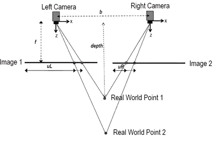

# 深度学习需要立体 3D 视觉来概括现实的建模吗

> 原文：<https://medium.datadriveninvestor.com/is-stereoscopic-3d-vision-what-deep-learning-needs-to-generalize-modeling-of-the-reality-1871f579e2ef?source=collection_archive---------0----------------------->

随着深度学习，特别是 CNN 在图像处理方面获得成功和声誉，它也引起了一些严重的关注和批评。其中一些来自这个领域的先驱。

 [## 人工智能先驱说我们需要重新开始

### 杰弗里·辛顿对神经训练方法表示怀疑

www.axios.com](https://www.axios.com/artificial-intelligence-pioneer-says-we-need-to-start-over-1513305524-f619efbd-9db0-4947-a9b2-7a4c310a28fe.html)  [## 视觉深度学习的局限性，以及我们如何解决它们

### 深度学习的历史我们正在见证深度学习的第三次崛起。前两次浪潮-20 世纪 50-60 年代和…

thegradient.pub](https://thegradient.pub/the-limitations-of-visual-deep-learning-and-how-we-might-fix-them/) 

Yan LeCun，Yoshua Bengio 也对深度学习的局限性，甚至是它的“终结”发表了类似的评论。

许多先驱和研究人员已经指出的两个主要挑战是:1)训练深度学习图像分类需要数万甚至数百万张图片，然而它仍然不能很好地概括；2)深度学习没有自己的世界模型(或者根本不泛化的非常初级的模型)。

一旦我们意识到这两者实际上是相关的，如果我们稍微超越深度学习本身，看看我们可以带来哪些补充技能来帮助深度学习，那么一些一线希望可能会在它们之上升起。

当我们将深度学习与人类学习进行比较时，我们，人类真的可以毫不费力地用“仅有的几个样本”来掌握物体的名称，或者我们有其他与当前深度学习不同的“技巧”来学习东西吗？

 [## 2019 年深度学习的终极学习路径及更多...-数据驱动型投资者

### 又一个美好的一周，一些好的教育内容将会到来。我最喜欢的&最受欢迎的帖子之一…

www.datadriveninvestor.com](https://www.datadriveninvestor.com/2019/01/07/the-ultimate-learning-path-for-deep-learning-in-2019-more/) 

一些解决大量训练数据需求的努力被广泛采用——深度学习研究人员长期以来一直在进行图像增强——对图像进行缩放、旋转、平移、翻转，甚至添加噪声。这些技术用于“扩大数据集”并添加一些“概括”功能，以使用有限的数据集处理倾斜、缩放、成角度、阴影的图像。

然而，这仍然远远不是孩子们的学习方式——他们不会要求放大镜或一副模糊的眼镜。相反，他们会拿着一个东西(比如说一个苹果)，玩它，在手中转动它，看它的背面，侧面，或者顶部，底部，推远它，或者拉近它，移动它，这样他们就可以从不同的角度，在不同的背景面前看到它。

当他们被告知“这是一个苹果”时，他们已经用这个物体的成千上万个视图(也称为“图像”)仔细查看了它——因此，虽然他们确实只被告知一两次这个是一个苹果，但这个概念并不是基于一个视图(图像)介绍的，而是基于一个*物体*，孩子已经收集了许多不同的视图(并且在他们知道它的名称后可以继续收集更多的视图。)

*因此，深度学习的最大问题可能不是它需要太多带标签的图像，可能是它缺乏将数百万张图像与一个对象(及其标签)联系起来的能力——所以当我们教机器学习时，我们必须对数百万张图像中的每一张图像进行标记——不像对孩子那样。*

孩子们能够在不知道物体名称的情况下将物体与其他物体区分开来，这一点非常有趣。在孩子被教导这个*对象*与一个标签(例如“苹果”)相关联之前，他们已经建立了这个对象的*模型*，包括它的不同视图。他们知道，当这个物体被颠倒过来时，它仍然是同一个东西，他们不需要另一个苹果背面的图像，再贴上“苹果”的标签，因为将一个物体翻转过来，它仍然是同一个物体的“知识”是一种隐含的技能，与识别这个物体是什么分开存在。一旦他们被告知，“这是一个苹果”，他们不仅会在这一瞬间联想到这个单一的图像，而且会将“苹果”与苹果的所有可能视图联系起来——这就像一次标记成千上万个图像。这就是为什么我们只需要教孩子几次这个概念，但我们需要训练数千次甚至数百万次深度学习，然而孩子在*概括*方面比深度学习模型好得多。

所以“知道”同一个物体的不同视图仍然是同一个物体的能力可以保存数以百万计的标记图像——这也允许孩子“自学”——下次孩子看到半个苹果，当看到半个苹果的完整侧面时，他们会知道它仍然是一个苹果，他们也会知道苹果的切割侧面现在也是“苹果”。他们了解到，苹果可以看起来完全不同(外部与切割),而不需要任何额外的新切割训练数据集——我们不需要明确地教授它。

深度学习呢？大多数目标检测使用类似于图像分类或识别的算法。这不会为深度学习提供一种独立的能力，将一个对象的视图链接到该对象，并有意义地提高其性能。

人类实际上具有基于立体视觉的**物体识别**能力，而不依赖于**图像识别**。

杰弗里·辛顿先生已经注意到了这一点，并在 2017 年出版了他的胶囊网络。然而，胶囊仍然是基于处理 2D 图像上的像素，并通过在每个图像上找到结构化特征来处理信息，它仍然需要许多许多图片来训练。它也可能受益于立体层。

我们人类，不是学会用一只眼睛观察世界，学会看到的东西的名字，然后睁开另一只眼睛学会看 3D 的东西。这是相反的，我们在 3D 中看到的东西，能够告诉一个物体从它的背景和其他物体中分离出来，而不需要知道物体是什么。

我们一直使用单镜头图像来训练我们的深度学习模型的原因主要是因为我们拥有的大多数图片都是这种 2D 格式，我们只是有很多这样的图片，当图像存储在我们的视觉系统(我们的大脑)之外时，我们已经习惯了 2D 单镜头视图。

为什么 3D 很重要？因为额外的维度为人类提供了一种可靠而有效的方式来构建世界的模型，而无需知道视图中有什么，这对于人类的学习来说至关重要。孩子们自然知道，一个物体的许多不同视图实际上仍然是同一个物体——他们做到这一点不是因为他们被告知苹果的正面和背面都标有“苹果”,而是因为他们可以看出一个物体不管它是什么，从不同的角度看起来可能非常不同，但它仍然是一个物体。

与我们通常用于深度学习的 2D 图像相比，立体 3D 视觉可以提供额外的信息维度，这将允许 AI 获得独立于像素级对象识别的对象检测能力*。它将使计算机视觉系统能够可靠地对同一对象的视图进行分组，以允许我们对其进行一次标记，并且可以显著增加已标记的训练数据集，而无需依赖人类在每幅图像上一次又一次地标记同一对象。*

这就像*的无监督学习*首先对视图进行分组，然后用更少的标签对聚类进行标记。但对于第一部分，我们将使用立体视觉来执行对象检测，而不是使用无监督聚类，即给每个未命名的对象标记像素，这与儿童在没有明确教导的情况下会做的事情非常相似。

立体 3D 视觉由从稍微偏移的透镜拍摄的几乎相同视图的两个图像组成，提供了不需要识别物体就能识别物体的重要附加维度。每对图像同时显示同一物体，但角度略有不同，我们实际上拥有的物体图片数量是单视图片的两倍。

The stereoscopic 3D vision provides depth that can be used to differentiate objects without recognizing them

通过**结合 3D 立体视觉和 CNN(或胶囊)深度学习**，我们应该能够创建一个基于视觉的人工智能系统，该系统能够以比当前方法快得多的速度，在其立体 3D 相机周围建立一个相当准确和可知的世界模型。

就像一个孩子学习世界一样，我们可以训练 AI 使用立体 3D 视觉来构建现实的 3D 模型，然后再教给它这些物体的名称。这项技术在很大程度上是可用的，不仅大多数自动驾驶汽车已经使用它们的多视角视觉建立了 3D 世界模型，而且使用视频流创建 3D 模型也取得了进展——因为在某些情况下，在单镜头视频中，移动物体以某种类似于立体的方式揭示了它们的深度(尽管单镜头视频不够一致，无法用于独立于物体识别的物体检测)。

使用 3D 对象检测，系统将根据可靠的对象检测结果标记视频流(图像分割)中的所有像素，并创建其观察的事物的 3D 模型。所有这些图像分割和模型创建都独立于对象识别。

当我们提供标签时，或者通过给系统一些带有标签的图片，或者直接给系统收集的物体的 3D 模型加标签，然后系统将能够在该物体的所有不同角度的所有图像与这个新标签之间建立联系。还因为从背景中分割对象的能力，立体 3D 视觉可以提供对象的许多“干净”图像来训练 CNN(或胶囊)网络，从而避免通常阻碍图像分类的背景噪声。

这种方法将允许深度学习推理能够像现在一样处理单视觉图片和视频。

另一方面，对于共存的机器人(即自动驾驶车辆)，基于其 3D 模型而不是“视角”(图像)实际识别对象的能力也值得探索。

计算机视觉从 2D 图像开始，主要是因为它更容易处理，我们拥有的大多数图片都是 2D，我们习惯了单一视觉的图片。我们一直知道 3D 视觉是有帮助的，但当谈到深度学习图像处理时，我们大多将 3D 视觉视为一种额外的奢侈品，而不是提供至关重要的补充处理可能性。

鉴于广泛讨论的深度学习缺点和当前的技术交叉，利用立体 3D 视觉来检测对象(图像分割和分组对象的数千个视图/图像)并建立对象模型，然后使用 CNN 或 CapsNet 来训练对象识别，甚至在对象而不是图像上训练深度学习模型，这可能是一种非常有用的设计。

这种结合两种不同技能的简单技巧可能会大大帮助我们提高深度学习图像处理的泛化和训练效率。

> *关于 2D 物体探测的更多信息:*
> 
> 如上所述，一些单镜头视频可能用于执行一些对象检测，或者使用单个图片，或者使用帧之间的时间差而不是两个镜头之间的角度差。
> 
> 像素级(2D)图像分割通过查看每个像素与其周围像素的关系来标记该像素属于哪个对象。虽然有用，但这不是一种足够独立的技术来增强图像分类深度学习模型(它实际上比图像分类更难，通常依赖于对象识别来增强语义分割)。除了一些例外，在大多数情况下，这种图像分割和对象检测对于“将同一对象的数千个视图分组”是不够可靠的，更不用说创建 3D 模型了。
> 
> 对于基于视频的技术，并非所有视频都是在帧的时间序列内以一致的偏移拍摄的，因此为特定对象导出适当深度信息的能力不如立体视觉那样可靠。对于单眼视觉的儿童来说，这是有据可查的，两个最常用的适应技能是 1)用触觉补充视觉——我们讨论过这在这一点上对人工智能来说是非常昂贵的；2)增加他们头部的运动——这是在“晶状体”改变位置时，用连续的图像来补充眼睛之间的空间差异。
> 
> 就技巧而言，之所以建议单眼人多移动头部，正是因为并非所有稳定的视频流都能提供必要的深度信息。对于计算机来说，拥有两个固定距离的摄像机来拍摄两个视频流，而不是经常移动摄像机，实际上要实用得多。
> 
> 单眼人采用的另一项“天然”技能是，一旦他们习惯了物体的大小，他们就可以从视觉中的物体大小获得距离信息——这需要在深度检测之前识别物体，通常依靠触摸来补充物体识别，以首先了解其实际大小。
> 
> (事实上，在单视角视频中，我们更容易被视错觉所迷惑，但当我们亲自观看时，却更容易注意到发生了什么，这是另一个很好的迹象，表明了第三维度的重要性。)