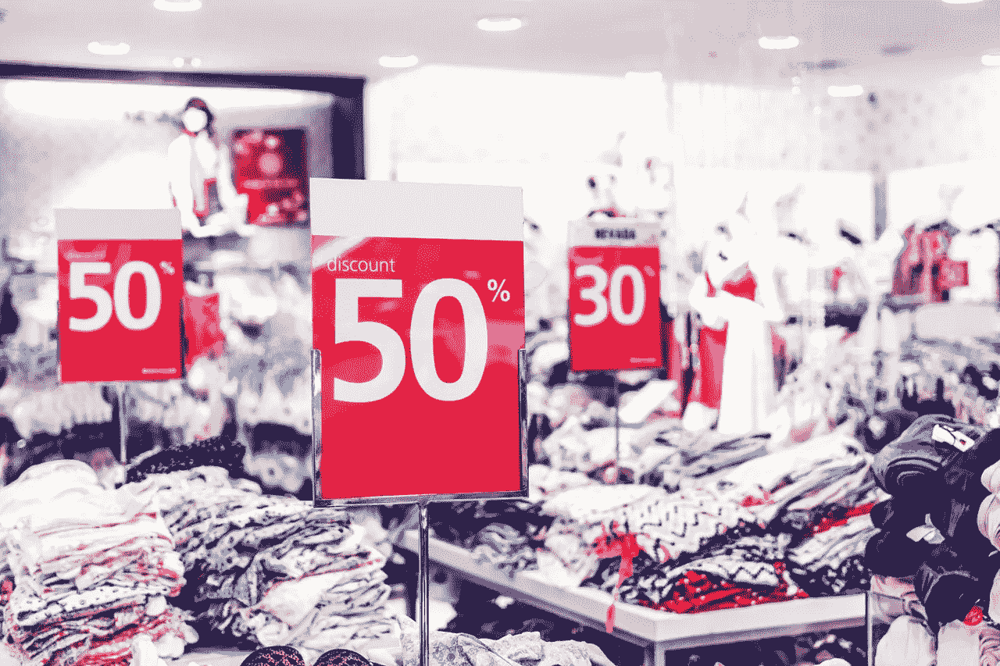

# 塔吉特百货在零售业末日中幸存了吗？

> 原文：<https://medium.datadriveninvestor.com/is-target-surviving-the-retail-apocalypse-95367134d458?source=collection_archive---------3----------------------->

我认为没有哪家零售商比塔吉特公司(纽约证券交易所代码:TGT)更容易受到零售业末日的影响。

Target 的主要客户群是 20 至 50 岁的城市和郊区妇女。不幸的是，这个群体是**亚马逊(NASDAQ: AMZN)** 最喜欢的人群。

 [## 2019 年值得关注的 20 种数字营销趋势和技术|数据驱动的投资者

### Faisal 在加拿大工作，拥有金融/经济和计算机方面的背景。他一直积极从事外汇交易…

www.datadriveninvestor.com](https://www.datadriveninvestor.com/2019/02/04/20-digital-marketing-trends-techniques-to-watch-out-for-in-2019/) 

此外，塔吉特百货出售的几乎所有商品；家具、电子产品、杂货、家居用品、小家电、服装、鞋子等。是亚马逊可以轻松在网上销售的商品。所以，Target 直接竞争；或者说间接地，几乎在每一个品类上与亚马逊合作。

# **在线零售商如何杀死目标**

不仅仅是亚马逊，家居用品零售商 [**Wayfair**](https://marketmadhouse.com/wayfair-the-biggest-online-retail-success-you-never-heard-of/) **(纽约证券交易所代码:W)** 正在经历爆发式增长。例如，Statista [估计](https://www.statista.com/statistics/660780/wayfair-active-customers/)活跃的 Wayfair 客户数量从 2017 年的 1099 万增长到 2018 年的 1516 万。

值得注意的是，Statista [估计【Wayfair 船舶的订单数量从 2013 年的 331 万增长到 2018 年的 2808 万。具体来看，Wayfair 年出货量 524 万单，2015 年 917 万单，2016 年 1406 万单，2017 年 1941 万单。](https://www.statista.com/statistics/660789/wayfair-annual-order-volume/)

Wayfair 与 Target 在家居装饰领域直接竞争。此外，Wayfair 现在是美国第六大在线零售商，销售额超过了 Target。

# 美国人正在戒除购物习惯吗？

Wayfair 伤害了 Target，因为它的每一个订单都代表了一次顾客没有去商场或购物中心的购物之旅。我认为 Wayfair 和亚马逊的增长表明美国人正在摆脱购物习惯。

美国人去商店的次数越来越少。相应的，*商业内幕* [预测](https://www.businessinsider.com/stores-closing-in-2019-list-2019-3)2019 年美国将有超过 7100 家门店关闭。特别是，Payless Shoes 将关闭其在美国的所有 2500 家门店。

事实上，商业内幕估计，零售商在 2017 年关闭了创纪录的 1.02 亿平方英尺的商店空间，在 2018 年关闭了 1.55 亿平方英尺的商店空间。因此，人们购物的地方和购物旅行的理由变少了。

此外，像 Payless 的许多商店关闭；包括超过 800 家金宝贝和疯狂 8 店和 650 家服装店，迎合了与塔吉特相同的市场。为了解释，金宝贝和服饰店像塔吉特百货一样出售打折服装。像 Payless 和 Dress Barn 这样的商店正在关闭，因为人们正在网上购物。

# **塔吉特能和亚马逊竞争吗？**

例如，据彭博[估计](https://www.bloomberg.com/graphics/2019-amazon-reach-across-markets/)，亚马逊现在控制着美国 7.7%的零售额，拥有 1 亿付费会员。

值得注意的是，亚马逊在 2018 年销售了价值 246.1 亿美元的服装和价值 254 亿美元的杂货。此外，亚马逊在 2018 年销售了价值 236 亿美元的消耗品。

相比之下，Target 截至 2 月 2 日的财年总收入为 753.56 亿美元。因此，亚马逊 2018 年在三个领域的销售额等于 Target 全年的收入。与此同时，亚马逊 2018 年的总收入为 2338.87 亿美元。引人注目的是，Statista 估计 Target 在 2018 年的在线销售额为 48.23 亿美元。

数字显示 Target 没有能力直接竞争；或者间接地，与亚马逊合作。值得注意的是，2018 年亚马逊的营收增长了 30.93%，而 Target 的营收增长了 3.63%。

# **当天发货可以保存目标吗？**

美联社[报道](https://wtop.com/business-finance/2019/06/target-to-offer-same-day-delivery-for-9-99-per-order/)，塔吉特百货试图以 9.99 美元的价格在 47 个州提供 65，000 件商品的当天送达服务，以此保持竞争力。

以前，目标客户必须每年支付 99 美元或每月支付 14 美元才能获得 Shipt 会员资格，从而获得当天送达。Target 将在其网站上添加 Shipt 的功能，并向忠诚卡持有者提供 5%的折扣，以鼓励当天送货。

我认为当天送达，因为没有证据表明大多数客户想要它。也没有证据表明顾客会使用当天送达。

然而，包括亚马逊、**克罗格(纽约证券交易所代码:KR)** 和**沃尔玛(纽约证券交易所代码:WMT)** 在内的几家零售商都在同一天下了重注。此外，沃尔玛为超过 35 美元的订单提供免费的一天送货服务。与此同时，亚马逊为 119 美元的 Prime 订阅提供一日送达服务。

# **当天发货的风险**

目标面临着当天送达的严重风险。潜在的当天送达风险包括:更高的劳动力成本，难以满足的不切实际的客户期望，以及更高的保险成本。例如，涉及当天送货司机的事故风险。

此外，沃尔玛让司机储存顾客冰箱的服务冒了很大的风险。我想知道，如果沃尔玛的司机在顾客家中受伤，谁将承担责任。

例如，如果司机在顾客的地毯上滑倒或被顾客的狗咬伤。此外，如果沃尔玛的司机没有锁顾客的门，让窃贼得以进入，沃尔玛会承担责任吗？

在这种情况下，同样的交付所产生的责任和保险成本可能会超过其收益。因此，像 Target 这样资源有限的零售商可能会冒不必要的风险进行当天实验。

# Target 赚钱了吗？

目前，塔吉特百货的资源很丰富，但与亚马逊或沃尔玛相比却很少。

例如，Target 在 2019 年 5 月 4 日报告的季度收入为 176.27 亿美元，季度毛利为 53.79 亿美元，季度营业收入为 11.35 亿美元，季度净收入为 7.95 亿美元。然而，塔吉特正在消耗大量现金。

事实上，2019 年 5 月 4 日，Target 报告的自由现金流为负-3.27 亿美元，融资现金流为负-5，700 万美元，投资现金流为负-6.49 亿美元。然而，截至 2019 年 5 月 4 日，Target 正在以 3.23 亿美元的运营现金流形式产生一些现金。

不幸的是，Target 的运营现金所剩无几。Target 在 2019 年 5 月 4 日拥有 11.73 亿美元的现金和等价物，没有短期投资。与此同时，截至 2019 年 3 月 31 日，亚马逊拥有 231.15 亿美元的现金和等价物以及 1390.5 万美元的短期投资。因此，亚马逊在上个季度末有 370.3 亿美元的额外现金。

相反，沃尔玛在 2019 年 4 月 30 日拥有 92.55 亿美元的现金和等价物。然而，沃尔玛当天公布的毛利为 308.91 亿美元，季度收入为 1239.25 亿美元。

归根结底，塔吉特百货正在从其 1844 家门店中赚钱，但它缺乏资源来跟上亚马逊和沃尔玛的步伐。因此，我认为避免与这些巨头直接竞争是塔吉特百货的明智策略。

# **塔吉特是价值投资吗？**

很容易理解为什么投资者仍然喜欢 Target。折扣店计划于 2019 年 9 月 10 日派发 66₵股息。该股息将高于 2019 年 6 月 10 日支付的 64₵的 2₵。

此外，对于 2019 年 7 月 11 日交易价格为每股 85.85 美元的股票来说，股息很高。具体来说，Target 提供的股息收益率为 3.08%，年化股息为 2.64 美元，当天的派息率为 49.1%。最后，dividends 估计塔吉特百货的股息已经增长了 51 年。

相比之下，亚马逊没有为其 2001.07 美元的股票支付股息，沃尔玛计划在 2019 年 9 月 3 日向 53₵支付 113.92 美元的股票。因此，塔吉特是一个更好的零售股息股。

尽管有股息，我认为市场先生高估了目标，因为缺乏资源限制了其增长潜力。我建议投资者远离塔吉特百货，因为它很难赶上亚马逊。

*原载于 2019 年 7 月 11 日*[*【https://marketmadhouse.com】*](https://marketmadhouse.com/is-a-goldman-sachs-cryptocurrency-coming/)*。*