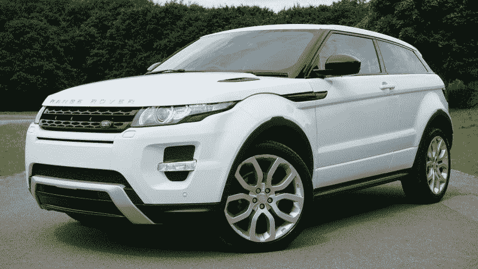
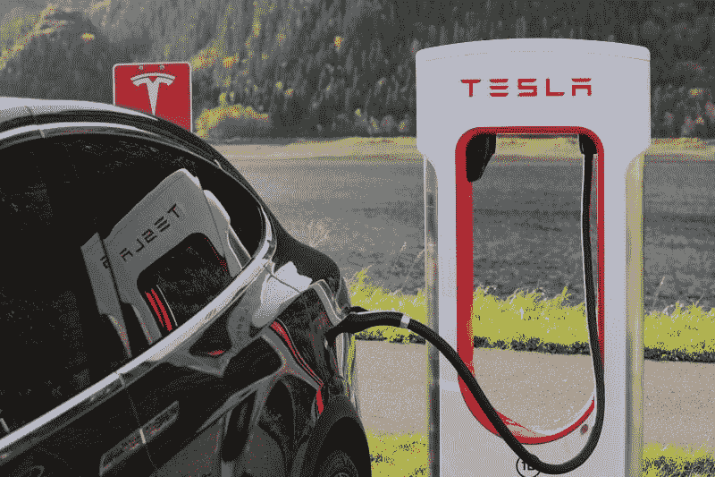
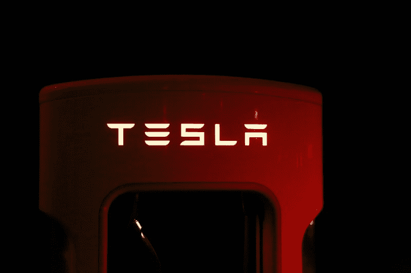
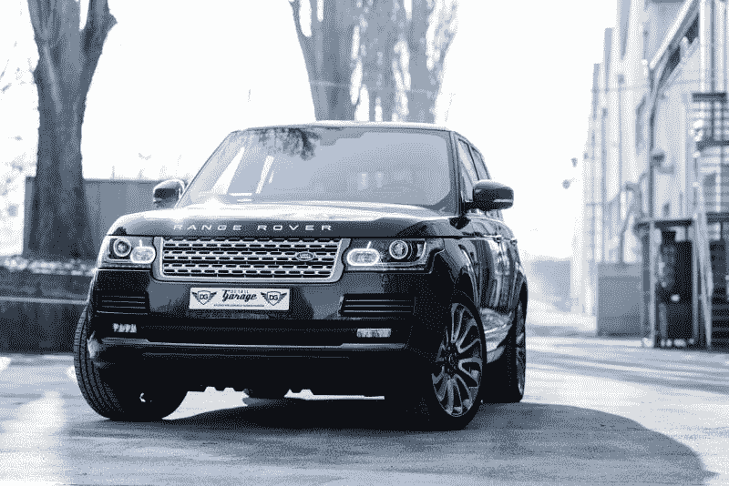
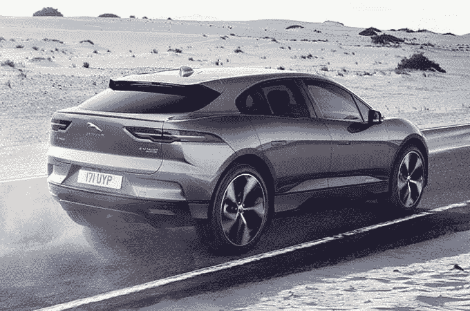

# 塔塔汽车是电动车的未来吗？—市场疯人院

> 原文：<https://medium.datadriveninvestor.com/is-tata-motors-the-future-of-electric-vehicles-market-mad-house-b44084a805e1?source=collection_archive---------3----------------------->

印度最大的汽车制造商**塔塔汽车公司(纽约证券交易所:TTM)** 可能是电动汽车的未来。

塔塔和它的竞争对手**特斯拉汽车公司(纳斯达克股票代码:TLSA)** 有两种生产电动汽车的方式。详细来说，埃隆马斯克在特斯拉的方法是建立一个新品牌，提供电动汽车所需的一切。因此，特斯拉拥有电池厂、汽车厂、分销系统，甚至汽车的[充电器](https://www.tesla.com/supercharger)。

 [## 在自动驾驶汽车发生事故的情况下，谁应该承担法律责任？-数据驱动型投资者

### 我仍然认为自动驾驶汽车是一种奢侈品，而不是必需品…

www.datadriveninvestor.com](https://www.datadriveninvestor.com/2018/11/02/who-is-legally-accountable-in-the-case-of-an-autonomous-vehicle-accident/) 

塔塔汽车公司；然而，利用现有品牌，专注于汽车。因此，塔塔正通过两个历史悠久的英国汽车品牌捷豹和路虎在印度以外建立市场。

电动 [I-PACE](https://www.jaguarusa.com/all-models/i-pace/index.html) 占捷豹 2019 年 3 月美国销量的 5.7%，*Inside ev*[预估](https://insideevs.com/news/343801/jaguar-i-pace-accounts-for-almost-6-of-jaguar-sales-in-us/)。具体来说，三月份捷豹在美国售出了 1001 辆 I-pace。IPACE 的销量很小，但增长很快，2019 年 3 月增长了 13%。然而，IPACE 的销量仍然落后于特斯拉 Model X，特斯拉在 2018 年 12 月销售了超过 4000 辆电动 SUV， *Inside EVs* 计算。

# 塔塔比特斯拉好吗？

例如，塔塔正在系统地向捷豹的产品线添加电动车型，而不是试图建立一家新的汽车公司。具体来说，捷豹正在提供电池电动 [I-PACE](https://marketmadhouse.com/is-tata-motors-the-future-of-electric-vehicles/#413cf08c1d73) 并可能提供其电动版 [XJ 敞篷车](https://www.cnet.com/roadshow/news/jaguar-xj-end-production-july-electric-successor-2020/)。

这种策略的好处是，塔塔只需要设计和制造汽车。经销商网络和品牌已经到位。此外，塔塔让其他人去担心制造电池和为车辆提供充电系统。

塔塔不需要投入资金和资源来建立品牌，因为品牌已经存在。捷豹和路虎都有悠久的历史和忠实的追随者。

这些品牌的一个明显优势是，它们可以吸引对电动汽车和新品牌持怀疑态度的更保守的司机。特斯拉面临的一个危险是，大多数汽车购买者都很保守。解释一下，大多数人购买某个特定品牌的汽车，比如**丰田**，因为他们知道它是可靠的。

人们买车是为了交通，而交通必须可靠。具体来说，你可能需要汽车去上班或去杂货店。然而，特斯拉销售的新品牌基于一项大多数司机都不熟悉的技术。

# 特斯拉比塔塔好吗？

然而，缺点是塔塔对供应链的控制力要小得多。例如，捷豹和路虎经销商是独立的，而特斯拉拥有特斯拉商店。

最后，特斯拉通过其 Gigafactory 确保电池和其他零部件的供应。塔塔希望供应商能生产足够的电池来满足其需求。塔塔的一个明显优势是，如果一家公司能提供电池，它可以更换供应商。如果电池生产失败，马斯克不能解雇[巨型工厂](https://www.tesla.com/gigafactory)。

鉴于这些情况，我认为塔塔是更好的公司，因为它在推动电动汽车方面承担的风险更小。特别是，塔塔没有像马斯克和大众那样将公司押在电动汽车上。

# 塔塔汽车是价值投资吗？

价值投资者会关注塔塔，因为它比特斯拉便宜。例如，2019 年 6 月 5 日，塔塔汽车的股价为 12.50 美元。与此同时，市场先生在同一天以每股 196.59 美元的低价格收购了特斯拉汽车公司。

然而，马斯克喜欢塔塔制造的汽车可以直接与特斯拉竞争，却不冒任何荒谬的风险。具体来说，塔塔的高管不和 SE 不和，[在视频里抽](https://www.cnn.com/videos/cnnmoney/2018/09/07/elon-musk-smoke-weed-orig.cnnmoney)大麻，卖[喷火器](https://www.usatoday.com/story/money/business/2018/06/11/elon-musk-delivers-first-1-000-flamethrowers/692937002/)。

相反，塔塔试图在扩大其锂离子电池系列之前，完善一个具有成熟市场的基本电动模型(I-PACE)。然而，特斯拉正试图一次生产所有产品，包括半挂牵引车和皮卡。

最后，捷豹路虎在多个国家设有工厂，包括英国、印度、斯洛伐克、奥地利、巴西和中国。马斯克正试图找出下一个工厂的位置，并在停车场搭建帐篷。

# 塔塔赚钱了吗？

与特斯拉相反，塔塔汽车赚了一些钱。例如，塔塔报告称，2018 年的毛利为 157.66 亿美元，收入为 442.85 亿美元。

然而，塔塔报告称，2018 年运营亏损为-16.71 亿美元，净收入为 10.24 亿美元。此外，塔塔汽车的运营现金流为 41.29 亿美元，融资现金流为 3.09 亿美元。然而，塔塔 2018 年的自由现金流为负-12.55 亿美元。

最后，塔塔汽车在 2019 年 3 月 31 日累积了 22.61 亿美元的现金和等价物以及 62.01 亿美元。因此，截至上一财年年底，塔塔的银行存款为 84.61 亿美元。

# 塔塔有一些价值属性

所以塔塔汽车是赚点钱的，不像特斯拉。众所周知，特斯拉 2018 年的营业亏损为-3.8807 亿美元，净收入为-9.7609 亿美元。相反，特斯拉 2018 年的总收入为 40.42 亿美元，营收为 214.61 亿美元。

此外，特斯拉报告 2018 年 12 月 31 日的运营现金流为 20.98 亿美元，自由现金流为负-2.2171 亿美元，融资现金流为 5737.5 亿美元。

因此，我认为特斯拉看起来像其他汽车制造商，如特斯拉和福特。不幸的是，市场先生并没有像对待汽车制造商一样对待特斯拉。相反,“市场先生”将特斯拉视为一家硅谷科技公司，但事实并非如此。尽管它的总部在湾区，特斯拉是一个汽车制造商，我们需要把它当作一个。

我认为这使塔塔成为一项价值投资，因为它生产类似于特斯拉的汽车，赚钱，而且股票便宜。塔塔甚至与 **Alphabet 的**自动驾驶汽车子公司 Waymo 合作[部署](https://www.theverge.com/2018/3/27/17165992/waymo-jaguar-i-pace-self-driving-ny-auto-show-2018)多达 20，000 辆自动驾驶 I-Pace SUV。

像特斯拉一样，塔塔汽车不支付股息，但这很划算。如果你正在寻找电动汽车和自动驾驶汽车的便宜货**塔塔汽车(纽约证券交易所代码:TTM)** 值得调查。我认为塔塔不像特斯拉，尽管亏损，但有一些真正的价值属性。

*原载于 2019 年 6 月 5 日*[*https://marketmadhouse.com*](https://marketmadhouse.com/is-tata-motors-the-future-of-electric-vehicles/)*。*