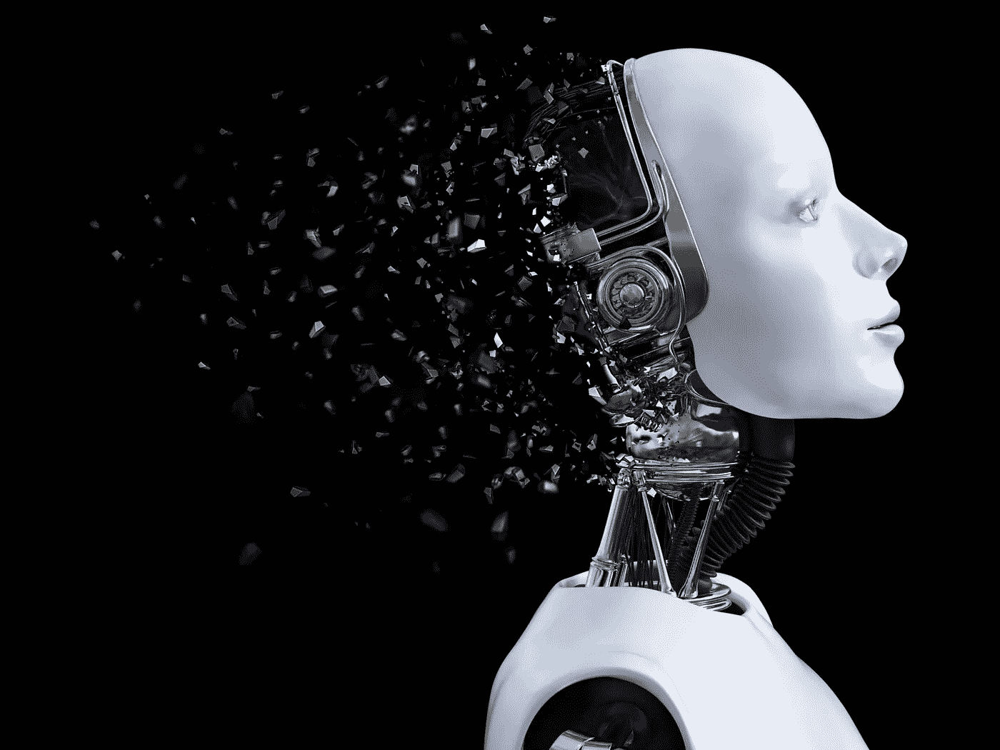
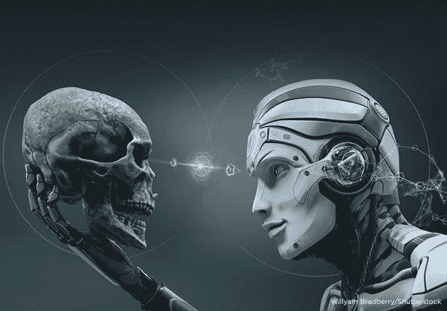

# 技术本身是进化的下一步吗？

> 原文：<https://medium.datadriveninvestor.com/is-technology-itself-the-next-step-in-evolution-334b99172ea8?source=collection_archive---------6----------------------->

据我所知，技术是任何使完成一项任务更容易的东西。从全球定位系统到车轮，技术本身就是为了减少生活中的努力。我担心人类对物质占有的渴望最终会把技术推得太远。我的猜测是，由于数十亿人的雄心和互联网的接入，技术的进步只会越来越快，我还认为，当人类关注这个问题时，停止机器学习可能已经太晚了。

你可能认为我疯了，但我只是与你分享这个想法，因为我知道的是，宇宙需要竞争、冲突和不断改进。处于食物链顶端的物种最终会形成自己更好的版本，我认为人类用大脑来主宰这个星球。出于这个原因，我们种族中最差的一端并没有消亡，因为愚笨的人遇到了愚笨的人并生了孩子，这意味着进化已经停止了。

我的理论是，进化的下一步是技术本身，它将能够以人类不能的方式思考。你可能会认为，如果我们曾经接近把火炬交给计算机，我们就会阻止技术的进步。我不敢苟同，我的最佳赌注是，一旦我们如此接近，只需要几个人犯几个错误，就能让技术和互联网拥有意识，几十年后，我们的命运将掌握在技术手中。

我确实意识到这并不是最激进的想法，但是我不得不说，如果对技术进步的速度无所作为，在某个时刻，我们所有的伟大想法和伟大发明都会将我们引向灭亡。我几乎在这种想法中找到了安慰，因为这意味着我们的意识不是最佳资产。如果你有宗教信仰，你可能会不同意，但我们不知道为什么我们会在地球上，但我们确实知道很多关于我们星球的历史，我们知道没有物种会永远处于顶端，我估计我们生活的自动化本身将不可避免地改善并最终超过人类，成为我们星球上的主导物种。

## 来自 DDI 的相关故事:

 [## 用 7 个步骤解释深度学习——数据驱动投资者

### 在深度学习的帮助下，自动驾驶汽车、Alexa、医学成像-小工具正在我们周围变得超级智能…

www.datadriveninvestor.com](https://www.datadriveninvestor.com/2019/01/23/deep-learning-explained-in-7-steps/)  [## 正在改变行业的 5 个真实世界区块链应用——数据驱动的投资者

### 除非你一直生活在岩石下，否则我相信你现在已经听说过区块链了。而区块链…

www.datadriveninvestor.com](https://www.datadriveninvestor.com/2019/02/13/5-real-world-blockchain-applications/)