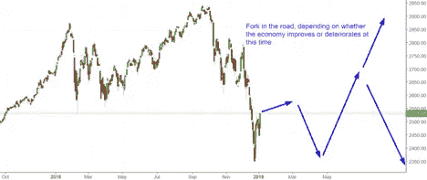

# 熊市结束了吗？如果是的话，现在是重返市场的恰当时机吗？

> 原文：<https://medium.datadriveninvestor.com/is-the-bear-market-over-if-so-is-now-the-right-time-to-get-back-into-the-market-62b41e0c64d3?source=collection_archive---------14----------------------->

Photo by [Jessica Weiller](https://unsplash.com/@jweiller?utm_source=medium&utm_medium=referral) on [Unsplash](https://unsplash.com?utm_source=medium&utm_medium=referral)

什么时候是回购股票的合适时机？

随着我们正式进入熊市，许多投资者的问题转向了何时重返市场。无论你是在 2018 年下跌期间抛售了一些投资，还是已经储备了一些现金等待以一个好价格买入，规划重新进入市场都可能是一个棘手的决定。

正如我们大多数人一生都被教导的那样，当谈到股票市场时，古老的哲学是“低买；高价出售" = $$$

因此，虽然熊市意味着下跌超过 20%，但信号肯定是存在的。

那么，你如何知道市场是否已经触底？

答案是你不知道；没有人知道答案。

如果我们能够预测市场何时涨跌，那么我想带你去拉斯维加斯。

明确的信息是，你不应该试图和时间的市场，但历史上留在市场比在市场上更糟糕。

所以你已经知道，大多数股票已经大幅下跌至 2018 年的高点。因此，如果你有多余的资金，现在可能是趁这些股票打折时重返市场的好时机。

如果你担心市场是否已经完全触底，一个好主意是慢慢买入你的投资。例如，如果你有 10，000 美元投资，那么在这个时间点投资四分之一或 2500 美元，然后在 30 天后再投资四分之一。

根据 investing.com 的说法，他们都看好未来 3-6 个月的前景。

你抓住机会了吗？现在似乎是你期待已久的时候了。即使进一步下跌真的发生，股票仍然是多年来最便宜的。

所以，最后一次研究一下你一直等待进入的股票、ETF 或共同基金，并观察市场。你的时间到了。从长远考虑，不管市场是涨是跌，都不要后悔。