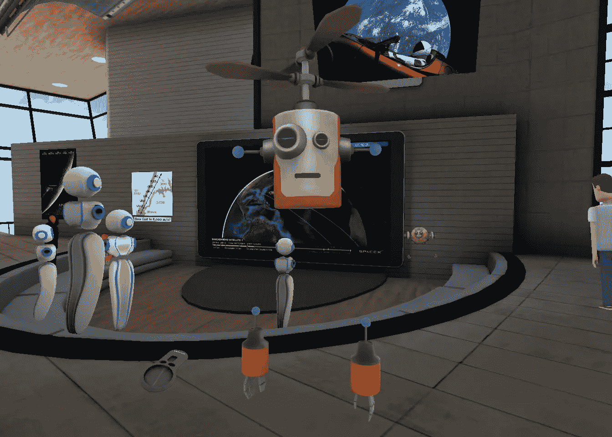

# 现在这一代 VR 是不是已经死了？

> 原文：<https://medium.datadriveninvestor.com/is-the-current-generation-of-vr-already-dead-84799eb46132?source=collection_archive---------5----------------------->

虚拟现实似乎给科技行业灌输了一种不健康的魅力:自 20 世纪 70 年代以来，每隔几年就会出现新一代的虚拟现实技术。总是有很多炒作和兴奋，但几年后残酷的认识开始出现:这个东西还没有准备好。一些利基应用程序通常会留下来，但我们仍在等待虚拟现实的大规模市场突破。

这一次，一切似乎都不同了:2014 年，脸书以令人垂涎的 2B 收购了早期虚拟现实开发商 Oculus。大约在同一时间，三星开始大规模推广其基于手机的 Gear VR 系统(与 Oculus 合作开发)，谷歌似乎希望通过其廉价的谷歌 Cardboard VR 浏览器来推广低端产品。数百家虚拟现实初创公司如雨后春笋般涌现，甚至像国家地理和纽约时报这样的严肃出版商也开始开发虚拟现实内容。

四年后，情况开始明显变得暗淡。是的，市场上大约有 500 万台 Gear VR 设备和 300 万台索尼 Playstation VR 头戴设备，加上大概几十万台更高端的 Oculus 和 HTC Vive 系统。是的，VR 仍然在无数的会议和活动中展示，希望看起来创新的大公司喜欢投资一两个 VR 应用程序。是的，脸书刚刚通过其 200 美元的 Oculus Go 耳机打破了一个重要的低端价格点，理论上使主流消费者能够负担得起 VR。此外，还有更多关于增强现实的宣传，这在某种程度上可能是虚拟现实的入门药物。

**但很难忽视一种日益增长的感觉，即虚拟现实并没有像业界希望的那样发展。**又来了，我们以前看过这部电影，让我们都把它包起来，等待大约五年后下一波虚拟现实的到来？

有几个迹象确实令人担忧:

## 1.没有人在使用它

当判断新技术的潜力时，我总是我的第一个测试对象。作为早期采用者，我们很容易认为消费者会采用一项新技术，只是因为我们这些技术极客认为它真的很酷。通常不是这样，或者只是有很长的时间延迟。早在 2001 年，我就非常喜欢我的第一台 Windows 平板电脑，但那是在 iPad 和 Surface 打入市场整整十年之后。

**真正的考验是另一种方式:如果我和我的早期采用者朋友不能对一项新技术保持持续的兴奋，它成为主流的可能性几乎为零。对于单个产品来说，情况并不总是如此(例如，Instagram 并不是技术迷，而是直接面向主流用户)，但它似乎适用于更基本的技术创新。**

我通常喜欢测试低端到中档版本的新技术。如果你想知道从现在起 10 到 15 年后普通人会得到什么，无论如何都要买高端的。但今天的中端产品是五年后的入门级消费产品，要找到一个拥有非极客消费者的市场，它必须非常引人注目。这就是为什么我拥有四代三星 Gear VR，一个谷歌 Daydream，可能还有十几个谷歌 Cardboards，所有这些都是在过去几年里用不同代的手机测试过的。我也有 4 台不同的 360 度摄像机，测试了不同的主题，甚至是我在古巴的假期。

结果:我几乎不用这个东西。我可能一个月用一次耳机来看看有什么新东西(通常不会太多)。而且 360 度的视频拍起来还是很别扭，剪辑起来也极其耗时。

似乎我并不孤单。我从所有拥有 VR 设备的朋友那里听到类似的故事。最好的公共指标可能是脸书新的社交虚拟现实功能，你可以与其他人一起参加活动，在虚拟聊天室见面或一起玩游戏。你可以看到你的朋友中有谁在使用社交 VR，并且目前在线。在我的 630 个脸书朋友中，有许多人在科技行业工作，总共有 18 个在 Oculus 社交虚拟现实平台上有账户，我从来没有见过他们中的任何一个人在线，即使在频繁使用的时候也没有。

更令人吃惊的是，**当你看公共虚拟现实活动的参与者数量时，通常只有几十到几百人参加。**这是在一个可能拥有 300 多万台设备的平台上。

*这里并不拥挤。作者的头像看起来有点悲伤。*

例如，我参加了 SpaceX 最近的猎鹰重型火箭发射的观看派对(有跑车的那次)。这有点像极客伍德斯托克，但尽管如此，只有大约 50 人出现在虚拟现实中。是的，这只是一个数据点，但当你登录 Oculus 系统时，你会看到几乎所有东西的类似低数字。我能找到的本周最热门的活动有 87 名注册用户。同样，这也是 300 万左右的潜在客户中的一部分。

## 2.虚拟现实内容还没那么有趣

我最喜欢的第一个新用户应用是侏罗纪世界演示。一只熟睡的恐龙突然醒来，几乎用尾巴撞你，然后仔细看着你，同时用恐龙的方式抱怨。这是目前大多数虚拟现实内容的一个非常典型的例子:制作精美，作为演示绝对引人注目，但最终并不那么有趣，因为它依赖于廉价的刺激而不是有趣的故事。没有人要求看两次演示。

在过去的几年里，出现了一些不同类别的虚拟现实应用。在这些游戏中，****可能是高端和低端市场中最先进和最有潜力的**。一些虚拟现实游戏非常有趣，完全沉浸其中当然是非常特别的——最初。我发现游戏的质量最终才是真正重要的，大多数虚拟现实游戏由于其有限的控制和其他限制，并没有达到最好的 2D 游戏的水平。**

**另一个虚拟现实内容类别是**“就好像你在那里一样！”视频**。各种精彩的地方、事件、艺术表演的剪辑不计其数。现在甚至有了直播，这是业界寄予厚望的，尤其是体育赛事。但当我最近尝试 2018 年足球世界杯的直播时，我非常失望。这就像坐在廉价的座位上，行动是如此遥远。好的，你可以切换到球门后面的摄像机，但是大多数时候，那里什么都没有发生。所有这一切都是在戴着不舒服的耳机的情况下进行的——五分钟后，它又回到了普通电视。这一类别的几乎所有东西的体验都是相似的。这是一个很好的新事物，但不值得经常使用，至少在当前的技术水平下不值得。**

**接下来是针对 VR 平台的**专门 apps】。你可以从虚拟冥想环境、教育内容或自助应用程序中获得任何东西(我最喜欢的是那种通过虚拟将你抛向深谷上空来治愈你恐高症的应用程序)。同样，这里有很大的潜力，但一旦新鲜感消退，你可能无法在 2D 世界获得几乎同样好的体验。****

**最后也是最奇怪的一类是 **2D 应用**，它们显然在其他设备上运行得更好，但出于某些原因，它们被移植到了 VR 上。网飞或 Hulu 就是很好的例子。可能没有比用沉重的 VR 头戴设备观看长格式视频更方便的方式了。为什么会有人想这么做？**

**从积极的一面来看，现在有一个由开发者组成的**生态系统**，他们已经获得了为 VR 开发的经验，并且有数百种游戏可供选择。这是对以前 VR 迭代的巨大改进，以前的迭代通常停留在演示级别。但感觉我们还没有在硬核游戏之外看到任何类似杀手级应用的东西。**

## **3.每个人(除了脸书)似乎都失去了兴趣**

**当三星最近推出其新旗舰 Note 9 智能手机时，**一个话题根本没有被提及:VR** 。这很了不起，因为三星已经投入巨资将 VR 打造为其手机的差异化产品。同样，谷歌也不再过多谈论其 Daydream VR 平台。诺基亚和其他人已经离开了 VR 相机业务，很多初创公司显然都在苦苦挣扎。**

**在内容方面，每日 360 度的图片已经从《纽约时报》的应用程序中悄然消失。《泰晤士报》还是做 360 内容的，但是你得努力去找。这同样适用于国家地理、探索和其他曾经对 VR 友好的出版商。到处都有一个剪辑，但没有什么能上头版。你不能责怪出版商: **360 度视频很难制作，观众仍然非常有限。**在这一点上，将它恰当地货币化几乎是不可能的，所以资源当然会被重新分配。在对 VR 和 360 度技术进行了大量投资的 YouTube 上，共有 33 个 VR/360 度视频，观看次数超过 1000 万。还不错，但对庞大的视频平台来说，没有什么能真正起到推动作用。相比之下，目前排行榜上的热门歌曲在 YouTube 上的浏览量超过了所有这些视频的总和。**

****科技领域最大的两家公司还没有在虚拟现实领域做任何可见的事情:苹果和亚马逊**——这两家公司都非常了解什么适合主流消费者。微软已经在混合现实上投入了大量资金，但不是纯 VR。有传言称，微软曾想为 Xbox 推出一款 VR 耳机，但最近扼杀了该项目。高端 VR 的先驱之一 HTC 作为一家公司表现不佳，正在考虑剥离其 Vive VR 部门。**

**投资者也很谨慎。对于被认为是下一件大事的东西，VR/AR 并没有获得很多持续的风险投资。许多活动都集中在几笔大交易上，比如被大肆宣传的 Magic Leap，它甚至在产品发布前就筹集了数十亿美元。这不完全是一个健康市场部门的结构。**

**唯一一家仍在高兴地吹捧虚拟现实的大公司是脸书。马克·扎克伯格是玩平台统治游戏的大师，在某种程度上，他对 Oculus 的投资可以被视为 2B 的一份保险，以防虚拟现实成为下一个大型计算平台。如果朋友之间的几十亿可以帮助你确保未来的统治地位，那又算什么呢？但低迷的虚拟现实市场能否保持脸书的注意力和投资意愿仍有待观察。**

## **我们只能等吗？**

**根据相对短期的结果来判断一项全新技术的表现当然是不公平的。自从第一个低于 1000 美元的虚拟现实解决方案(三星 Gear VR)问世以来，还不到四年。但与 iPhone 的发布相比，iPhone 可以说是第一款现代的、定义类别的智能手机。在同一时期(2007 年至 2011 年)，大约售出了 1.08 亿部 iPhones 和 2 亿多部安卓手机。这就是一个成功的品类发布会的样子。另一方面，对 VR 头戴设备最乐观的估计是在 20 米范围内(包括纸板风格的超低端观众)。**

**虚拟现实技术的现状显然有太多的问题。主流市场需要更加完美的东西，这还是在我们谈论许多人似乎感觉到的诸如虚拟现实引起的恶心等固有问题之前。**

**我们只能希望脸书和谷歌等公司继续向虚拟现实领域投入大量资金。这一类别完全消亡将是一种耻辱。**但有一点是肯定的:它迟早会回来。****

***原载于 2018 年 8 月 28 日*[*innospective.net*](https://innospective.net/is-the-current-generation-of-vr-already-dead/)*。***