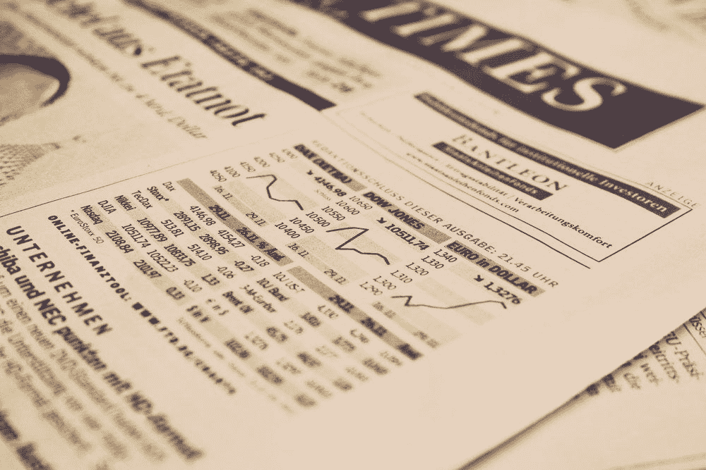

# 经济被操纵了吗？

> 原文：<https://medium.datadriveninvestor.com/is-the-economy-rigged-c42e49a1f7e1?source=collection_archive---------35----------------------->

Photo by [Markus Spiske](https://unsplash.com/photos/3Tf1J8q9bBA?utm_source=unsplash&utm_medium=referral&utm_content=creditCopyText) on [Unsplash](https://unsplash.com/search/photos/economy?utm_source=unsplash&utm_medium=referral&utm_content=creditCopyText)

很容易说出什么受到了操纵，谁受到了操纵，这样我们就可以合理解释我们自己的情况。

责怪别人或我们能模糊识别的东西会让我们暂时兴奋，因为它带走了我们应该关注的人——我们自己。

积极地做出决定去改变一个人的环境并不是承担个人责任。这就是为什么我喜欢资本主义的“理念”，尽管它有很多缺点。它培养了个人责任和主动性的观念。

话虽如此，就经济而言，我们这些二级投资者和市场参与者面临着一些自然的逆风。我们只能控制这么多。

经济中的主要参与者是一级机构投资者，他们拥有二级市场无法获得的巨大影响力。说它对穷人不利，只说对了一半。

它是针对不参与“流动市场”的普通人的。事实上，人们可以辩称，这种做法也不利于那些碰巧“白手起家”的百万富翁。

## 以下是为什么和如何对日常生活中的人作弊:

*   “系统”要你付钱进去。
*   对于中产阶级来说，这个系统希望你进入一个正式的教育系统，这样它就可以制度化地让你得到一份体面的工作，扣缴那些税收，并欺骗你认为你会得到很大的退款。
*   工资仅够支付生活费用，而且自本世纪初以来，工资没有随着通货膨胀的步伐持续上涨。
*   零工/自由职业者的经济在某些方面很好，但在其他方面则不然。组织很容易支付自由职业者的工作，而不提供主要的津贴和福利，如 401K 计划，健康保险，养老金等。也可能是压低工资的原因。这是一个循环往复的过程。
*   这个体系不支持有抱负的企业家。尽管有很多“玫瑰踏板”的内容，但事实并非如此。它不利于那些违背自己意愿的人。支持系统就是不存在。
*   体制如何不要那些“不守规则”的人？如果你想第一次创业，融资很难或者几乎不可能。银行不了解你，也不会贷款给任何没有记录的人。
*   在建立企业的过程中，你将无法提供稳定的收入或 W2，这将使你难以扩大信用额度。申请贷款、抵押贷款以及租房或买房都非常困难。你有责任为自己提供健康保险以及许多其他福利，如果你能聚集起潜在的多年不一致的现金流。
*   如果你很穷，它也会对你不利。你没有获得基本保健的经济来源，也负担不起适当的住所、食物、水和教育。
*   如果你得不到适当的教育，技能差距会扩大，财富差距会扩大，技术鸿沟会变得更大。反过来，提供一种可持续的生活方式要困难得多。

经济不仅仅不利于穷人。它对试图提供稳定生活的普通人和那些想提高社会地位的人不利。

它是针对人的。

如果你真的逆潮流而动，坚持不懈，并在这个过程中成为白手起家的百万富翁，这个系统会奖励你。

到达那里是对你不利的地方。

*最初发表于*[*【www.quora.com】*](http://qr.ae/TUGcEN)*。*