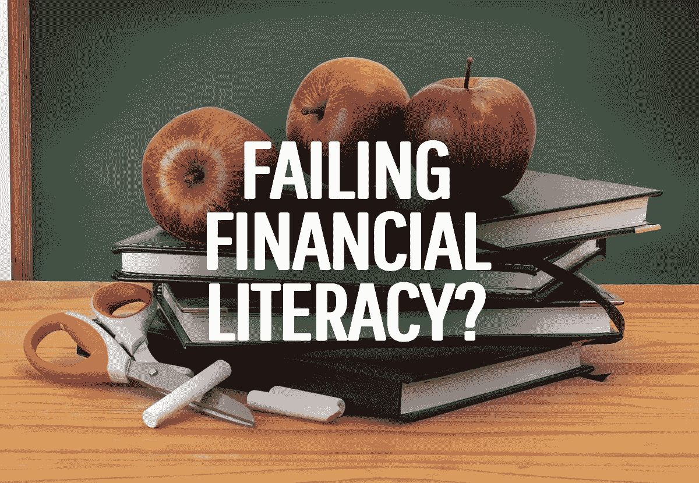

# 教育系统在个人理财方面失败了吗？

> 原文：<https://medium.datadriveninvestor.com/is-the-education-system-failing-personal-finance-f613a8da6710?source=collection_archive---------8----------------------->

最近听很多人说金融教育在一堆一堆的往下掉。我看到有人呼吁我们的孩子需要在学校里学习更多的个人理财知识。人们说教育系统没有教会学生基本的理财知识。如果没有更好的金融知识，学生们注定会陷入债务和错误的生活。

但这是真的吗？教育系统真的没有教育孩子个人理财吗，或者作为一个社会，我们真的辜负了我们的孩子吗？

我警告你——在这篇文章中，我将发表一些笼统的声明。我很大程度上会脱离我自己的经历，再加上一点点研究。

澳大利亚有大约 [10，000 所不同教育水平的学校](https://www.abs.gov.au/ausstats/abs@.nsf/mf/4221.0)——美国有 [120，000 所学校](https://nces.ed.gov/fastfacts/display.asp?id=84)。每个学校的体验都不一样。见鬼，每个*班*的体验都不一样。

同样值得记住的是*每个学生*都是不同的。我可能因为某个特定的老师而喜欢某个科目，但是坐在我旁边的孩子可能会讨厌这个老师或这个科目——影响他们的学习体验，并可能终生影响他们对某个特定科目的知识。此外，如果我旁边的孩子讨厌某个科目，那会对我产生负面影响。

那么，教育体系是否未能在学校充分教授个人理财知识？还是真的有别的事情发生？

# 我的正规金融教育

[我以前说过](https://hishermoneyguide.com/how-we-were-firing-without-knowing-it)我从来没有读过*富爸爸、穷爸爸*或者*赤脚投资者*，或者与戴夫·拉姆齐或者其他任何数量的金融教练或者人物有任何关系。

我主要从父母那里学到了一些常识和愤世嫉俗的态度，以及高中时的一点金融知识。

老实说，我不太记得我在学校里学过的东西。我假设我们学过利率和预算。但我真的不记得了。

相反，我唯一记得的事情发生在 10 年级或 11 年级，当时我在澳大利亚沉睡的旧布里斯班的一所市中心高中。

我的数学老师(不，我们没有专门的金融老师)告诉我们在一个学期中做一个股票市场作业。

虽然我想我们被告知投资，但我不记得任何细节。我所记得的是，我们被要求选择四家公司，假设每家投资 500 美元，提供选择这些公司的理由，然后在任务期限内跟踪它们(大约两个月)。

我特别记得我选择了一家名为拉姆齐医疗保健的小公司。我想“每个人都需要医疗保健”，于是我选择了他们(遗憾的是，我不记得其他公司了)。

对我来说不幸的是，我没有从拉姆齐医疗保健中心或其他机构得到想象中的富裕。直觉告诉我，我在一家公司赚了边际利润，一家相当持平，两家比最初的购买价格低了一些。

总的来说，我对投资相当失望。这当然没有改善[我对股票的看法](https://hishermoneyguide.com/changing-thoughts-on-shares/)。

但是我不应该灰心丧气。如果我*真的*在 2000/2001 年以大约 1.5 美元的价格收购了 Ramsay Health Care，并持有至今，我就能获得大约 4000%的利润。

叹气。我可能已经退休了。

# 金融教育的差距

所以回到近 20 年前，我在一所普通的公立学校学习个人理财。但是其他人——包括我这一代的澳大利亚人——说他们不是。这是怎么回事？

最简单的解释是人们只是忘记了。我只具体记得最小的片段，所以别人完全忘记也不是不可能的吧？

我要大胆地说，大多数在学校学过个人理财的人，他们已经完全忘记了。一些作为模糊的背景知识被保留了下来，但是其余的都消失了，被认为是多余的，被其他信息覆盖了。

但这无论如何也不能解释全部情况。澳大利亚没有，世界其他地方也肯定没有。

我转身问艾莉，她在高中被教了什么，她断然否认被教过个人理财。数学和统计学，是的——但是资金管理、预算、投资等等，不行。

她在一所私立学校，所以很明显，尽管我们在同一个州，但我们没有相同的课程。尽管为她的教育付了钱，她还是没有学会相当简单的金融基础知识。

很明显，这比看起来要复杂得多。

# 全球金融教育在很多地方都存在

二十年前我和埃莉上学时，我对澳大利亚的课程设置不抱任何希望，但我们可以看到今天发生的事情，这些事情引起了人们的强烈抗议。

在澳大利亚，金融知识是高中课程的一部分。在数学方面，课程包括贷款、投资、年金和复利的单元。这是建立在以前的百分比、比率和利率的基础上的。

我不是老师，但看起来学生们肯定也在国家课程的“[算术](https://www.australiancurriculum.edu.au/f-10-curriculum/general-capabilities/numeracy/)”下学习税收和预算之类的东西。

我喜欢认为我是一个现实主义者。学生不可能学到所有的东西。他们当然也不会记得所有的事情。但是我相信那些说学校没有教他们个人理财的人是错误的*。*

也就是说，各地的情况不尽相同。

在美国，只有三分之一的州要求公立高中学生上个人理财课。20 年前，美国只有一个州要求学生学习个人理财。

同时，89%的美国教师认为应该在课堂上教授个人理财知识。然而，真正可怕的是，只有 20%的教师认为他们有能力教授这门课。

在某些方面，这将金融知识置于性教育的同一保护伞下。

父母可能更愿意让老师来承担性教育和理财教育的重担。但是许多老师也不能胜任工作。

那么有没有别的解决办法呢？

# 理财素养其实应该是父母的责任吗？

在一个理想的世界里，我认为金融知识应该掌握在正规的教育系统中，以及在父母的指导下。

教师应该提供诸如算术技能之类的基础知识——加法、减法、百分数、分数等。以及各个国家的预算、税收和退休储蓄策略等关键财务领域。

问题是有好老师，也有坏老师——就像有人善于理财，也有人不善理财。

在澳大利亚和美国成千上万的教师中，我可以告诉你会有几个财务上的败类。怎么会？从数量上来看。你可以看到[一般人的财务](https://hishermoneyguide.com/average-wealth)有多差。

教师的工资很稳定，但这些天他们不得不忍受学生和家长的垃圾，没有什么了不起的。但是他们挣的钱还不足以让他们一夜暴富，考虑到他们在社会上的人数，你*不会希望这些人教你的孩子理财。*

但是人们的平均财务状况更多地反映了学生的家长们如何处理他们的钱。

虽然教师应该教授理论，但父母应该教授良好的习惯，并以身作则，巩固这些教训。然而，问题是父母基本上没有能力做到这一点。

我认为这才是问题的核心。有几代好心人把坏习惯传给他们的孩子。其中一些人自己成为了老师。

不幸的是，这个循环还在继续。

# 学校个人理财有什么解决办法？

对于一个破碎的循环，没有快速的解决办法，也没有更长的时间，只有简单的解决办法。这是一个代际问题。

即使在澳大利亚，尽管生活在世界上最富有的国家之一，但是在全国范围的课程中，你可以看到许多人努力维持生计，需要昂贵的短期贷款。

如果他们做不到，那些没有正规金融知识的人还有什么希望？

我的解决方案在政治上不会受到任何一方的欢迎。它也不会立即帮助股票交易所上市公司的底线。

我唯一能想到的是——除了持续的金融知识教育——改变社会的心态，远离无休止的支出和增长。

花钱被认为是好的，人们需要知道不需要这样。

人们需要知道，他们不应该在获得贷款后就想拥有一切(新房子、汽车、衣服、电子产品、假期等)。

公司从这种心态中获利，但社会却承受着个人的累积成本。

# 短期经济损失换取长期收益？

我在这篇文章的开头说我会做全面的陈述，我很确定我已经做了。不过，我会再做一个。

如果人们更像我和艾莉，会发生什么？我的意思是，他们保持节俭，直到他们达到更高级的财务独立。

在我们的情况下，我们目前每年花费大约 20，000 美元，过着非常节俭的生活。但是将来，当我们提前退休的时候，我们将依靠[每年 10 万美元左右的收入生活。我们将对经济非常有益。](https://hishermoneyguide.com/our-high-income-early-retirement-budget)

显然，我们的情况很极端。但是想象一下，如果人们*一起*勒紧裤腰带过了 5-10 年([而不是 20 年或更久](https://hishermoneyguide.com/wow-34-years-old-half-way-working-life))，建立了自己，只有他们放松了预算？

他们不需要以提前退休或兼职为目标。他们只需要偿还债务，并有某种形式的住房保障——要么是大部分已还清的房子，要么是有助于产生支付住房费用的被动收入的投资。

在那之后，他们可以回到过去的消费方式。这可能不是理想的个人财务管理，但我在这里尽量做到至少有点现实。如果鼓励人们这么做，或许可以转移对金融危机的叙述。

相反，我担心那些刚起步的人只会看到那些年纪更大、已经站稳脚跟的人。他们会想要他们所拥有的，并把事情带回起点，也就是我们现在所处的位置…

所以回到最初的前提，教育系统是否应该为社会糟糕的财政状况负责，我认为不应该。

我认为这又回到了人类的核心倾向——总的来说——互相攀比。人们只是有一个短期的焦点；他们无视未来，无视他们天生就知道的符合自身长期最佳利益的东西。许多人在冲动控制和延迟满足中挣扎。

问任何人他们是否愿意贷款:几乎每个人都会说他们不愿意。但是没有那笔贷款，他们就不能得到他们想要的(而不是他们需要的)。所以他们选择贷款。

教育系统当然可以改进，但家长也需要承担责任。如果你想帮助你的孩子从小学到中学学习理财知识，[这个网站是一个极好的资源](https://www.moneysmart.gov.au/teaching/teaching-resources)(不管你来自哪个国家)。

如果你不确定自己的个人理财知识，你可能会比自己查看这些资源更糟糕。它们以通俗易懂的方式涵盖了许多基础知识。

我们都需要为自己的行为负责，而不是在金融教育上玩无休止的指责游戏。只有这样，我们才能为我们自己、我们的孩子和子孙后代提高金融素养。

干杯，

亚历克斯

PS:你是否认为教育系统未能在学校恰当地教授金融知识？还是存在于课堂之外的问题？

*原载于 2019 年 7 月 11 日*[*【https://hishermoneyguide.com】*](https://hishermoneyguide.com/education-system-failing-personal-finance/)*。*