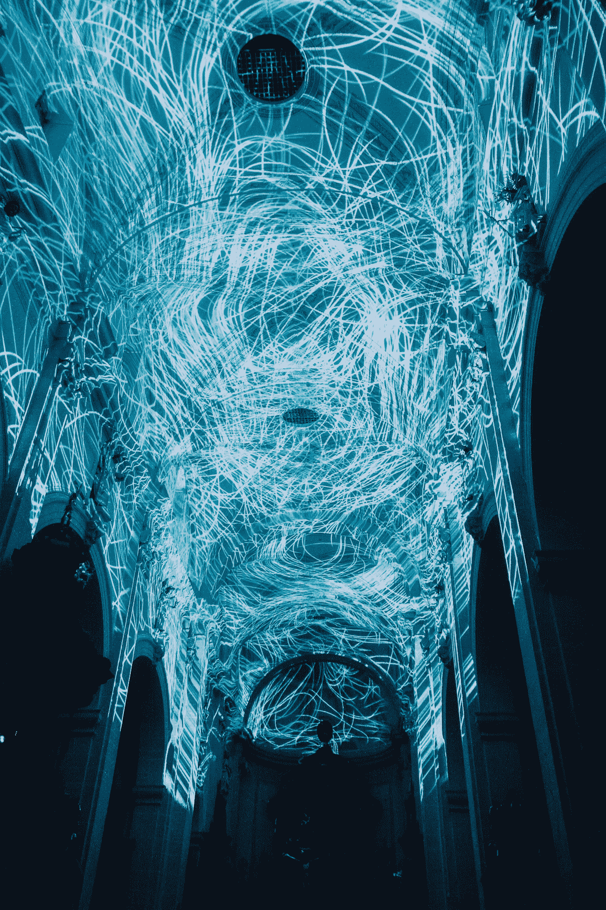

# 量子互联网时代来临了吗？

> 原文：<https://medium.datadriveninvestor.com/is-the-era-of-quantum-internet-upon-us-c1e2c73382f0?source=collection_archive---------12----------------------->

## 它可能会改变我们今天所知的世界

Quantum Computing could be the revolution of today’s internet. Photo by [Robynne Hu](https://unsplash.com/@robynnexy?utm_source=unsplash&utm_medium=referral&utm_content=creditCopyText) on [Unsplash](https://unsplash.com/s/photos/network?utm_source=unsplash&utm_medium=referral&utm_content=creditCopyText)

  Y 你一边盯着手机，一边啧啧有声地吃着意大利面。我做了一个非常好的酱，但是你甚至不会注意到，沉浸在那个小屏幕的世界里。突然你抬起头。什么是量子互联网？

“未来！”

“是的，但是——什么是*它是*？

这就像今天的互联网——但是用的是量子计算机。为了存储和传输信息，我们将使用量子位而不是比特。

什么是量子位？

> 量子位有点像薛定谔的猫

你知道什么是古典音乐吗？

它是任何种类的信息，存储在 0 或 1 中。“0 和 1 的序列决定了你存储的任何信息的内容。”

“还有一个量子位，”

一个量子位是零*和*是一——以及介于两者之间的任何东西。“马上！”

你看起来很困惑。

看啊。我可以给你寄一张小猫的照片。这里有很多位。或者我可以给你寄一张死小猫的照片。那是一组独立的位。它们是两个独立的文件，存储在两个独立的地方。

但是有了量子计算机，我可以同时把你们两个——*！*

我发给你的图片里的小猫是死的同时又是活的，就像薛定谔的猫一样。我基本上是在一条消息中向您发送两件事情，因此使用了更少的存储空间。

 [## 2019 年即将改变世界的技术|数据驱动的投资者

### 很难想象一项技术会像去年的区块链一样受到如此多的关注，但是……

www.datadriveninvestor.com](https://www.datadriveninvestor.com/2019/01/17/the-technologies-poised-to-change-the-world-in-2019/) 

此外，计算时间大大减少，因为量子计算机可以同时执行许多操作。有了量子计算机，我们能够解决传统计算机需要几百万年才能解决的问题。

Stephanie Wehner, one of the leading forces behind the development of the Quantum Internet.

“所以基本上量子计算机是超快的，因为它一次可以计算一千件事情，”

没错。想象一下你能用它做的所有事情！你能解决的复杂问题！

现在把这种潜力乘以十亿——因为如果我们与这样一台超级计算机交流，我们就可以进行令人惊叹的对话了……”

“我们如何发送量子信息，”

利用量子纠缠。

我的意大利面也纠结了……”

是的…但是量子纠缠有点不同。它可以启用[不可破解的](https://www.nature.com/news/china-s-quantum-satellite-clears-major-hurdle-on-way-to-ultrasecure-communications-1.22142)安全性。它还可以帮助 T2 制造更好的时钟、全球定位系统，甚至望远镜

“怎么做，”

这个问题的根源在于[量子纠缠](https://www.nature.com/news/cosmic-test-backs-quantum-spookiness-1.21401)的几个特征。想象我们有两台量子计算机。一个属于爱丽丝，一个属于鲍勃。他们在世界的不同角落。爱丽丝可以有两个纠缠在一起的量子比特，然后给鲍勃发送一个。

> 量子信息是不可破解的

请记住，量子位是 0 和 1 的模糊组合。但是，如果我们问一个量子位是什么，答案将是零或一。与普通钻头不同的是，它事先不知道会发生什么。

现在，如果爱丽丝和鲍勃同时问他们的量子位是什么，会发生什么？

他们的量子位会返回同样的答案！这叫做*最大协调*。但是请注意，这种连接本质上是私有的。没有人能在不改变它的情况下接入这种连接——这就是为什么它非常安全！”

 [## 量子互联网:间谍梦的噩梦

### 确保通过互联网发送的信息不会落入坏人之手是最大的挑战之一…

medium.com](https://medium.com/@n.biedrzycki/the-quantum-internet-a-nightmare-from-a-spy-dream-122e51fb3089) 

耶，再也没有国安局窃听我的自拍了！

确实如此。这意味着你可以即时同步。这意味着我们有很多更好的方法来同步时钟，或跟踪位置数据。或者我们可以改进天文望远镜，这通常依赖于将多个望远镜组合成一个非常大的望远镜。

你推开你的空盘子。“冰淇淋？”

是的，请给我两块钱。

你起身打开冰箱门。“但如果那东西真的很酷，为什么我们还没有量子计算机呢？”

The Quantum Internet might unlock completely new possibilities to humankind. Photo by [Bit Cloud](https://unsplash.com/@bitcloudphotography?utm_source=unsplash&utm_medium=referral&utm_content=creditCopyText) on [Unsplash](https://unsplash.com/s/photos/network?utm_source=unsplash&utm_medium=referral&utm_content=creditCopyText)

因为它们很贵。因为远距离传输量子信息极其困难。

这就是为什么我们不会很快拥有个人量子计算机。但我们可以用自己的[计算机将](https://science.sciencemag.org/content/362/6412/eaam9288)连接到大型量子计算机，并为计算空间付费。

但是拥有这台超级计算机的人会知道你在上面做的一切！

不，这实际上是可能的，使其成为固有的私有。这意味着你在使用量子计算机，但计算机甚至不知道它的用途。

你啃着你的冰淇淋。哦好的。那么，为什么我们还没有量子互联网呢？

Quantum computers could become accessible to everyone soon. Photo by [theverticalstory](https://unsplash.com/@theverticalstory?utm_source=unsplash&utm_medium=referral&utm_content=creditCopyText) on [Unsplash](https://unsplash.com/s/photos/network?utm_source=unsplash&utm_medium=referral&utm_content=creditCopyText)

“目前，在超过 100 公里左右的距离上传输量子信息仍然非常困难，”

“为什么，”

还记得我们在讨论两个纠缠的粒子吗？这意味着我们通过光纤发送一个单独的粒子。相比之下，在普通互联网中，我们为每一位发送数百万个粒子。此外，我们不能发送带有相同信息的新粒子——如果它丢失了，它就丢失了。”

这太糟糕了。

没错。所以现在人们正在研究盒子——它们被称为量子中继器——它将与[量子隐形传态](https://arxiv.org/abs/1707.00934)一起工作

心灵运输？什么…？!'

> 未来从现在开始

听起来很疯狂，是吧？

假设爱丽丝想给鲍勃发送一个纠缠的量子比特。但是鲍勃的电脑太远了。所以量子位首先到达量子中继器，在它们之间。

量子中继器将爱丽丝的量子比特状态与另一个交换。这个反过来又和鲍勃电脑里的一个量子比特纠缠在一起。所以尽管爱丽丝只发送了一半的粒子，鲍勃已经收到了信息！

哇，现在越来越可怕了。

“太棒了，”我一边收拾我们的碗，一边回答道。

研究人员目前正在研究这些量子中继器。他们想在 2020 年前发送第一条[量子信息！”](https://www.nature.com/articles/d41586-018-01835-3)

什么？“但那是——现在！”

“我们生活在激动人心的时代……”