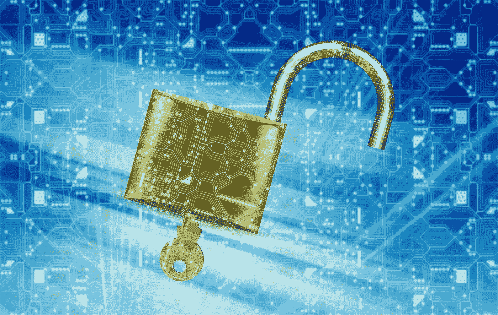

# 你用的交易所安全吗？

> 原文：<https://medium.datadriveninvestor.com/is-the-exchange-you-use-safe-faf1ca9b5633?source=collection_archive---------3----------------------->

伴随着加密货币需求的激增，人们的资产总是存在安全威胁。4000 亿美元的全球加密货币市值和较少的监管为无数黑客拦截威胁私有财产的交易打开了大门。

交易所的安全性能一直是重中之重。黑客历史的发生，是因为交易所缺乏安全性。其中一些是:

2017 年 12 月，韩国 [Youbit 交易所被黑](https://qz.com/1160573/bitcoin-exchange-youbit-files-for-bankruptcy-in-south-korea-after-latest-hack/)，被盗 17%的资产。Site 最终关闭了交易所，并申请破产；

2018 年 1 月 25 日，日本 [Coincheck 被黑](https://www.wsj.com/articles/cryptocurrency-worth-530-million-missing-from-japanese-exchange-1516988190)，交易所客户损失 5.3 亿美元加密货币资产；

2018 年 3 月 7 日，[交易员怀疑币安交易所被黑](https://www.forbes.com/forbes/welcome/?toURL=https://www.forbes.com/sites/cbovaird/2018/03/07/bitcoin-drops-below-10000-as-traders-suspect-binance-hack/&refURL=https://www.google.si/&referrer=https://www.google.si/)，导致比特币连续两天下跌，市值下跌 15%。

加密货币交易所成为黑客攻击的重灾区，安全性成为所有交易平台的重中之重。

市场上有无数的交易所，但选择一个正确的是，也应该是任何交易者的首要任务。为了避免任何庞氏骗局，交易者应该警惕网上资产交易。有些交易所也提供了在区块链以外的平台上运行的选择。这对一些交易者来说很有诱惑力，但是在交易开始之前，你必须核实和认证一些事情。

## **分散交换可能提供一个解决方案**

所有这些受损的交易所(Bitstamp，Bitfinex，Youbit，Bitthumb，…)都是集中的。这并不罕见，因为大多数主要交易所都是集中的。当交易所被集中时，集中有两种形式:

**1。** **资产控制和系统管理。**

有了资产管理，银行等值得信赖的机构运营得非常好。当您使用集中交易所时，您同意让交易所持有您的资金，并将其私下存入您的帐户，直到您希望提取它。交易所通常将客户资金存入热门钱包储备(在线)。

**2。** **集中化的另一种形式是交易所如何存储其数据以及它用来支持自身的基础设施。**

如果黑客想要进行集中交易，只需要通过一个中央门户，通常是第三方托管服务器。一旦他们进入，黑客可以获得中央资金来源，交换热门钱包储备和私人密钥。

当然，它们都有一些安全功能来防止恶意行为者。但历史表明，这些措施远远不够。

这就是为什么我们需要**分散式**沟通。分散交易交易所(DEX)提供了一系列增强的安全优势。

**1。** **没有进入或控制的中心点。**

与集中式 exchange 不同，DEX 不是由单一实体控制的。当然，人们用来访问交易所的域名服务器是集中的，但没有实体控制市场，交易所也不支持服务器。

目前，大多数分散式交易所都建立在以太坊区块链上，由节点网络而不是中央服务器支持。这意味着攻击者必须损害支持交换的一半节点来控制它，这几乎是不可能的。

**2。** **用户控制资金。**

由于不存在具有 DEX 的实体，因此不存在控制用户资金的中央枢纽。去中心化的交换是不可信的，这意味着用户总是在控制他们的资产，所有的交易都是点对点的。

为此，DEX 使用以太坊驱动的智能合约来管理加密货币。一旦资金被锁定在智能合约中，只有拥有相应私钥的人才能接触到资金。在一个集中的系统中，你放弃你的私人密钥，它们都集中在一个单一的分类账中，反映了交易所的热门钱包储备。如果黑客抓住了这些钥匙，你的钱就可以被清除。

在一个分散的系统下，你总是控制着你自己的私钥。只要您不向恶意第三方披露，您的资产在 DEX 智能合约中是安全的。

**3。** **与硬件钱包整合。**

这可能是 DEX 最大的好处。大多数分散的交易所，如以太三角洲和 IDEX，可以与 Ledger Nano S 或 Trezor 硬件钱包同步。除了冷藏之外，硬件钱包是存储和管理个人资金的最安全选择，因为它们不会受到可能损害软件钱包的相同恶意软件的影响。使用符合硬件钱包的 DEX，您可以将您的 Ledger Nano S 或 Trezor 插入交易所的智能合约中，并将资金导入交易所的智能合约中。

目前，人们普遍认为分散式交易所的流动性更差，因为它们没有那么多做市商，尽管它们确实以更具可扩展性的方式通过点对点协议传递订单和信息。

另一方面，分散式交易所目前使用起来通常更加昂贵和复杂。用户界面并不令人惊奇，它们更多的是一种智力成就，而不是一个完美的工具。到目前为止，在他们能够与集中交易所竞争之前，还有很多事情需要改变。也许，这就是集中交易所仍然在市场上盛行的原因。

然而，随着技术的快速发展和新解决方案的出现，用户偏好的转变可能是瞬间的。

你也可以阅读 [**加密货币交易所的验证过程变得越来越奇怪。**](https://medium.com/@VidrihMarko/the-verification-process-for-cryptocurrency-exchanges-is-becoming-more-and-more-strange-451ba123f1be)

## 作者:[马尔科·维德里](https://twitter.com/VidrihMarko)

## [@密码](https://steemit.com/@cryptomarks)

*图片通过 pixabay*