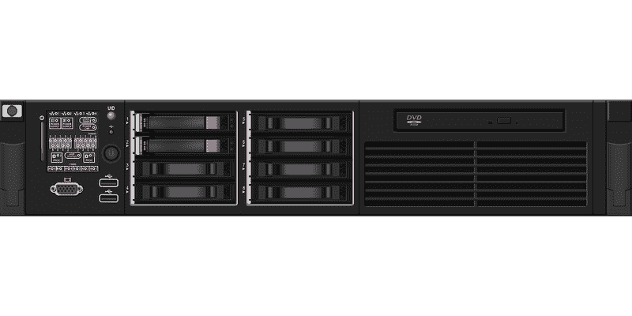
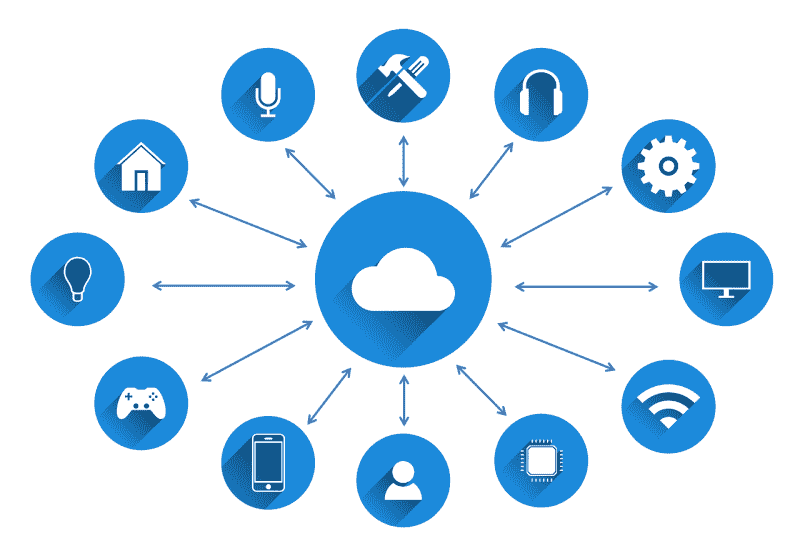

# 惠普企业公司是价值投资吗？—市场疯人院

> 原文：<https://medium.datadriveninvestor.com/is-the-hewlett-packard-enterprise-company-a-value-investment-market-mad-house-39bdf21e82a?source=collection_archive---------7----------------------->

惠普企业公司(纽约证券交易所代码:HPE) 最近运气不错。HPE 股价增长了 16.2%；或 2.50 美元，在 2019 年 1 月 3 日至 10 月 18 日之间。

那么什么是惠普企业，是价值投资吗？澄清一下 [**惠普企业**](https://en.wikipedia.org/wiki/Hewlett_Packard_Enterprise) **(纽约证券交易所代码:HPE)** 不是历史上的计算机制造商。相反，他们在 2015 年将 HPE 从惠普公司剥离出来。

 [## 算法交易的机器学习|数据驱动的投资者

### 当你的一个朋友在脸书上传你的新海滩照，平台建议给你的脸加上标签，这是…

www.datadriveninvestor.com](https://www.datadriveninvestor.com/2019/01/30/machine-learning-for-stock-market-investing/) 

惠普企业向大型组织出售服务器、信息技术(IT)和云解决方案。个人电脑、打印机、墨水和其他消费品来自 [**【惠普公司】**](https://en.wikipedia.org/wiki/HP_Inc.) **(纽约证券交易所代码:HPQ)** ，一家独立的公司。

# HPE 的价值投资特征

我觉得惠普企业有价值潜力，因为它便宜，默默无闻。例如，HPE 股票在 2019 年 10 月 18 日的交易价格为 15.35 美元。

此外，HPE 不为公众所知，但它制造了对商业、工业、银行和政府至关重要的基础设施。特别是，惠普企业提供[混合云](https://www.hpe.com/us/en/home.html)服务。

如果没有云，许多现代商业、娱乐、金融、商业、零售、运输、教育和政府都是不可能的。需要云的现代设施包括金融科技、社交媒体、流媒体视频、人工智能、大数据、区块链、加密货币、智能手机、游戏、流媒体音频和投资市场。

因此，HPE 是一家基础设施公司，这赋予了它典型的价值投资特征。像基础设施公司一样，**伯克希尔哈撒韦公司(纽约证券交易所代码:BRK。拥有 HPE 是晦涩和不性感的。**

# 惠普企业赚钱吗？

惠普企业公司赚了点钱。为了解释这一点，HPE 在 2019 年 7 月 31 日报告的毛利为 25.23 亿美元。

然而，HPE 在同一天报告了 200 万美元的营业损失和 2700 万美元的净亏损。另一方面，惠普企业是一家现金充裕的公司。

截至 2019 年 7 月 31 日，HPE 的运营现金流为 11.96 亿美元，自由现金流为 6.48 亿美元。事实上，截至 2019 年 7 月 31 日，Hewlett Enterprise 拥有 36.93 亿美元的现金和短期投资。

因此，惠普企业提供了低股价和大量现金的典型价值特征。然而，HPE 也存在一些严重的问题。

# 惠普企业的麻烦

惠普企业的大问题；在我看来，是它的收入增长率。特别是，HPE 已经连续三个季度出现收入负增长。

具体来说，Stockrow 估计惠普企业的收入增长率在截至 2019 年 1 月 31 日的季度下降了-1.5%。该收入增长率于 2019 年 4 月 30 日下跌至-4.68%，并于 2019 年 7 月 31 日下跌至-7.05%。

相比之下，截至 2019 年 1 月 31 日的季度，HPE 的毛利增长了 8.14%。截至 2019 年 4 月 30 日的季度，惠普企业利润增长 2.23%；而截至 2019 年 7 月 31 日止的三个月则为 3.66%。

因此，惠普企业公司的业务并没有增长，但它从该业务中赚了更多的钱。我认为收入增长率表明 HPE 的业务是不可持续的。

此外，和沃伦·巴菲特一样，我认为良好的收入增长率对企业在当今世界的生存至关重要。澄清一下，我认为没有一个业务或收入流是可靠的。因此，每个企业都需要增长来应对未来的收入损失。

# 惠普企业是好的分红股吗？

我认为 HPE 的股票价格低，股息高。具体来说，**惠普企业(纽约证券交易所代码:HPE)** 于 2019 年 9 月 10 日支付了 11.25₵股息。

2019 年 10 月 18 日，Dividend.com 给惠普企业的股息率为 2.96%，年化支付 45₵，支付率为 25.8%。然而，HPE 只经历了两年的股息增长。

相反，我不认为 HPE 的股息是安全的，因为它所处的行业。详细说，惠普企业是一家小公司，直接与现金充裕的巨头竞争。

# 惠普企业能活下来吗？

例如，惠普企业直接与**亚马逊**竞争；亚马逊网络服务(AWS)、**、微软(纳斯达克代码:MSFT)** 和**甲骨文(纽约证券交易所代码:ORCL)的所有者。**

值得注意的是，甲骨文在 2019 年 8 月 31 日拥有 357.04 亿美元的现金和短期投资。与此同时，截至 2019 年 6 月 30 日，亚马逊拥有 414.63 亿美元的现金和短期投资。最后，微软在 2019 年 6 月 30 日拥有惊人的 1338.39 亿美元现金和短期投资。

因此，微软有 1338.39 亿美元用于扩展其 Azure 云。例如，2018 年 6 月，微软支付[75 亿美元](https://marketmadhouse.com/microsoft-buys-github/)收购文件共享平台和软件仓库 GitHub。

# 惠普企业能和微软、GitHub 竞争吗？

GitHub 威胁到了惠普企业，因为它为用户提供了超过 9600 万个知识库和超过 3100 万个开发者的服务。此外，GitHub [估计](https://octoverse.github.com/)去年使用其服务的组织数量增长了 40%,超过 210 万。

收购 GitHub 表明了为什么 HPE 无法与微软、甲骨文和亚马逊竞争。我认为惠普企业缺乏购买力，无法成为云服务和 IT 领域的主要参与者。

归根结底，我认为惠普企业太小，无法在云和 IT 领域竞争和生存。因此，我认为投资者远离 HPE 是明智之举。

事实上，我认为惠普企业(纽约证券交易所:HPE) 能够生存的唯一方法就是成为一个更大的现金充裕的组织的一部分。没有更多的现金，惠普企业不可能在今天的云业务中具有竞争力。

*原载于 2019 年 10 月 18 日*[*https://marketmadhouse.com*](https://marketmadhouse.com/is-the-hewlett-packard-enterprise-company-a-value-investment/)*。*