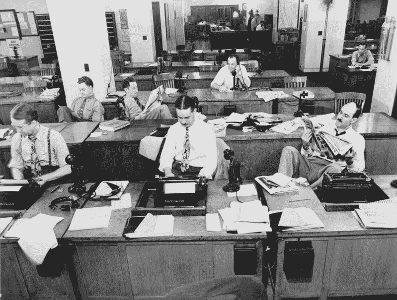
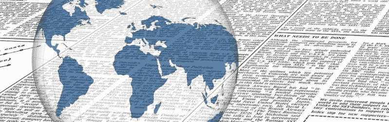

# 《纽约时报》赚钱了吗？—市场疯人院

> 原文：<https://medium.datadriveninvestor.com/is-the-new-york-times-making-money-market-mad-house-804b72ee726d?source=collection_archive---------8----------------------->

奇怪的是，美国的记录纸；传奇的《纽约时报》正在吸引大量新订户。例如，据美联社[估计](https://www.marketwatch.com/story/new-york-times-subscriber-numbers-are-skyrocketing-in-the-trump-age-2019-02-06)，灰色女士在 2018 年最后一个季度收到了 265，000 份新的数字订阅。

有趣的是，*《纽约时报》*正在增加其新闻编辑室的记者，这在记者们在其他城市驾驶优步的时代是闻所未闻的。事实上，美联社声称，在 2018 年底，时报的新闻编辑室员工是该报历史上最大的。

 [## 视频推动营销|数据驱动投资者

### 当话题转到创意视频时，没有人会把安德鲁和皮特这对营销组合逼到墙角。他们的悠闲…

www.datadriveninvestor.com](https://www.datadriveninvestor.com/2019/01/23/video-sets-marketing-in-motion/) 

相反，*《纽约时报》*2018 年报纸发行量跌破 50 万份。Statista [估计](https://www.statista.com/statistics/273503/average-paid-weekday-circulation-of-the-new-york-times/) *《泰晤士报》*2018 年工作日平均发行量为 48.7 万份。因此，《纽约时报》的报纸发行量不到 2008 年的一半。Statista 估计《纽约时报》2008 年的发行量为 103 万份？

# 《纽约时报》能赚钱吗？

《灰色女士》杂志上不同的故事提出了一个问题:“纽约时报公司(纽约证券交易所代码:NYT)赚钱吗？”

目前,《纽约时报》从它的运营中赚了一点钱。具体来说，Stockrow 估计，在截至 2019 年 6 月 30 日的季度，纽约时报的收入为 4.3636 亿美元，毛利润为 2.4806 亿美元。

此外,*《纽约时报》*公布的税前利润为 3459 万美元，同期净收入为 2517 万美元。因此,《泰晤士报》是赚钱的，但是它现在的收入远不及 20 世纪后期报纸产生的现金流量。

此外，纽约时报报道税前利润为 3459 万美元，同期净收入为 2517 万美元。因此,《泰晤士报》是赚钱的，但是它现在的收入远不及 20 世纪后期报纸产生的现金流量。

# 《纽约时报》的竞争对手是谁？

三十年前，提名《纽约时报》的竞争对手很容易。《泰晤士报》的主要竞争对手是当地报纸，如《纽约邮报》和《每日新闻》。

然而，今天,*《纽约时报》*是一家全国性的数字新闻机构，以印刷纽约报纸为副业。因此，弄清楚谁是《T2 时报》的竞争对手可能会很困难。

《T4 时报》最大的直接全国性竞争对手是其他严肃的全国性新闻机构，包括国家公共广播电台(NPR)、华盛顿邮报、华尔街日报和赫芬顿邮报。此外，*《泰晤士报》*还面临着来自 [*《卫报》*、](https://www.theguardian.com/us)的奇怪挑战，这是一份历史悠久的英国报纸，它出版了一份咄咄逼人的美国数字版。

尤其是《华盛顿邮报》是《纽约时报》和《T21》的主要威胁，因为美国首富杰夫·贝索斯拥有该报。因此，*《华盛顿邮报》*背后有贝索斯的1129 亿美元财富和**亚马逊(纳斯达克股票代码:AMZN)** 帝国。贝佐斯声称《邮报》和亚马逊是分开的，但是有人相信他吗？

值得注意的是，你可以在亚马逊上找到*《华盛顿邮报》* [数字接入](https://www.amazon.com/The-Washington-Post-Digital-Access/product-reviews/B072MHQFJ1)，但是*邮报对 Prime 会员的*特别优惠已经成为历史。然而，如果《邮报》的收入下降，这样的交易可能会恢复。

# 报纸能在 21 世纪生存吗？

《纽约时报》、《卫报》、《T42》、《华盛顿邮报》证明了报纸可以在 21 世纪生存——但不是报纸。这三家报纸都通过创建强大的数字存在得以生存。

事实上，我认为*是* *纽约时报**卫报*和*邮报*是数字新闻机构。例如，这三本书我都读了好几年了，但我从未见过纸质版的《华盛顿邮报》或《卫报》。

因此,*《纽约时报》*生存了下来，因为它的管理层明白产品是新闻，而不是报纸。相应地，纽约时报公司专注于提高其新闻产品，而忽略了纸质版。

# 为什么地方报纸正在消亡

这与传统的报纸策略背道而驰，后者强调不惜一切代价提高报纸发行量。奇怪的是，我认为对高发行量的痴迷正在扼杀大多数美国报纸。

解释一下，像《丹佛邮报》这样的报纸如此痴迷于高发行量，以至于忽略了其他一切。*例如,《丹佛邮报》*付钱给无家可归者在丹佛街头典当其报纸以增加发行量，这冒犯了许多读者。

此外，*《丹佛邮报》*没有创造出科罗拉多州以外任何人感兴趣的内容。因此，除了野马队球迷和科罗拉多人之外，没有理由让任何人访问丹佛邮报的网站。

# 《纽约时报》为何幸存

《纽约时报》生存下来并赚了一点钱，因为它提供了大量远离纽约的人们感兴趣的内容。像《丹佛邮报》这样的地区性或地方性报纸没有理由不做类似的事情。

例如,《丹佛邮报》本可以成为滑雪、酿酒、钓鳟鱼、环境、乡村烹饪或自由政治方面的国家权威。世界各地的人们都对这些话题感兴趣，所以这样的关注会吸引一些眼球到丹佛邮报的网站上。

值得注意的是,*《纽约时报》*吸引了互联网流量，因为它是书籍、出版、政治、旅游、戏剧和许多其他主题的权威。这种权威的一部分是运气，纽约是美国戏剧、美国娱乐、全球金融和出版业的中心。此外，在美国被视为“高雅文化”的大部分东西都是以纽约为基地的。

# 《纽约时报》如何赢得全国观众

《纽约时报》提供了许多有趣的特写，从未去过纽约的人可能会读到。书评、采访、*《纽约时报》* *《杂志》*，以及调查性报道等等。

最后，作为美国自由主义声音的名声；《左翼日报》是《纽约时报》的绝佳广告。值得注意的是，《纽约时报》从唐纳德·j·特朗普总统(纽约州共和党人)那里获得了很多很好的广告；一个彻头彻尾的纽约人和《纽约时报》的忠实读者，他不断在推特上攻击该报。

每次特朗普在推特上攻击《纽约时报》时，他都会告诉他的 6240 万推特粉丝访问该报的网站。同样，*《泰晤士报》*任何时候都可以免费宣传任何其他政治人物；比如美国参议院少数党领袖米奇·麦康奈尔(肯塔基州共和党)就对此进行了抨击。

# 报纸能发展一个全国性的追随者来生存吗？

然而，在美国唯一处于类似地位的报纸是《华盛顿邮报》。解释一下，*《邮报》*拥有庞大的全国追随者，因为它被誉为国家政治的主要新闻来源。

没错，大多数地区性报纸无法复制《纽约时报》和《T2 邮报》的地理优势。然而，一些论文可以涵盖国家利益的主题。

例如，*洛杉矶时报*可以报道娱乐新闻，底特律报纸可以报道汽车新闻，*芝加哥论坛报*可以报道各种财经新闻。此外，休斯顿纪事报可以报道石油和天然气，而西雅图时报可以报道亚马逊。

此外，像《芝加哥论坛报》这样的报纸可以在政治等领域与《泰晤士报》和《华盛顿邮报》直接竞争。在 20 世纪的大部分时间里，《芝加哥论坛报》的政治报道在受欢迎程度上与《纽约时报》不相上下。然而，今天的论坛报只是那份报纸鼎盛时期的一个苍白的影子。

# 如何扼杀一份伟大的报纸

不幸的是，对许多报纸来说，发展或重建一个全国性的追随者可能为时已晚。解释一下，这些报纸不再有传统发行领域之外的人们感兴趣的内容。

值得注意的是，许多报纸削减了报道人员，几十年来都没有提供有意义的报道。一旦体育或新闻等内容、报道及其受众消失，就很难被取代。

因此，报纸可以用好的内容发展一个全国性的追随者，但这很难。值得注意的是,《华盛顿邮报》和《纽约时报》建立了全国性的声誉，因为它们是独立的实体，不属于全国性的连锁报纸。

家庭；不是由广告推销员经营的公司，拥有这些报纸并正确经营它们。例如，欧克斯-苏兹伯格家族；美国最后一个伟大的报业王朝，自 1896 年以来一直控制着《纽约时报》。

像论坛报这样的报业公司摧毁了美国大多数伟大的地区性报纸，包括《丹佛邮报》、《芝加哥论坛报》和《洛杉矶时报》。值得注意的是，新媒体集团的院长辛格尔顿像经营一份小镇日报一样经营《丹佛邮报》；并在报纸破产前赶走了大部分读者和广告商。

# 《纽约时报》是价值投资吗？

《纽约时报》很便宜，但我不认为它的股票是价值投资。我认为市场先生在 2019 年 9 月 17 日将纽约时报公司的股票定价过高，为 29.20 美元。

此外，2019 年 7 月 9 日最后一次支付的 5₵季度股息并不能证明纽约时报的股价。值得注意的是，2019 年 9 月 17 日，纽约时报股票向投资者提供的股息收益率为 0.68%，20₵的年化派息率为 23.8%。此外，Dividend.com 在《泰晤士报》的报道称，近期股息没有增长。

持有《纽约时报》公司股票的唯一理由是拥有一段报纸历史，或者代表高质量的新闻报道或美国自由主义。归根结底，我认为*《纽约时报》*会活下来，会让一些人高兴，但会赚很多钱。

*原载于 2019 年 9 月 17 日*[*https://marketmadhouse.com*](https://marketmadhouse.com/is-the-new-york-times-making-money/)*。*