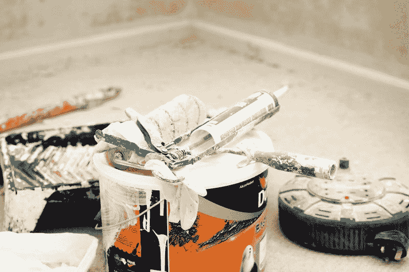
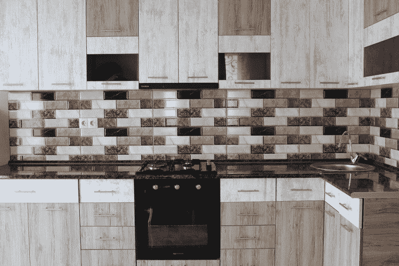

# 劳氏的零售业末日来临了吗？—市场疯人院

> 原文：<https://medium.datadriveninvestor.com/is-the-retail-apocalypse-coming-to-lowes-market-mad-house-566d06005408?source=collection_archive---------3----------------------->

家装商店即将迎来零售末日，劳氏公司将解雇数千名员工。

*华尔街日报*声称劳氏公司将会用 30 个承包商取代数千名组装烧烤架的员工，*今日美国* [报道](https://www.usatoday.com/story/money/2019/08/02/lowes-store-layoffs/1898200001/)。然而，没有证据表明劳氏正在计划裁员。

 [## 算法交易的机器学习|数据驱动的投资者

### 当你的一个朋友在脸书上传你的新海滩照，平台建议给你的脸加上标签，这是…

www.datadriveninvestor.com](https://www.datadriveninvestor.com/2019/01/30/machine-learning-for-stock-market-investing/) 

相反，该公司正在淘汰那些可能对其核心业务贡献甚微的外围员工。解释一下，Lowe 的主要业务是向承包商、家庭和建筑业主出售建筑用品、工具、家具和电器。

剪草机和烤架是昂贵的消费品，劳氏公司以销售为副业。因此，劳氏可以改变其商业模式，脱离消费品。

# 劳氏正在改变其商业模式

劳氏公司正在彻底改变其商业模式。例如，该公司正在更换供应商和自动化商店。

值得注意的是，劳氏正在测试使用机器人检查库存，一段 [**英伟达**](https://marketmadhouse.com/nvidia-is-making-less-money-is-it-still-a-value-investment/) **(纳斯达克股票代码:NVDA)** 视频[揭示了](https://www.nvidia.com/en-us/autonomous-machines/robotics/)。此外，《今日美国》报道称，Lowe 的首席执行官 Marvin Ellison 希望不断检查库存，就像**沃尔玛(纽约证券交易所股票代码:WMT** )在其位于长岛的智能零售实验室[中的先锋](https://marketmadhouse.com/walmarts-ai-customer-surveillance-raises-ethical-questions/)。

劳氏的其他变化包括关闭果园五金供应链和 51 个劳氏的位置。我认为埃里森正试图让劳氏更精简、更吝啬，这样它就能在零售业的末日中生存下来。特别是，埃里森正在努力减少脂肪，所以当亚马逊(纳斯达克股票代码:AMZN) 为它的顾客而来时，劳氏将会更加有利可图。

# 为什么劳氏要改变商业模式？

目前，劳氏面临三个巨大的；但却鲜为人知。

首先，劳氏的主要客户群体美国和加拿大婴儿潮一代正在老化和消亡吗？解释一下，婴儿潮一代是年龄在 54-74 岁的美国人，他们出生于二战后的婴儿潮。Inc indar[估计每天有 4676 名美国婴儿潮一代人死亡。](https://incendar.com/baby_boomer_deathclock.php)

婴儿潮一代的死亡对劳氏来说可能是灾难性的；因为它的目标客户是拥有郊区住宅的 50 到 70 岁的白人。值得注意的是，我估计婴儿潮一代正以每年 170.5 万人的速度死亡。

# Lowe 的顾客可能很快就没钱了

第二，婴儿潮一代很快就会有更少的钱在劳氏消费，因为他们很快就会退休。这可能会伤害劳氏，因为彭博[估计](https://www.bloomberg.com/news/articles/2019-03-26/almost-half-of-older-americans-have-zero-in-retirement-savings) 52%接近退休年龄的美国人(婴儿潮一代)没有退休储蓄。

因此，Lowe 公司一半以上的主要客户可能很快就会除了社会保障之外一无所有。然而，社会保障管理局[估计【2019 年 6 月，65 岁以上老人的平均社保金额为每月 1274 美元。](https://www.ssa.gov/policy/docs/quickfacts/stat_snapshot/)

在这种情况下，更多的老年人会试图卖掉他们的房子来获得额外的现金，而不是继续工作。此外，这些老年人中很少有人会有多余的钱去买劳氏烧烤架或割草机。因此，现在退出这些业务可能是劳氏的明智之举。

# 美国的房屋拥有率正在下降

第三，有证据表明，千禧一代(24 岁至 39 岁)不太可能购买婴儿潮一代留下或出售的房屋。

据城市研究所[计算](https://www.urban.org/urban-wire/state-millennial-homeownership)，2015 年千禧一代的住房拥有率为 32.2%，而婴儿潮一代为 75%。因此，2015 年，不到三分之一的千禧一代拥有住房。这对 Lowe 的[不利，因为](https://www.pewresearch.org/fact-tank/2018/03/01/millennials-overtake-baby-boomers/) Pew 预测千禧一代将在 2019 年成为美国最大的一代，拥有 7300 万成员。

事实上，美国人口普查局估计，美国的住房拥有率在过去一年中略有下降。该局估计，住房自有率从 2018 年第二季度的 64.3%下降到一年后的 64.2%。虽然降幅很小，但这可能是一种趋势。

此外，2018 年 6 月至 2019 年 6 月，新房销售下降了 2%，*《纽约时报》* [估计](https://www.nytimes.com/2019/08/01/business/interest-rates-housing-market.html)。尽管抵押贷款利率很低，但房屋销售还是下降了。美联储利用抵押贷款利率来鼓励购房。值得注意的是，美联储正在降低利率试图增加房屋销售。

鉴于这些现实，Lowes 可能很快就会有更少的客户，其剩余的客户可能会有更少的钱来消费。作为 Lowe 业务支柱的富裕郊区房主可能很快就会成为历史。

# 劳氏如何适应新美国

我认为埃里森了解人口结构的变化，并正在调整 Lowe 的商业模式以适应这些变化。

例如，Lowe's 正在通过关闭 Orchard 和减少其割草机和烤架组装业务来脱离消费者销售。此外，Lowe's 正在通过自动化商店减少对人性化客户服务的依赖。

一种可能的情况是，埃里森要求劳氏公司专注于对承包商和房东的销售。解释一下，美国人不太可能拥有自己的房子，但他们仍然需要一个玩耍的地方。因此，美国将会有更多的租房者和房东。

《纽约时报》指出，相应地，投资者在像亚特兰大这样的市场购买可能出租的房屋。这些投资者将需要改造许多房屋，这可能会帮助劳氏公司。房东或他们的承包商需要供应品，劳氏可以提供这些供应品。

# Lowe 的新零售战略

例如，自动化商店可以更快地将建筑用品和工具运送给承包商。这种自动化商店可以作为为承包商和房东服务的送货卡车车队的履行中心。在这种情况下，劳氏仍然可以服务零售客户，同时扩大其承包商业务以满足需求。

为承包商服务是一个明智的策略，因为在这一领域竞争较少。当它卖给消费者时，劳氏必须直接与沃尔玛和亚马逊竞争。然而，它只在合同市场上与**家得宝(NYSE: HD)** 、五金店和较小的当地公司竞争。

最后，劳氏可以通过专注于承包商营销来降低运营成本。直接销售给在网上或通过电话订购的承包商可能会使劳氏公司削减其商店员工。此外，劳氏可以减少其库存和相关费用。

# 劳氏赚钱了吗？

如此激进的战略转变会让许多投资者怀疑劳氏是否在赚钱。

有趣的是，劳氏公司现在正在赚钱，但即将摆脱四分之一的亏损。具体来说，Lowe's 在 2019 年 5 月 3 日报告的营业收入为 14.17 亿美元，净收入为 10.46 亿美元。与 2019 年 2 月 1 日报告的运营亏损-5.68 亿美元和净亏损-8.24 亿美元相比，这是一个很大的改善。

加上 Lowe 在 2019 年 5 月 3 日报告的 174.1 亿美元的收入，增长率为 2.19%。此外，Lowes 于 2019 年 5 月 3 日报告的毛利为 55.81 亿美元，高于 2019 年 2 月 1 日的 40.37 亿美元。

# 劳氏公司产生的现金减少了

Lowe's 赚的钱越来越多，收入也在增长。我认为这些数字证明了埃里森战略的转变。该公司需要这一战略，因为劳氏公司产生的现金越来越少。

2019 年 5 月 3 日，劳氏公司产生的现金减少，运营现金流为 21.37 亿美元，运营现金流为 19.56 亿美元。然而，这些数字低于 2018 年 5 月 4 日的 34.29 亿美元和 32.10 亿美元。

然而，劳氏公司保留了更多的现金。该公司在 2019 年 5 月 3 日拥有 29.73 亿美元的现金和等价物。此外，Lowe's 在同一天有 1.9 亿美元的短期投资。

因此，劳氏拥有 31.63 亿美元的现金和短期投资，高于 2018 年 5 月的 17.7 亿美元。埃里森的策略是带来更多的现金，劳氏将需要这些现金来对抗亚马逊。

# 劳氏是价值投资吗？

我认为劳氏是一家好公司，因为它的管理层会承担风险，在问题出现之前做出改变。

相反，我们应该等着看住房拥有率和对某些产品的需求是否会下降。埃里森现在正在重新定位劳的专横，以服务于那些可能增长的细分市场。

因此，我认为 **Lowe's (NYSE: LOW)** 在 2019 年 8 月 5 日交易的 96.81 美元是一项价值投资。同时，劳氏也是一个很好的股息股。

# 劳氏公司是一只很好的分红股票

劳氏将于 2019 年 8 月 7 日支付 55₵股息。该股息由 7₵从 2019 年 5 月 8 日支付的 48₵·劳氏公司获得。此外，这是 7₵.第二年提高劳氏公司的股息劳氏公司在 2017 年支付了 41₵股息。

令人惊讶的是，Dividend.com[将 56 年的股息增长归功于劳氏公司。2019 年 8 月 5 日，每股 Lowe's 股票的股息率为 2.27%，年化股息为 2.20 美元，派息率为 42.4%。](https://www.dividend.com/dividend-stocks/services/home-improvement-stores/low-lowes/)

我建议那些寻找能够在零售业末日和美国不断变化的住房拥有模式中幸存下来的高股息股票的人去调查 Lowe's。这家家装巨头在急剧变化的市场中不断赚钱，并支付丰厚的股息。

*原载于 2019 年 8 月 5 日*[*【https://marketmadhouse.com】*](https://marketmadhouse.com/is-the-retail-apocalypse-coming-to-lowes/)*。*