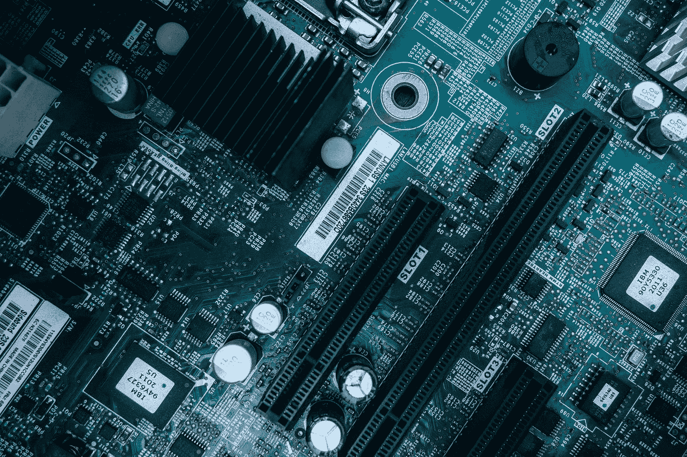

# 技术寿命的缩短是个问题吗？

> 原文：<https://medium.datadriveninvestor.com/is-the-shortening-of-technology-lifespans-a-problem-bf24e6984337?source=collection_archive---------6----------------------->

## 技术寿命不是问题，我们才是。

个人电子产品的寿命变短了吗？

这是一个有趣的问题，我经常在网上评论、博客以及开发者每年发布新产品时听到。

答案是著名的“视情况而定”。

这取决于产品、细分市场和国家。我们都敏锐地意识到(许多人比其他人更清楚)，我们购买的设备是大批量、短生命周期的产品。人们希望每隔一两年就以旧换新手机或平板电脑，这造成了大量浪费。我见过的挑战之一，也是我们都经历过的挑战，是不仅仅是硬件，软件也变得越来越先进。

旧设备的问题是，你的手机可能只有 6 个月，突然有一个软件更新，现在你的手机超级慢，使用起来更加令人沮丧。

所以在手持设备的尖端存在竞争，这是一个方面。

例如，另一个细分市场是儿童玩具，它的发展速度很快，生命周期很短，并且没有得到太多的关注。很多父母会把他们的玩具给别人，所以它的生命周期很短。人们很容易忽略许多儿童玩具中含有对人类和环境有害的电子元件。我们知道继续使用这些产品并把它们扔进垃圾填埋场是不可持续的。回收电子产品变得越来越有价值，除了金、焊料、铜，半导体还有其他用途。

可持续性和价格是相互依存的。

这是最糟糕的消费主义的不好的一面:每六个月就用一部完美的智能手机、平板电脑或其他产品去换一个稍微快一点、稍微薄一点或颜色不同的东西。

我属于那一类。

但是那台旧设备会怎么样呢？最有可能的是，它在房子里呆了几个月之后，被扔进了垃圾箱，然后被扔进了垃圾填埋场。

不是电子产品本身出了问题，而是要求更快更好产品的时尚。因为我们有更多的可支配收入，对大多数人来说，升级的成本相对较小。而且即使是买不起的也签长期合同，方便自己升级。这背后有创新，但无论如何，所有的消费设备最终都会在某个时间点成为废物。

在我看来，如果我们能尽可能多地回收任何给定的设备，当它最终被扔进垃圾箱时，我们可以推得越来越久。

你的手机和你的食物到达超市时使用的一次性塑料没有什么不同，它就像塑料吸管一样，是当今的热门话题。所有的一次性塑料都是废物，有害的，是对资源的浪费。但实际上，我们购买的消费设备是完全一样的，因为它们是一次性使用的，可能会持续几年，但最终都要放在同一个垃圾桶里。

洗衣机和家用电器在某些情况下可以使用十到二十年。我上一台洗碗机用了十五年。就我个人而言，我接受这个事实，与我拥有的其他东西相比，这似乎是一个令人印象深刻的寿命。但是从全球的角度来看，每天有 70 亿人在消费产品，这确实提出了可持续性的问题。对于这个星球来说，15 年甚至不是一眨眼的时间。没什么区别。我们需要变得更好。

在这方面，政府可以通过推动来伸出援手。最近的诺贝尔奖得主迪克·泰勒在他的书《推动》中写道，随后英国卡梅伦政府成立了一个“推动小组”。

价值观会变。

作为国家和消费者，我们越来越关注我们对地球的影响，这创造了新的产业和新的故事。一旦创造了价值，人们理解了价值，态度和行为也会随之改变。当行为改变时，公司也会随之改变。

这包括产品生命周期:它归结为社会的价值观。在消费者层面，包括我自己，当我们决定每年购买一部手机是可以接受的，这就是推动技术发展的价值。

但是当我们退后一步问自己，“这真的可以接受吗，真的有必要吗？”这就是技术开始改变的时候。诚然，这些是第一世界的问题，但它们同样严重，同样真实。

例如，现在为我们的设备供电的电池不再使用来自刚果民主共和国的原材料。这是由于消费者对这个话题的关注，以及用他们的钱包为更符合道德的产品投票。消费者不想卷入不道德的制造，他们也不想卷入不道德的处理只是时间问题。

这就是资本主义和优秀企业运作良好的地方，因为市场决定我们的方向，我们说，如果你不打算以某种方式行事，我们就不会从你那里购买。

尽管它们有所不同，但我们可以看到同样的变化发生在汽车行业，这也是我们希望在个人电子行业看到的。我们看到了关于电动汽车的新对话，它们消耗的能量，它们的寿命。当你买了一辆 70 岁的车，你希望它能工作，同样的事情也发生在电动汽车上，所以我们怎么能有一部能在十年、十五年或二十年内工作的 iPhone 呢？

很难想象，不是吗？

我们是推动改变的人，如果我们想要改变，我们需要在我们购买的东西中表明这一点。这就是商业的目的:创造顾客。

企业通过满足创造顾客。

我们买的东西是满足我们的信号。

你想要改变吗？从你自己开始，看看你在哪里，然后你想去哪里。问问你自己，“我需要一部有 X 处理能力的手机吗？”当你看到它的时候，客观上它真的只是短信和电话，所以我为什么要花这么多钱买一部手机呢？

我不知道，但我知道。