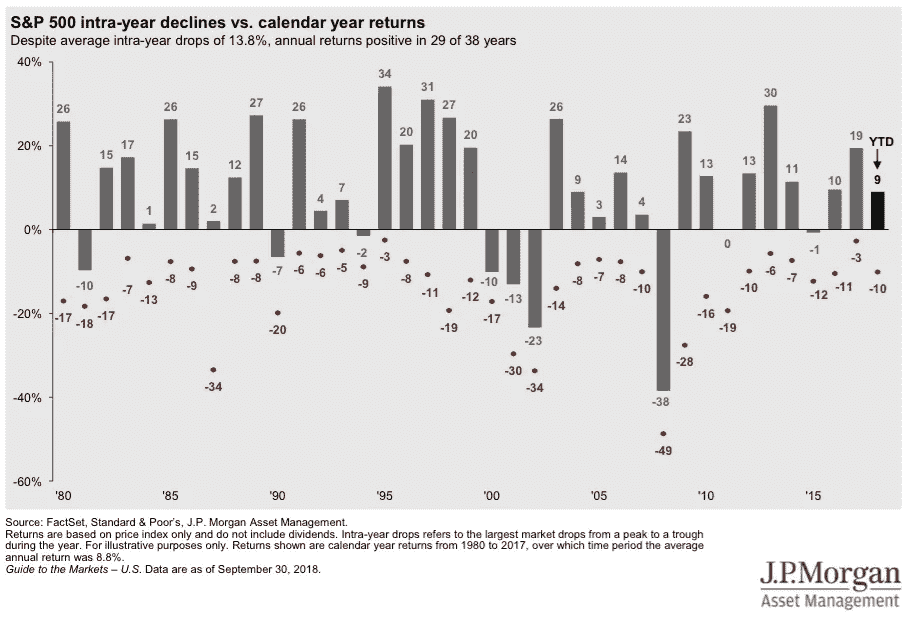

# 股市是经济密语吗？

> 原文：<https://medium.datadriveninvestor.com/is-the-stock-market-an-economy-whisperer-2b0dc3314f22?source=collection_archive---------13----------------------->

通常，当股市成为头条新闻时，你会看到很多关于经济的闲聊。由于这些头条新闻通常出现在市场大幅下跌时，因此伴随的评论往往专注于潜在的衰退。

今年，人们想知道所有这些大惊小怪是为了什么是情有可原的。经济正以多年来最快的速度增长(截至 2018 年第三季度为 3.5%)，失业率处于近五十年来的最低水平。

与此同时，今年股市经历了比 2017 年更多的起伏。然而，去年是一个异常现象，事情在 2018 年已经恢复正常。

这是 JP 摩根优秀的[市场指南书](https://www.jpmorganfunds.com/cm/Satellite?UserFriendlyURL=diguidetomarkets&pagename=jpmfVanityWrapper&vanity=diguidetomarkets#top)中的一个图表，他们每季度出版一次。数据显示，自 1980 年以来，标准普尔 500 指数平均每年下跌近 14%。图表中的红点显示了每年的下跌程度，尽管如此，你可以看到该指数在 38 年中有 29 年实现了正回报。

Annual returns and intra-year declines for the S&P 500 index since 1980\. Source: [JP Morgan Guide to Markets](https://am.jpmorgan.com/us/en/asset-management/gim/adv/insights/guide-to-the-markets/viewer).

著名经济学家保罗·萨缪尔森曾经说过:

> 在过去的五次衰退中，有九次是由股市引发的。

自 20 世纪 20 年代以来，已经出现了 10 次*熊市。*当股票下跌至少 20%时，就出现了*熊市*，即大幅下跌，而不是你年复一年看到的典型下跌。多想想 2000 年和 2008 年的股市崩盘。

在这十次熊市中，有八次发生在衰退期间。因此，即使是数据也表明存在联系。

如果你仔细想想，股票市场应该能告诉你一些关于经济的信息。毕竟，股价本质上反映了公司未来的发展状况。如果“集体智慧”认为利润在走下坡路，那就有理由认为经济疲软(或经济衰退)是原因。当然，投资者可能是错的，过去也曾经是错的。

Ritholtz Wealth Management 的首席执行官和《改革宗经纪人》博客的作者 Josh Brown 最近在 NPR 的《金钱星球》上对股票和经济做了一个很好的类比。直接引用[文字记录](https://www.npr.org/templates/transcript/transcript.php?storyId=670171543):

> 布朗:我现在要给你一个我最喜欢的类比。一个女人正穿过中央公园，她带着一只狗。什么是非常活跃的狗？
> 
> 瓦内克·史密斯:哦，就像杰克·罗素梗或者类似的东西？
> 
> 布朗:好的。杰克罗素梗很棒。如果你只是看着她，她在做什么？她在走正常的路。她在走直线。你知道，她正以适中的速度直立行走——没什么特别令人兴奋的。然后让你的眼睛向下看一点。看那只狗。这只狗快疯了。它在追鸟。它在挖掘泥块。它朝树跑去。它在到处撒尿。狗就是股市。女人就是经济。你知道，狗在追蝴蝶，然后它在嗅自己。所以，如果你只是在看狗，你就没有在看经济。你看到的是亿万人的贪婪和恐惧在买卖中的体现。但是你没有看到经济运行的真实表现。所以重要的是要明白，是的，股市引领经济，在某种程度上，反映经济…
> 
> 瓦内克·史密斯:是的，它们是联系在一起的，就像狗和…
> 
> 布朗:是的，狗会沿着那个女人遛狗的方向走。所以经济和狗——或者说经济和股票市场在某种程度上是联系在一起的。但是它们看起来不一样。即使他们朝同一个方向走，他们的行为也不一样。

正如 NPR 主持人 Stacey Vanek SMith 在这一集的最后所说的，我们都应该试着关注这个冷静的遛狗女人。让我们的视线远离有时像歌剧一样的狗。