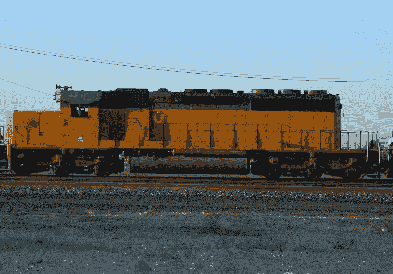
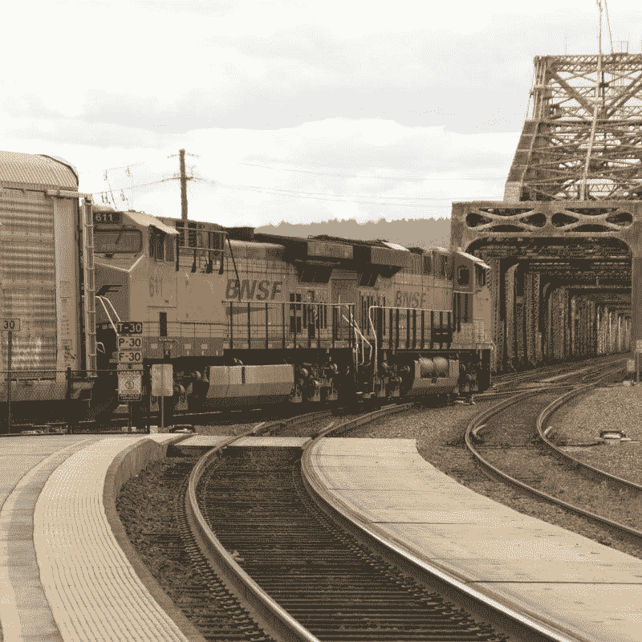
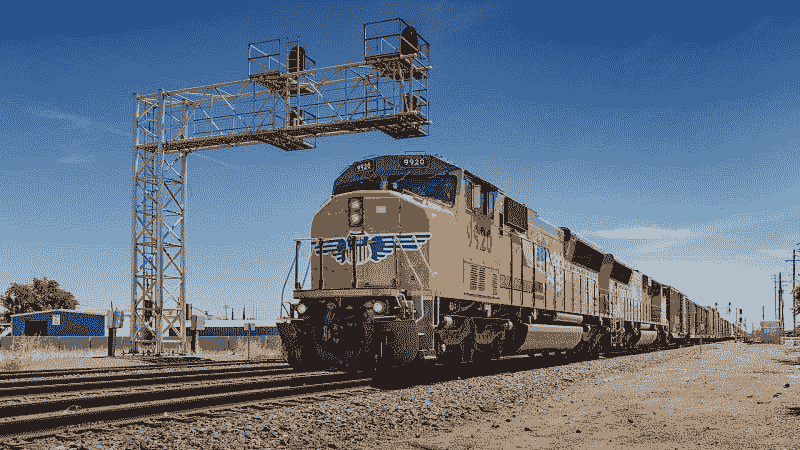
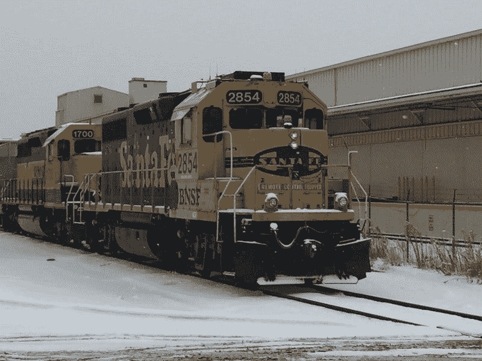
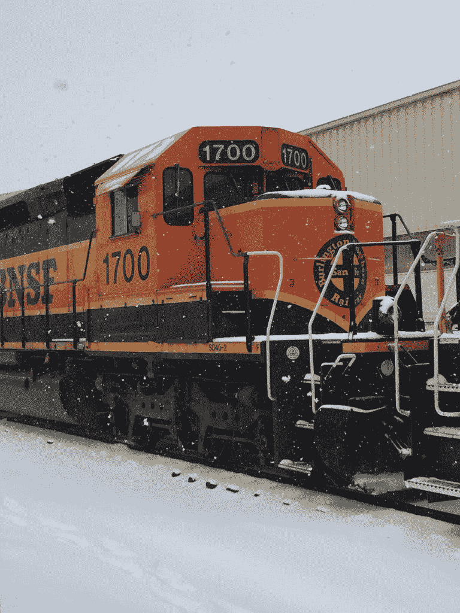

# 联合太平洋有麻烦了吗？—市场疯人院

> 原文：<https://medium.datadriveninvestor.com/is-the-union-pacific-in-trouble-market-mad-house-446a094ac343?source=collection_archive---------4----------------------->

许多投资者都在问联合太平洋公司是否陷入困境，因为这家古老的铁路公司正在裁员。

例如，**联合太平洋(NYSE: UNP)** 计划在俄勒冈州的赫米斯顿裁员 195 人，*俄勒冈州* [透露](https://www.oregonlive.com/business/2019/05/union-pacific-will-lay-off-nearly-200-in-hermiston.html)。赫米斯顿铁路站场将会裁员。那些失去工作的人将包括“机械师；电工、扳道工、材料搬运工和普通工人，”*俄勒冈人*补充道。

 [## 在自动驾驶汽车发生事故的情况下，谁应该承担法律责任？-数据驱动型投资者

### 我仍然认为自动驾驶汽车是一种奢侈品，而不是必需品…

www.datadriveninvestor.com](https://www.datadriveninvestor.com/2018/11/02/who-is-legally-accountable-in-the-case-of-an-autonomous-vehicle-accident/) 

此外，联合太平洋；或将关闭赫米斯顿铁路站场以削减成本。很明显，一份 UP 新闻稿包含了委婉语；"努力运营一条高效的铁路。"因此，我认为联合太平洋公司正在削减成本以避免亏损。

# 联合太平洋在亏损吗？

联合太平洋在亏损吗？

联合太平洋公司正在赚钱，但其收入正在萎缩，收入增长正在放缓。

特别是，UP 报告 2019 年 3 月 31 日的负收入增长率为-1.66%。与此同时，收入从 2018 年 12 月 31 日的 57.57 亿美元降至 2019 年 3 月 31 日的 53.84 亿美元。

联合太平洋仍在赚钱，3 月底的毛利为 40.19 亿美元。然而，这一毛利低于 12 月份的 42.66 亿美元。另一方面，毛利比 2018 年 3 月的 40.21 亿美元略有增长。

# 联合太平洋公司赚钱了吗？

美国最古老的洲际铁路仍在盈利。UP 报告 2019 年第一季度的营业收入为 19.6 亿美元，净收入为 13.91 亿美元。然而，这些数字低于 2018 年 12 月的 20.16 亿美元和 15.54 亿美元。

联合太平洋公司的现金流也在下降；上一次运营现金流为 19.59 亿美元；低于 2019 年除夕的 23.12 亿美元。此外，最后的自由现金流为 12.07 亿美元，低于三个月前的 13.03 亿美元。

因此，UP 在银行有 10.59 亿美元的现金和等价物以及 6000 万美元的短期投资。这总计增加了 11.19 亿美元的额外现金。

联合太平洋正在赚钱，但不足以证明 2019 年 5 月 29 日 168.73 美元的股价。我认为在这种情况下，联合太平洋的股价会下跌。

# 联合太平洋是好股票吗？

UP 是一只很好的股息股票，将于 2019 年 6 月 28 日向股东 88₵支付股息。2019 年，8₵的派息从 2018 年 12 月 28 日的 80₵开始增长。

此外，UP 的股息为投资者提供 2.09%的股息收益率，3.52 美元的年化支付，2019 年 5 月 29 日的支付率为 45.3%。另外，Dividend.com 指出，联合太平洋公司在过去的九年里支付了股息。

总之，我认为联合太平洋公司是一只不错的股息股，但基础并不牢固。我认为，由于危险的新竞争，联合太平洋面临严重的收入损失。

# 机器人卡车如何威胁联合太平洋

有趣的是，我认为对铁路最大的威胁是机器人或自动驾驶卡车。

机器人卡车威胁着铁路，因为它们提供了火车的许多优势，而无需维护昂贵的基础设施。具体来说，像火车这样的机器人卡车减少了对司机的需求。

理论上，机器人卡车可以在更少司机的情况下长距离行驶。无人驾驶卡车可以在没有司机的情况下在州际公路上的城市之间行驶。然而，司机可以在城市外登上卡车，把它带到最终目的地。

# 虚拟现实如何威胁联合太平洋

如果司机可以通过遥控操作大型钻机，卡车运输公司将会节省更多的成本。为了解释，我认为司机可以使用虚拟现实(VR)设备，如 [Oculus Quest](https://variety.com/2019/digital/news/oculus-quest-guardian-system-mixed-reality-1203223870/) 来“看到”卡车传感器看到的东西。

因此，一个司机可以从他在密歇根的娱乐室里开着半拖车去拉斯维加斯送货。在这种情况下，一个虚拟现实的“司机”可以监管几个大型钻井平台。

值得注意的是，初创公司 [Aitheon](https://www.aitheon.com) 正试图为其称为 Aitheon Pilots 的远程机器和车辆运营商建立一个区块链市场。Aitheon 飞行员将通过遥控操作机械和电动车。Aitheon 的管理层希望飞行员将他们的服务出售给车主，换取加密货币或稳定货币。

# 无人驾驶卡车现在正在高速公路上行驶

自动驾驶卡车现在正在美国的高速公路上长途行驶。

无人驾驶大型钻机正在凤凰城和达拉斯的美国邮政署​(USPS)配送中心之间进行试运行， *CDL 生活新闻* [报道](https://cdllife.com/2019/usps-tries-out-robot-trucks-to-replace-team-truckers/)。每辆卡车运送邮件的时间超过 20 小时。

无人驾驶卡车独角兽 TuSimple 负责自主大型钻机。值得注意的是， *CDL 生活新闻*指出，美国邮政总局希望用机器人钻机取代车队卡车司机。TuSimple 显然在测试中使用了 Freightliner。*福布斯* [声称](https://marketmadhouse.com/is-the-union-pacific-in-trouble/#1e7dcddf1af4)图森未来筹集了 1.78 亿美元来开发其自主 semis。

几家公司；包括**戴姆勒股份公司**都在开发自主钻机。戴姆勒的 Freightliner [卡斯卡迪亚](https://www.theverge.com/2019/1/11/18174275/daimler-tesla-self-driving-trucks-tusimple-ces-2019)有一些基本的自动驾驶能力，*福布斯*注解[。其他值得注意的无人驾驶 semi 计划包括 **Telsa Motors(纳斯达克股票代码:TSLA)** Semi 和 **Alphabet(纳斯达克股票代码:谷歌)**](https://marketmadhouse.com/is-the-union-pacific-in-trouble/#5e72d7a32b4f) [Waymo](https://www.thestreet.com/investing/stocks/alphabet-waymo-semi-trucks-coming-14804227) 子公司的实验。

# 无人驾驶卡车会让铁路倒闭吗？

我认为无人驾驶半挂卡车可能会降低货运成本，从而威胁到铁路。目前，劳动力是长途货运的最高成本。

据 ZipRecruiter [计算，长途卡车司机的全国平均年薪为 69，134 美元，其中一些人的年薪高达 105，000 美元。相反，美国 2019 年的平均工资中位数为 47060 美元，*余额*](https://www.ziprecruiter.com/Salaries/Long-Haul-Truck-Driver-Salary) [估计](https://www.thebalancecareers.com/average-salary-information-for-us-workers-2060808)。

消除；或者更低，卡车司机和运营商的数量可以让更多的半挂车上路，运输更多的货物。理想情况下，公司可以用一台钻机，由一名司机带领几辆卡车组成车队。因此，卡车“列车”可以直接与铁路竞争。

卡车运输公司的运营成本将会降低，因为纳税人提供了他们的基础设施；高速公路。与此同时，美国铁路是私人企业，付费维护铁轨。

# 为什么无人驾驶卡车来得这么快

卡车司机可以通过[电动大型钻机](https://www.cnbc.com/2018/10/22/truck-makers-rev-up-for-rollout-of-electric-big-rigs.html)实现更大的节约和更高的效率。理论上，电动钻机可以提供更低的燃料成本，需要更少的维护。

由于卡车司机短缺，企业有强烈的动机采用无人驾驶半挂卡车。*卡车司机工资* [声称](https://www.truckdriverssalary.com/us-truck-driver-shortage-stats/)到 2026 年，由于糟糕的工作条件和老龄化的劳动力，美国可能会缺少 175，000 名卡车司机。目前，美国大约有 70，000 个卡车司机职位空缺。

显然，卡车司机短缺导致工资上涨；让运营商更有动力去无人驾驶。然而，公众的强烈反对可能会让自动驾驶设备远离高速公路。我的猜测是对技术失业和高速公路上的机器人杀手卡车的歇斯底里，这可能会使机器人钻机远离道路。

# 联合太平洋能活下来吗？

在这种情况下，联合太平洋将很难生存。值得注意的是，联合包裹最大的竞争对手伯灵顿北方圣达菲(BNSF)是伯克希尔哈撒韦公司(纽约证券交易所代码:BRK)的一部分。因此，BNSF 背后有沃伦·巴菲特的资源支持。

市场变化的一个结果可能是 UP 合并或出售自己。合乎逻辑的合并可能是与加拿大国家铁路公司的合并。巴菲特的好朋友比尔盖茨是 CN 的部分所有者，因此合并可以放弃新的资源。

与 CN 合并；或者像 CSX****(纽约证券交易所:CSX)** 这样的东海岸铁路，将会放弃一个真正的跨洲系统。从东海岸到西海岸可以让联合太平洋更有效率和竞争力。**

# **Hyperloop Jump 会启动联合太平洋吗？**

**[Hyperloop](https://marketmadhouse.com/hyperloop-replace-air-freight/) 技术；这种比传统铁路运输速度更快、成本更低的运输方式提供了一种更吸引人的可能性。令人质疑的是，Hyperloop TT [声称](https://www.hyperloop.global/how-it-works)其系统可以以每小时 1223 公里(759.937 英里)的速度每天运送 4000 批货物。**

**Hyperloop 是 UP 的一个机会，因为联合太平洋的铁路线将是合乎逻辑的 Hyperloop 路线。不幸的是，Hyperloop 仍然在绘图板上。我建议投资者现在远离**联合太平洋(纽约证券交易所代码:UNP)** ，因为我认为它的股价很快就会暴跌。**

***原载于 2019 年 5 月 29 日*[*https://marketmadhouse.com*](https://marketmadhouse.com/is-the-union-pacific-in-trouble/)*。***