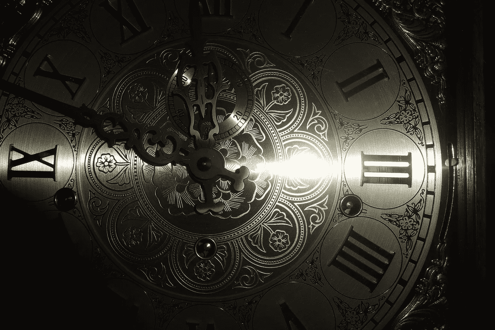

# 世界变好了吗？

> 原文：<https://medium.datadriveninvestor.com/is-the-world-getting-better-5396c4941287?source=collection_archive---------41----------------------->

Photo by [Brooke Campbell](https://unsplash.com/photos/Rw2-Y0nSIKQ?utm_source=unsplash&utm_medium=referral&utm_content=creditCopyText) on [Unsplash](https://unsplash.com/search/photos/midnight-clock?utm_source=unsplash&utm_medium=referral&utm_content=creditCopyText)

今天早上，我看了的帖子[世界正在变得更好，实际上是](https://medium.com/datadriveninvestor/the-world-is-getting-better-actually-f9dc7402d01e)。虽然这是一本好书，我也不反对它的主要观点，但是在这里多一点上下文是有好处的。

Ologunde 的帖子的主要观点是，与最近的数据所显示的相反，现在的世界比过去更好。这种说法的理由是更高的预期寿命、更低的谋杀率、更低的贫困率、更高的受教育率、更多的闲暇时间和更高的可支配收入。虽然我(显然)认为这些是非常好的趋势，但我认为还有更多。

以《原子科学家公报》维护的[末日钟](https://en.wikipedia.org/wiki/Doomsday_Clock)为例。这个隐喻的时钟象征着人为全球灾难的可能性。它的工作非常简单。午夜代表着一场人为的全球性灾难，时钟越接近午夜，世界就越接近这样的灾难。当末日钟在 1947 年被创造出来时，它被设定为离午夜还有 7 分钟。1991 年，差 17 分钟就午夜了。现在，是两点钟。离午夜还有两分钟。如果《原子科学家公报》是正确的，那么我们现在比 1947 年更接近一场灾难。即使在 1949 年，当美国和苏联之间的核军备竞赛开始时，时钟被设置为“只”差 3 分钟到午夜。然而，应该注意的是，末日时钟自 2007 年以来才开始反映气候变化的危险，因此将 2018 年与 1949 年进行比较有点棘手。然而，即使自 2007 年以来，时钟已经向前净前进了三分钟。

为什么 2018 年的时钟被设置为差两分钟到午夜？因为公报认为，世界领导人未能应对核战争和气候变化的威胁。这里要认识到的重要一点是，尽管冷战早已结束，但自 1947 年以来，全球灾难的威胁并没有下降，而是上升了(除非你不同意这份公报)。

另一个例子是恐怖袭击死亡人数的上升。自 1970 年以来，这一数字大幅增长。除了死亡，恐怖主义还有另一个不同于谋杀的影响:它传播恐惧。因此，在判断世界是否正在变得更好时，不能忽视恐怖主义。

用这个帖子来诱导恐惧，或者说世界变得更糟，绝对不是我的本意。我认为世界正在变得越来越好。我的目标只是为 Ologunde 的原始帖子提供更多的背景，并表明并非所有趋势都在变好。