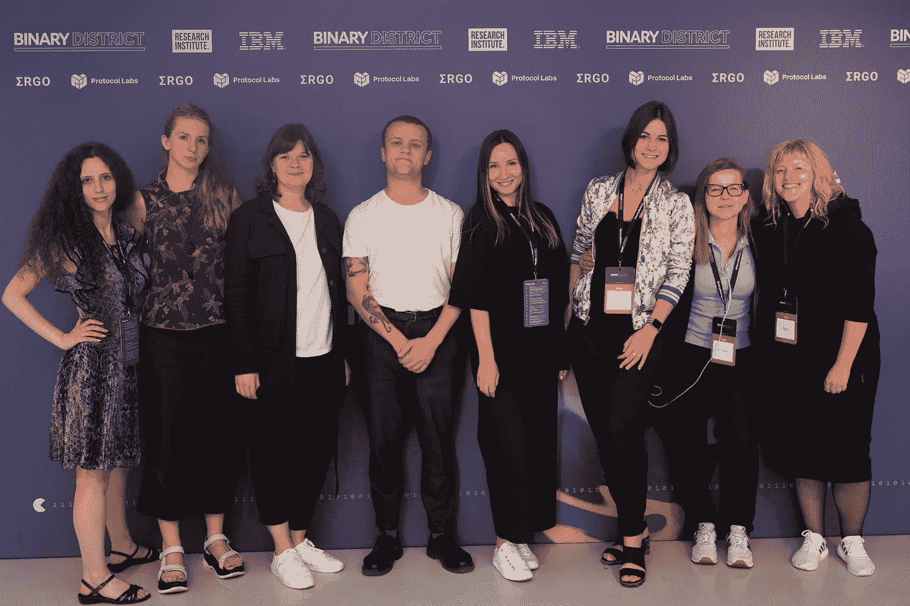

# 有没有更好的联网方式？建立一个合作的技术社区。

> 原文：<https://medium.datadriveninvestor.com/is-there-a-better-way-to-network-building-a-collaborative-tech-community-9cb52b9b8c13?source=collection_archive---------41----------------------->

我们都在努力寻找那些在专业上对我们有用、有共同兴趣的人。他们说不是你知道什么，而是你认识谁，而是你认识多少人？

专业活动就像速配，对某些人来说很棒，但对那些想要更深入交流的人来说就不太好了。

每当我在会议上交流时，似乎都有一个标准的格式:

x:“嗨，我是 x”

y:“嗨，我是 y”

x:“你是做什么的？”

y:“我在*此处插入公司名称*工作”

x:“享受？”

y:“它支付账单”

x:“有卡/LinkedIn？”

y:“是的，我知道，很高兴和你说话！”

你只能说很多次你的头衔和工作地点，而不会觉得你在土拨鼠日。你经常很难听到或被别人听到别人的谈话。这导致了表面的谈话，实际上没有任何进展。当你对自己的工作充满热情时，这可能会有点令人不快。

尽管有时人们不愿意请别人讲述细节，特别是在技术领域，但高度技术性的东西值得更深入的探索。能够讨论你正在做的事情可以打破僵局，这是仅仅交流社交细节所不能做到的。人际关系网的“顶级王牌”方面通过实际讨论人们正在开发什么项目并了解他们如何处理问题来对抗。

从根本上说，我们需要没有太多背景噪音的活动、美味的食物、美酒，最重要的是有机会进行交谈，不仅可以促进大量的关系，还可以促进有意义的关系。

这并不是说快速约会式的社交没有它的位置，但是只参加这些活动就像在生活中只吃开胃菜一样。它们在短期内满足了你，但它们的最终目的是激起你更多的欲望。人们不仅仅是他们的第一印象，仅仅以此来评判他们是不公平的。不同意猫王的观点，请少一点行动，多一点对话。

我的公司 Binary District 涵盖了新兴技术的每个领域，无论是区块链、人工智能、增强现实、虚拟现实、网络安全还是生物技术，人们在所有这些领域发表观点的速度之快令人大开眼界。在一个偏爱有自我推销天赋的人的社会里，许多人在不了解实际情况的情况下，很快就对科技发表了自己的看法。当一切都很新，人们努力跟上技术变化的步伐时，声音最大的人会比最聪明的人得到更多的关注。这不是进步的最佳方式，我非常期待人们有信心、时间和空间来分享他们的激情。

我们的座右铭是“没有炒作，只有事实”，这同样适用于我们选择的演讲者和我们选择创造的氛围。

Primalbase 将于 10 月 4 日开放，请务必在此回复。

如果你找不到我本人，你可以在推特上看到我，所以请随意联系。