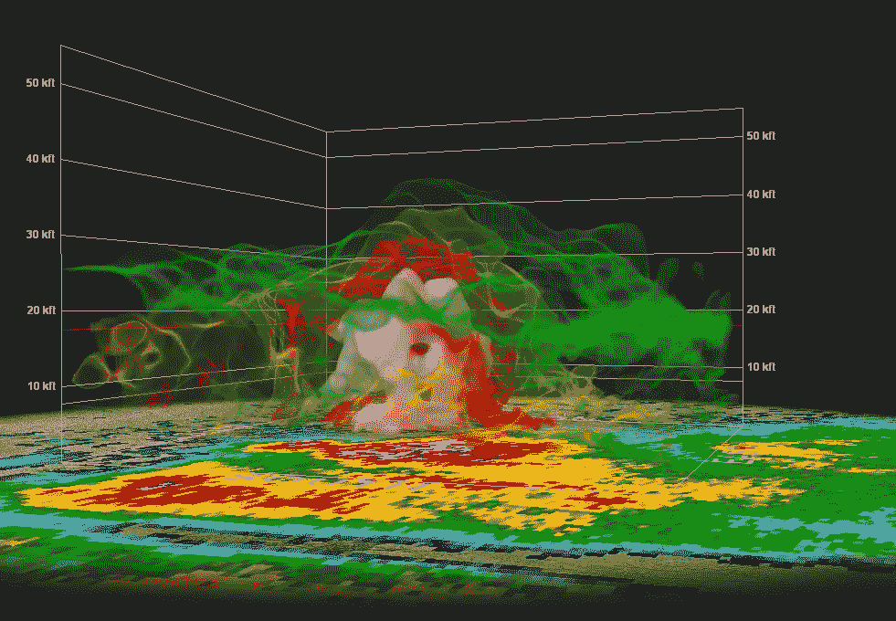

# “气候变化讲座”还有希望吗？

> 原文：<https://medium.datadriveninvestor.com/is-there-any-hope-in-that-climate-change-lecture-e7c7df93a491?source=collection_archive---------13----------------------->

不。我问我搭档的时候她是这么说的。但对于富有同情心、乐观的教育者来说，这个答案通常并不令人满意(公平地说，我的伙伴也是其中之一)。是否有一线希望，潜在的解决方案，任何希望？如果不是，那么这个演讲就像是在绕着厄运和黑暗的阴沟转圈，从阿伦尼乌斯和阿尔·戈尔的《T2》的《难以忽视的真相》开始，这个故事就被反复讲述。据我们所知，从小学开始，学生们可能就做噩梦，梦见他们的地球正在变得越来越大却越来越小。在我年轻的时候，我把卡车在洗衣板路上开过来的声音误认为是*原子弹*即将到来的世界末日的声音，所以我知道这种恐惧。但还是有希望的。

A dramatic image of a thunderstorm over Arizona from [@NWSTucson](https://twitter.com/NWSTucson)

对于气候变化科学，通常很难弄清楚学生们已经知道了什么，或者愿意承认他们知道什么。他们都看过曲棍球棒图，但很少有人知道为什么它会在一年内振荡(北半球的陆地面积更大)。保持它的趣味性和新鲜感可能很难(还记得阿尔·戈尔在舞台上的摘樱桃人吗？—真希望我也有一个。如果你曾经想告诉你的学生，讲座并不完全是悲观绝望的，这里有一些话题可能会有所帮助。这些都可能吸引不同的学生群体。

1.  微生物很可能会存活下来。真正消灭地球上的生命不太可能。我们可以将目前改变地球气候的实验视为实验进化的下一次重大尝试。一百万年后，我们将会看到史蒂芬·杰·古尔德关于*回放时间带*不可能有同样结果的说法是否正确。同样，即使是亚历山大·冯·亨博尔特也知道热带地区有更多的物种。一个更温暖的世界可能会有更多不同的微生物，在经历了动物的急剧多样性平静期后。小心处理这个问题，但是科幻片可能会一直伴随着你。
2.  告诉反叛者大人们在撒谎，以此来取悦他们。只要看看最近的 IPCC 报告，就能发现被戏谑为潜在气候变化缓解措施的近乎虚假的说法。碳中和碳捕获而没有进一步的土地利用转换是目前的永动机。我们已经有了光合作用的最佳选择，但根本没有足够的土地面积、时间或有效的方法来储存碳，使其远离微生物，微生物将——生存、呼吸，并将二氧化碳释放到大气中。(公平地说，最新报告最重要的发现是利率的重新校准——这比他们预测的要快)。
3.  像阿奇连环漫画中的 Jughead 这样的学生，他们不介意空着他们的老爷车，因为*事情似乎总是会解决*和*生活是关于旅程*可能会喜欢这样的论点，即人类对于*技术生态位扩展*(蒂姆·怀特在描述为什么人类*没有*经历适应性辐射时使用的一个短语——我们胜过了其他人——例如尼安德特人，等等)。).你的学生中会有数量惊人的人属于这一类。他们倾向于饮用藻类生物反应器永动机。或者希望埃隆·马斯克能想出办法。如果有必要，他们甚至愿意搬到火星的真空地带。没有什么能削弱他们的乐观，所以为什么不考虑所有的想法。我会提醒这些学生，在 20 世纪有一段时间，有一种观点认为有一类问题没有技术解决方案。那时，他们得出结论，草原上已经没有足够的空间给绵羊了。但这可能是道听途说。有可能，也有可能。(讽刺对你的几个聪明人有用)。
4.  吸引了解 RadioLab 和 Freakanomics 的播客爱好者。在那里，他们可能已经听说过理查德·塞勒和丹尼尔·卡内曼，以及行为经济学的承诺。也许就连尼克·斯特恩也感叹说*气候变化是世界上有史以来最大的市场失灵*。他们对人类经济、社会和心理学的见解可以为如何实现必要的二氧化碳减排奠定基础。如果他们需要证书，指出提到的三个电台名人中的两个已经获得了诺贝尔奖(他们实际上是经济学家)。
5.  你的很多学生都是海龟。他们对自己想要看到的变化感到无能为力，并且足够聪明地知道他们的环保选择不太可能解决气候问题。他们知道政府或理性的社会可以做得更多。对于这些学生，埃莉诺·奥斯特罗姆(Eleanor Ostrum)的多中心治理思想为她赢得了几年前的诺贝尔经济学奖。她的研究表明，这种治理模式是人类过去甚至今天解决公共资源问题的方式。如果我们能够改变我们对二氧化碳的估价方式，并实施市场机制，迫使每个人都以同样的方式估价，我们也许能够找到一种方法来改变我们对大气是一个无限垃圾场的看法。将行为经济学与多中心治理体系相结合是真正的希望所在。向你的班级展示这些的一些细节是值得的。
6.  你的一些学生很实际。跟他们谈保险和养老金。永远不会太早。为了说明行为经济学的优势，告诉他们关于保险和养老金支付的*选择退出*条款的常见做法。理性的人类很少*选择退出这些程序。研究表明，同样理性的人不太可能自愿加入，但如果他们不自愿加入，而不去选择退出，他们会受益。完成这个与气候危机的类比——考虑一个垃圾场。每个人都有。提醒他们*没有扔东西的‘离开’(*巴里布衣的说法)。还要提醒他们，他们可能真的不知道，当他们去垃圾场时，在那里存放东西是要花钱的。同样，人们应该为在大气中储存二氧化碳付出代价。想象一下，如果在大气中储存哪怕一盎司的二氧化碳都有计算和假设的成本。可能会有自由意志主义者决定退出这些强制性付费，但是在一个理想化的多中心政治体系中，社会力量会迫使他们付费。最有可能的情况是，地方机构参与制定规则，并且有合理和透明的执行手段。这可能是碳乌托邦。*

总之，我在聪明的经济和政治体系中看到了应对气候危机的希望。我相信生命会存活下来。但人类是否会成功，取决于我们能在多大程度上通过软技术来设计新的经济和政治体系，以确保我们的优势持续存在。正如我认识的一些科学家在一本新书中哀叹的那样，*把二氧化碳科学搞对了还不够。艾尔。2011).所以，冒险一试吧。谈论经济和政治。或许还有一些希望。*