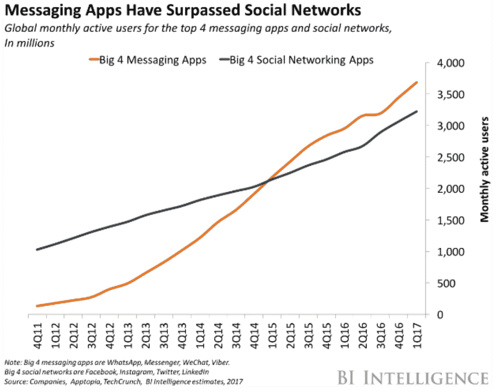
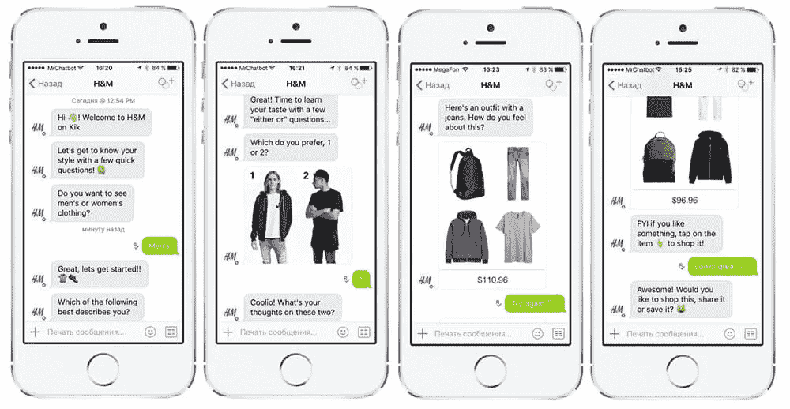
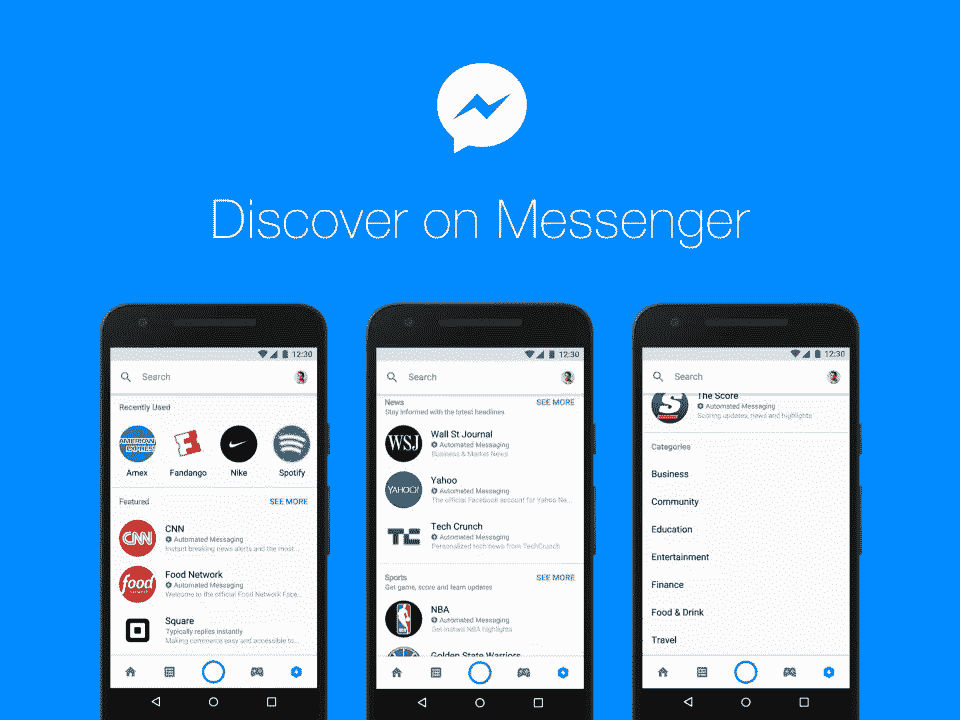
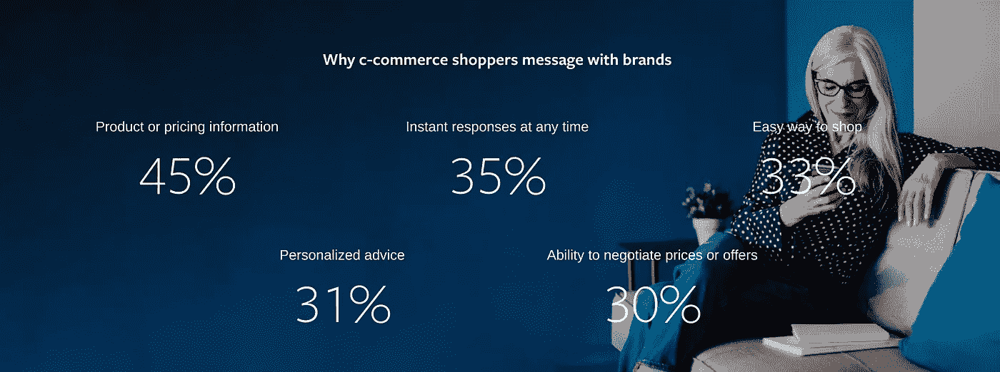

# 这终于是“对话商务”的时代了吗？

> 原文：<https://medium.datadriveninvestor.com/is-this-finally-the-age-of-conversational-commerce-990d8f1da6dd?source=collection_archive---------1----------------------->

## 但愿脸书地平线不是未来。

## “会话式商务”是一个乏味的名字，不是吗？

它很模糊，但当你理解它的内涵时，也令人失望。

它剥夺了对话和购物的乐趣。

但这些名字不是我编的；反正还没有。我一直在玩 Con-Com，虽然那可能是一个漫画事件。

所以，谢谢点击。

有 jazzier 文章标题在那里，你给了这个一个机会。

现在你来了，系好安全带，听听我的见解。因为尽管这个名字并不吸引人，但是在电子商务的保护伞下却存在着许多吸引人的话题。

我们先来看看对话式商务到底意味着什么，以及为什么它会或不会在不久的将来起飞。

然后，我们将继续关注来自亚马逊、苹果和脸书的最新电子商务新闻，特别关注后者。

本周，脸书发布了一份关于电子商务的新报告，并宣布了社交网络的虚拟现实版本脸书地平线。时机不太可能是意外。

# 这场讨论的核心是两个关键问题:

*   在这么多轮炒作之后，为什么人们现在可能会从事电子商务呢？
*   公司如何扮演助手而不是刺激物的角色？

## 让我们来看看。

还记得以前短信营销的糟糕日子吗？公司会向任何有手机的人发送包含报价代码之类的大量信息。他们中的一些人仍然这样做。

潜在的理由是足够合理的。

短信便宜、快捷、易懂。如果写得有点想象力，它可能会激起一个小但重要的少数人的注意。

如果客户没有参与到信息中，损失也不大。比起具体的信息，我更讨厌媒介。

在 SMS 活动的执行过程中，该技术的局限性暴露无遗。它从来就不是用来交谈的；责任总是在于传达信息。

其中一些限制将在 2019 年降低，这让人们乐观地认为，我们正在进入对话式商业时代。

对话式商务是许多技术发展的核心:

*   数字助手:智能家居设备和软件(如谷歌助手)的流行已经使与技术对话的想法正常化。
*   **自然语言处理:**这项技术不仅更擅长理解我们说的话，也更擅长理解我们的意思。
*   **人工智能语言生成:**一些聊天机器人可以在不求助于有限的、基于规则的系统的情况下做出反应。
*   智能手机的采用:智能手机是许多全球用户将会接触到的第一个支持互联网的设备。到 2021 年，智能手机用户将增加 5 亿，设备总数将达到 38 亿。
*   **更便宜的移动数据:**印度现在有最便宜的移动数据，这意味着在这个增长最快的市场之一，永远在线的数字通信更容易实现。
*   **更好的数据管理:**公司开始以一种简化购物的方式组织和处理客户数据。最好的助手在后台操作；公司通过有效利用他们的数据来做到这一点。
*   **Messenger apps:** 仅在脸书产品上，每天就有 1000 亿条消息。在闲聊中，一些品牌信息会被大多数人接受。

这一切创造了一个环境，在这个环境中，公司可以潜在地个性化他们的信息，与他们的受众建立联系，并简化购物体验。

直觉上，这对购物者和卖家以及中介都有意义。

例如,《金融时报》报道称,“苹果公司正在提示那些试图给博柏利、希尔顿和威瑞森等公司打电话的 iPhones 用户,”转而开始商务聊天，这样你就可以通过短信与商家互动，而不是等待。""

本周，亚马逊宣布了一整份简讯价值的声控产品，包括一个烤箱、一些眼镜和一个可怕的戒指。这里 可以看到完整名单 [**。**](https://www.cnet.com/news/amazon-event-2019-echo-buds-echo-frames-alexa-privacy-updates-echo-studio-and-everything-announced/)

这是一种高压手段，但可能会奏效。

毕竟，人们需要帮助来找到合适的产品，就像他们在网下购物时一样。

然而，在数字世界中，电子商务网站的“无尽货架”使整个购物企业在坚持中努力。

连接的对话设备可以接收我们语言中的信号，从而影响我们接受的服务。

亚马逊甚至 [**想让 Alexa 从我们的语气中推断出我们的挫败感**](https://www.fastcompany.com/90409535/little-by-little-amazon-is-giving-alexa-more-ai-smarts) ，这只是他们想了解我们的开始。(一个代表高科技。在不久的将来。)

所有这些都可以在许多重要方面改变典型的网上购物之旅。

# 人们如何使用对话式商务

显然，54%的人已经放弃了某个网站，因为很难找到合适的产品。大多数人(71%)会转向更容易找到和选择合适产品的竞争对手。

对话式商务应该关注是什么让对话成为我们生活中如此重要的一部分。

特别是，他们需要倾听并以加分的方式回应。我们不太可能因为认为一家公司是我们的朋友而想与之聊天，所以这种交流总是有效的。

如果人们真的开始像朋友一样和品牌聊天，我会攒钱买一张去月球的票。这个星球不再是我的家。

我们有自己的先入之见，认为年轻的“消费者”(或者人们，如果你喜欢的话)更有可能接触任何新事物。

然而，消息界面是智能手机时代的主页。

通常，我们甚至不解锁来阅读它们；它们就在那里，在我们的手机上，笔记本电脑屏幕上，或者手表的脸上。有些人总是有话要说，他们想在短信里说。

> “直觉会告诉我们，千禧一代最喜欢我们的短信服务，但我会告诉你，我们的核心客户与可能更懂技术的年轻群体一样投入。”
> 
> —托里·福布斯-罗伯茨
> 达美航空公司

这适用于所有的人口统计，而且看起来不太可能改变。

随着世界各地越来越多的人上网，他们接触到了 Facebook Messenger 和 WhatsApp 等数据精简通讯应用。

公司现在也可以通过消息应用程序利用更先进、更有趣的创意格式。

这开启了一系列有益于用户的用例。他们可以根据自己的条件获得即时响应，甚至可以根据自己的具体需求协商价格。

简而言之，对话式商务可以减少我们的大脑总是热衷于避免的摩擦。

然而，其他挑战依然存在。

# 为什么我们不能有好东西

公司有滥用这种工具的历史，坦白地说，会毁了所有人。

他们打着“改善客户体验”的幌子这样做，没有意识到或不关心世界上每一家类似的公司都在类似的房间，穿着类似的衣服说着类似的话。

> **这是一个绝好的机会，在客户说不之前，我们会一直抓住这个机会。**

当然，博柏利会将电子商务视为一个“大赌注”，但普拉达、芬迪、古驰和迪奥也会如此。

这些受众列表不仅会相互重叠，还会与成千上万的其他人重叠。

加上杂货或家居用品等其他零售垂直行业，同一客户可能会收到来自品牌的大量信息，所有这些信息都旨在“改善客户体验”。

我经常被这种会议中出现的自私自利的逻辑谬误所触动。

是的，你的观众可能会在网上传递很多信息。他们可能会关注你公司的 Twitter 账户，或者买了几条你的牛仔裤。

然而，在“数据驱动战略”的支持下，这些点以一种骑士的方式连接在一起，这通常是幼儿的保留。

将“客户使用消息应用程序”添加到“我们可以给他们发消息”中，并不总是等同于“让我们给他们发消息”。

不幸的是，我们的在线测量方法常常依赖于达到令人沮丧的程度。这是我们的信号，创意已经开始“疲劳”，这是一种委婉的安慰，法语词根为“我们真的是在这里碰运气，伙计们。”

在那之前，继续努力。

从这种方式中获得回报的公司将诚实地评估受众的偏好，并具有超越品牌泡沫的同理心。

专注于让观众定制互动，而不是基于他们甚至不知道你拥有的数据进行放肆的个性化。

也就是说，尽管存在潜在的陷阱，但对话式商务似乎正开始突破。

在引言中，我提到了本周来自脸书的一份新报告。

调查发现，40%的电子商务买家表示，他们最初就是这样开始网上购物的。

当然，脸书希望在 Messenger 上鼓励品牌与客户的对话。它也有一些令人兴奋和/或可怕的愿景，这些都可能导致。

# FACEBOOK 地平线

> “去年假日季，全球三分之二的受访者告诉我们，他们曾向企业发送过信息。”
> 
> —脸书

脸书委托波士顿咨询集团对会话式商务进行一些研究。波士顿咨询公司询问了 9 个国家的大约 9000 人，以详细说明他们对电子商务交流的期望。

你可以在这里看到调查结果**。正如你所料，他们发现人们喜欢技术，但品牌今天表现不佳。**

**要是有一个信使平台能帮助公司更好地运作就好了，嗯？**

**撇开朴实的现实主义不谈，这份报告确实揭示了一些耐人寻味的问题。**

**例如，一些用户发现，通过 Messenger，卖家可以发送更真实的产品照片。购买者可以在商品到达之前看到他们真正得到的东西，而不是看那些光鲜的现场图片。**

****

**在这份报告中，对话式商务的文化层面也很突出:**

> **“亚太地区的消费者使用信息进行产品研究的可能性是全球平均水平的 1.26 倍。在拉丁美洲，人们使用 WhatsApp 和 Messenger 的水平比全球平均水平高 1.43 倍和 1.28 倍。”**

**毫无疑问，脸书已经把目光投向了中国，希望从中获得灵感。我 [**在**](https://medium.com/swlh/how-facebook-will-become-the-wechat-of-the-western-world-d0603faa3b3c) 之前已经写过扎克伯格模仿微信战略的计划，所以我在这里就简单说一下。**

**品牌信息非常符合微信的审美；他们的许多创意活动让目前的信使广告看起来非常柔和。这完全是一件更加光彩夺目的事情，到处都是汽车和手袋。**

****

**考虑到脸书的商业影响力和远大抱负，他们似乎不太可能满足于仅仅将短信营销带入数字时代。**

**因此，本周我们来看看脸书的另一项声明。**

**脸书地平线(视频 [**此处**](https://www.youtube.com/watch?v=Is8eXZco46Q) )计划于 2020 年初推出，是一个虚拟现实世界，用户可以在这里见面和聊天。**

**脸书地平线是一个地狱般的幻影，一个我们不值得拥有但很可能会得到的世界，充斥着无腿化身滔滔不绝地谈论成为无腿化身有多“棒”的世界。**

**这是*没有奇思妙想的乐高电影*，没有想象力的*黑镜*。**

****

**这是那种你谷歌，然后谷歌，然后再谷歌的公告，以确保它真的发生了，然后你才把它提交给时事通讯。**

**它让你看日期，即使你知道现在是九月，万一今天是 4 月 1 日。是的，我确实这么做了。**

**为了展示这个虚拟世界提供了多少自由，在视频中，一名女子要求——并立即留了——胡子。**

**脸书:实现我们一直渴望的平等。**

****

**公平地说，他们还说你可以用卷曲的吸管啜饮精品咖啡。酷毙了。**

**从实用的角度来看，Horizon 将取代脸书的 VR hangouts 产品，它将允许用户在卡通世界中漫步，相互聊天。**

**游戏将会出现，再次从微信在线游戏的巨大商业成功中领先。**

**然而，似乎不可避免的是，脸书将允许品牌在这个虚拟世界中创建商店、人物和广告活动。**

**无论是否起飞(如果你错过的话，我们的通讯 er 是怀疑的)，我们的旅行方向仍然是明确的。**

**这个想法是鼓励用户将他们的整个自我带入网络世界，而不仅仅是我们可以通过他们的行为收集的数据点。**

**同样的雄心也支撑着脸书进军 Messenger 上的对话式商务。**

**消费者最终也会对对话式商务产生兴趣。**

**毕竟，任何减少我们认知努力的事情都会受到欢迎。**

**例如，我收到了关于这份时事通讯的反馈，我应该用表达相同观点的图片替换文字，以使其更易于阅读。**

**很快，这个世界将变成一个巨大的、咧着嘴笑的表情符号，如果我们能如愿的话，这是一个全球性的击掌手势。**

**如果它鼓励我们分享我们的数据，企业会非常高兴地报以微笑。**

**这样的变化是渐进的，但是所有的迹象表明它们已经开始了。**

**谨慎执行的对话式商务可能是最大的受益者。**

# **"交谈缩短了想要和拥有之间的距离。"**

# **—脸书**