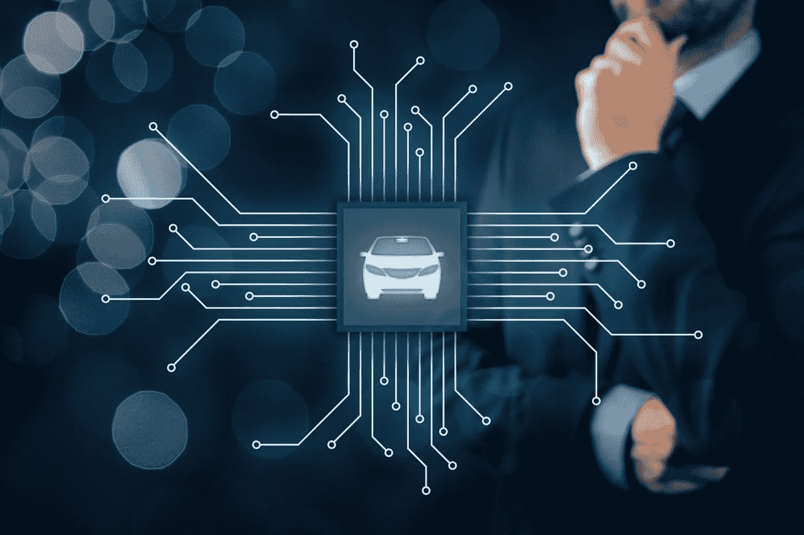

# 这是我们所知的汽车时代的终结吗？

> 原文：<https://medium.datadriveninvestor.com/is-this-the-end-of-the-era-of-automobiles-that-we-know-8e304f65a70e?source=collection_archive---------25----------------------->

我们生活在一个神奇的时代。汽车技术的发展和不间断的信息获取让我们希望每个人都能够乘坐自动驾驶汽车。有些人对此感到高兴，有些人则感到悲伤。这是为什么呢？一方面，曾经是科幻的东西变成了现实:我们勇敢地进入未来，在未来，即使是在 A 部分的一辆不起眼的汽车上，司机——就像让·吕克·皮卡德(星际迷航)一样——以“计算机”这个词开始旅程……然而，另一方面，我们对即将发生的事情感到强烈的渴望……

当我们看自动驾驶汽车厂商准备的宣传片，比如特斯拉自动从 A 点移动到 B 点，最后停车，或者沃尔沃卡车牵引车运行一列类似的卡车，一系列的问题出现在我们的脑海里:***我们什么时候才能用上它们？***，*与交通相关的舒适度会有怎样的变化？*"，最重要的是: **"** *安全吗？***。******

******我们还不知道这些问题的答案，因为它确实依赖于迄今为止尚未建立的法律法规。在自动驾驶汽车的情况下，引发事故的法律责任问题仍然没有解决。而在事故发生前:**车应该去救谁？**司机，或者我们更应该说“乘客”，或者路上的第三者？******

****让我们也考虑上述卡车列的交通分担的结果，其中车辆之间仅保持最小的空间。这样一根柱子最长可达 60 米！这样的栏目怎么超车？在高速公路上，我们在左车道，错过了出口，柱在我们旁边，右车道，怎么下公路？如果我们刹车，会给后面的车辆造成困难。如果我们加速通过柱子，我们会开得太快而不能安全地进入出口的弯道。****

****我们只有一个选择来摆脱所有的恐惧和疑虑:**把驾驶车辆只留给电脑**。通过这种方式，所有的汽车将能够相互通信，以相同的速度移动，并适应相互的需求。十字路口的灯将会消失，交通标志将不再需要…这就像乌托邦一样伟大。没有一个国家能够负担得起只为自动驾驶汽车划分道路，禁止行人、骑自行车的人、骑摩托车的人等。四处走动。****

****此外，在特权车辆的情况下，如警察、消防队、救护车或政府车辆，算法的工作方式将略有不同。怎么会？所有这些车辆必须在尽可能短的时间内到达目的地，并要求其他道路使用者根据其需求进行调整。即使我们在贵宾通过期间停止自动驾驶汽车，其他旅行者仍然会在路上。当然，他们可以适应现在发生的事情，但是一个新的(或者旧的？)问题出现了:特权车谁来跑？会是一台**电脑还是一个人**，就像目前为止的情况一样？****

****让我们假设这将是一个男人。一个生活在大多数交通工具都由电脑操控、一切都自动发生的世界里的人。你只要把车开走，它就会按照指示的方向行驶。这样的人会如何驾驶车辆？在没有道路交通经验和自动驾驶汽车强加的新条件下？在最好的情况下，他会感到不舒服，开得很慢。****

****现在让我们假设它将是一台计算机。不幸的是，由于对自动驾驶汽车的限制，出于安全原因，这种汽车可能会移动得太慢，并且不会进行不包括在先前提供的范围内的机动。消防队试图控制的火势会蔓延得太大，警察将无法抓住罪犯。另外，值得注意的是搭载**贵宾**的特权车问题，这类人员的安保标准肯定比较高。为了保持足够的保护水平，这些车辆可能并不总是能够适应交通规则。这么重要的问题，贵宾们会委托一台不敏感的机器做决策吗？****

******那么未来的交通会是什么样子呢？**一切都旨在让尽可能多的车辆实现自动驾驶。很有可能，它肯定会改善道路安全，在交通领域将确定几个关键群体:****

1.  ******公共交通**。这是一个非常受欢迎的分支，机车车辆制造商像汽车制造商一样积极开发产品。公共交通肯定会是自主的。更重要的是，由于整个基础设施的一体化，我们将能够实现这样一种情况，即公共交通车辆将不必在交通灯前停下来，因为它们将能够在接近十字路口时尽早通知交通灯控制系统。****
2.  ****汽车共享，它将被视为一种更有声望的公共交通方式。出租车司机将不再被需要:司机的角色将被系统取代。我们将无法驾驶这样的出租车，但我们将轻松方便地到达我们指定的地点，之后车辆将开往下一个客户。谁会错过和出租车司机的对话，可能总会和 Alexa 或者 Siri 交流几句。****
3.  ******私人自主汽车**。对它们的需求仍然存在，因为不是每个人都喜欢使用别人的财产。一些人仍然会决定投资自己的车，宁愿自己维持车内的秩序，而不是参加抽奖，在抽奖中，失败意味着乘坐脏车旅行。此外，大多数人随身携带各种储存在手套箱或行李箱中的设备:工作所需的配件或因一时需要而有用的东西。我们还会将所有运送包裹或订购食品的快递车辆纳入该组。****
4.  ******我们可以自己驾驶的汽车**。是啊！然而……！我们将能够在很长一段时间内(通过选择)自己驾驶汽车。值得将它们区分为一个单独的组，因为以前组中的车辆将不能由人类驾驶。在这种情况下，情况会有所不同:仍然有独立车手的可能性。除其他外，他们的清单将包括前面提到的所有特权车辆:警察、救护车、消防队和贵宾。这就是为什么人们会决定将他们的安全托付给受过专门训练的司机，以及那些只是喜欢驾驶汽车并能支付更高费用的人。****

****事实上，仍然存在与未来运输相关的额外费用问题。自己开车的可能性将是一种奢侈品，你应该为此买单。其中一项费用是保险费:高于全自动驾驶汽车的费用。如果我们的车辆没有安全系统，如 ESP 或停车摄像头，我们现在要支付更多的费用，因此毫无疑问，未来自驾将是一种更昂贵的替代选择。****

****此外，非自主车辆本身也会更贵。汽车公司将大规模生产自动驾驶汽车，传统汽车将小批量生产，这将提高它们的价格。****

****当然，这种对未来交通的设想只是闯入我们日常生活的一种预测。然而，这一预测得到了对汽车工业当前趋势和发展方向的观察的支持，这一方面是大公司所希望的，另一方面也是它们的客户所希望的。我们街道上的自动驾驶汽车不再是科幻电影中的场景，而是灰色沥青越来越近的现实。更重要的是，这似乎是一种理性的、非常可能的未来情景。****