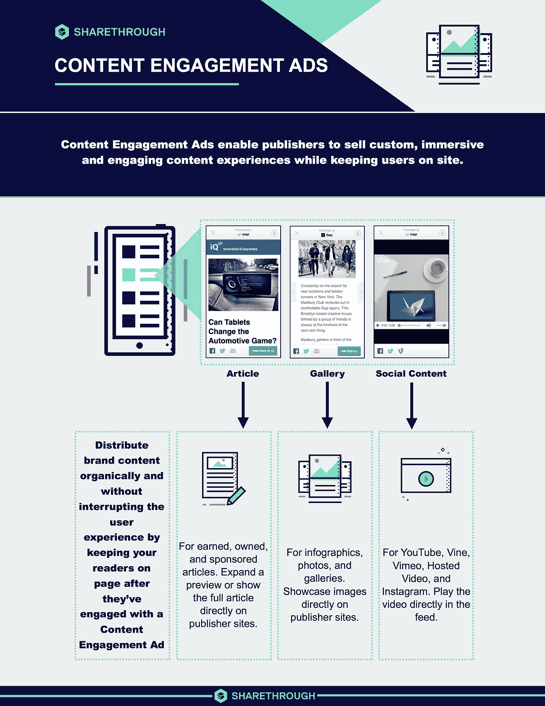

# 这是原生广告的黄金时代吗？

> 原文：<https://medium.datadriveninvestor.com/is-this-the-golden-age-of-native-advertising-2341c4187e1e?source=collection_archive---------13----------------------->

你都看到了。

一千零一封不请自来的邮件。

喧闹的电视广告打断了你最喜欢的电视节目。

极其恼人的弹出窗口、弹出广告和负面广告重定向即将接管网络。

电话推销员在你警告他停止后第一百次打电话来。

所有这些都是广告的形式。

他们渴望的只是你的关注...当然还有你口袋里的东西。

在这种营销中，广告被强行灌输给不情愿的消费者，难怪他们对广告产生了严重的厌恶。

不用说，这导致了广告块的兴起和繁荣。

据 Pagefair 统计，[2016 年使用 ad block 的设备数量为 6.15 亿](https://pagefair.com/pagefair-2017-adblock-report/)。而且这个数字预计每年都会急剧增加！

虽然这个数字可能有点夸张，[在它的 15-10%](https://qz.com/1195777/googles-swelling-advertising-business-couldnt-save-profits-in-q4-2017/)，谷歌的收入仍然会停滞或下降。

那些没有安装广告块的用户呢？

[尼尔森诺曼集团](https://www.nngroup.com/articles/fight-right-rail-blindness/)在 2018 年开展的一项研究显示，用户已经学会忽略类似广告、接近广告或出现在传统广告位置的内容。

这种报道似乎预示着广告的死亡。但事实完全不是这样。

自从人类学会如何买卖以来，广告就一直存在，而且不会很快消失。

此外，仍然需要用广告来吸引消费者的注意力只是改变策略。

事情就是这样。

高速运转的数字营销人员的大脑想出了一个奇妙的方法来应对整个数字广告行业即将到来的大规模广告末日。

哦，天啊，它真的很有魅力。

Statista [的一份研究报告显示，仅在 2018 年，就有 5430 亿美元用于数字广告](https://www.statista.com/statistics/236943/global-advertising-spending/)。

根据该报告，数字广告支出每年将增长 4.5%。

很明显，广告支出的增加与相关公司的正投资回报率有关。

那么，数字营销人员从《绿野仙踪》中窃取了什么神奇的营销技巧来扭转局面呢？

屏住呼吸——这是本土广告。

原生广告是数字广告的新面孔，是为了应对互联网上消费者行为的变化而创建的。

从本质上说，这种演变彻底改变了数字广告，从通常的贴在你脸上的类型，到补充和丰富用户在网页上的体验的类型。

到底是什么？

[原生广告](https://www.sharethrough.com/nativeadvertising/)是与他们出现的平台的设计、模式和功能相匹配的那种广告。

原生广告的这种特殊品质与横幅广告或展示广告形成了鲜明的对比，后者本质上几乎总是具有干扰性。

因为它太显眼了，与网站的编辑流程不匹配，这将导致负面的用户体验。

原生广告作品。

[大约 85%的数字营销人员](https://contentmarketinginstitute.com/2016/09/native-advertising-marketing-strategy/)目前在他们的营销活动中使用这种策略。也出现了许多专门为此目的构建的平台。这类平台的例子有 Outbrain、Revcontent 和 Disqus。

Outbrain 最近的一项研究显示，消费者对原生广告的关注比其讨厌的对手多 53 %。

这还不是全部。

我们还发现，原生广告使购买意愿增加了 18%,并将用户返回网站的可能性提高了 52%。

根据 MarketingLand 的说法，原生广告在防止广告疲劳方面做得非常好。

不要挠头，也不要问谷歌什么是广告疲劳，因为我会告诉你。

广告疲劳是一个技术术语，用来指用户由于看到大量广告而产生的厌倦状态。

当这种情况发生时，他们会将它们置之不理，根本不再看它们。

但这在原生广告中根本不会发生。

为什么？

这种广告形式的本质是将品牌信息嵌入到编辑内容中，因此受众永远不会厌倦。

如果内容非常有趣，引人入胜，那就更是如此。

谁不喜欢讲得好的故事呢？

为了证明这一点，斯坦福大学的研究人员进行了一项详细的研究，发现虽然消费者已经知道他们沉浸其中的故事实际上是一个广告，但他们并不在乎，因为他们喜欢它。

我的问题又来了，谁不喜欢一个讲得好的故事？

还有呢？

所有的大男孩都在这么做。

想想贝宝、沃尔玛、亚马逊、JC Penny 以及其他公司，它们的营销资金可不是闹着玩的。

坦率地说，行业分析师一直认为横幅广告将很快成为在线营销生态圈的历史，没有人想到它会如此之大。

[目前，大多数社交媒体和搜索引擎平台，如谷歌和脸书，正在向原生广告转型。](https://www.the-gma.com/native-advertising-2020-5-global-futures-format-rise)

Adobe 的 CMO.com 报告称，美国社交网站上的本土广告支出将达到 23.6 亿美元，占美国付费社交广告支出总额的 38.9%。

除了他们之外，像 Buzzfeed、Snapchat、亚马逊，甚至网飞这样的发布平台也尝到了这场数字营销革命的甜头。

Buzzfeed 以自己的方式开创了本土广告行业。[gawker 在报道 BuzzFeed 内部泄露的信息](http://tktk.gawker.com/internal-documents-show-buzzfeed-s-skyrocketing-investm-1709816353)时表示，Buzzfeed 正在蓬勃发展，收入从 2011 年的 400 万美元增长到 2013 年的 6400 万美元，再到 2015 年上半年的 4600 万美元。

根据 eMarketer.com 的调查，近四分之三接受调查的美国出版商表示，他们已经在其网站上提供原生广告，另有 17%的出版商表示，他们正在考虑今年提供这一服务。

谁不喜欢好故事？

许多知名公司的首席营销官已经加入进来。

事实上，这是统计数据，Sharethrough.com 的一项调查显示[大约 32%的首席营销官表示他们已经购买或计划在未来六个月内购买](https://www.adskills.com/beginners-guide-to-native-advertising/)原生视频广告。

你看，这是本土广告的黄金时代。