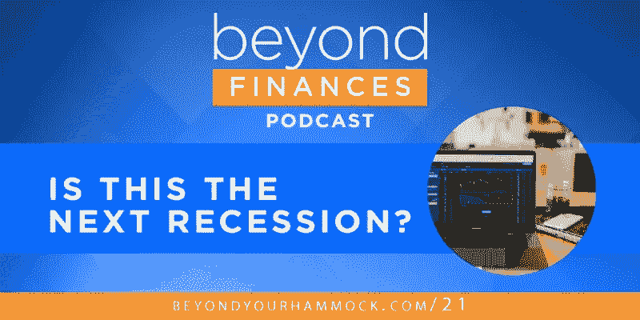

# 这是下一次衰退吗？[超越金融播客，第 21 位]

> 原文：<https://medium.datadriveninvestor.com/is-this-the-next-recession-beyond-finances-podcast-21-488bd427d764?source=collection_archive---------10----------------------->

## 找出在经济低迷时应该做什么，了解为什么市场时机选择是失败者的游戏，并接受我们关于如何让你的生活免受衰退影响的建议。

围绕“这是下一次衰退吗？”这个问题，T2 有很多言论和媒体报道似乎有很多迹象表明，这是一件即将发生的大事——*，当它发生时，我们都彻底完蛋了。*

 [## 算法交易的机器学习|数据驱动的投资者

### 当你的一个朋友在脸书上传你的新海滩照，平台建议给你的脸加上标签，这是…

www.datadriveninvestor.com](https://www.datadriveninvestor.com/2019/01/30/machine-learning-for-stock-market-investing/) 

但至少可以说，这是一份充满感情的外卖。是真的吗？为了弄清楚最近的头条新闻和经济衰退的恐惧，我们在这一集后退一步，关注几个关键事实:

*   我们不确定下一次衰退何时开始
*   我们不知道它会对市场或经济产生多大的影响
*   我们不知道它什么时候会结束，什么时候会开始新的扩张

我们*做*知道的是:

*   衰退是市场周期的正常部分，应该在意料之中
*   市场波动也是正常的，也是可以预期的
*   市场时机选择不起作用…但是长期投资，根据你的目标、需求和时间范围适当分配多样化的投资组合会非常有效

在这个节目中，我们看看我们知道的和不知道的，并解释你应该如何看待每一件事，这样你就可以对你的投资、你的财务以及如果明天经济衰退来袭(或不来袭)该怎么办充满信心。

# 准备好进入这一集了吗？

你可以这样收听这个播客:

[听苹果播客(iTunes)](https://podcasts.apple.com/us/podcast/beyond-finances/id1448447206) // [听 Spotify](https://open.spotify.com/show/6wVjV6ErKa4uGi8UVQJM66) // [听阴天](https://overcast.fm/itunes1448447206/beyond-finances)

没有看到你最喜欢的播客列表？打开你喜欢的应用程序，只需搜索“超越财务”就能找到我们— [或者在你的桌面上点击](http://beyondyourhammock.com/21)。

# 延伸阅读和资源

*   据美国有线电视新闻网报道，大多数投资者认为 2018 年是股票的高峰年。(其实不是。)
*   从美国国家经济研究局的数据中了解典型的市场周期是什么样的[以及它们会持续多长时间](https://www.nber.org/cycles/)。
*   每个人都不擅长预测衰退。国际货币基金组织的这项研究显示，即使是世界级的经济学家。
*   见见鲍勃，[，世界上最糟糕的市场计时者](https://awealthofcommonsense.com/2014/02/worlds-worst-market-timer/)，了解他最终仍然成为百万富翁，尽管他只是在市场下跌前投资。他成功的秘诀是什么？*他从不出售，而是去套现。*各位，上市时间到了！
*   然后让 Bo 和 Brian,《金钱人秀》的主持人[解释为什么 Bob 无论如何都不应该扰乱市场时机选择](https://youtu.be/oIiFIFG3eII),坚持用美元成本平均法来获得 4 倍于他的储蓄金。
*   想变得书呆子吗？获取 Eric 在本期节目中引用的一些图表:[市场下跌和波动——超越你的吊床](https://beyondyourhammock.com/wp-content/uploads/2019/09/Market-Declines-and-Volatility-Unbranded.pptx)

# 想从播客和你的主持人那里得到更多吗？以下是如何连接

我们很乐意与您联系并继续对话！

*   在 [Twitter](http://twitter.com/beyondfinances) 和 [Instagram](http://instagram.com/beyondfinances) 上关注 Eric @BeyondFinances
*   在[推特](http://twitter.com/kaliroberge)和 [Instagram](http://instagram.com/kaliroberge) 上关注 Kali @KaliRoberge
*   如果您有任何问题或意见，请发送电子邮件至 team@beyondyourhammock.com。

你甚至可以点击这里[和 Eric 聊一聊如何成为 BYH 的财务规划客户。](http://booknow.so/ericroberge)

我们很想听听你的想法。 [***通过在 iTunes***](https://itunes.apple.com/us/podcast/beyond-finances/id1448447206) ***上留下您的评论来分享您的反馈，或者与朋友分享这一集。这意义重大。***