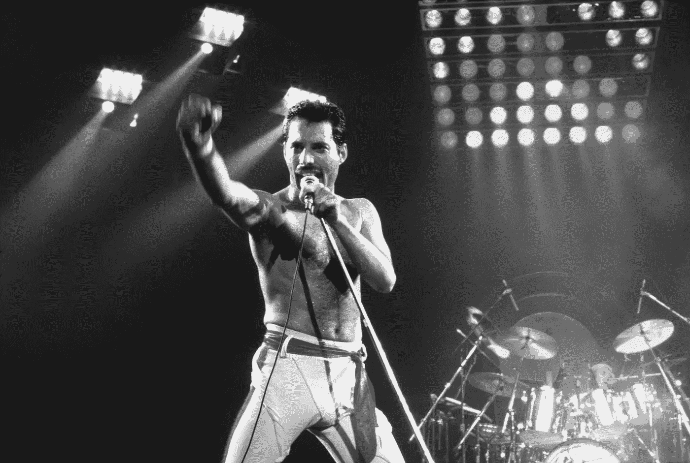
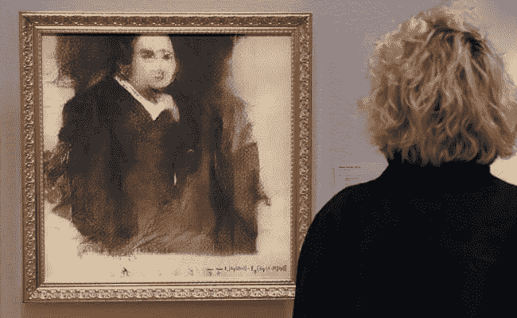
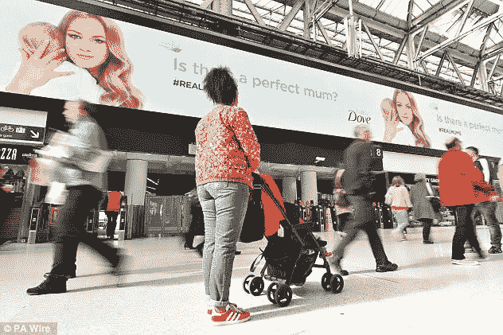

# 这是真实的生活吗？

> 原文：<https://medium.datadriveninvestor.com/is-this-the-real-life-d1f65c73f1ff?source=collection_archive---------33----------------------->

## *“这是真实的生活吗？这只是幻想吗？”曾经唱过佛莱迪·摩克瑞，现在我们说；" Alexa 演奏波西米亚狂想曲"*

“在电力时代之前，只有真实的体验才是可能的。然而，在二十世纪，公众已经习惯了真实体验与绝对不真实的合成体验混杂在一起的信息环境。”(合成体验如何塑造社会现实，1990 年，第 60 页)在 90 年代，人们用不存在的复杂算法创造数字体验，唯一关心的是媒体和电视，以及“专家”如何通过以下形式改变事件的性质:通过相机和镜头变换视角，从一个场景切换到另一个场景，改变运动速度等等。

> *尽管这种混合被认为在定义上是相似的，但在今天的数字世界中，信息技术的影响要大得多，这个问题远非仅仅借助变焦镜头就能改变观点。*

根据全球设计和创新咨询公司 Fjord's 的 2019 年趋势报告，在街区出现了一种新的“现实”；“嗯，你好先生(混合现实)。”—产生新的可视化效果，其中物理和数字对象实时共存和交互，换句话说，它是现实和虚拟现实的混合。

我们生活在一个混合现实的时代。在不久前，这意味着通过耳机或屏幕访问现实(虚拟或增强)的版本。去年，主要通过 AI(人工智能)创建的合成现实给我们的生活带来了新的复杂程度，也带来了与安全威胁相关的严重问题。然而，不能忽视合成现实在探索品牌传播新途径方面的创造性潜力，以及它如何通过混杂的体验为我们的日常生活铺平道路。

> *谈铺垫……*

谷歌展示了其谷歌双工技术，谷歌助手通过合成语音电话预约理发。这引起了很大的兴趣，因为谷歌能够展示人工智能如何自然地与人类互动，甚至在对话中不经意地说“嗯嗯”。

在娱乐、移动、安全、自动化、医疗保健、艺术和设计领域，还可以找到其他一些积极的应用。这里有一些引人注目的例子；

一小部分演员通过数字技术保存自己，以便在死后继续他们的事业。

他们扫描自己，这样他/她的全息版本就可以呈现出来，继续为行业做贡献。然而，根据科技研究员 Supasorn Suwajanakorn 的说法，在不久的将来甚至不需要扫描。在 2018 年 4 月的 TED 演讲中，Suwajanakorn 展示了一个非常有趣的项目，他目前正在进行这个项目。他演示了如何通过使用她/他的现有照片和视频来构建一个人的数字模型，并指出如果您可以获得这项技术和材料，您就可以为任何人建模。虽然这可能会在潜在滥用的情况下引发与安全相关的问题，但是能够向你去世的祖父母征求一些建议不是很酷吗？或者看几年前去世的你最喜欢的女演员主演的电影，比如查理·卓别林？

导演奥斯卡·夏普(Oscar Sharp)和人工智能研究员罗斯·古德温(Ross Goodwin)创造了一个名为本杰明(Benjamin)的人工智能算法，它完全可以生成一个动作。

两年前，本杰明已经有了 100 多个剧本，然后他写了一部名为《太阳之春》的电影。然后在 2018 年，Benjamin 在 Sunspring 演员，公共领域电影，随机提示和 48 小时中被喂了。结果是“区外”；一部从剧本到图像都完全由人工智能控制的电影。

***人工智能生成的艺术品在佳士得拍出 43.25 万美元。***

三个以“明显”著称的巴黎合作者创作了一系列虚构的“贝拉米家族”成员的肖像。这个名为“Edmond de Belamy”的系列由人工智能创作，2018 年 10 月，其中一幅画在英国着名拍卖行佳士得的拍卖中以 43.25 万美元的价格售出。

人工智能为贝贝芙的英国广告活动生成了一个“真正的妈妈”形象。

从一项来自英国母亲的重要数据开始，“由于每天在社交媒体和杂志上看到的图片，英国 10 个第一次做妈妈的人中有 9 个感到有压力要变得完美。”德芙意识到没有完美的母亲，只有“真正的”母亲。因此，他们使用人工智能通过输入来自不同来源的 1800 幅母亲图像来创建一个“完美妈妈”图像。

> *现在怎么办？*

看到这些例子让我想到混合现实很快就会成为我们日常生活的一部分。可以理解的是，存在一些与安全性、真实性和真实性相关的担忧。甚至有人认为这会把我们带到造谣时代。然而，就像任何与创新和技术有关的事情一样；“首先它是可怕的，其次它是熟悉的，然后它被接受”。

最初发布于[数据驱动投资者。](https://www.datadriveninvestor.com/2019/01/23/is-this-the-real-life/)