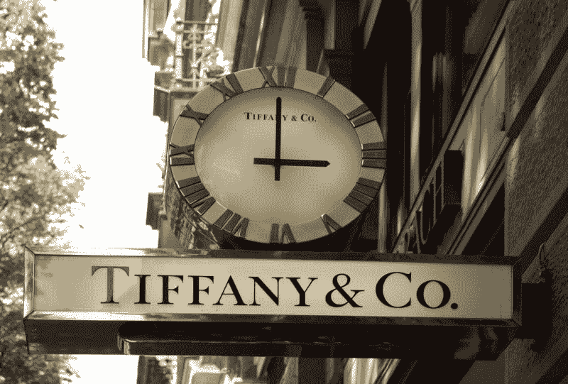
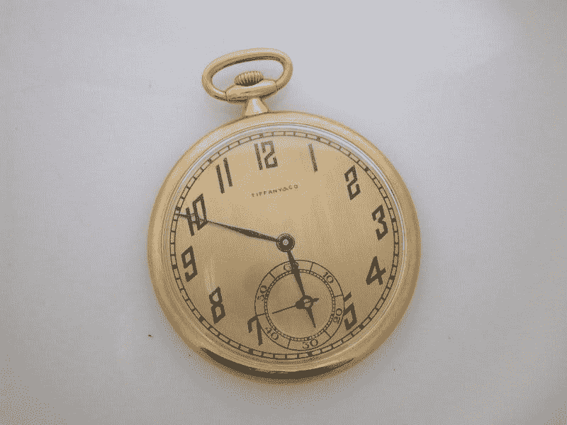
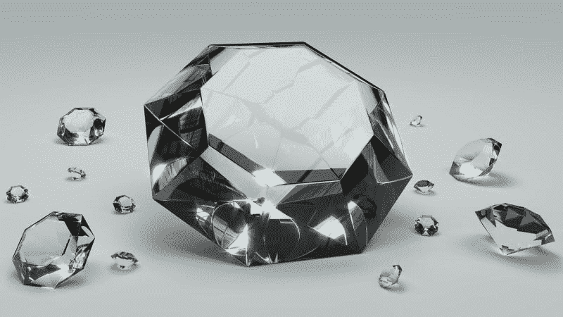

# 蒂芙尼公司赚钱了吗？—市场疯人院

> 原文：<https://medium.datadriveninvestor.com/is-tiffany-co-making-money-market-mad-house-7cd2d8a9ef82?source=collection_archive---------7----------------------->

珠宝商是典型的价值投资，因为他们出售小而贵的产品来换取现金。更重要的是，珠宝商的运营费用低，库存可以维持很长时间。

沃伦·巴菲特是一位相信珠宝的价值投资者。事实上，**伯克希尔哈撒韦公司(纽约证券交易所代码:BRK。B)** [拥有](https://www.berkshirehathaway.com/subs/sublinks.html)三家珠宝商。那些珠宝商是 Borsheim's Fine Jewelry、Helzberg Diamonds 和 Ben Bridge 珠宝商。

 [## 算法交易的机器学习|数据驱动的投资者

### 当你的一个朋友在脸书上传你的新海滩照，平台建议给你的脸加上标签，这是…

www.datadriveninvestor.com](https://www.datadriveninvestor.com/2019/01/30/machine-learning-for-stock-market-investing/) 

巴菲特对珠宝的兴趣让我想知道美国最著名的珠宝商；**蒂芙尼& Co(纽约证券交易所代码:TIF)** 或蒂芙尼是价值投资。蒂芙尼通过全球 300 多家店铺销售珠宝和其他奢侈品。此外，蒂芙尼还拥有广泛的电子商务和融资业务。

# 蒂芙尼赚钱了吗？

蒂芙尼在赚钱。该珠宝商报告称，2019 年 7 月 31 日的毛利为 6.57 亿美元，收入为 10.49 亿美元。

此外，蒂芙尼公司当天公布的营业收入为 1.843 亿美元，净收入为 1.363 亿美元。重要的是，蒂芙尼正在创造现金。

该珠宝商报告 2019 年 7 月 31 日的运营现金流为 1.228 亿美元，自由现金流为 6040 万美元。然而，同一天，蒂芙尼公布的融资现金流为负 1.34 亿美元，投资现金流为负 4980 万美元。

因此，截至 2019 年 7 月 31 日，蒂芙尼公司拥有 6.41 亿美元的现金和等价物，以及 3960 万美元的短期投资。因此，截至 7 月底，蒂芙尼拥有 6.806 亿美元现金。

# 蒂芙尼缩水了吗？

蒂芙尼已经经历了三个季度的收入增长萎缩。特别是，Stockrow 在截至 2019 年 7 月 31 日的季度中给予蒂芙尼公司-2.55%的负收入增长率。

此外，截至 2019 年 4 月 30 日的季度，蒂芙尼的收入增长率为 2.91%。截至 2019 年 7 月 31 日的季度收入增长率为 1.03%。因此，在至关重要的 2018-2019 年假日季，蒂芙尼的收入增长出现萎缩。

此外，蒂芙尼 2019 年 7 月 31 日报告的 10.49 亿美元收入低于一年前蒂芙尼公司 2018 年 7 月 31 日报告的 10.76 亿美元。因此，蒂芙尼的业务似乎正在萎缩。

# 蒂芙尼是成长股吗？

蒂芙尼的收入缩水很奇怪，因为它的顾客群；有钱人越来越多。

例如，米高梅研究公司[估计](https://mgmresearch.com/global-millionaire-population-analysis-2019/)全球百万富翁人数从 2013 年的 1733.1 万增长到 2018 年的 1960.4 万。此外，米高梅研究公司预测，到 2023 年，全球百万富翁的数量将增长至 2340.5 万。

此外，米高梅研究公司计算出，2018 年欧洲有 571.6 万名百万富翁，北美有 640.3 万名百万富翁，亚洲有 564.5 万名百万富翁。米高梅研究公司预计，到 2023 年，这些数字将增长到 698 万、743.1 万和 607 万。

此外，美国的富人越来越富。美联社[声称](https://www.nbcnews.com/news/us-news/u-s-income-inequality-highest-level-50-years-economic-gap-n1058956)，美国人口普查局估计美国的收入不平等达到了 50 多年来的最高水平。相应地，IncomeInequality.org[估计](https://marketmadhouse.com/is-tiffany-co-making-money/#income-inequality)2018 年最富有的 0.1%美国人的平均收入为 670.9 万美元。与此同时，IncomeInequality.org 估计，2018 年 1%的美国人的平均收入为 185.5 万美元。

理论上，蒂芙尼公司有更多的潜在顾客，他们的钱也更多。然而，去年蒂芙尼的收入缩水了。

# 为什么蒂芙尼的收入在缩水？

我认为蒂芙尼收入缩水有两种解释。

首先，由于对收入不平等日益增长的歇斯底里，富人不敢炫耀他们的财富。一些观察者包括[me](https://marketmadhouse.com/the-luddites-are-coming/)；总统候选人杨安泽预测收入不平等和技术失业会引发暴力。

奥斯陆大学报告称，有研究表明，不平等的加剧会导致暴力、种族主义和极端主义的上升。特别是，据 NBC 新闻[报道](https://www.nbcnews.com/storyline/inauguration-2017/they-don-t-have-right-d-c-limo-driver-recalls-n710111)，暴徒在 2017 年唐纳德·j·特朗普总统的就职典礼上点燃了一辆豪华轿车。

在这种情况下，有钱人可能会担心穿戴华丽的珠宝会让他们成为暴力的目标。一个相关的担忧是，特朗普明年可能再次当选可能会在美国引发大范围的反富人骚乱。

因此，富人可能会因为害怕暴力而放弃珠宝。相反，富人可以投资保镖、装甲车、枪支和加固掩体。

# 蒂芙尼的亚马逊证明了吗？

第二，蒂芙尼公司可能容易受到亚马逊和其他在线零售商的攻击。

解释一下，珠宝加价高，但是小，容易出货。因此，很容易打折和运送珠宝，但仍然赚钱。可以预见的是，亚马逊提供了大量的珠宝选择。

此外，许多公司正在进入在线奢侈品业务。[捷黑](https://www.storeno8.com/jetblack)；例如，拥有**沃尔玛(WMT 证券交易所代码)**孵化器 8 号店的支持。Jetblack 是一家数字礼宾服务公司的创始人珍妮·弗列斯，旨在为上流社会的女性提供奢侈品。

因此，蒂芙尼公司正在与亚马逊及其模仿者竞争。亚马逊可以以更低的价格、更方便的方式提供同样的珠宝。像 Jetblack 这样的服务，弗列斯打算作为奢侈品的 Instacart，可以帮助蒂芙尼向讨厌购物的有钱女人运送珠宝。

此外，担心安全的富裕买家会避免走进蒂芙尼的商店。因此，他们不太可能成为罪犯或暴徒的目标。

# 蒂芙尼是好的分红股吗？

我认为 **Tiffany & Co (NYSE: TIF)** 是一只不错的股息股票，因为它在 2019 年 9 月 19 日支付了 58₵股息。此外，蒂芙尼的股票在 2019 年 10 月 15 日的交易价格为 91.04 美元。

我认为蒂芙尼的股票定价过高，但股息弥补了更高的价格。解释一下，58₵红利给了蒂芙尼公司很高的安全边际。因此，股东将从这个零售商身上赚一些钱。

蒂芙尼的安全边际很高，因为它的高股息增长。事实上，在过去的一年半时间里，蒂芙尼的股息增长了 8₵。详细来说，蒂芙尼在 2019 年 3 月支付了 50₵股息，并在 2018 年 6 月和 2019 年 9 月分别增长到 55₵和 58₵。

此外，Dividend.com 将九年的股息增长归功于蒂芙尼公司。总体而言，Tiffanny 's 提供的股息率为 2.55%；2019 年 10 月 15 日的年化派息为 2.32 美元，派息率为 48.2%。

# 蒂芙尼是价值投资吗？

我认为 **Tiffany & Co(纽约证券交易所:TIF)** 是一项价值投资，因为股息收益率和公司的[特许经营权价值](https://www.thebalance.com/profiting-from-franchise-value-356148)。

蒂芙尼的特许经营价值来自其悠久的历史和作为奢侈品象征的声誉。例如，许多人记得这本书和电影*。其他人知道该公司的珠宝或其为美国海军制造奖牌的历史。*

*这个名声是一把双刃剑，因为有些人可能会将蒂芙尼视为贪婪和收入不平等的象征。然而，蒂芙尼因为它的声誉可以卖更高的价格。*

*特别是，这种声誉可以帮助蒂芙尼在网上销售，并通过像 Jetblack 这样的数字增强交付服务进行销售。值得注意的是，这家珠宝商可以接触到住在蒂芙尼专卖店附近的数千万顾客。*

*然而，收入和收入增长的下降表明，蒂芙尼很容易受到亚马逊的影响。因此，我反对购买蒂芙尼，直到管理层表明它扭转了收入增长。*

**原载于 2019 年 10 月 15 日*[*https://marketmadhouse.com*](https://marketmadhouse.com/is-tiffany-co-making-money/)*。**