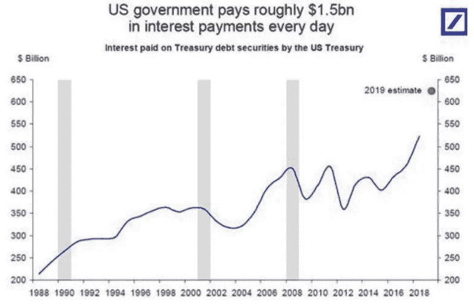
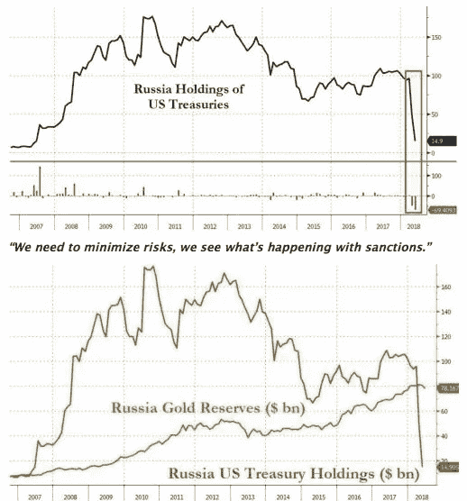

# 美元作为世界储备货币的时间到了吗？

> 原文：<https://medium.datadriveninvestor.com/is-time-up-for-the-us-as-the-worlds-reserve-currency-c05b581dec79?source=collection_archive---------1----------------------->

## **堆积如山的美国债务**

目前美国股票市场相当紧张。利率在上升，而美国的企业债务却在膨胀。高管们对资产负债表进行了杠杆化，以至于不到 10 家标准普尔 500 公司现在拥有正现金头寸。与此同时，美国政府继续肆意借债，尽管近十年来经济持续增长，但美国的债务山比以往任何时候都高。不幸的是，随着利率上升，以及历史上的海外买家开始质疑为山姆大叔的透支提供资金的逻辑，偿还这些债务将变得越来越困难。

据报道，美国将在 2018 年向[借款超过 1.3 万亿美元](https://www.zerohedge.com/news/2018-10-29/americas-true-deficit-us-borrow-over-13-trillion-2018)，现在每天为其当前债务负担服务的成本为每天 15 亿美元！

来源:[https://www . zero hedge . com/news/2018-10-29/Americas-true-deficit-us-borrow-over-13 万亿-2018](https://www.zerohedge.com/news/2018-10-29/americas-true-deficit-us-borrow-over-13-trillion-2018)

## 经济力量正在转移

鉴于我们正在看到与美国和中国的潜在贸易战，以及对伊朗、委内瑞拉和俄罗斯的制裁增加，我们还要多久才能看到其他国家效仿委内瑞拉？委内瑞拉最近发行了石油加密硬币，试图为其现金匮乏的经济筹集资金。虽然这在一年前似乎是一个疯狂的想法，但对于沙特阿拉伯这样的国家来说，效仿委内瑞拉的做法，发行以其丰富的石油储备为支撑的沙特硬币会有多难？回到 20 世纪 70 年代，美国达成了一项石油交易，以换取美元权力。他们告诉沙特人，如果他们用美元给石油定价，然后用剩余的美元购买美国国债，那么美国将提供军事保护，沙特人可以控制他们的石油储备。将近 50 年后，世界已经不同了。在经济实力不断转移的动态全球市场中，这笔交易是否仍有吸引力。[2014 年，石油占沙特收入的 90%](https://www.arabianbusiness.com/energy/386158-so-how-important-is-oil-to-the-new-saudi-arabia)但是到 2035 年，他们打算将政府赤字削减至零，并减少对石油的依赖。有人怀疑，许多国家会乐于不必买卖以美元计价的石油，但这样做肯定会给美元带来进一步的压力。

 [## 如果资本主义失败了，那么还有什么选择呢？数据驱动的投资者

### 在当前政治领域的修辞之旅中，我们都可以面对面地接触到流行词汇，如…

www.datadriveninvestor.com](https://www.datadriveninvestor.com/2020/03/16/if-capitalism-is-a-failure-then-what-is-the-alternative/) 

## 美国的制裁可能适得其反

超过 40%的美国债券(即他们的债务)由海外投资者持有，美国在不同国家的制裁可能会适得其反。如下图所示，俄罗斯等国家一直在抛售所持美国国债，并稳步增持黄金。

来源:[https://www . zero hedge . com/news/2018-07-27/Putin-plays-down-russias-dollar-liquidation-we-need-minimize-risks](https://www.zerohedge.com/news/2018-07-27/putin-plays-down-russias-dollar-liquidation-we-need-minimize-risks)

俄罗斯总统普京最近谈到美国*施加的制裁时说:“我认为这是一个重大的战略错误，因为他们正在破坏人们对美元作为储备货币的信心。”*

## 没有什么是永恒的

对美元未来的担忧不仅来自外国，也来自全球最大的基金管理公司。贝莱德(Blackrock)首席执行官拉里·芬克在新加坡举行的新经济论坛(New Economic Forum)上发表讲话时表示，美国面临着削弱美元储备货币地位的风险，主导货币的地位不会永远持续下去。

 [## 为什么包容性财富指数比 GDP 更能衡量社会进步？|数据驱动…

### 你不需要成为一个经济奇才或金融大师就能知道 GDP 的定义。即使你从未拿过 ECON 奖…

www.datadriveninvestor.com](https://www.datadriveninvestor.com/2019/03/08/why-inclusive-wealth-index-is-a-better-measure-of-societal-progress-than-gdp/) 

虽然美国将制裁作为施加影响和控制事件的一种方式，但在我们日益数字化的全球经济中，旧的区域和地理边界变得越来越不重要，因为资本可以按一下按钮就可以转移

美国在现代的经济重要性在很大程度上是基于其货币的使用和力量。从 1815 年到 1920 年，英国的英镑一直是全球储备货币。在此之前，它是拿破仑时期的法国法郎(1720 年至 1815 年)，在此之前，它是荷兰货币(1640 年至 1720 年)。所有这些货币最终都让位于一种新的货币，通常是在 100 年后。自 1920 年以来，即 100 年来，美元一直是全球储备货币——没有什么是永恒的！

## **新订单**

有趣的是，在今年 11 月的一次演讲中，普京说*世界将寻找替代支付系统 *…。因为美元交易的波动性使得全球许多经济体都希望找到替代的储备货币，创建不依赖于美元的支付系统……*世界将寻找替代的支付系统。*

*虽然他没有明确提到加密货币，但使用了“替代储备货币、支付系统、替代储蓄和交易方法”等语言，人们不禁认为普京正以相当大的兴趣关注委内瑞拉石油公司。毫无疑问，普京很想找到一种方法来绕过美国的制裁，并允许俄罗斯公司获得资本，扩大俄罗斯的经济。*

*不仅仅是俄国在抛售美国国债，美国债券的两个最大的外国持有者，[中国和日本也在减持美国债券。这可能会蔓延开来。尽管随着美国利率上升，债券价值下降以反映利率上升，这并不令人惊讶，但它令人担忧。利率上升通常会给股市带来压力，因为机构偿还债务变得更加困难。然后，投资者要求更高的利率来弥补潜在的违约，恶性循环开始了。在一个全球联系日益紧密的世界里，传染病和信心丧失可能会迅速蔓延，正如我们在 1987 年和 2008 年所看到的那样。](https://www.cnbc.com/2018/10/16/china-treasury-holdings-lowest-in-14-months.html)*

*有趣的是，我们最近看到了两个大公司探索传统货币替代品的例子。在俄罗斯，世界上最大的镍生产商之一 Nornickel 正在考虑推出一种由其生产的金属支持的稳定的硬币。像 Nornickel 这样拥有信誉、资源和全球足迹的公司将越来越多地寻找替代方式来获得融资，特别是如果美国继续制裁的话。与此同时，其他公司，如日本航运巨头 NYK，目前正在探索如何在全球范围内用 NYK 币支付员工工资，而不是用日元。*

## ***新的资产类别***

*如果我们要看到加密货币得到更多的采用，整个用户体验需要变得更加用户友好和安全。政府将要求进行 KYC 和反洗钱检查，以确保加密货币不会成为洗钱和其他不法活动转移资金的首选方式而不被发现。然而，随着我们开始看到像日本索尼这样值得信赖的全球品牌提供加密货币钱包，越来越多的机构将被鼓励更多地参与进来，我们可能会逐渐看到日常交易不再使用美元等传统货币。*

*在过去 100 年的经济不确定时期，美元一直是避风港，投资者纷纷抛售股票和债券，通常持有美元现金。然而，当我们面临下一次重大经济冲击和股市调整时，现在有一种选择，可以替代持有负债累累的美元投资。我们可能会看到投资者寻求将资本转移到与其他资产类别不相关的加密货币[。这可能解释了为什么我们看到越来越多的机构对这一领域表现出兴趣，如管理着 6.8 万亿美元的](https://www.forbes.com/sites/chuckjones/2018/08/11/one-chart-explains-why-you-should-own-bitcoin-and-other-cryptocurrencies/#5113d1535c4a)[富达](https://www.coindesk.com/fidelity-looking-to-expand-digital-asset-trading-beyond-bitcoin-and-ether)最近宣布，他们正在考虑扩大向机构提供托管服务的加密货币的数量。活跃的不仅仅是富达，最大的加密交易运营商币安相信，随着他们推出交易这些资产的平台，stablecoins 将是一个相当大的市场。*

*有形资产支持的加密货币提供了一个可行的选择。从历史上看，自 1800 年美元采用黄金标准以来，许多货币都是由黄金支持的，美元也是如此。加密货币的潜在投资者在投资领域将有更大的选择，并将接触不同的资产，无论是大宗商品、钻石、钯、镍、原油、房地产，还是稀有收藏品[潜在的斯特拉迪瓦里小提琴](https://bitcoin.co.uk/blockchain-startup-mattereum-takes-home-9-million-violin/)——所有这些都可以通过数字、全球可交易的加密货币获得。*

*目前，美元仍将是全球储备货币，但大量美国政府和企业债务、不断上升的利率、货币和经济制裁以及现在以加密货币形式出现的一种新的替代资产类别的组合，人们不知道还能持续多久？*

*乔尼·弗莱*

*团队区块链有限公司首席执行官*

*2018 年 12 月*

* [## 首都

### 来自首都的最新推文(@thecapital_io)。资本是一个金融微博社交网络…

twitter.com](https://twitter.com/thecapital_io) 

**访问专家视图—** [**订阅 DDI 英特尔**](https://datadriveninvestor.com/ddi-intel)*