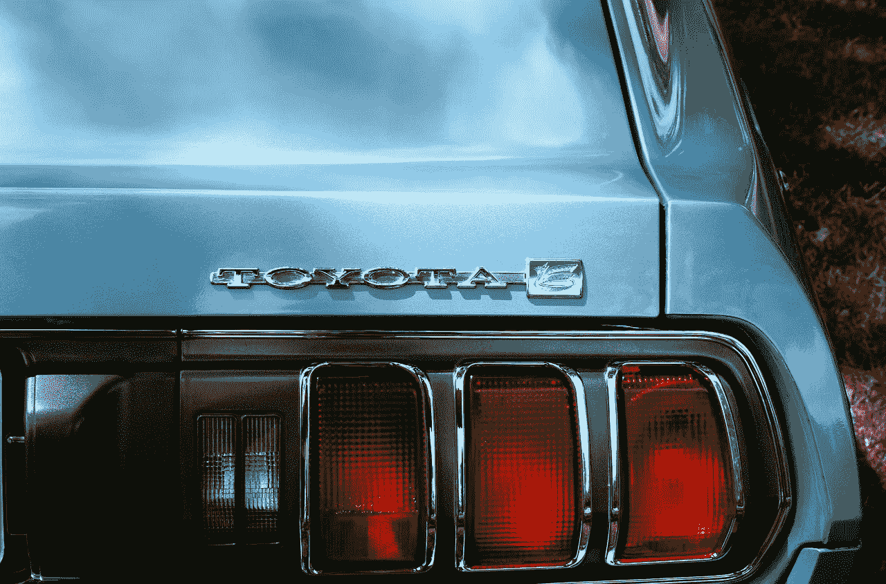
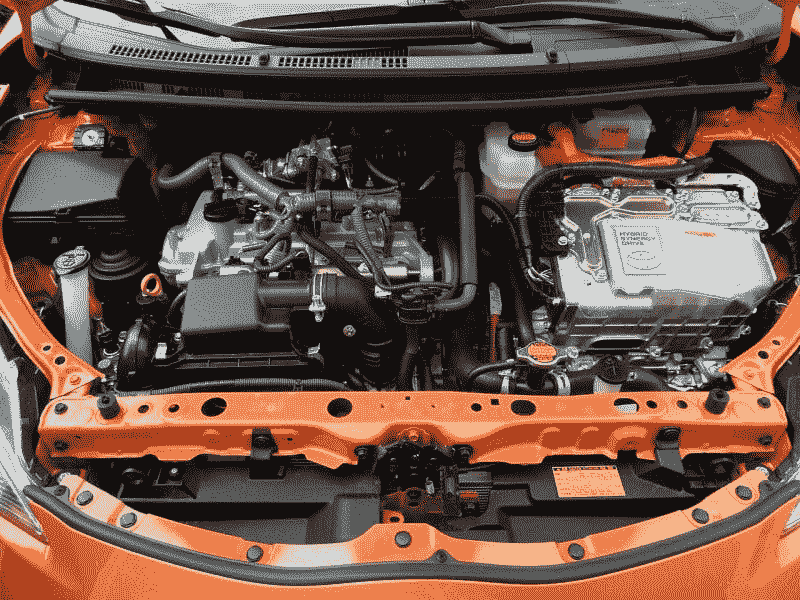
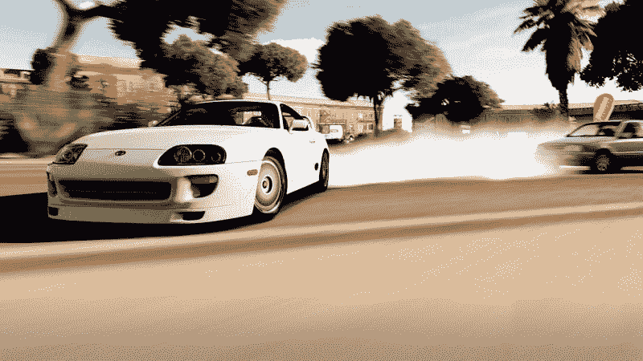
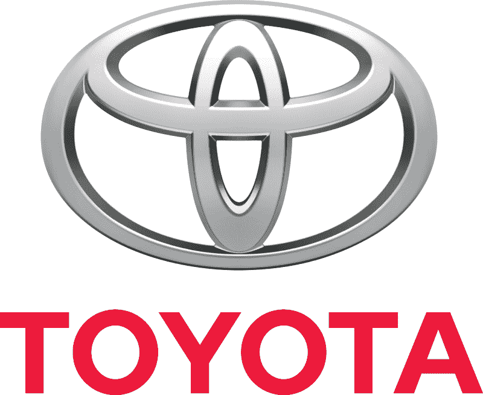
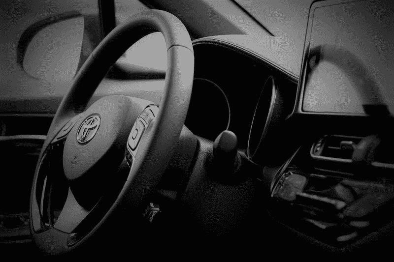
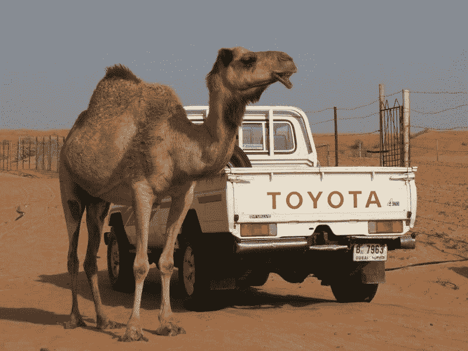

# 丰田赚钱了吗？—市场疯人院

> 原文：<https://medium.datadriveninvestor.com/is-toyota-making-money-market-mad-house-2459d8f7784e?source=collection_archive---------12----------------------->

丰田汽车公司是最大的汽车制造商，但是它赚钱了吗？

Statista [估计](https://www.statista.com/statistics/267274/worldwide-vehicle-sales-of-toyota-since-2007/)，丰田在截至 2019 年 3 月的财年售出 960 万辆汽车。与此同时，*每日看板*估计，2018 年 1 月/2 月至 2019 年 1 月/2 月期间，丰田的年同比销量增长了 4.3%。然而，*每日看板* [估计](https://dailykanban.com/2019/03/worlds-largest-automakers-2019-toyota-maintains-its-lead/)丰田在此期间的产量为 1060 万辆，略高于 Statista 的估计。

不管怎样，丰田正在制造大量汽车，产量也在增加。然而，据 Largest.Org[估计](https://largest.org/technology/automakers/)，截至 2019 年 3 月，丰田仍是全球第二大汽车制造商，全球销量为 1052.1 万辆。因此，丰田的存档**大众汽车公司(OTC: VWAPY)** 仍然是第一大汽车制造商，上一财年的全球销量为 1083.1 万辆。

 [## 在自动驾驶汽车发生事故的情况下，谁应该承担法律责任？数据驱动的投资者

### 我仍然认为自动驾驶汽车是一种奢侈品，而不是必需品…

www.datadriveninvestor.com](https://www.datadriveninvestor.com/2018/11/02/who-is-legally-accountable-in-the-case-of-an-autonomous-vehicle-accident/) 

# 丰田赚了很多钱

丰田从所有这些汽车中赚了很多钱。例如，该公司报告截至 2019 年 3 月 31 日的财年的年度毛利为 498 亿美元。

此外，丰田报告上一财年的营业收入为 224.32 亿美元，净收入为 171.7 亿美元。丰田的年收入为 2747.79 亿美元。此外，这些收入在上一个财年以 6.92%的速度增长。

最后，丰田从其运营中获得了大量现金。上一财年自由现金流为 134.38 亿美元，运营现金流为 342.42 亿美元。然而，丰田在该财年的融资现金流为负 49.17 亿美元，因此在融资方面出现了亏损。

# 丰田是一家现金充裕的公司

令人印象深刻的是，丰田在 2018 年带来了大量现金。例如，丰田在 2019 年 3 月 31 日拥有 427.37 亿美元的现金和等价物，以及 102.47 亿美元的短期投资。

令人印象深刻的是，丰田在 2018 年带来了大量现金。例如，丰田在 2019 年 3 月 31 日拥有 427.37 亿美元的现金和等价物，以及 102.47 亿美元的短期投资。

因此，丰田在上一个财年结束时拥有 529.39 亿美元的银行存款。这足以购买 2019 年 7 月 23 日市值为 399.8 亿美元的**福特(纽约证券交易所代码:F)** 。此外，丰田在银行有足够的现金收购**特斯拉汽车公司(纳斯达克代码:TSLA)** ，该公司在 2019 年 7 月 23 日的市值为 444.2 亿美元。

奇怪的是，特斯拉的股票在 2019 年 7 月 23 日的交易价格为每股 258.18 美元，而丰田的股票售价为 260.17 美元。因此，市场先生在给汽车股票定价时肯定是疯了。

# 丰田能称霸电动车吗

埃隆马斯克(Elon Musk)应该感到担忧，因为丰田正大举进军电动汽车市场。特别是，丰田将与比亚迪合作，为中国市场开发全电动汽车。

据 *Eletrek* [报道](https://electrek.co/2019/07/19/toyota-byd-china-evs/)，为中华人民共和国计划的车辆包括低地板 SUV 和全电动轿车。另外，丰田和当代安培科技有限公司(CATL)；另一家中国公司将生产电池。

有趣的是，比亚迪的 gigafactory 是特斯拉的 20 倍。 *Eletrek* [声称](https://electrek.co/2019/02/25/byd-battery-gigafactory-electric-cars/)比亚迪的电池工厂一年可以生产足够容纳 200 亿瓦电力的电池。相比之下，埃隆·马斯克在内华达州的 Gigafctory 1 每年只能生产 10 亿瓦的电池。这些电池足够容纳 10 亿瓦特的电力。

比亚迪在中国生产电动汽车、卡车和公共汽车。此外，比亚迪和**戴姆勒股份公司**以 Denza 品牌在中国生产汽车。

# 丰田在电动汽车方面落后于其他汽车制造商吗？

Geek.com[报道](https://www.geek.com/tech/toyotas-electric-vehicle-will-transport-2020-olympic-athletes-visitors-1796448/)称，丰田的其他电动计划包括一款名为无障碍旅客运输车(APM)的电动货车，将在 2020 年夏季奥运会上搭载乘客。值得注意的是，APM 理论上可以搭载六名乘客前往东京奥运场馆的座位。

APM 的目的是把残疾人、老人、小孩、肥胖的人和其他很难移动到座位上的人拉过来。由于国家糖尿病、消化和肾脏疾病研究所估计有三分之一的美国人肥胖，所以 APM 的市场将会很大。

与此同时，Electrek [声称](https://electrek.co/2019/06/07/toyota-electric-car-images-accelerate-plan/)丰田计划在 2020 年推出其首款全电动汽车。具体来说，丰田计划推出三款短程电动汽车，看起来像戴姆勒智能汽车或高尔夫球车。因此，丰田在电动汽车领域落后于潮流。

因此，丰田落后于特斯拉、 [**、塔塔汽车**](https://marketmadhouse.com/is-tata-motors-the-future-of-electric-vehicles/) **(纽约证券交易所代码:TTM)** 等制造真正电动汽车的公司。然而，有一个真正的丰田电动汽车的图片，它可以在日本销售明年。

# 英伟达能否帮助丰田用自动驾驶汽车赚钱？

与特斯拉和塔塔不同，丰田对其自动驾驶汽车实验保持沉默。有趣的是，丰田正在转向人工智能领域的全球领导者之一； [**英伟达(NASDAQ: NVIDIA)**](https://marketmadhouse.com/value-investing-in-robots-artificial-intelligence-virtual-reality-and-self-driving-vehicles-at-nvidia-corp-nvda/) 求助开发自动驾驶汽车。

丰田将使用[英伟达的 DRIVE Scalable AI 平台](https://www.nvidia.com/en-us/self-driving-cars/drive-platform/)来训练和测试自动驾驶的神经网络， *TechCrunch* [报道](https://techcrunch.com/2019/03/18/toyota-doubles-down-on-nvidia-tech-for-self-driving-cars/)。此外，丰田是英伟达 Drive Constellation 的第一个客户，这是一个模拟器，让开发人员在虚拟世界中测试自动驾驶汽车。

有趣的是，丰田运营着两个自动驾驶汽车的开发团队，TRI-AD 和美国的丰田研究所。据报道，*《财富》* [称，每个实体都在采取不同的方式开发无人驾驶汽车。这两个组织都与英伟达密切合作。](https://fortune.com/2017/09/27/toyota-self-driving-car-luminar/)

# 丰田的自动驾驶车辆有多先进？

然而，没有迹象表明丰田或英伟达已经实现了完全自动驾驶(FSD)能力。虽然，丰田正在计划一个完整的 FSD 功能，它称之为司机。重要的是，似乎没有对丰田自动驾驶汽车进行大规模测试。

与此同时， **Alphabet 公司(NASDAQ: GOOG)** 正在凤凰城测试数十辆自动驾驶汽车，并使用自动驾驶货车测试拼车服务。值得注意的是，丰田正在与 [Waymo](https://marketmadhouse.com/will-waymo-boost-fiat-chrysler-automobiles-fcau/) 合作，试图为自动驾驶汽车制定标准。

希望为自动驾驶车辆开发一个标准的操作系统，类似于 **Alphabet(纳斯达克股票代码:GOOGL)** 手机安卓操作系统，*日经亚洲评论* [报道](https://asia.nikkei.com/Business/Companies/Toyota-expands-self-driving-alliance-ahead-of-Google-s-Waymo)。丰田还投资了优步(纳斯达克股票代码:优步)，该公司还有一个自动驾驶汽车项目。

此外，《日经亚洲评论》透露，丰田正在与亚马逊(NASDAQ: AMZN )合作开发另一款名为 CES 的自动驾驶汽车。CES 是一辆自动化货车，亚马逊可以用它来交付自动化商店。

因此，丰田正在分散其自动驾驶汽车的努力，并希望其中一项能够奏效。这种策略可以将风险降至最低，但可能成本高昂且令人困惑。特别是，如果丰田最终推出了几个不起作用的自动驾驶汽车系统。

然而，丰田正在积累大量关于自动驾驶汽车的数据，并在该领域获得大量经验。这一经验可能会让丰田在自动驾驶汽车的部署方面占据优势。

# 丰田是一只高收益股票

因此，福特是汽车股的价值，但丰田是一个伟大的收益股。事实上，2019 年 7 月 23 日，丰田投资者的年化股息为 4.38 美元，股息收益率为 3.32%，派息率为 30.4%。

丰田于 2019 年 6 月 4 日支付了每年两次的股息 1.944 美元。该股息比 2018 年 12 月 7 日支付的 1.558 美元有所增加。目前，Dividend.com 给丰田一年的股息增长。

因此，如果你正在寻找一个具有丰田增长潜力的收入股，丰田就是其中之一。这家汽车制造商支付了高额股息，市场先生对其进行了公平定价，其收入和销售额都有所增长。最后，由于在自动驾驶汽车和电动汽车领域的有趣投资和战略联盟，丰田可能会在未来许多年保持增长。

*原载于 2019 年 7 月 23 日*[*https://marketmadhouse.com*](https://marketmadhouse.com/is-toyota-making-money/)*。*