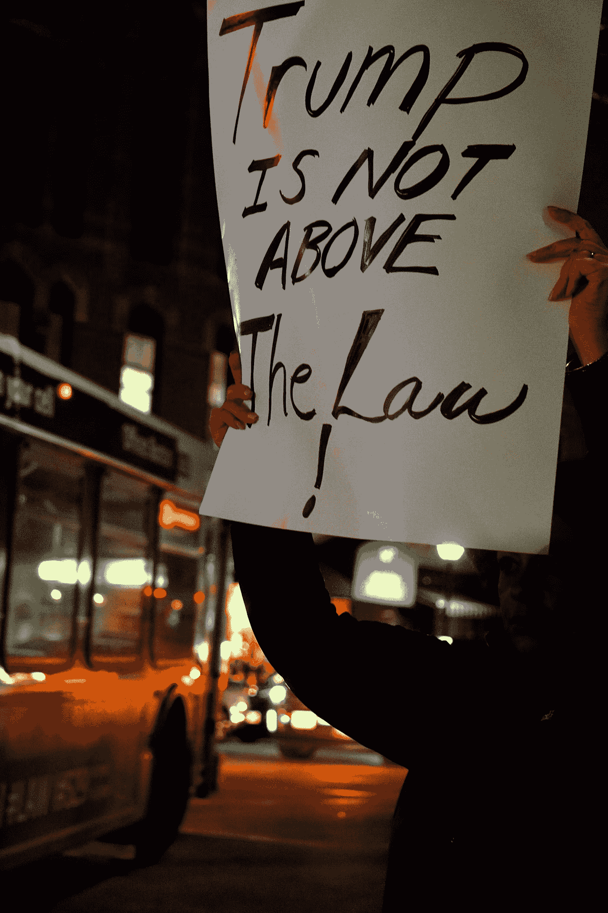

# 特朗普是外国势力的代理人吗？基于有力的间接证据，答案似乎是肯定的。

> 原文：<https://medium.datadriveninvestor.com/is-trump-an-agent-for-a-foreign-power-77878813cc7a?source=collection_archive---------7----------------------->

特朗普是否与外国势力勾结的问题是一个错误的问题。问题是他勾结的程度。

Photo by [LS d'Avalonia](https://unsplash.com/@davalonia?utm_source=medium&utm_medium=referral) on [Unsplash](https://unsplash.com?utm_source=medium&utm_medium=referral)

过去几天，有爆料称，一名告密者称特朗普在电话中向一位外国领导人承诺了什么。无论他承诺什么，都被举报人认为是不正当的。周二，国会议员亚当·希夫(Adam Schiff)说，[情报部门监察长(IC IG)已经表示，对川普的指控既可信又紧迫据美国有线电视新闻网(CNN)报道，国家情报总监(DNI)周三致信亚当·希夫(Adam Schiff)，称“该投诉不涉及情报界的任何人，而是行政部门的利益相关者”。因此，其律师称，该投诉并不属于办公室的“紧急关注事项”请看 CNN](https://www.dni.gov/index.php/who-we-are/organizations/icig/icig-who-we-are)[的报道](https://www.cnn.com/2019/09/18/politics/acting-dni-maguire-agrees-testify-house-intel/index.html)。这个前置短语“to the office”只是意味着 DNI 在“推卸责任”，因为它涉及行政部门的一名成员，而不是情报机构的一名雇员。

 [## 保护主义、政治和经济动荡|数据驱动的投资者

### 美国股市昨日出现 400 多点的大幅反转，为未来的事情发出了警告信号。市场…

www.datadriveninvestor.com](https://www.datadriveninvestor.com/2018/06/28/protectionism-politics-economic-turmoil/) 

这似乎是一个荒谬的区分，它不是一个“紧急关注”，因为这是一些其他机构的责任。这位首席检察官今天出现在众议院情报委员会面前，关于他所说的话有相互矛盾的报道。据报道，国际总检察长解释说，他不能披露投诉中的细节，因为司法部称这不属于国家情报总监的管辖范围，因此不属于他的管辖范围。请看来自 CNN 的报道。当谈到有关这位拥有外国权力的总统的问题时，这只是一长串恶作剧中的最新一个。

在继续说下去之前，我要指出,“勾结”是一种犯罪，它被明确列入宪法，作为弹劾的理由。我知道读者可能会有不同的看法，但我要指出的是，宪法第二章第 4 条规定，总统可以因叛国、贿赂或其他重罪和轻罪而被弹劾和罢免。 [18 美国法典 201(b)(2)](https://www.law.cornell.edu/uscode/text/18/201) 定义了贿赂的不同条件，内容如下:

> **任何公职人员或被选为公职人员的人员直接或间接腐败地要求、寻求、接收、接受或同意接收或接受个人或任何其他人或实体的任何有价物品，**以换取:
> 
> (A)在执行任何官方行为时受到影响；
> 
> (B)受影响在美国实施或协助实施**或共谋**或允许任何欺诈行为，或为实施任何欺诈行为创造机会；或者
> 
> 被诱使从事或不从事任何违反该官员或个人公务的行为；

所以“勾结”是犯罪的一个要素。任何告诉你勾结不是犯罪的人都是在给外行人带来不必要的混乱。这就好比说‘杀人’不是犯罪。没错，“杀人”不一定是犯罪。这可能是正当防卫，也可能是在战争时期。一般规则是‘杀人’是犯罪，正如一般规则是‘勾结外国势力’是犯罪一样。

特朗普的私人律师鲁迪·朱利安尼(udy Giuliani)证实，国务院一直在协助特朗普向乌克兰政府施压，要求其调查乔·拜登、亨特·拜登和民主党全国委员会。请看 NBC 新闻的这个故事。政治报道称，特朗普政府正在考虑进一步向乌克兰提供军事援助。见[川普举起意在对抗俄国的乌克兰军事援助](https://www.politico.com/story/2019/08/28/trump-ukraine-military-aid-russia-1689531)来自*政治*。因此，在特朗普向外国政府寻求个人帮助(选举援助)的同时，他的政府恰好在审查对同一政府的进一步军事援助。我确信特朗普的支持者对此没有任何问题。

“代理”的定义是什么？根据剑桥词典，一个[代理人](https://dictionary.cambridge.org/us/dictionary/english/agent)被定义为*一个为另一个*做事或代表另一个的人。因此，如果特朗普从乌克兰获得选举援助，他将向他的政府表示，应该向乌克兰提供军事援助。换句话说，他将代表一个外国势力。在这种情况下，人们可以说他是“外国势力的代理人”。这听起来不也像上面宪法中提到的贿赂以及美国法典中概述的涉及共谋的贿赂吗？

我们没有足够的证据证明特朗普有罪。我们有足够的证据表明，我们国家的任何其他人都会被逮捕和审判。这也是弹劾审判的足够证据。然而，对特朗普来说，这种勾结只是办公室里的又一天。考虑一下下面这个我能想到的候选名单，如果是民主党总统犯下这些行为，共和党人会尖叫着弹劾他:

1.  想想小唐纳德·特朗普(Donald Trump Jr)、贾里德·库什纳、保罗·马纳福特(Paul Manafort)和俄罗斯政府代表之间的“特朗普大厦”会议，他们试图获得特朗普的竞选对手希拉里·克林顿(Hillary Clinton)的负面信息。请看[穆勒从*纽约杂志*中发现的关于川普大厦会议的](http://nymag.com/intelligencer/2019/04/what-mueller-found-out-about-the-trump-tower-meeting.html)。
2.  想想在椭圆形办公室会见俄罗斯大使基斯利亚克和外交部长拉夫罗夫，他给了俄罗斯机密信息。这次会面导致美国情报机构提取了一名在克里姆林宫内部工作的间谍。参见[出于安全考虑，美国从《卫报》的*中删除了特朗普*](https://www.theguardian.com/world/2019/sep/09/us-removed-covert-source-in-russia-due-to-safety-concerns-under-trump)治下的俄罗斯秘密消息来源。
3.  想想特朗普承认他将在 2020 年大选中接受俄罗斯政府的帮助。请看哥伦比亚广播公司在 YouTube 上的视频。如果这没有让你震惊，那就没什么能让你震惊了。

根据我们对特朗普的了解，白宫或情报界有人提供了关于特朗普对外国领导人不当承诺的紧急信息，这应该是所有美国人都非常关注的问题。不管你是共和党人还是民主党人，这都很重要。这不是政治问题，这是爱国主义问题。

下一个问题是，电话那头的国家领导人是谁？美国有线电视新闻网(CNN)报道称，特朗普最近与弗拉基米尔·普京和乌克兰总统泽伦斯基进行了通话。请看 CNN[的报道](https://www.cnn.com/politics/live-news/trump-intelligence-whistleblower-complaint/index.html)。上周五，乌克兰总统感谢特朗普允许 3.9 亿美元的军事援助。援助金额应该是 2.5 亿美元。参见[乌克兰总统感谢川普释放延迟的反俄军事援助:“我喜欢这种关系”](https://www.newsweek.com/ukrainian-president-thanks-trump-releasing-delayed-anti-russian-military-aid-i-like-this-kind-1459100)来自*新闻周刊*。记得上个月朱利安尼在乌克兰寻找拜登家族的丑闻。这是怎么回事？

特朗普对整个故事的回应如下:

> 又一个假新闻——没完没了！事实上，每当我与外国领导人通电话时，我都知道可能会有许多美国机构的人在监听，更不用说其他国家的人了。没问题！知道了所有这些，有人会傻到相信我会在这样一个潜在“人口密集”的电话中与外国领导人说一些不恰当的话吗？反正我只会做正确的事，只会为美国做好事！

考虑到特朗普做过和说过的所有愚蠢的事情，为什么有人会蠢到不相信他会做其他完全愚蠢的事情？我不会列出特朗普说过的所有愚蠢的事情。这是读者可以很容易谷歌到的东西。

在任何特朗普的支持者试图提醒世界[穆勒报告](https://cdn.cnn.com/cnn/2019/images/04/18/mueller-report-searchable.pdf)清除特朗普之前，我只想说，他们需要阅读穆勒报告。它没有清除特朗普。穆勒报告发现，没有足够的证据确定特朗普参与了与俄罗斯的阴谋。报告还发现，特朗普曾多次阻挠调查。由于其办公室的权力，特朗普能够成功阻挠调查。很可能是这种阻碍阻止了调查发现必要的证据。除了掩盖错误之外，还有什么原因会阻碍调查呢？

基于上述证据，特朗普极有可能会放弃美国政府的好处，以换取外国政府向他提供的任何个人好处。显而易见的问题是，特朗普给了外国政府什么以换取个人好处。他是否泄露了可能影响我们国家安全的机密信息？他可能有。《纽约时报》报道称，五角大楼和情报官员表示，由于担心特朗普的反应，以及他可能撤销行动或与外国官员讨论此事的可能性，他们普遍不愿与特朗普详细讨论针对俄罗斯的行动，正如他在 2017 年向俄罗斯外交部长提及叙利亚的一项敏感行动时所做的那样。见[美国升级对俄国电网的网络攻击](https://www.nytimes.com/2019/06/15/us/politics/trump-cyber-russia-grid.html)来自*纽约时报*。“[五只眼](https://www.foreignbrief.com/united-states/five-eyes-trump-era-dominant-diminished/)”关注的是在特朗普时代向美国提供信息。参见[特朗普时代的五只眼:主导还是被削弱？](https://www.foreignbrief.com/united-states/five-eyes-trump-era-dominant-diminished/)摘自*国外简报。*

我们的国家情报部门会因为这位总统的粗心大意或公然勾结而被削弱到什么程度？特朗普通过与敌对国家分享敏感信息对我们的国家安全造成了多大的威胁？特朗普为什么要分享这些信息？为什么他现在做出这些“不适当的承诺？”特朗普只是愚蠢，还是心甘情愿地在外国势力的指导下运作？与俄罗斯分享了什么？美国人民需要问这些问题。国会、法院或政府的其他部门需要开始为人民寻找答案。这些答案需要尽快给出，因为如上所述，最近这些与外国领导人的不当活动被称为“紧急事件”

**更新:**这是一个快速发展的故事。就在我完成的时候，《华盛顿邮报》报道称，这个‘不当承诺’与乌克兰有关。《华盛顿邮报》的知情人士称，举报人对特朗普的投诉涉及乌克兰。