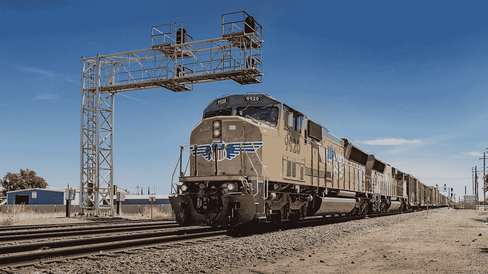
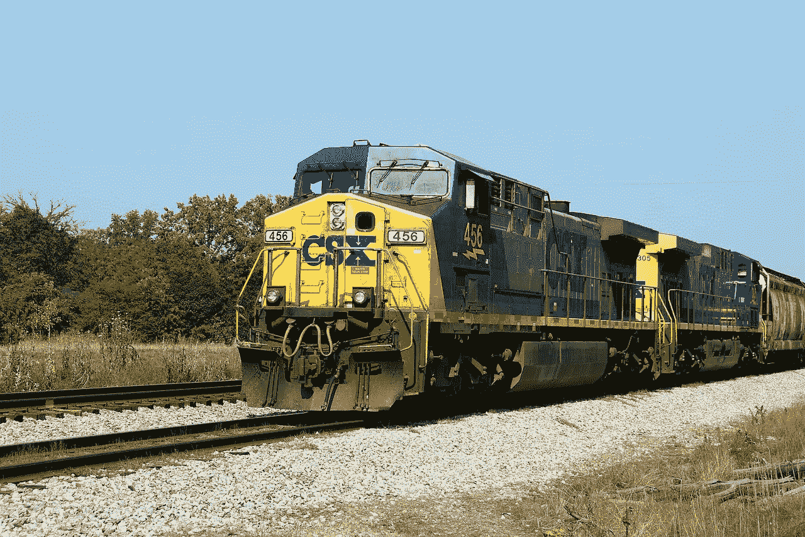
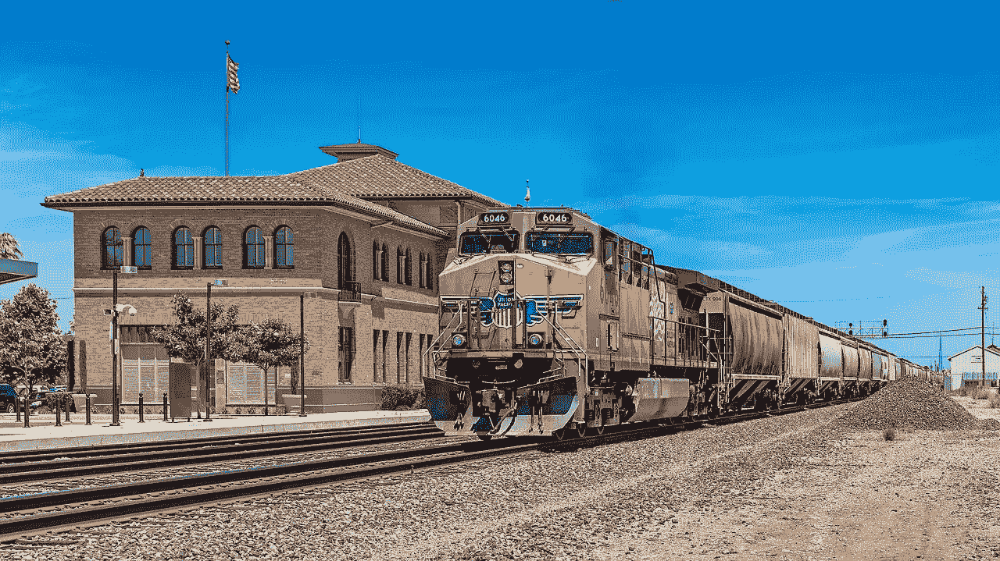
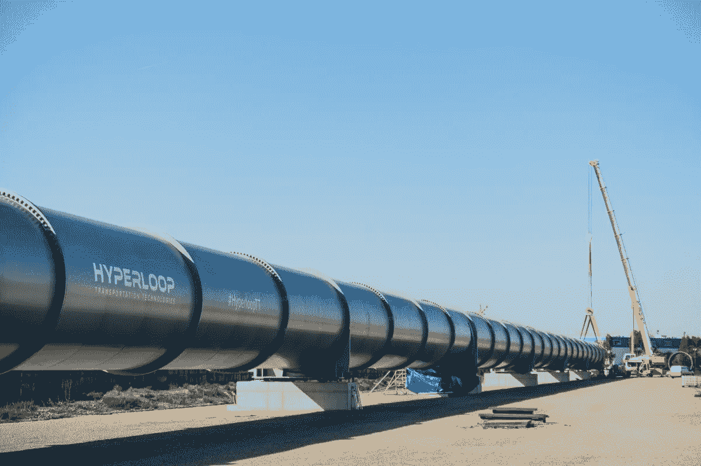
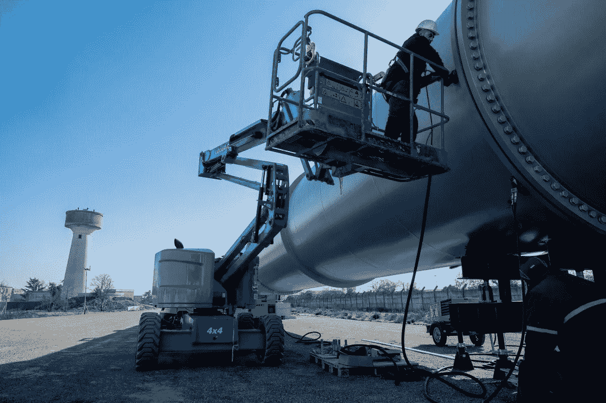
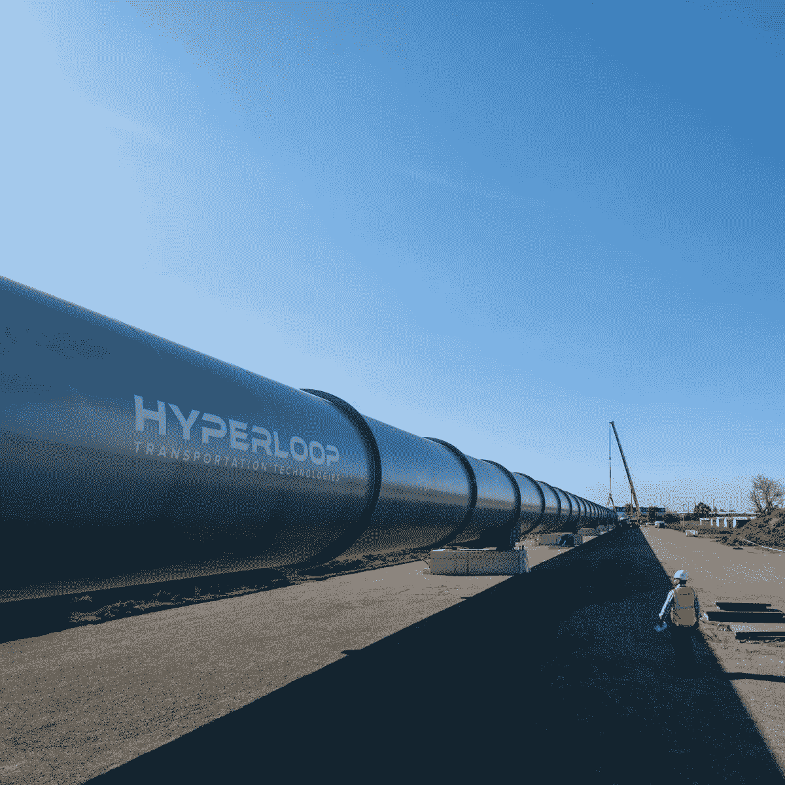

# 联合太平洋(UNP)赚钱了吗，巴菲特会买吗？

> 原文：<https://medium.datadriveninvestor.com/is-union-pacific-unp-making-money-and-will-buffett-buy-it-117e3ebce34b?source=collection_archive---------2----------------------->

作为一家铁路公司和伯克希尔哈撒韦公司(纽约证券交易所代码:BRK。B) 观察家我必须问联合太平洋(UNP)赚钱了吗？此外，我问沃伦·巴菲特会买下美国最古老的横贯大陆铁路吗？

巴菲特可以收购联合太平洋；或者向上，因为他喜欢铁路。事实上，**伯克希尔哈撒韦公司(纽约证券交易所代码:BRK。A)** 拥有美国最大铁路的伯灵顿北圣达菲，或称 BNSF。

此外，联合太平洋的总部就在巴菲特的家乡奥马哈。从历史上看，巴菲特喜欢奥马哈公司。值得注意的是，[伯克希尔·哈撒韦](https://marketmadhouse.com/berkshire-hathaway-now-house-cash/)通过伯克希尔·哈撒韦媒体拥有他家乡的报纸*奥马哈世界先驱报*。

 [## 数据驱动的投资者

### 事实上，在各行各业，数据的大规模激增正在改变我们感知世界的方式。而且只有…

go.datadriveninvestor.com](http://go.datadriveninvestor.com/youtube) 

# 沃伦·巴菲特会收购联合太平洋公司吗？

巴菲特可以用伯克希尔哈撒韦公司的 1120 亿美元现金收购联合太平洋公司。

此外，沃伦大叔在他的年度致投资者信中写道:“尽管如此，我们仍然希望进行一次大象规模的收购。然而，彭博[报道](https://www.bloomberg.com/news/articles/2019-02-23/berkshire-s-insurers-rebound-with-return-to-underwriting-profit)在同一封信中，巴菲特也哀叹“天价股票”。

值得注意的是，联合太平洋在 2019 年 2 月 22 日的市值为 1229.3 亿美元。因此，如果巴菲特愿意，他可以很容易地买下。

然而，还有更便宜的铁路。例如，2019 年 2 月 22 日，CSX 公司的市值为 597.9 亿美元，诺福克南方公司的市值为 49.02 美元，堪萨斯城南方公司的市值为 112.4 亿美元。

# **为什么巴菲特不会收购联合太平洋**

我认为巴菲特现在不会买 UP，因为它是“天价股”之一。事实上，2019 年 2 月 28 日，UNP 的股价为 167.98 美元。

例如， **CSX 公司(纳斯达克股票代码:CSX)** 的股票在同一天的交易价格是 72.67 美元。与此同时，**诺福克南方公司(纽约证券交易所代码:NSC)** 的股票交易价格为 179.30 美元，**堪萨斯城南方公司(纽约证券交易所代码:KSU)** 的股票交易价格为 108.64 美元。

因此，巴菲特更有可能购买 CSX 公司的股票，而不是 UP 公司、T2 公司、南堪萨斯城公司或 T4 公司。然而，堪萨斯城南部的市值如此之低，它可能会吸引沃伦叔叔的兴趣。

# 联合太平洋公司赚钱了吗？

即使沃伦巴菲特不想要它，价值投资者也应该调查联合太平洋。

事实上，联合太平洋公司正在赚钱。例如，UP 报告称，2018 年第四季度的毛利为 42.66 亿美元，营业收入为 22.1 亿美元，净收入为 15.54 亿美元。

此外，联合太平洋公司报告 2018 年第四季度收入为 57.57 亿美元。重要的是，这些收入以 5.63%的速度增长。

此外，联合太平洋公司 2018 年第四季度的运营现金流为 23.12 亿美元，自由现金流为 13.03 亿美元。因此，联合太平洋公司正在产生大量的现金。

最后，联合太平洋公司(UNP)在 2018 年 12 月 31 日拥有 12.73 亿美元的现金和等价物以及 6000 万美元的短期投资。因此，联合太平洋在 2018 年底有 13.33 亿美元的可用现金。

# **联合太平洋是好的分红股票吗？**

我认为联合太平洋(纽约证券交易所代码:UNP) 是一只很好的分红股票，因为它支付的股息很高。

事实上，联合太平洋公司计划在 2019 年 3 月 29 日派发 88 英镑的股息。此外，股息比 2018 年 12 月 28 日支付的 80 英镑增加了 8 英镑。

此外，2019 年 2 月 28 日，联合太平洋股东的股息收益率为 2.10%，年化股息为 3.52 美元，派息率为 45.3%。雪上加霜的是，Dividend.com 报告称，联合太平洋公司的股息已经连续 9 年增长。

我认为在这种情况下，联合太平洋是一个很好的股息和收益股。定价过高，不过我认为你不会在联合太平洋股票上赔钱？因此，我认为联合太平洋(UNP)可能是长期增长投资组合的一个很好的补充。

# **因为 Hyperloop** 你应该调查铁路股

像联合太平洋铁路公司(Union Pacific)这样的铁路股票有长期增长的潜力，因为有了超级循环(Hyperloop)。

解释一下 [Hyperloop](https://www.hyperloop.global/progress) 是结合了喷气式客机和铁路属性的下一代运输系统。具体来说，Hyperloop 可以像火车一样在地面上的预定路线上运行。

然而，Hyperloop 吊舱将通过一个管道旅行，因为它们去除了大部分空气。去除空气会减少阻力，这使得被称为 pod 的车辆能够在地面上高速行驶。

理论上，Hyperloop 吊舱的移动速度可以达到每小时 600 英里(每小时)到 1000 英里(每小时)。然而，他们没有测试速度超过 400 英里/小时的 Hyperloop 车辆。

另一方面，Hyperloop 运输技术；或者说 [HyperloopTT](https://www.cnbc.com/2019/02/26/hyperloop-firm-unveils-first-images-of-its-new-test-track-in-toulouse.html) ，正在建造第一个全尺寸 [Hyperloop Pod](https://marketmadhouse.com/first-hyperloop-passenger-pod-planned-for-next-year/) 。此外，HyperloopTT 和 [Virgin Hyperloop One](https://hyperloop-one.com/) 都已经建造了全尺寸 Hyperloop [测试轨道](https://futurism.com/hyperloop-test-track-hyperlooptt)。

# **为什么 Hyperloop 可以增加联合太平洋的价值**

像联合太平洋这样的铁路公司可以从 Hyperloop 中获利，因为 Hyperloop 公司将需要运营路线。

现有的铁路路权可以为 Hyperloops 提供理想的路线。值得注意的是，联合太平洋的线路已经包含了 Hyperloop 需要的部分基础设施。例如，隧道、桥梁和铁路站场。

事实上，联合太平洋铁路公司直达许多城市的中心，包括丹佛、拉斯韦加斯、盐湖城、埃尔帕索、圣安东尼奥、达拉斯、波特兰、芝加哥和洛杉矶。另外，上行线路直达洛杉矶、奥克兰、西雅图、休斯顿和圣佩德罗的主要港口。此外，联合太平洋公司通过长隧道运营，如科罗拉多州的[莫法特隧道](https://en.wikipedia.org/wiki/Moffat_Tunnel)。

# **联合太平洋如何从 Hyperloop 中获利**

此外，联合太平洋公司现有的通行权将非常适合 Hyperloop。例如，连接洛杉矶和盐湖城的上行线路。事实上，这条线正好穿过美国最热门的旅游目的地之一:拉斯维加斯。

此外，联合太平洋公司经营两条洲际航线。其中包括奥克兰和奥马哈之间最初的横贯大陆铁路，以及加州巴斯托和德克萨斯州休斯顿之间的旧的南太平洋铁路。此外，UP 还运营着通往波特兰、俄勒冈州和西雅图的线路。

因此，联合太平洋拥有 Hyperloop 运营商所需的基础设施和路线。因此，UP 可以作为 Hyperloop 开发商或 Hyperloop 运营商的收购目标。

理论上，Hyperloop 的速度可以让 UP 在货运和客运方面与航空公司竞争。事实上，航空公司可能无法与 Hyperloop 竞争，因为 Hyperloop 将使用更便宜的电力。与此同时，客机燃烧喷气燃料。

此外，Hyperloop 可以提供更频繁的服务，并在拥堵的城市中运营。相比之下，飞机必须降落在远离城镇的机场。

因此， [Hyperloop](https://marketmadhouse.com/how-hyperloop-will-disrupt-everything/) 可以增加铁路股票的价值。因此，联合太平洋可能是一个比许多人意识到的更好的增长股票。