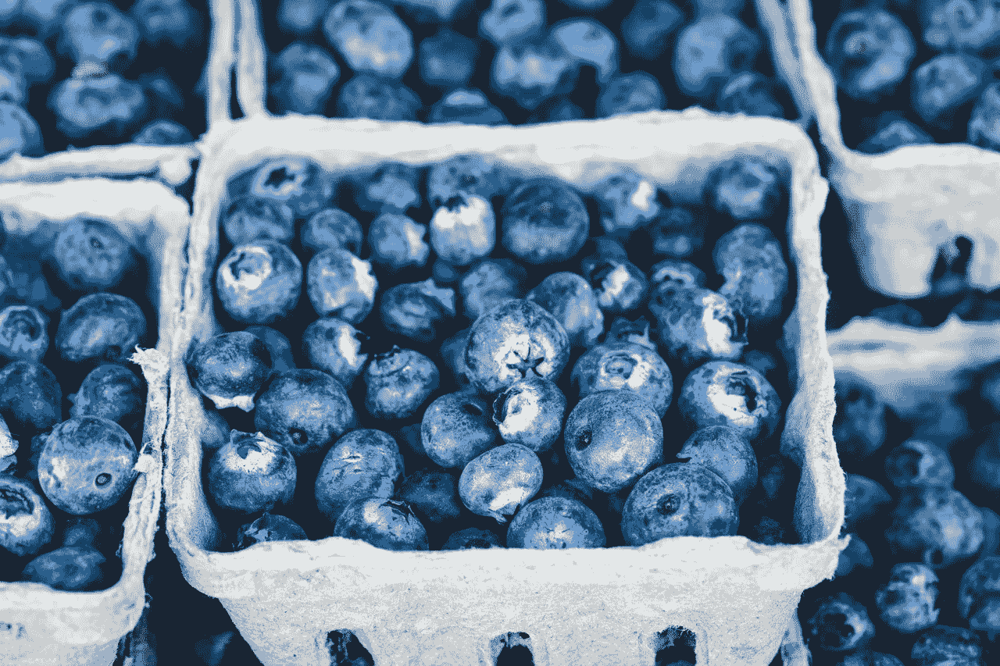
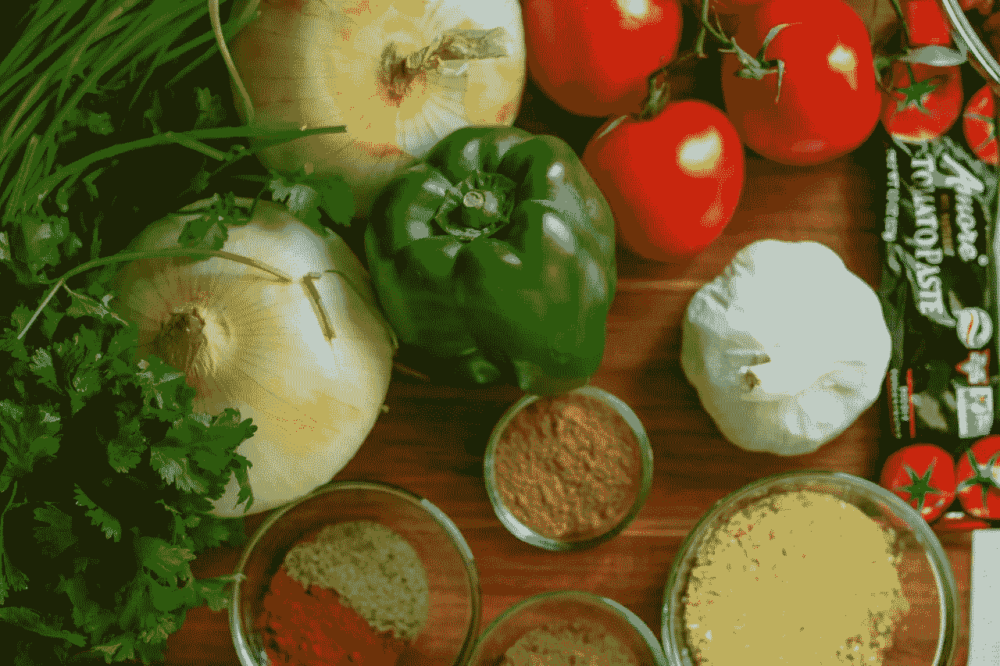
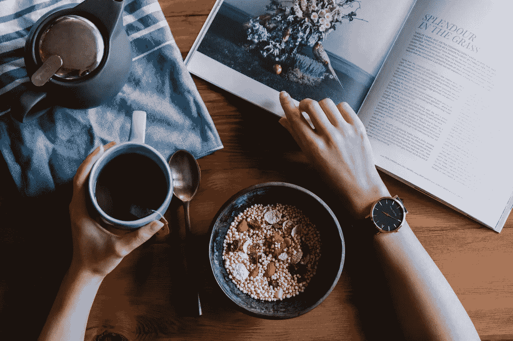

# 联合天然食品公司赚钱了吗？

> 原文：<https://medium.datadriveninvestor.com/is-united-natural-foods-making-money-9a5273c7608a?source=collection_archive---------14----------------------->

经销商**联合天然食品(纳斯达克股票代码:UNFI)** 收购了境况不佳的杂货商 **Supervalu(纽约证券交易所股票代码:SVU)** 。因此，是时候问问 UNFI 是否赚钱了。

此外，我们必须问，UNFI 能否与**亚马逊(纳斯达克股票代码:AMZN)** 和**克罗格(纽约证券交易所代码:KR)** 竞争。解释克罗格是有机和天然食品领域最大的玩家。

例如，克罗格的简单真相天然食品品牌在 2017 年的销售额达到 20 亿美元，*进步杂货商* [报道](https://progressivegrocer.com/krogers-simple-truth-brand-hits-2b-sales)。此外，Kroger 在 2017 年销售了价值 10 亿美元的有机产品，新闻稿[声称](https://www.prnewswire.com/news-releases/krogers-organic-produce-sales-achieve-1-billion-300591942.html)。如果这个数字是正确的，克罗格控制了美国 20%的有机农产品市场。

除此之外，亚马逊还拥有美国最著名的有机天然食品杂货商全食超市。此外，亚马逊正在通过 Go、Fresh 和 Prime Now 大举进军杂货业务。

**联合天然食品公司收购 Supervalu**

UNFI 联合天然食品公司是一家位于罗德岛的经销商，在美国和加拿大销售几种有机品牌。

UNFI 于 2018 年 10 月 23 日以 29 亿美元收购 super valu Inc .*明尼阿波利斯/圣保罗商业杂志* [报道](https://www.bizjournals.com/twincities/news/2018/10/23/supervalus-gone-at-least-from-wall-street-as-2-9b.html)。因此，Supervalu 不再是一家独立的公司或股票。

重要的是，日报推测，UNFI 可能会出售 Supervalu 的超市品牌，包括 Cub Foods。有趣的是，克罗格；该公司在明尼苏达州没有业务，可能是幼兽食品的买家。Cub Foods 是双子城最大的杂货商，有 81 家分店。

Supervalu (SVU)因为这笔交易从纽约证券交易所(NYSE)消失了。收购后，Supervalu 股东将获得每股 32.50 美元。此外，UNFI 已经承担了 16 亿美元的超高价值债务，《明尼阿波利斯星报-论坛报》报道。

杂货店能赚钱吗

Supervalu 超市在 UNFI 的一次销售引发了人们对实体店作为投资的可行性的质疑。

杂货商在今天的市场上赚不了多少钱。例如，Supervalu 在 2018 年 9 月 9 日报告了 3600 万美元的现金和短期投资。此外，Supervalu 报告 2018 年第三季度自由现金流为 800 万美元，运营现金流为 4800 万美元。

Supervalu 报告称，2018 年第三季度收入 35.12 亿美元，净亏损 5700 万美元，运营亏损 5300 万美元。因此，很容易理解为什么 UNFI 想退出超市业务。

**亚马逊是联合天然食品的机会**

我怀疑 UNFI 的管理层认为卖给亚马逊和克罗格是比与他们竞争更好的商业计划。例如，亚马逊的分销商有一些巨大的机会。

彭博推测，到 2021 年，亚马逊可能会开设 3000 家无收银台便利店。此外，大多数去的地方都在时髦的市中心街区。

因此，商店需要有机和天然食品，必须有人来供应。联合天然食品公司是向 Amazon Go 提供农产品和天然食品的明显候选人。

**对于亚马逊时代，联合天然食品(UNFI)是一项价值投资吗？**

此外，Supervalu 可以提供日常商品和杂货。因此，对于亚马逊时代来说，联合天然食品可能是一项价值投资。

UNFI 将通过向亚马逊供货来赚钱，而不是与百货店竞争。因此，UNFI 就像**伯克希尔哈撒韦公司(纽约证券交易所代码:BRK。B)** 子公司麦克莱恩。

更详细地说，[麦克莱恩公司](https://www.mclaneco.com/content/mclaneco/en/home.html)向零售商供货；例如便利店和折扣店。因此，麦克莱恩从零售中赚钱，而没有拥有和经营实体店的风险。

重要的是，不管谁拥有或经营商店，麦克莱恩都能赚钱。如果 Amazon Go 让 Seven-11 破产，McLane 就直接卖给 Amazon。UNFI 也在遵循同样的策略。

独特的是，UNFI 与 Supervalu 在杂货业务上也有类似的机会。例如， [Supervalu](https://www.supervalu.com/our-brands.html) 运营着 18 个配送中心和仓库，每年向 39 个州的 2000 家零售商运送 6 亿箱商品。此外，Supervalu 向杂货商提供 5，000 种食品和一般商品。

**super valu 会让联合天然食品成为价值投资吗？**

联合天然食品可能是一项价值投资，因为它很便宜。2018 年 10 月 29 日，UNFI 股票的售价为每股 21.98 美元。

2018 年 7 月 28 日，UNFI 的毛利为 3.7594 亿美元，收入为 25.92 亿美元。此外，联合天然食品公司 2018 年第三季度的净收入为 3279 万美元，营业收入为 4976 万美元。

2018 年第三季度，联合天然食品实现自由现金流 1.4963 亿美元，运营现金流 1.6464 亿美元。不幸的是，联合天然食品公司在 2018 年 7 月 28 日报告了 2332 万美元的现金和等价物。

因此，很容易理解为什么 UNFI 想要卖掉 Supervalu 的杂货店。它需要产生现金的资产。

毫不奇怪，联合天然食品公司不支付股息，但它有一些潜在价值。例如，UNFI 是一个可能的收购目标。

值得注意的是，亚马逊将需要供应链基础设施，而 UNFI 有。因此，UNFI 可能是一种投机性投资，因为股东可能会获得收购利润。

超市盈利吗？

Supervalu 表明，区域性超市不再是价值投资。然而，物流和供应链可能是价值投资。

因此，散户投资者需要密切关注联合天然食品。它的成败可以向我们展示杂货业的未来。

*原载于 marketmadhouse.com(2018 年 10 月 29 日)*