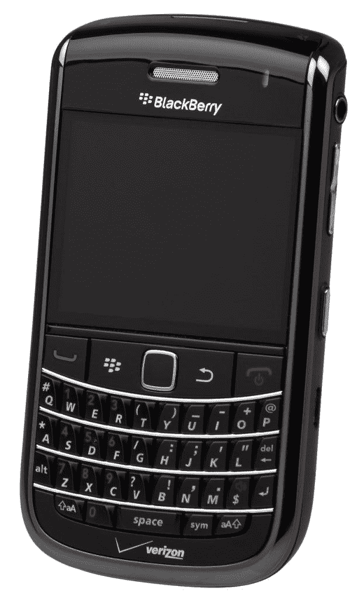

# 威瑞森是价值投资吗？—市场疯人院

> 原文：<https://medium.datadriveninvestor.com/is-verizon-a-value-investment-market-mad-house-5034326d8d4b?source=collection_archive---------9----------------------->

许多人会问威瑞森是否是一项价值投资，因为该公司在 2018 年第三季度控制了超过三分之一的美国无线市场。然而，2019 年 7 月 22 日，威瑞森股票的交易价格为 55.37 美元。

具体来说，**据 Statista [估计](https://www.statista.com/statistics/199359/market-share-of-wireless-carriers-in-the-us-by-subscriptions/)，Verizon Communications(纽约证券交易所代码:VZ)** 在 2018 年第三季度拥有美国无线订阅市场 34.91%的份额。此外，Statista [估计【2018 年第三季度，威瑞森在美国拥有 1.5148 亿无线客户。](https://www.statista.com/statistics/283507/subscribers-to-top-wireless-carriers-in-the-us/)

 [## 算法交易的机器学习|数据驱动的投资者

### 当你的一个朋友在脸书上传你的新海滩照，平台建议给你的脸加上标签，这是…

www.datadriveninvestor.com](https://www.datadriveninvestor.com/2019/01/30/machine-learning-for-stock-market-investing/) 

如果 Statista 是正确的，超过三分之一的美国人是威瑞森的用户。具体来说，Worldometers [估计 2019 年 7 月 19 日美国人口为 3.29093 亿。](https://www.worldometers.info/world-population/us-population/)

# 为什么威瑞森可以成为威瑞森的投资对象

因此,“市场先生”可能会低估一家平台服务于超过三分之一美国人口的公司。

与此同时，威瑞森出售一种产品，许多人没有无线服务就无法生活。Statista [计算](https://www.statista.com/chart/2072/landline-phones-in-the-united-states/)事实上，2018 年 54.9%的美国人没有座机。因此，54.9%的美国人依赖无线电话作为他们的主要通信手段。Thu 54.9%的美国人需要手机与朋友、家人和工作保持联系。

此外，越来越多的人将无线作为他们获取信息和娱乐的主要来源。事实上，Statista [估计](https://www.statista.com/statistics/209348/mobile-video-viewers-in-the-united-states/)2018 年有 1.695 亿美国人承认用手机看视频。Statista 预测，这个数字在 2020 年可能会增长到 1.795 亿。

最后，人们越来越依赖无线来满足交通等基本需求。值得注意的是，Statista [估计](https://www.statista.com/topics/4610/ridesharing-services-in-the-us/) 36%的美国人在 2018 年使用过拼车服务，如 **Lyft(纽约证券交易所代码:LYFT)** 和**优步(纳斯达克代码:优步)**。此外，2018 年使用 rideshare 的美国人数量增长了 15%。

特别是，2018 年 3 月有 3870 万美国人使用优步，2018 年 1 月有 1600 万美国人使用 Lyft。因此，去年有 5470 万美国人依赖手机作为部分交通工具。

# 威瑞森赚钱了吗？

因此，威瑞森提供的是数千万人需要的基本服务，但它赚钱了吗？金融数据给出的答案是肯定的，威瑞森赚了很多钱。

Stockrow reports 威瑞森报告称，截至 2019 年 3 月 31 日，季度毛利为 191.38 亿美元，季度营业收入为 77.09 亿美元，季度净收入为 50.32 亿美元。此外，威瑞森的这些数字来自 321.8 亿美元的季度收入。

然而，威瑞森的季度收入从 2018 年 12 月 31 日的 341.81 亿美元下降到三个月后的 321.28 亿美元。然而，Stockrow 声称，在截至 2019 年 3 月 31 日的季度，威瑞森的收入增长了 1.12%。

# 威瑞森产生了多少现金？

因此，威瑞森赚了很多钱，但它从所有这些无线订阅中产生了多少现金呢？答案是很多。

2019 年 3 月 31 日，威瑞森报告季度运营现金流为 70.81 亿美元，季度自由现金流为 28.13 亿美元。然而，威瑞森在同一天公布的投资现金流为负 48.03 亿美元，融资现金流为负 26.57 亿美元。

最后，威瑞森持有的现金很少。截至 2019 年 3 月 31 日，它只有 23.22 亿美元的现金和等价物，没有短期投资。

# 威瑞森在赔钱吗？

我认为这些数字表明威瑞森在庞大的基础设施上损失了很多钱。

解释一下，威瑞森应该从 1.5148 亿无线用户中产生大量浮存。浮存金是公司从定期订阅费中产生的现金流。

重要的是，浮存是沃伦·巴菲特价值投资模型的关键组成部分。例如，**伯克希尔哈撒韦公司(纽约证券交易所代码:BRK。B)** 使用产生的浮动保险费为其运营和收购融资。

同样，威瑞森也进行了一些令人印象深刻的[收购。最值得注意的是，威瑞森在 2016 年收购了雅虎的剩余部分。其他值得注意的威瑞森收购包括 Sensity Systems、Telogis、XO 的光纤网络、Volicon、Fleetmatics、2015 年的 AOL 和 2006 年的 MCIWorldcom。](https://www.verizon.com/about/timeline-categories/mergers-acquisitions)

因此，威瑞森拥有大量潜在有利可图的基础设施。例如，Sensity Systems 为城市和物联网(IoT)的数字化转型提供服务。同时，Volicon 为广播公司提供视频采集技术和工作流程创建。另外，Complex 开发优质视频内容。

# 威瑞森的潜力

因此，即使亏损，威瑞森也在获取价值。具体来说，威瑞森正在为数字化转型提供基础设施。

与网飞(纳斯达克股票代码:NFLX) 这样的内容不同，威瑞森提供的是将网飞带给观众的服务。威瑞森不是在建设物联网，而是在建设物联网可以运行的基础设施。

因此，威瑞森可以从物联网中赚钱；、或流视频，而不承担构建和提供这些服务的风险。此外，威瑞森通过提供这些公司运营所需的基础设施，从优步、Lyft、**、GrubHub(纽约证券交易所代码:GRUB)** 和 Instacart 等零工经济业务中获利。

解释一下，GrubHub、Instacart、优步和 Lyft 的司机没有无线订阅就无法赚钱。因此，这些司机有强烈的动机每月向威瑞森发送订阅。因此，威瑞森从零工经济中产生了浮存金。

鉴于这些现实，我认为威瑞森有很大的增长潜力。然而，它能从这种增长中获得的现金可能很少。

# 威瑞森是一只好的分红股票吗？

**威瑞森(纽约证券交易所代码:VZ)** 以可观的股息形式与投资者分享现金。

例如，Verizon 计划在 2019 年 8 月 1 日派发 60.3₵股息。此外，1.03₵在 2018 年增加了股息，从 2018 年 8 月 1 日的 59₵增加到 2018 年 11 月 1 日的 60.3₵。

令人印象深刻的是，Divided.com 认为，自 2007 年以来，威瑞森已经连续 12 年保持股息增长。2019 年 7 月 22 日，威瑞森向投资者提供的股息收益率为 4.26%，年化派息为 2.41 美元，派息率为 51.7%。

归根结底，我认为威瑞森是一只长期收益良好的股票。该公司产生大量现金，支付高额股息，并在一个不断增长的市场中运营一个大型平台。我认为威瑞森在 2019 年 7 月 22 日是一个价值投资，每股 55.37 美元。

*原载于 2019 年 7 月 22 日*[*https://marketmadhouse.com*](https://marketmadhouse.com/is-verizon-a-value-investment/)*。*