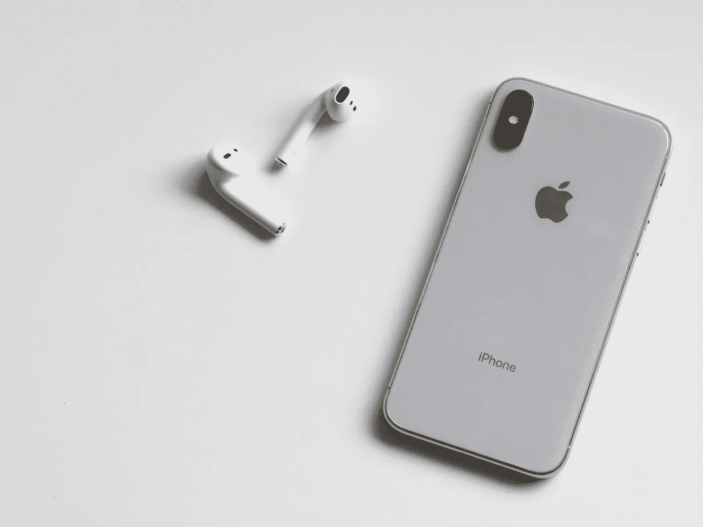

# Verizon Communications(纽约证券交易所代码:VZ)是一个好的价值投资吗？

> 原文：<https://medium.datadriveninvestor.com/is-verizon-communications-nyse-vz-a-good-value-investment-aedd7d544e6c?source=collection_archive---------22----------------------->

Verizon Communications(纽约证券交易所代码:VZ) 的价值案例很简单。本质上；威瑞森很便宜，它的足迹很大，而且能赚很多钱。

为了解释，威瑞森是美国最大的无线运营商，2018 年第三季度拥有 1.5397 亿客户，Statista [计算](https://www.statista.com/statistics/283507/subscribers-to-top-wireless-carriers-in-the-us/)。此外，这一足迹还在增长，因为威瑞森在 2018 年第三季度拥有 1.4887 亿无线客户。

更重要的是，威瑞森从这些无线用户身上赚了很多钱。例如，威瑞森在 2018 年第三季度的收入为 326.07 亿美元，毛利润为 192.76 亿美元。

**威瑞森通信公司(纽约证券交易所代码:VZ)正在赚大钱**

此外，威瑞森 2018 年第三季度的营业收入为 76.75 亿美元，净收入为 49.24 亿美元。

此外，威瑞森正从其业务中产生大量现金。例如，威瑞森报告 2018 年第三季度的运营现金流为 98.11 亿美元，自由现金流为 56.23 亿美元。

最后，威瑞森于 2018 年 9 月 30 日报告了 25.38 亿美元的现金和短期投资。因此，威瑞森显然正在吸引大量无线用户。

具体来说，浮存金是公司从客户必须支付的定期订阅费中产生的现金。例如，所有那些必须每月支付无线服务费用的人。

值得注意的是，浮存金是沃伦·巴菲特为保险费发明的术语。事实上，保险费是巴菲特用来建立伯克希尔哈撒韦公司(纽约证券交易所代码:BRK)的资金来源之一。B 。

**Verizon communication s(纽交所代码:VZ)是廉价股吗？**

价值投资者对 Verizon Communications(纽约证券交易所代码:VZ)感兴趣，因为它是一家便宜但现金充裕的公司。事实上，2019 年 1 月 9 日，威瑞森股票的交易价格为 57.10 美元。

特别是，与迪士尼相比，威瑞森是一只便宜的娱乐股。很明显，迪士尼在 2019 年 1 月 9 日的交易价格为每股 112.39 美元。我们可以认为威瑞森是一只娱乐股，因为它通过有线电视、流媒体视频和无线传播娱乐。

此外，与苹果(纳斯达克股票代码:AAPL)相比，威瑞森是一只便宜的手机股票。相比之下，苹果公司的股票在 2019 年 1 月 9 日的交易价格为 153.31 美元。

**Verizon Communications(纽约证券交易所代码:VZ)是经典的价值投资**

**Verizon communication s(NYSE:VZ)**是一只手机股票，因为它提供了 iphone 和其他设备运行所需的信号无线信号。

因此，购买威瑞森是一个经典的价值投资策略。策略是忽略市场先生喜欢的热门股票，寻找提供市场宠儿运作所需基础设施的平庸公司。

例如，如果没有威瑞森的无线信号，iPhone 只是一堆毫无价值的金属、玻璃和塑料。此外，威瑞森还为迪士尼和网飞(纳斯达克股票代码:NFLX)提供互联网、有线电视和无线服务。

但是，威瑞森的成本比**网飞(纳斯达克股票代码:NFLX)** 要低；该公司在 2019 年 1 月 9 日的交易价格为每股 320.24 美元，非常荒谬。因此，在价格过高的行业，投资威瑞森是划算的。

**威瑞森通信公司(纽约证券交易所代码:VZ)也是一只不错的分红股票**

最后， **Verizon Communications(纽约证券交易所代码:VZ)** 也是一只相当不错的分红股票。例如，2018 年 1 月 9 日，威瑞森股东的股息收益率为 4.22%，年化股息为 2.41 美元，股息支付率为 51.7%。

Dividend.com 报道，锦上添花的是，威瑞森股东还享受了 12 年的股息增长。详细说明下一次威瑞森股息将是 2019 年 2 月 1 日的 60.3 英镑。

此外，在过去的一年里，威瑞森表现出良好的股息增长。例如，威瑞森在 2017 年 8 月 1 日支付了 57.7 英镑的股息。该股息在 2017 年 11 月 1 日增长到 59 英镑，在 2018 年 11 月 1 日增长到 60.3 英镑。

因此，威瑞森的现金股利在一年内增长了 2.3。因此，威瑞森是一个伟大的股息股票。

**令人惊讶的是，Verizon Communications(纽约证券交易所代码:VZ)是一只收益良好的股票**

归根结底，**Verizon communication s(NYSE:VZ)**是一只收益不错的股票，因为有股息。

如果你正在寻找一个稳定但不断增长的价值投资，能够带来丰厚的股息，威瑞森是一个很好的选择。例如，威瑞森的收入已经连续六个季度增长。值得注意的是，威瑞森报告 2018 年第三季度的收入增长率为 2.18%。

我认为威瑞森是 21 世纪的价值投资。如果你在寻找具有强劲增长潜力的分红股票，威瑞森是一个很好的候选人。

想要从移动电话和无线技术的普及中获利的投资者应该调查一下 Verizon Communications。既然我们大多数人离不开手机，我们不妨从无线网络中赚钱。拥有一些 Verizon 通讯公司(纽约证券交易所:VZ)的股份是一个很好的方法。

这个故事最早出现在 [*市场疯人院*](https://marketmadhouse.com/) 。