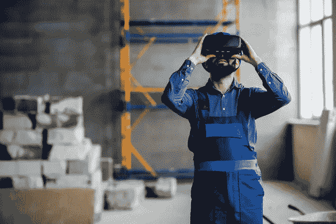

# 虚拟现实比现实世界更适合学习吗？

> 原文：<https://medium.datadriveninvestor.com/is-virtual-reality-better-than-the-real-world-for-learning-7640dce6c306?source=collection_archive---------16----------------------->

**2018 年 10 月 13 日**由 Van Ton-Quinlivan

我不是虚拟现实专家，也不是游戏玩家，但我对 VR 提供的体验非常好奇。尤其是学习方面。这让我参加了由未来研究所(IFTF)新兴媒体实验室主任 Toshi Hoo 主持的关于虚拟世界前沿行为的小组讨论。

我们参加了 IFTF 一年一度的十年预测活动，该活动由[未来 50 伙伴关系](http://www.iftf.org/partner-with-iftf/)发起，在硅谷的中心举办。Toshi 组织了一个混合媒体扬声器小组——其中两个扬声器作为他们的化身参与进来，并设计了类似视频游戏的虚拟代表，他们在现实世界中与他们同步移动。

如果小组成员举起一只手，化身也举起它的手。当小组成员开口说话时，头像也开口说话。那些看过史蒂文·斯皮尔伯格的*《玩家一号》*的人，应该知道我的意思。300 多名观众能够在大屏幕上体验 Toshi 在采访头像时从他的 Oculus 耳机中看到的内容。那是我第一次体验社交 VR。

当我告诉我 16 岁的儿子，一个在《我的世界》设计虚拟世界长大的典型青少年，我所看到的，他的反应是，“为什么有人会生活在真实世界而不是虚拟世界？”

在虚拟世界*中，你*决定你想要的样子，只要点击一下，任何你想要的改变都是可能的。因为钱不是问题，你可以随心所欲地打扮和装饰你的空间，而不需要消耗任何资源。与现实世界不同，你可以在任何地方与虚拟角色的朋友互动，因为没有地理位置的限制。

我儿子认为虚拟世界相当自由，更不用说对世界的碳足迹有好处。

嗯。他可能发现了什么。但我心里想的和我儿子不太一样。

激起我兴趣的是，虚拟现实是一个你可以在世界任何地方的真实生活环境中获得身临其境的体验的地方。我在 IFTF 实习期间试图回答的一个问题是，哪些实践最有希望压缩学习时间，以便学习者能够更好地跟上变化的速度并与机器配对？我要把 VR 加到列表里。

全球化和数字化正在改变企业和劳动力需求，劳动力中的成年人越来越需要技能、再技能和技能提升，以保持、找到工作并取得进步。在学习和培训方面，虚拟现实可能会改变游戏规则。

创建一个虚拟形象，在家里或工作场所学习，可以消除 40 多岁、50 多岁或 60 多岁的人对重返校园的耻辱感或焦虑。它还允许员工置身于世界任何地方的实际工作环境中，这样他们就可以边做边学，而不会遇到复制工作场所的困难。

公司已经抓住了这一概念，并正在将虚拟现实技术用于劳动力发展和培训。 [STRIVR](https://www.strivr.com/walmart-vr-training-expansion/) 与[沃尔玛合作，帮助在北美培训员工](https://www.vrfocus.com/2018/09/walmart-acquire-17000-oculus-go-headsets-to-train-staff/)，分发 17，000 个 Oculus Go 耳机培训员工。在虚拟现实中练习一些在现实世界中可能很危险的事情，风险也较小，否则员工可能没有机会尝试。

我们培训劳动力的方式已经过时了。IFTF 刚刚发布新报告， [*AI 部队塑造工作&学习 2030*](http://www.iftf.org/fileadmin/user_upload/images/ourwork/Work___Learn/IFTF_Lumina_AI_Forces_Work_Learn.pdf) ，探索即将到来的工作+学习生态系统。而埃森哲最近推出了 [*It's Learning。只是不像我们所知道的*](https://maileranalytics.accenture.com/Log/Log?link=%5bhttps%3a%2f%2fwww.accenture.com%2fus-en%2finsights%2ffuture-workforce%2ftransforming-learning%5d&tranId=7472701&subj=IntroducingItsLearning.JustNotAsWeKnowIt.OurlatestFutureWorkforcecontent&userPk=%23_U7IDRxCKSMkHxzr8eLUrTw%3d%3d&email=7UHZq3mw5ZG%2bNxI1R4MyfIo1CQBswasP8jiIsyv42EM%3d) ，这暴露出今天的教育和培训体系都跟不上当前的技能需求，更不用说明天的新需求了。

我们需要让人们在一个科技推动的世界中更有弹性，那么为什么不求助于科技来做到这一点呢？

[Van Ton-Quinlivan 是](http://www.iftf.org/vantonquinlivan/)[未来研究所](http://www.iftf.org/vantonquinlivan/)的常驻执行官，也是加州社区学院劳动力和数字未来的执行副校长。 [@WorkforceVan](https://twitter.com/WorkforceVan)

*原载于 www.iftf.org***。**